---
description:
    Concert Operate SSO
sidebar_position: 1
---

# CloudPak for AIOps / Concert Operate SSO

This section describes how to configure Single Sign-On (SSO) for CloudPak for AIOps / Concert Operate using Keycloak as the OpenID Connect (OIDC) Identity Provider and OpenLDAP as the user directory. It can also be used as a reference to build launch in context for SevOne devices from Cloud Pak for AIOps / Concert Operate. 
You can also use this guide in conjunction with the SevOne NMS SSO and SevOne DI SSO guides to enable cross launch between Cloud Pak for AIOps / Concert Operate and SevOne NMS and SevOne DI.

## Overview and Architecture
Single Sign-On (SSO) is an authentication method that lets a user log in once and access multiple applications or systems without signing in again.

Single Sign-On (SSO) between CloudPak for AIOps and SevOne is typically achieved by integrating both platforms with a common OIDC or SAML provider, such as Keycloak, and a common user and groups directory provider, such as LDAP, or Active Directory, rather than by establishing a direct authentication relationship between the two products. In this model, users authenticate once through the shared identity provider, which validates credentials against the organization’s directory service and then issues the identity and access claims required by each application. This approach provides a consistent login experience across Cloud Pak for AIOps and SevOne, simplifies user administration, centralizes authentication policy, and supports role-based access control through mapped groups or claims.

This guide configures Single Sign-On (SSO) for IBM Cloud Pak for AIOps 4.13.1 using Keycloak as the OpenID Connect (OIDC) Identity Provider and OpenLDAP as the user directory. CP4AIOps uses IBM Cloud Pak Foundational Services (Common Services) for its SSO layer.

:::important 
At the time of writing, CloudPak for AIOps 4.13 was used to configure and validate the SSO integration described in this guide. The procedures and configuration examples presented are generally applicable to
IBM Concert Operate 5.1 and later, which is newer release of CloudPak for AIOps (CP4AIOps). 
:::

<div align="center">

</div>

| Component | Role | Protocol |
|---------|-------|-------|
| OpenLDAP | User directory — single source of truth for users and groups | LDAP / port 389 (non-secure) |
| Keycloak | OpenID Connect (OIDC) Identity Provider — federates users from LDAP, issues OIDC tokens | HTTPS / port 8443 |
| CloudPak for AIOps / <br/> Concert Operate | Service Provider — AIOps platform consuming OIDC tokens | HTTPS / port 443 (secure) |
| IBM Foundational Services | IAM layer — handles OIDC registration and token validation within CP4AIOps | HTTPS / port 443 (secure) |

:::important 
sevone-realm IS REQUIRED to enable cross launch between Cloud Pak for AIOps / Concert Operate and SevOne NMS and SevOne DI.
This guides uses sevone-realm because it is the realm configured for the SevOne application within Keycloak that will be used to achieve CP4AIOps right-click functionality to launch SevOne in context. 
:::

## Prerequisites

| Software | Version | Notes |
|---------|-------|-------|
| OpenLDAP | 2.6.x | Running on port 389 (or 636 for LDAPS), users must have uid and mail attributes |
| Keycloak | 26.x or later | Secure Keycloak with Self Signed Certificate or CA signed, configured with SAN (Subject Alternative Names),admin credentials required |
| CloudPak for AIOps / <br/> Concert Operate | 4.13.1 / <br/> 5.1 or later | Installed on OpenShift 4.12+ |
| IBM Foundational Services | 4.x | Installed as part of CP4AIOps / Concert Operate |

## OpenLDAP Verification
Skip this step as we will use CloudPak for AIOps / Concert Operate to verify OpenLDAP accessibility.
The OpenLDAP is the same as the one used in SevOne NMS SSO and SevOne DI SSO guides.
To recap, the LDAP structure that we will use for this example is as follows:

```
dc=example,dc=com (Base DN)
├── ou=users (Organizational Unit for users)
│   ├── uid=alice 
│   ├── uid=bob 
│   └── uid=charlie 
└── ou=groups (Organizational Unit for groups)
    ├── cn=network_ops_engineer 
    ├── cn=network_admin 
    └── cn=network_svc_mgr 
```

## Keycloak Configuration: TLS Cert, Subject Alternate Name (SAN), Realm, LDAP Federation & Client
Keycloak must serve a TLS certificate with a Subject Alternative Name (SAN) matching its hostname. 
Platform auth service under IBM Foundational Services component will fail with x509: certificate relies on legacy Common Name field if the Keycloak certificate has no SAN. 

### Keycloak Config: TLS Cert, Subject Alternate Name (SAN)
Skip this step if you have already configured Keycloak with a certificate that includes the necessary SAN entries.
Below is an example of a SAN configuration file for generating a self-signed certificate for Keycloak. 
You can use this configuration with OpenSSL to create a certificate that includes the necessary SAN entries.

```bash title="Host: Keycloak"
cat > /opt/keycloak/conf/keycloak-san.cnf << 'EOF'
[req]
default_bits       = 2048
prompt             = no
default_md         = sha256
distinguished_name = dn
x509_extensions    = v3_req

[dn]
CN = keycloak.example.com

[v3_req]
subjectAltName   = @alt_names
keyUsage         = critical, digitalSignature, keyEncipherment
extendedKeyUsage = serverAuth

[alt_names]
DNS.1 = keycloak.example.com
DNS.2 = keycloak
EOF
```

```bash title="Host: Keycloak"
sudo openssl req -x509 -newkey rsa:2048 -nodes \
  -keyout /opt/keycloak/conf/keycloak.key \
  -out    /opt/keycloak/conf/keycloak.crt \
  -days 825 -config /opt/keycloak/conf/keycloak-san.cnf

# Verify SAN is present
openssl x509 -in /opt/keycloak/conf/keycloak.crt -noout -text \
  | grep -A3 "Subject Alternative Name"

sudo systemctl restart keycloak
```

:::important 
Substitute Keycloak hostname, keycloak.example.com in the above example. 
Keycloak hostname, keycloak.example.com used in the configuration must be changed to actual Keycloak hostname in your environment. 
:::

### Keycloak Config: Realm, LDAP Federation & Client

#### Log in to Keycloak Admin Console
1. Login to Keycloak Admin Console from your browser using the URL: `https://keycloak.example.com:8443/admin/master/console/` (replace keycloak.example.com with your Keycloak hostname).
2. Accept the certificate warning if prompted.
3. Log in with your Keycloak admin credentials.

#### Select Realm: sevone-realm
1. On Keycloak Admin Console, click `Manage realms` on the top-left area.
2. Choose `sevone-realm` in the list of realms. We are going to use the `sevone-realm` which we created earlier in SevOne NMS SSO guide.
3. For Cloud Pak for AIOps / Concert Operate SSO, we will use the same `sevone-realm` and create a new OIDC client in the `sevone-realm` realm.

#### Create OIDC Client: cp4aiops-client
1. In sevone-realm, click **Clients** → **Create client**
2. Configure **General Settings**:
   - Client Type: `OpenID Connect`
   - Client ID: `cp4aiops-client`
   - Name: `CP4AIOps SSO Client`
   - Description: `CP4AIOps SSO Client`
3. Click Next
4. Configure **Capability config**:
   - Client authentication: `ON`
   - Authorization: `OFF`
   - Standard flow: `ON`
   - Direct access grants: `ON`
   - Service accounts roles: `ON`
   - Implicit flow: `ON`
   - Standard Token Exchange: `OFF`
   - JWT Authorization Grant: `OFF`
   - OAuth 2.0 Device Authorization Grant: `OFF`
   - OIDC CIBA Grant: `OFF`
5. Set Require PKCE to `ON` and PKCE Method to `S256`
6. Click Next
7. Configure **Login settings**:
   - Root URL: `https://cp-console-cp4aiops.apps.example.com`
   - Home URL: `Leave empty`
   - Valid redirect URIs: `https://cp-console-cp4aiops.apps.example.com/ibm/api/social-login/redirect/keycloak-oidc`
   - Valid post logout redirect URIs: `https://cp-console-cp4aiops.apps.example.com/*`
   - Web origins: `https://cp-console-cp4aiops.apps.example.com`
   - Admin URL: `Leave empty`
7. Click Save

Here are guidelines for the above **Login settings** configuration:

| Setting | Value | Description |
|---------|-------|-------|
| Root URL | `https://<cp-console-url>` | cp-console URL, such as cp-console-cp4aiops.apps.example.com |
| Valid redirect URIs | `https://<cp-console-url>/ibm/api/social-login/redirect/<name-of-the-oidc-in-CloudPak>` | Valid redirect URL to follow format in Value column |
| Valid post logout redirect URIs | `https://<cp-console-url>/*` | cp-console URL including /* |
| Web origins | `https://<cp-console-url>` | cp-console URL |

:::important
"keycloak-oidc" is the OIDC name in CloudPak for AIOps / Concert Operate configuration and
must be used as the last segment of the "Valid redirect URIs" in Keycloak Login settings as above.
:::

:::important 
Substitute CloudPak for AIOps hostname, example.com in the above example. 
CloudPak for AIOps hostname, cp-console-cp4aiops.apps.example.com used in the configuration must be changed to actual CloudPak for AIOps hostname or ipAddress in your environment. 
:::

:::important
To find the CloudPak for AIOps route, use oc command below <br/>
    `oc get route cpd -n <cp4aiops-namespace> -o jsonpath='{.spec.host}'`
:::

#### Retrieve Client Secret
1. In `sevone-realm`, on the `cp4aiops-client` client page, click the `Credentials` tab
2. Copy the `Client Secret` value — you will need it in next steps to configure CloudPak for AIOps SSO.
3. Save it: `oidc_client_secret`: `<paste-here>`


#### Configure LDAP User Federation
1. Skip this step if you have already configured LDAP federation in SevOne NMS SSO guide.

#### Synchronize Users from LDAP
1. Skip this step if you have already synchronized users from LDAP in SevOne NMS SSO guide.

#### Create Group Mapper
1. Skip this step if you have already created group mapper in SevOne NMS SSO guide.

#### Synchronize Groups from LDAP
1. Skip this step if you have already synchronized groups from LDAP in SevOne NMS SSO guide.

#### Edit profile Client Scope
We are going to crete a new Mapper called `custom-sub`.
1. In `sevone-realm`, click the `Client scopes` on left panel
2. Click `profile` under `Name` column from the list of client scopes in Client scopes page
3. On `Profile` page, go to `Mappers` tab
4. On `Mappers` tab, select `Add mapper` → select `By configuration` from drop down list and finally, select `User Property`.
5. Configure the following settings for the new mapper:

| Setting | Value |
|---------|-------|
| Mapper type | User Property |
| Name | custom-sub |
| Property | username |
| Token Claim Name | sub |
| Claim JSON Type	| String |
| Add to ID token	| ON |
| Add to access token	| ON |
| Add to lightweight access token	| OFF |
| Add to userinfo	| ON |
| Add to token introspection | ON |

6. Click Save to create the new mapper.
7. Logout from Keycloak.

## CloudPak for AIOps Config: LDAP configuration
In addition to OIDC (for authentication), CloudPak Foundational Services can also connect directly to LDAP for user/group search and role mapping. This guide follows the IBM Foundational Services LDAP connection guide.
The configuration below is specific to OpenLDAP structure.
### Configure LDAP via the CP4AIOps Management Console
1. Log in to the CP4AIOps Management Hub: `https://<cp4aiops-route>/zen/#/homepage`
2. Click the hamburger menu (☰) → Administration → Identity Provider
3. On the **Identity providers** page → click **New connection** → select **LDAP**
4. On New LDAP server connection page, let's configure all the sections.
5. Configure **Connection details** section:

| Field | Value |
|---------|-------|
| Connection name | openldap |
| Server type	| Custom |

<div align="center">
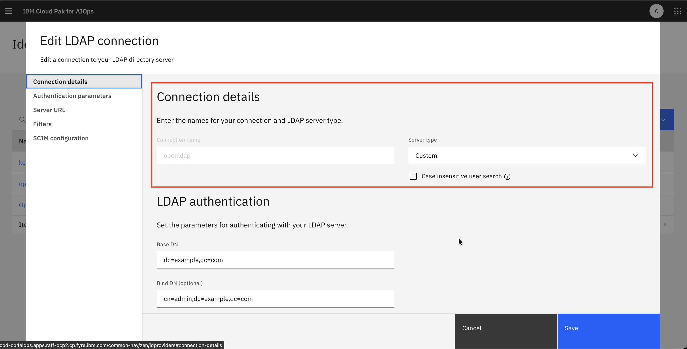
</div>

6. Configure **LDAP authentication** section:

| Field | Value |
|---------|-------|
| Base DN	| dc=example,dc=com |
| Bind DN	(optional) | cn=admin,dc=example,dc=com |
| Bind DN password (optional) | secret |

<div align="center">
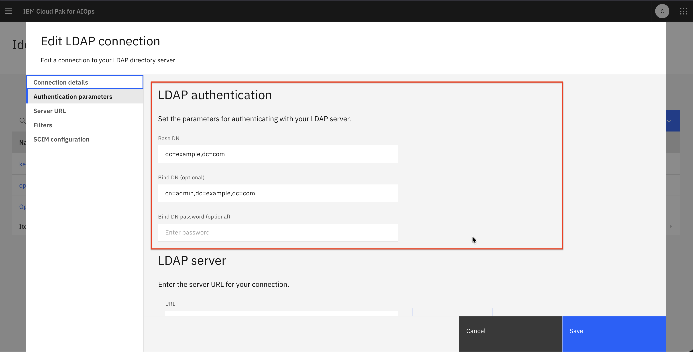
</div>

7. Configure **LDAP server** section:

| Field | Value |
|---------|-------|
| LDAP server URL	| `ldap://<openldap.example.com>:389` |
| Client certificate validation mode | `Leave empty` |
| Enable LDAP failover | `OFF` |

8. Click `Test connection` → expect green success indicator message such as "Successful connection to ldap://openldap.example.com:389"

<div align="center">
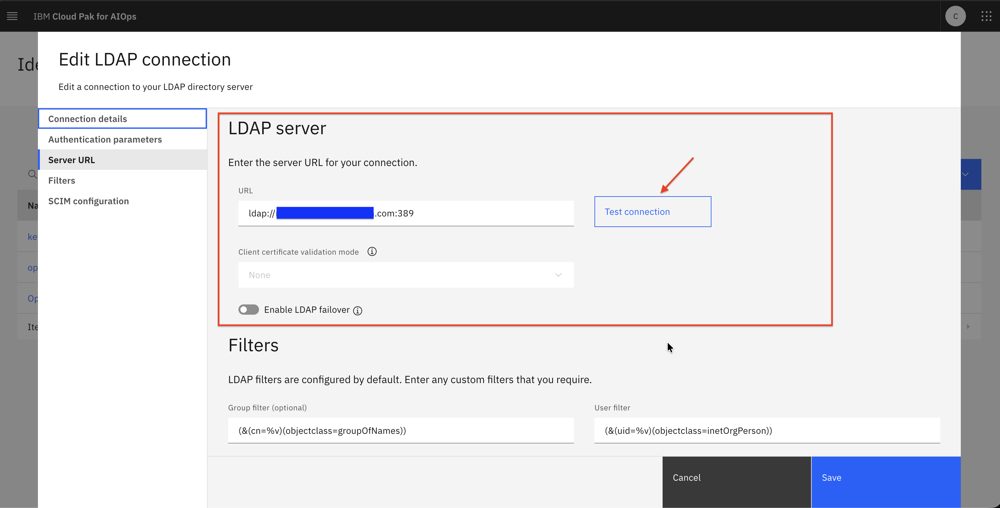
</div>

9. Configure **Filters** section:

| Field | Value |
|---------|-------|
| Group filter | (&(cn=%v)(objectclass=groupOfNames)) |
| User filter	| (&(uid=%v)(objectclass=inetOrgPerson)) |
| Group ID map | *:cn |
| User ID map	| *:uid |
| Group member ID map (optional)	| groupOfNames:member |

<div align="center">
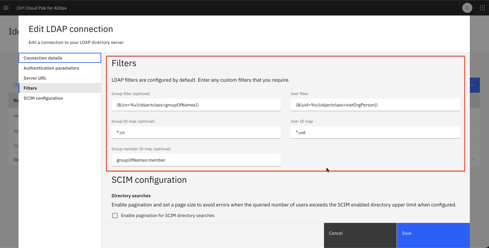
</div>

10. Configure **SCIM configuration** section:

| Field | Value |
|---------|-------|
| Enable pagination for SCIM directory searches | `Leave unchecked` |

<div align="center">
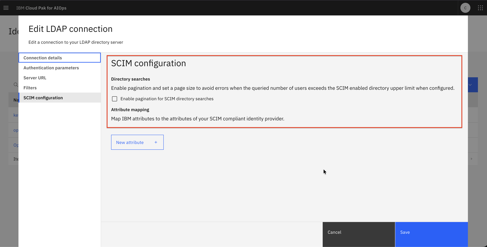
</div>

11. Click `Create` to save the new LDAP connection

:::note 
For production, use LDAPS such as `ldaps://<openldap.example.com>:636`
:::

## CloudPak for AIOps Config: OIDC Configuration
We will configure OIDC in CP4AIOps Foundational Services in conjunction with OpenLDAP.
CP4AIOps uses IBM Cloud Pak Foundational Services (Common Services) IAM. OIDC is configured by creating a New OIDC Connection on Identity Provider Configuration page at `https://<cp-console-url>/common-nav/zen/idproviders`
### Create Keycloak CA Certificate Secret
CP4AIOps must trust Keycloak's TLS certificate. Copy the Keycloak Self Signed cert or CA cert under a Secret.
To achieve that, edit platform-auth-ldaps-ca-cert secret in cp4aiops namespace to include the Keycloak CA cert in PEM format under data.certificate.
1. On the OCP Bastion VM, run the following commands:
```bash title="Host: OCP Bastion VM"
# Copy the Keycloak cert to your local machine
openssl s_client -connect keycloak.example.com:8443 -showcerts 2>&1 < /dev/null \
  | sed -ne '/-BEGIN CERTIFICATE-/,/-END CERTIFICATE-/p' > keycloak_certs.pem

#Login
oc login https://api.ocp1.example.com:6443 -u kubeadmin -p secret

# Set the namespace to cp4aiops
oc project cp4aiops

# Create the secret in the cp4aiops namespace with the Keycloak Self Signed or CA cert
oc create secret generic platform-auth-ldaps-ca-cert \
  --from-file=certificate=./keycloak_certs.pem \
  --dry-run=client -o yaml | kubectl apply -f -
```

2. After adding the Keycloak self signed cert, the secret will have the following structure where the certificate is under `data.certificate` in base64 encoded format.
Use command `oc edit secret platform-auth-ldaps-ca-cert -n cp4aiops` to view the secret structure.
```bash title="Host: OCP Bastion VM"
...snippet...
      namespace: cp4aiops
  ownerReferences:
    - apiVersion: operator.ibm.com/v1alpha1
      kind: Authentication
      name: example-authentication
      uid: 15149324-9334-459e-95f9-c16f70475783
      controller: true
      blockOwnerDeletion: true
  labels:
    app.kubernetes.io/managed-by: ibm-iam-operator
    app.kubernetes.io/part-of: im
data:
  certificate: LS0tLS1C...N2ckZzbWc0aAozM0NESkF1Mld1YUJKU3RGNnN3TCtBPT0KLS0tLS1FTkQgQ0VSVElGSUNBVEUtLS0tLQo=
type: Opaque
```
3. Exit from the secret editor.

### Register Keycloak as OIDC Identity Provider in CP4AIOps
1. Launch web browser, navigate to the CP4AIOps Login page <br/>i.e. `https://cpd-cp4aiops.apps.example.ibm.com/zen/#/homepage` and login as `cpadmin`
2. On `CP4AIOps Landing` page, navigate to `Manage Users` → `Identity provider configuration`
3. On `Identity provider configuration` page, click `New OIDC connection`
4. Choose `OIDC` as the connection type.
5. Configure **Connection details** section:

| Field | Value | Explanation |
|---------|-------|-------|
| Name | `keycloak-oidc` | This value matches with Keycloak OIDC Client Login setting |
| Description	| `This is an OIDC connection` | Any meaningful description |
| Use in conjunction with an existing LDAP | `ON` | Set to ON as our setup requires OpenLDAP for user directory | 
| Enable just in time provisioning | `OFF` | Set to OFF | 
| This is a SCIM compliant identity provider | `OFF` | Set to OFF | 
| Specify LDAP connection | Choose `openldap` | This is the LDAP connection created in earlier steps |
| Enable on-behalf-of flow for Microsoft Azure | `OFF` | Set to OFF | 

<div align="center">
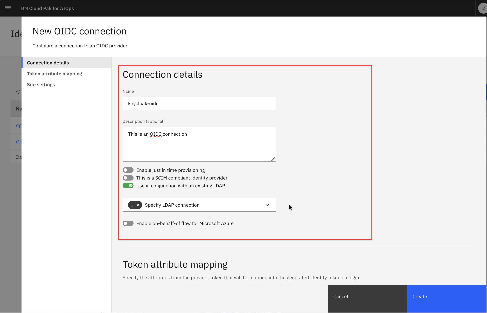
</div>

6. Configure **Token attribute mapping** section:

| Token attribute | Provider token attribute |
|---------|-------|
| Display name(optional) | `preferred_username` |
| Email | `email` |
| Family name | `givenName` |
| Given name | `userName` |
| Groups | `groups` |
| Preferred username (optional) | `preferred_username` |
| Sub | `sub` |
| Unique security name (optional) | `preferred_username` |

<div align="center">
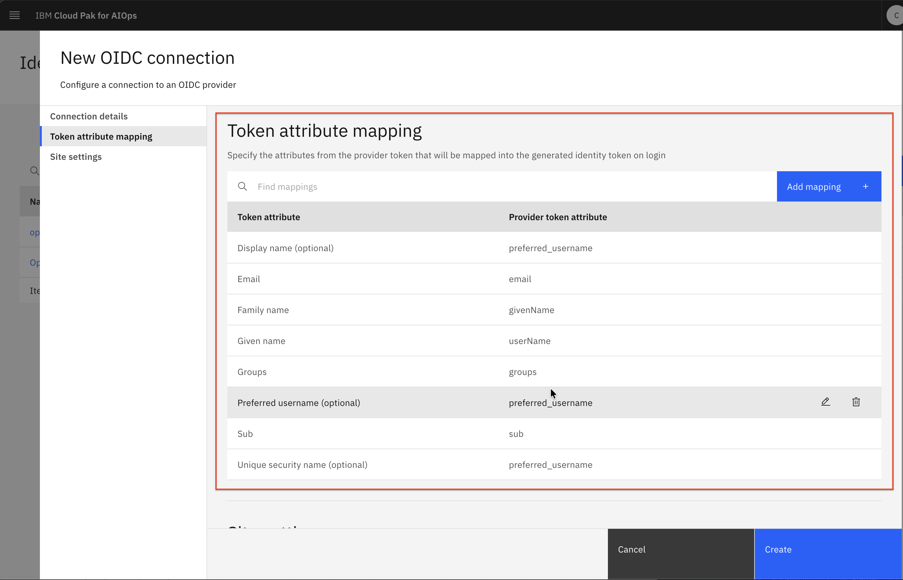
</div>

7. Configure **Site settings** section:

| Settings | Value |
|---------|-------|
| Well-known URI | `https://<keycloak.example.com>:<keycloak-port>/realms/{realm}/.well-known/openid-configuration` |
| Client ID | `cp4aiops-client` |
| Client secret | `<oidc_client_secret>` |

<div align="center">
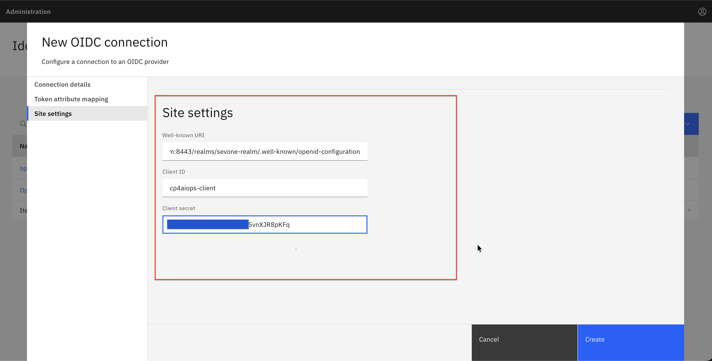
</div>

8. Click Save button
9. Exit from CP4AIOps UI

:::important
The Well-known URI in Site settings section can be tested using `curl -k` such as `curl -k https://keycloak.example.com:8443/realms/sevone-realm/.well-known/openid-configuration`
:::

:::important
The discovery_url must be the full RFC 8414 discovery endpoint. CP4AIOps will fetch it at registration time. If Keycloak's TLS cert is not trusted, this call will fail with x509: certificate signed by unknown authority. Ensure the CA cert secret was created in earlier step. 
:::

### Restart platform-auth-service pod in CP4AIOps cluster
1. Login to CP4AIOps cluster using oc login
2. Restart `platform-auth-service` pod under `cp4aiops` namespace
```bash title="Host: OCP Bastion VM"
#Login
oc login https://api.ocp1.example.com:6443 -u kubeadmin -p secret

# set project to cp4aiops
oc project cp4aiops

# get pod platform-auth-service
oc get pods | grep platform-auth-service

# delete platform-auth-service pods
oc delete pod $(oc get pods | grep platform-auth-service | awk '{print $1}')
```

3. After `platform-auth-service` pod under `cp4aiops` namespace has been restarted, run the following commands to verify Keycloak cert is present in JKS keystore file.
```bash title="Host: OCP Bastion VM"
# set project to cp4aiops
oc project cp4aiops

# rsh to platform-auth-service pod
oc rsh $(oc get pods | grep platform-auth-service | awk '{print $1}') 

# rsh to platform-auth-service pod
sh-4.4$ keytool -list -v -keystore /opt/ibm/wlp/output/defaultServer/resources/security/key.jks -storepass insecurePass |grep -i "alias"

sh-4.4$ exit
```

4. JKS file should contain the last entry which is Keycloak certificate
```bash title="Expected output from keytool"
sh-4.4$ keytool -list -v -keystore /opt/ibm/wlp/output/defaultServer/resources/security/key.jks -storepass insecurePass |grep -i "alias"
Alias name: ca2
Alias name: default
Alias name: https://127.0.0.1:443/idauth/oidc/endpoint/op
Alias name: icp-ldap-0
Alias name: oidc123
Alias name: keycloak.example.com:8443
```

:::important
Must restart the platform-auth-service pod for changes to take effect. 
These changes include the new OIDC connection and the new cert addition to JKS keystore in platform-auth-service pod. 
:::

## CloudPak for AIOps Config: User Roles Assignment
As admin, we will assign LDAP users with Roles in CP4AIOps before allowing LDAP users to login to CP4AIOps.
### Assign Role to LDAP Users
1. Launch web browser, navigate to the CP4AIOps Login page <br/>i.e. `https://cpd-cp4aiops.apps.example.com/zen/#/homepage` and login as `cpadmin`
2. On CP4AIOps landing page, click the hamburger menu (☰) → Administration → Access control
3. On the **Access control** page → click **Add users +**
4. Search for users such as `alice`, `bob`, `charlie`
5. Click and assign any of these roles deemed fit for the user
   → Account administrator
   → Administrator
   → Automation Administrator
   → Automation Analyst
   → Automation Developer
   → Automation Operator
   → Service Administrator
   → User
6. Finally, click Add to save the role assignments

## CloudPak for AIOps SSO Login: Verification and Testing
### Verify SSO Login Button
1. Launch new Private/Incognito Firefox window and navigate to the CP4AIOps Login page <br/>i.e. `https://cpd-cp4aiops.apps.example.com/zen/#/homepage`
2. You should see `keycloak-oidc` as an option under `Log in with` drop down list
3. Select `keycloak-oidc` under `Log in with` drop down list

<div align="center">
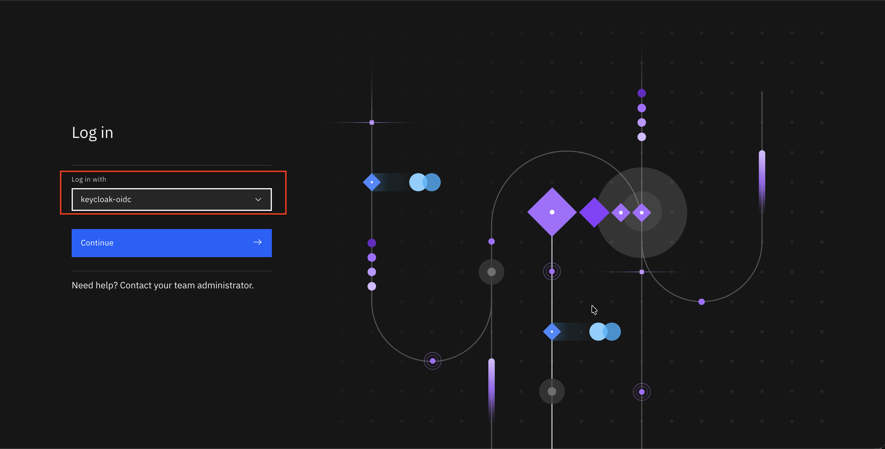
</div>

4. You will be redirected to Keycloak login page
5. On Keycloak login page, enter your OpenLDAP user credentials (e.g., alice, bob, charlie) and click **Sign In**.

<div align="center">
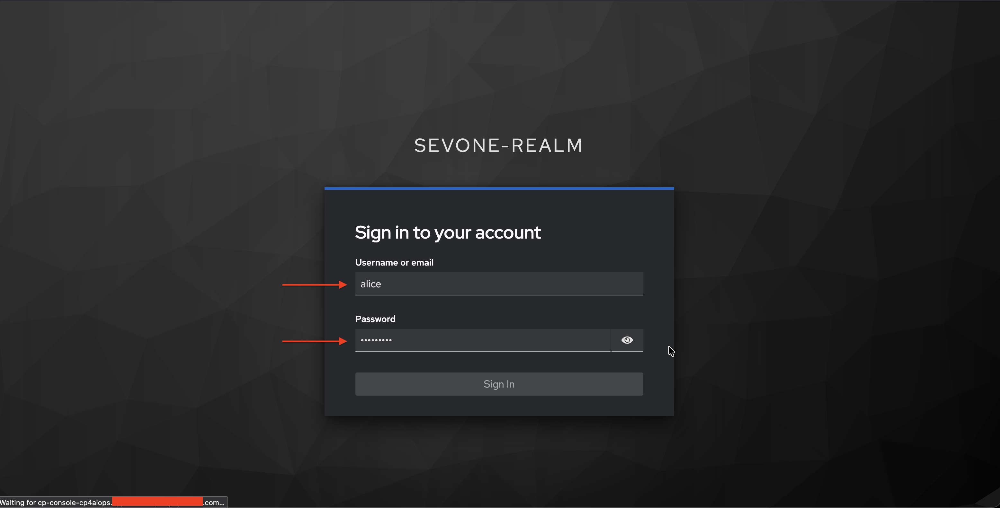
</div>

6. You should be redirected back to CP4AIOps landing page, you will see you logged in as LDAP user on top right corner

<div align="center">
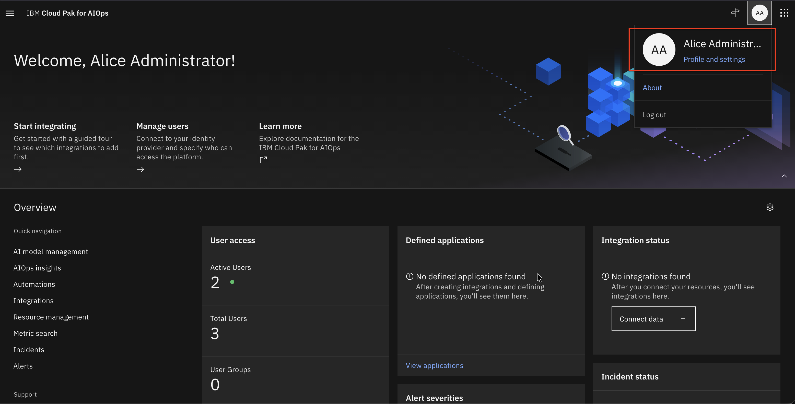
</div>

7. Next, we will do cross launch from CP4AIOps to SevOne for SevOne discovered devices.

### Perform SevOne Observer discovery and configure right-click tool for launch in context
1. Configure SevOne Observer and perform the Observer discovery
2. Use `Topology tools` to add menu option in topology to launch SevOne DI for discovered devices
3. Assign name to the topology tool such as `launchSevOne` and its configuration as below

<div align="center">
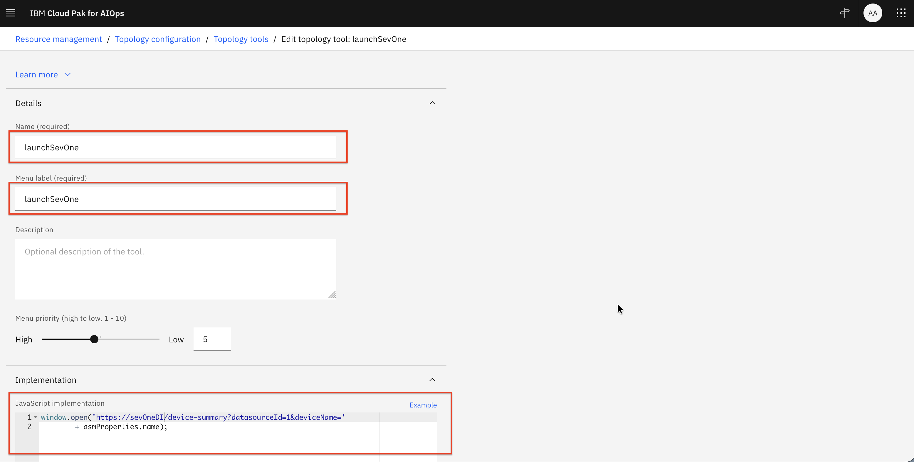
</div>

4. Define JavaScript implementation to the topology tool such as code block below 

```bash title="Example JavaScript for Topology tool"
window.open('https://sevoneDI.example.com/device-summary?datasourceId=1&deviceName='
        + asmProperties.name);
```

5. In CP4AIOps topology, do right click for a SevOne discovered device where you will get `launchSevOne` menu option.

<div align="center">
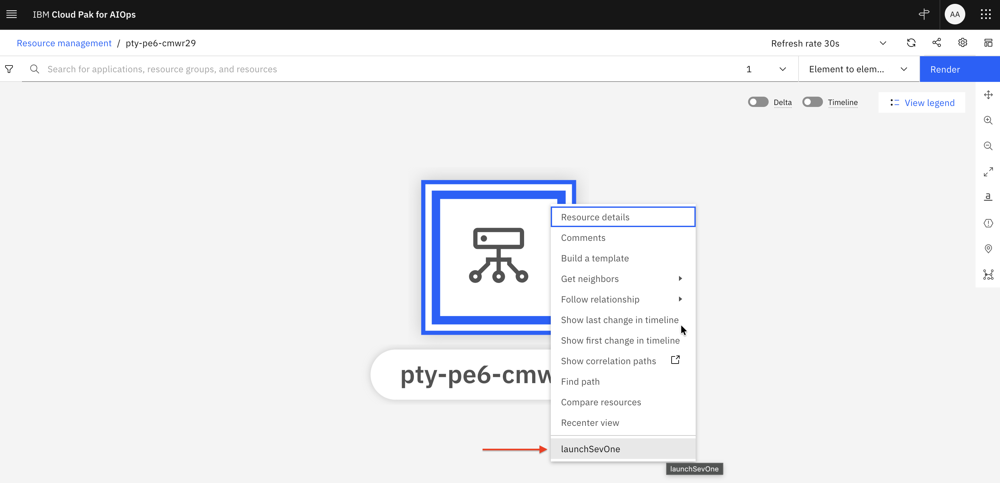
</div>

6. You will be directed to SevOne DI dashboard for the device.

<div align="center">
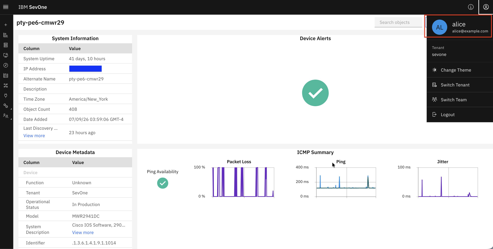
</div>

7. Login to Keycloak UI as admin, under `sevone-realm` → `Session` you will see `alice` logged in to 2 clients which are `cp4aiops-client` and `sevoneDI`.

<div align="center">
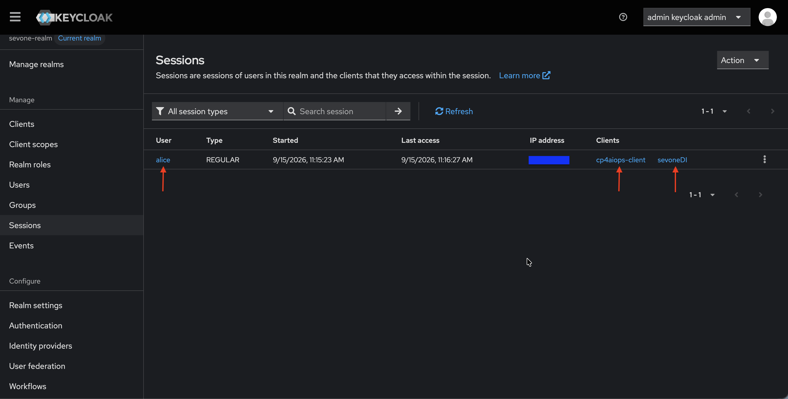
</div>

================================
===================================

# Congratulations! You have successfully configured CP4AIOps SSO with Keycloak and OpenLDAP. 
You can now log in to CP4AIOps using your LDAP credentials through Keycloak.
You can also perform cross launch from CP4AIOps to SevOne. 

================================
===================================
