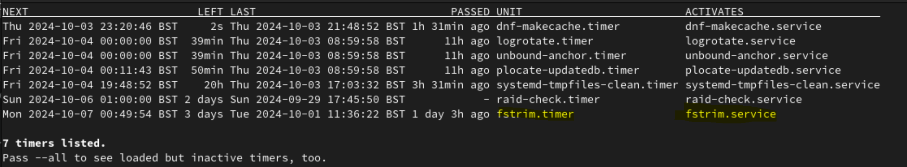

# Reclaiming free space on block devices

This section focuses on the importance of reclaiming free blocks after delete
operations periodically to avoid running out of capacity unnecessarily.

## TL;DR

Following deletion operations, freed blocks are not immediately reclaimed and
returned to the underlying block storage pool. Freed blocks need to be reclaimed
as part of a normal and healthy operations regime to maintain accurate and
efficient capacity utilization.

Understanding the need for the capacity reclamation process and configuring
appropriate schedules to reclaim freed blocks will help ensure applications are
not suddenly impacted due to loss of storage capacity.

See [Reclaiming space on target volumes][rh-odf-fstrim] for guidance on how to
configure `fstrim` jobs to help maintain healthy capacity utilization of your
storage cluster.

## Understanding block device (RBD) capacity behaviour

In production environments, the recommended storage devices are enterprise grade
SSD or NVMe drives for best performance and resiliency.

When configuring underlying storage in a software-defined-storage (SDS)
solution, it can be common practice to leverage thin-provisioning for efficiency
and utilization.

When thin-provisioned, disk space is allocated based on data needs instead of
preallocation upfront. As a result, the block storage controller has more work
to do in maintaining the underlying blocks, e.g. managing which blocks have been
freed and reclaiming them for reuse in other storage requests.

To understand this, let's consider a simple scenario of what happens when an
application requests block storage using a Persistent Volume Claim (PVC) with
dynamic provisioning via a `StorageClass` in filesystem mode:

1. On receiving a PVC request in a thin-provisioned storage solution, a
   Persistent Volume (PV) is created in the underlying block storage pool,
   formatted with the requested filesystem, and mounted onto the node(s) where
   the consuming Pods are scheduled to run.

1. The application running in the associated Pod(s) read, write and delete data
   as needed.

1. When data is deleted within the filesystem, whilst it may appear free for
   reuse within the context of the PV's filesystem, the underlying block storage
   pool is not aware the associated blocks are actually free yet.

1. As new writes occur, it can be the case that new blocks from the underlying
   storage pool are allocated. This can happen for many reasons and is typically
   transparent to the filesystem within the PV.

When files are deleted from a filesystem within a PV, the occupied space is not
released and returned immediately to the underlying block storage pool. Which
can lead to a discrepancy between the actual used space reported by the
filesystem inside the PV, and the space reported by the underlying storage
platform, in this case Ceph.

The process used to reclaim unused space in the underlying block storage pool
devices is known as `fstrim`:

- It essentially informs the underlying storage pool about blocks no longer in
  use, allowing Ceph to reclaim the space.

## What happens if unused space is not reclaimed periodically?

The immediate affect is the storage solution cannot report accurately on
utilized disk space, which can lead to:

- A capacity threshold warning alerts being triggered at `75%` full capacity.
- A capacity threshold critical alert being triggered when capacity usage
  crosses `85%`:
  - This leads to the storage cluster going into `read-only` mode for data
    protection until the situation is resolved.

So whilst the application and filesystem inside the PV may _think_ they have
available capacity from the filesystem perspective, the underlying storage
solution thinks it is running out of capacity, until blocks marked to be freed
are actually reclaimed.

If the storage cluster goes into `read-only` mode, or backing devices begin to
experience instability related problems, the application relying on the storage
will be negatively impacted, potentially going down completely.

:::caution Increased writes and deletes can accelerate overall capacity usage.

In periods of increased write activity, underlying block consumption can be
accelerated if new writes outstrip deletes and block reclamation.

:::

## Why don't I need to manually run `fstrim` in a normal Linux server environment?

In a normal Linux (normal being a standard, non-Kubernetes server environment)
system which uses `systemd`, `fstrim` is normally configured to run weekly as a
`timer` job.

On a `systemd` based Linux server that has an SSD or NVMe drive, you can list
the active timers using:

```bash
sudo systemctl list-timers
```

You should see output like below:



:::note Configuration can vary between Linux distributions.

:::

## What else can impact capacity utilization?

As mentioned above, write and delete heavy usage patterns at the filesystem
level can impact how quickly capacity usage grows, especially during periods of
high writes, like a data storm for example.

But application data isn't the only thing that consumes capacity from the
underlying storage pool. The storage solution itself has to maintain metadata it
uses to manage the storage cluster.

As data volume increases, so does the metadata. In situations where there are
frequent writes or deletes, metadata can accumulate over time, particularly if
the storage solution is not configured to reclaim free blocks after deletions at
an optimum frequency.

This all contributes to overall capacity usage of the usable storage pool.

## How frequently should `fstrim` be run?

This depends on several factors, including application workload filesytem usage
patterns. In most cases every `24 hours` may be sufficient.

However, in cases where there are substantial writes and deletions at fairly
rapid or frequent rates, more aggressive `fstrim` frequency may be required.

:::caution Consider performance impacts of running too frequently.

It is always advisable to seek advice from storage subject matter experts and
test the impact of frequency changes in a pre-production environment before
making changes in production.

:::

The current recommended approach is to monitor for `CephClusterNearFull` alerts
which by default occur at `75%` utilization:

- Take action to add capacity or use it as guidance to work out the frequency of
  running `fstrim` to reclaim space.

An additional proactive approach would be to leverage Prometheus metrics to
understand how fast PVs may be filling up:

- It could be the case that there is a data storm causing the capacity
  utilization to go up faster than normal:
  - Leveraging rate calculations as part of the overall monitoring strategy will
    help provide better forward guidance.

## Keeping an eye on application storage configuration changes

From time to time, based on application and usage requirements, there can be a
need to increase Persistent Volume Claim (PVC) capacity requests.

It is imporant to remember that in a highly abstracted system such as Kubernetes
/ OpenShift, coupled with Software-Defined-Solutions (SDS) such as IBM Storage
Fusion Data Foundation or OpenShift Data Foundation, the storage solution will
not be inherently aware of increases in overall application capacity
requirements. The storage solution will keep attempting to service storage
requests until it runs out of capacity.

It is highly advisable to introduce a careful change management process which
includes reviewing any changes to PVC requirements and whether more storage
capacity is required as a result.

## How do I configure `fstrim`?

This typically requires annotating the target PVCs with a schedule frequency.

It is highly advisable to review the documentation fully and testing in a
pre-production environment before making changes in production.

Refer to the [Red Hat OpenShift Data Foundation][rh-odf-fstrim] documentation
for detailed instructions on the procedure.

---

[rh-odf-fstrim]:
  https://docs.redhat.com/en/documentation/red_hat_openshift_data_foundation/4.14/html/managing_and_allocating_storage_resources/reclaiming-space-on-target-volumes_rhodf#reclaiming-space-on-target-volumes_rhodf
