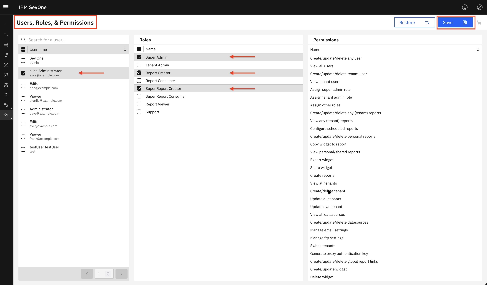
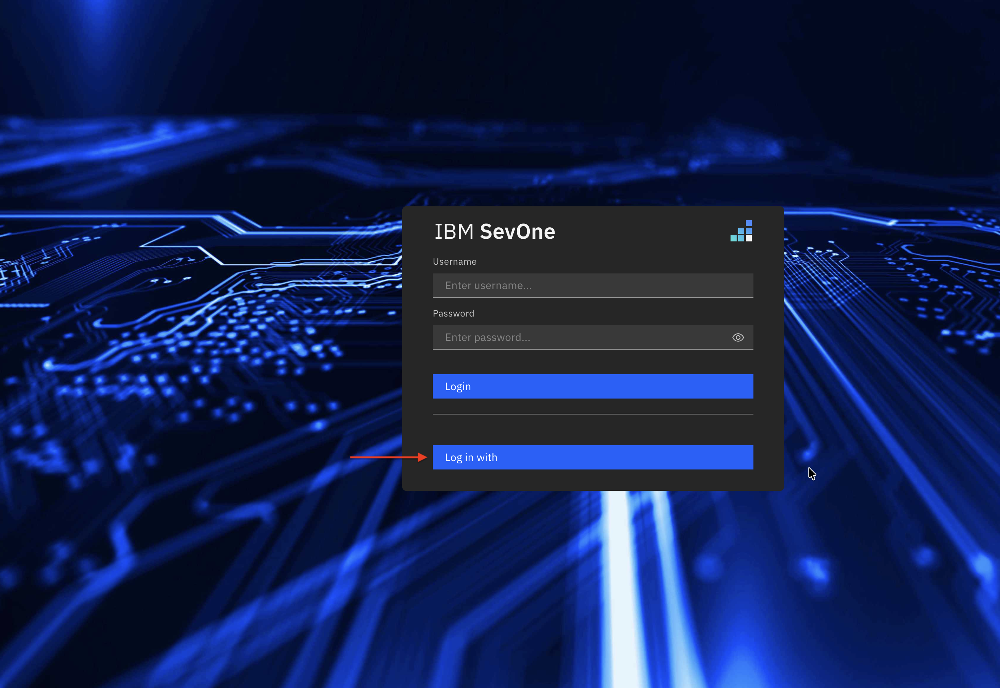
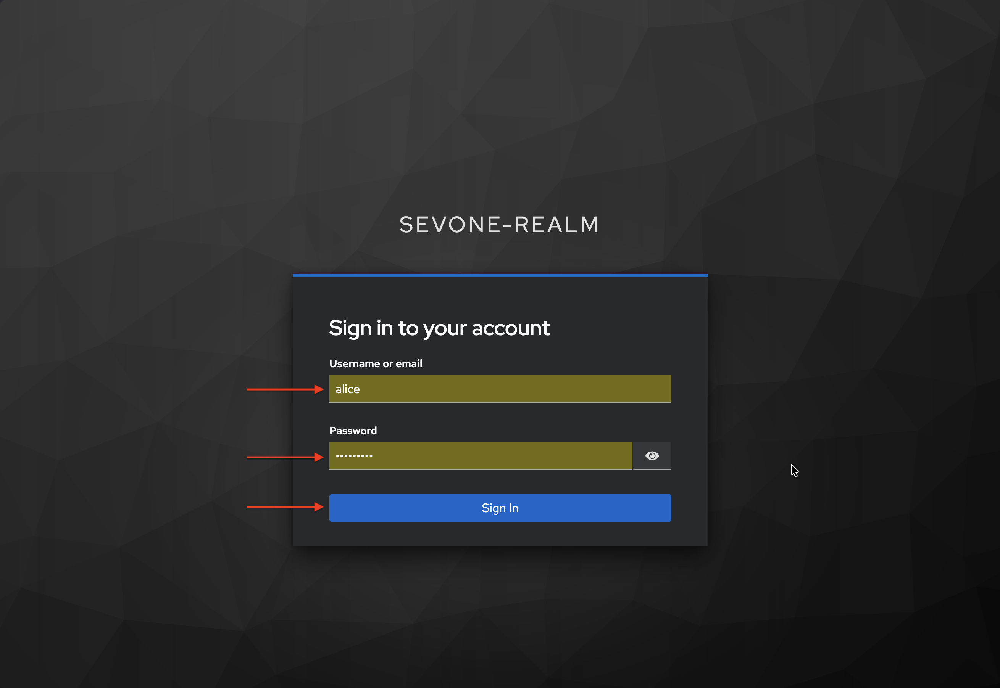
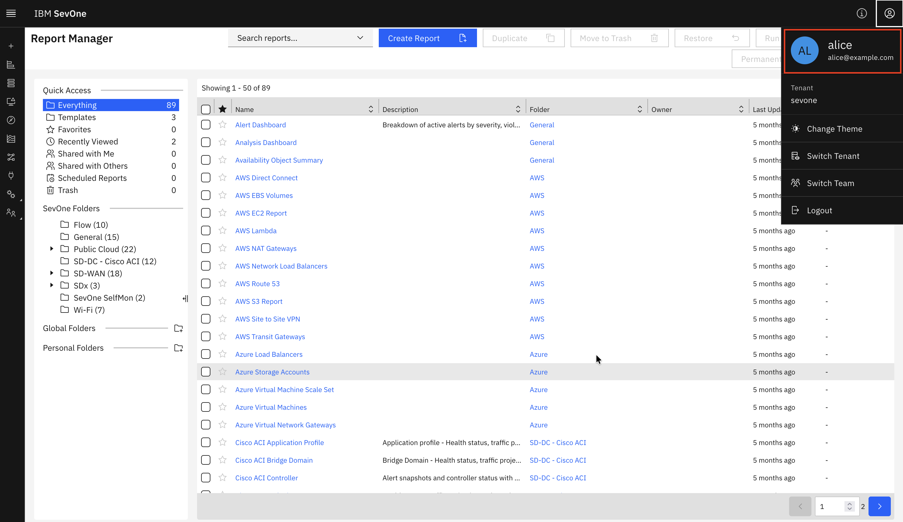

---
description:
    SevOne DI SSO
sidebar_position: 1
---

# SevOne Data Insights SSO

This section describes how to configure Single Sign-On (SSO) for IBM SevOne Data Insights using Keycloak as the OpenID Connect (OIDC) Identity Provider and OpenLDAP as the user directory. It can also be used as a reference to build launch in context for SevOne devices from Cloud Pak for AIOps / Concert Operate. 
SevOne NMS SSO configuration guide is a prerequisite for this guide. Please refer to the SevOne NMS SSO guide for instructions on configuring SSO for SevOne NMS before proceeding with this guide.

## Overview and Architecture
Single Sign-On (SSO) is an authentication method that lets a user log in once and access multiple applications or systems without signing in again.

Single Sign-On (SSO) between Cloud Pak for AIOps and SevOne is typically achieved by integrating both platforms with a common OIDC or SAML provider, such as Keycloak, and a common user and groups directory provider, such as LDAP, or Active Directory, rather than by establishing a direct authentication relationship between the two products. In this model, users authenticate once through the shared identity provider, which validates credentials against the organization’s directory service and then issues the identity and access claims required by each application. This approach provides a consistent login experience across Cloud Pak for AIOps and SevOne, simplifies user administration, centralizes authentication policy, and supports role-based access control through mapped groups or claims.

This guide configures Single Sign-On (SSO) for IBM SevOne Data Insight using Keycloak as the OpenID Connect (OIDC) Identity Provider and OpenLDAP as the user directory.

<div align="center">

</div>

| Component | Role | Protocol |
|---------|-------|-------|
| OpenLDAP | User directory — single source of truth for users and groups | LDAP / port 389 (non-secure) |
| Keycloak | OpenID Connect (OIDC) Identity Provider — federates users from LDAP, issues OIDC tokens | HTTPS / port 8443 |
| SevOne Data Insights (DI) | Relying Party — consumes OIDC tokens, enforces RBAC | HTTPS / port 443 (secure) |

## Prerequisites

| Software | Version | Notes |
|---------|-------|-------|
| OpenLDAP | 2.6.x | Running on port 389 (or 636 for LDAPS), users must have uid and mail attributes |
| Keycloak | 26.x or later | Secure Keycloak with Self Signed Certificate or CA signed, configured with SAN (Subject Alternative Names),admin credentials required |
| SevOne Data Insights (DI) | 8.2 | Running, admin access available, FQDN or IP used for redirect URIs |

## OpenLDAP Verification
Skip this step if you have already verified OpenLDAP accessibility from SevOne NMS.
To recap, the LDAP structure that we will use for this example is as follows:

```
dc=example,dc=com (Base DN)
├── ou=users (Organizational Unit for users)
│   ├── uid=alice 
│   ├── uid=bob 
│   └── uid=charlie 
└── ou=groups (Organizational Unit for groups)
    ├── cn=network_ops_engineer 
    ├── cn=network_admin 
    └── cn=network_svc_mgr 
```

## Keycloak Configuration: TLS Cert, Subject Alternate Name (SAN), Realm, LDAP Federation & Client
Keycloak must serve a TLS certificate with a Subject Alternative Name (SAN) matching its hostname. Go 1.15+ rejects certificates that only have a Common Name (CN). 
SevOne DI component uses Go — it will fail with x509: certificate relies on legacy Common Name field if the cert has no SAN. 

### Keycloak Config: TLS Cert, Subject Alternate Name (SAN)
Below is an example of a SAN configuration file for generating a self-signed certificate for Keycloak. 
You can use this configuration with OpenSSL to create a certificate that includes the necessary SAN entries.

```bash title="Host: Keycloak"
cat > /opt/keycloak/conf/keycloak-san.cnf << 'EOF'
[req]
default_bits       = 2048
prompt             = no
default_md         = sha256
distinguished_name = dn
x509_extensions    = v3_req

[dn]
CN = keycloak.example.com

[v3_req]
subjectAltName   = @alt_names
keyUsage         = critical, digitalSignature, keyEncipherment
extendedKeyUsage = serverAuth

[alt_names]
DNS.1 = keycloak.example.com
DNS.2 = keycloak
EOF
```

```bash title="Host: Keycloak"
sudo openssl req -x509 -newkey rsa:2048 -nodes \
  -keyout /opt/keycloak/conf/keycloak.key \
  -out    /opt/keycloak/conf/keycloak.crt \
  -days 825 -config /opt/keycloak/conf/keycloak-san.cnf

# Verify SAN is present
openssl x509 -in /opt/keycloak/conf/keycloak.crt -noout -text \
  | grep -A3 "Subject Alternative Name"

sudo systemctl restart keycloak
```

:::important 
Substitute Keycloak hostname, keycloak.example.com in the above example. 
Keycloak hostname, keycloak.example.com used in the configuration must be changed to actual Keycloak hostname in your environment. 
:::

### Keycloak Config: Realm, LDAP Federation & Client

#### Log in to Keycloak Admin Console
1. Login to Keycloak Admin Console from your browser using the URL: https://keycloak.example.com:8443/admin/master/console/ (replace keycloak.example.com with your Keycloak hostname).
2. Accept the certificate warning if prompted.
3. Log in with your Keycloak admin credentials.

#### Select Realm: sevone-realm
1. On Keycloak Admin Console, click `Manage realms` on the top-left area.
2. Choose `sevone-realm` in the list of realms. We are going to use the `sevone-realm` which we created earlier in SevOne NMS SSO guide.
3. For SevOne DI SSO, we will use the same `sevone-realm` and create a new OIDC client in the `sevone-realm` realm.

#### Create OIDC Client: sevoneDI
1. In sevone-realm, click **Clients** → **Create client**
2. Configure **General Settings**:
   - Client Type: `OpenID Connect`
   - Client ID: `sevoneDI`
   - Name: `SevOne DI SSO Client`
   - Description: `SevOne DI SSO Client`
3. Click Next
4. Configure **Capability config**:
   - Client authentication: `ON`
   - Authorization: `OFF`
   - Standard flow: `ON`
   - Direct access grants: `ON`
   - Service accounts roles: `ON`
   - Implicit flow: `ON`
   - Standard Token Exchange: `OFF`
   - JWT Authorization Grant: `OFF`
   - OAuth 2.0 Device Authorization Grant: `OFF`
   - OIDC CIBA Grant: `OFF`
5. Click Next
6. Configure **Login settings**:
   - Root URL: `Leave empty`
   - Home URL: `Leave empty`
   - Valid redirect URIs: `https://sevoneDI.example.com/callback`
   - Valid post logout redirect URIs: `https://sevoneDI.example.com/` <br/>
                                      `https://sevoneDI.example.com/*` <br/>
                                      `https://sevoneDI.example.com` <br/>
   - Web origins: `Leave empty`
   - Admin URL: `Leave empty`
7. Click Save

:::important 
Substitute SevOne DI hostname, sevoneDI.example.com in the above example. 
SevOne DI hostname, sevoneDI.example.com used in the configuration must be changed to actual SevOne DI hostname or ipAddress in your environment. 
:::

#### Retrieve Client Secret
1. In `sevone-realm`, on the `sevoneDI` client page, click the `Credentials` tab
2. Copy the `Client Secret` value — you will need it in next steps to configure SevOne DI SSO.
3. Save it: `oidc_client_secret`: `<paste-here>`


#### Configure LDAP User Federation
1. Skip this step if you have already configured LDAP federation in SevOne NMS SSO guide.

#### Synchronize Users from LDAP
1. Skip this step if you have already synchronized users from LDAP in SevOne NMS SSO guide.

#### Create Group Mapper
1. Skip this step if you have already created group mapper in SevOne NMS SSO guide.

#### Synchronize Groups from LDAP
1. Skip this step if you have already synchronized groups from LDAP in SevOne NMS SSO guide.

#### Verify default mappers
1. In `sevone-realm`, click the `Client scopes` on left panel
2. Click `profile` from the list of client scopes in Client scopes page
3. Click `Mappers` tab
4. Verify that the following default mappers are present:
   - `full name`
   - `username`
   - `given name`
   - `family name`
5. Logout from Keycloak.

## SevOne DI Config: OIDC configuration
### Edit SevOne DataInsight resource
1. Log in to SevOne Data Insight VM
2. Edit the SevOne Data Insight resource using the following command:
```bash title="Host: SevOne DI"
# Open the DataInsight resource for editing
kubectl edit datainsight di
```

3. Add the oidc and graphql sections under spec section as shown below. Replace `<oidc_client_secret>` with the actual client secret you retrieved from Keycloak.
```bash title="Host: SevOne DI"
spec:
  oidc:
    enable:         true
    enableRedirect: false
    scope:          openid profile email
    authority:      "https://keycloak.example.com:8443/realms/sevone-realm"
    clientId:       "sevoneDI"
    clientSecret:   "<oidc_client_secret>"
  graphql:
    env:
      OIDC_NAME_CLAIM: email
```
:::important 
How configuration is applied? <br/>
SevOne Data Insight is managed via a Kubernetes custom resource. Editing the DataInsight CR triggers the operator to reconcile and restart affected pods automatically. 
:::

4. Save and exit. The operator applies the change automatically.
5. Full `spec.oidc` property reference.

| Property | Type | Default | Description |
|---------|-------|-------|-------|
| enable | boolean | false | Required. Set to true to enable OIDC |
| enableRedirect | boolean | false | Redirect unauthenticated users to Keycloak. Set to false |
| scope | string | "openid profile groups" | Requested OAuth2 scopes. Include groups only for multi-tenant |
| authority | URL | --- | Required. Keycloak realm base URL. DI automatically appends /.well-known/openid-configuration |
| clientId | string | --- | Required. Must match exactClient ID in Keycloak |
| clientSecret | string | --- | Required for confidential clients (Authorization Code flow) |

6. Full `spec.graphql` property reference.

| Parent | Property | Type |Default | Description |
|---------|-------|-------|-------|-------|
| graphql.env | OIDC_NAME_CLAIM | string | --- | Required. Set to email to tell DI to use the email claim from the OIDC token |

### Wait for configuration to apply
1. On the SevOne Data Insight VM, run the following command:
```bash title="Host: SevOne DI"
# Wait until the DataInsight resource is Successful
kubectl wait datainsight di --for condition=Successful --timeout=120s

  # Confirm pods are running
kubectl get pods -n default | grep di-
```

2. All three pods (di-djinn, di-graphql, di-ui) should show 1/1 Running with 0 restarts for a healthy state.
```bash title="Host: SevOne DI"
di-djinn-56c98ffd5d-p8s25         1/1     Running     0             7h19m
di-graphql-664bc48f68-ncnsg       1/1     Running     0             7h19m
di-ui-59d7cd7bcc-zqt2r            1/1     Running     0             51d
```

### Add Self-signed certificate or the CA certificate to the DI resource
1. On the SevOne Data Insight VM, run the following command:
```bash title="Host: SevOne DI"
# First, copy the PEM content to your clipboard
cat /tmp/keycloak-ca.pem
```

2. Edit the SevOne Data Insight resource using the following command:
```bash title="Host: SevOne DI"
# Open the DataInsight resource for editing
kubectl edit datainsight di
```

3. Add or extend the additionalCas section under spec — paste the full PEM content preserving indentation. Maintain a six-space indentation from the left margin for the Keycloak Certificate entry.
```bash title="Host: SevOne DI"
spec:
  oidc:
    enable:         true
    enableRedirect: false
    scope:          openid profile email
    authority:      "https://keycloak.example.com:8443/realms/sevone-realm"
    clientId:       "sevoneDI"
    clientSecret:   "<oidc_client_secret>"
  graphql:
    env:
      OIDC_NAME_CLAIM: email
  additionalCas:
    - |
      -----BEGIN CERTIFICATE-----
      <paste full PEM content here — preserve 6-space indent>
      MIIDqzCCApOgAwIBAgIUWTTn/ZrTC/VBOEP8ZZORD1psA8Ew...
      -----END CERTIFICATE-----  
```

```bash title="Example"
spec:
  oidc:
  additionalCas:
    - |                                                                
      -----BEGIN CERTIFICATE-----
      MIIDPDCCAiSgAwIBAgIUEB66xAjJ2HCRDMOQvBU9FNZfRNwwDQYJKoZIhvcNAQEL
      BQAwIjEgMB4GA1UEAwwXcmFmZi1rYzI2MS5meXJlLmlibS5jb20wHhcNMjYwNzE3
      MTEwNDM1WhcNMjgxMDE5MTEwNDM1WjAiMSAwHgYDVQQDDBdyYWZmLWtjMjYxLmZ5
      cmUuaWJtLmNvbTCCASIwDQYJKoZIhvcNAQEBBQADggEPADCCAQoCggEBAKHfY5yZ
      Xd8rqXfwKxLD8TWS/xNngccLkayI0w2SRoRFlQYDk+ZJFPzcL4tsO9iv2Ye8RdGr
      zTSUG9rn7RolcYZTM+FZjSHo0OwzhsF2rPQryJEEIgSAVEQz4NlF9g7Z3hgIt9jy
      h55OAgGIrw1+OWi61lSmye5X//QBgSoYKDnSRLYp4o2Wf0m6/5tQ2pMMc4yZpjuY
      mRyL8Hw0weVh+dBEGuF2dBQ1jDXBYf2+fpgw8ft9LpLdyEnTxJirV9q1Y7BVsiDg
      ZaEqKG/Kw/C0DH7wVxH5xrXOFompifLsueolJY1NzpuNsBDmBsOeIr7CjTpLmN9Z
      9+KqDTMyASi8CI0CAwEAAaNqMGgwIgYDVR0RBBswGYIXcmFmZi1rYzI2MS5meXJl
      LmlibS5jb20wDgYDVR0PAQH/BAQDAgWgMBMGA1UdJQQMMAoGCCsGAQUFBwMBMB0G
      A1UdDgQWBBSsjRvgUpT8pd7u1ocurJeVdIsi0jANBgkqhkiG9w0BAQsFAAOCAQEA
      gt0XSZbGwq8JEWFmcKSmAY88/fA2igvHuYGuIQKObIvUOgfDQeRgbeKAADI/6igm
      brIr7FbyY8aIGbF4Ti2uN9tXLsJ0OjzE7lqxpbxYpd3Zhkl32ee8pnQueVDPQcub
      yaqvGVIgVklY9LnegAIhGIqnE5TJbC0+0lqhmraJayshWnHOfzxlYExWfObYY1aJ
      zDEAxz6IiFs5Q94/OpkKjjb47BtM3NaOgEdlxmzJouI5r5r/bU7eAne6ZtE23w0s 
      IS+chbAU5JwMUX8Sy1MKptX+ceukl1JR8dg2sm31YZzWHWZAvZsP6rn3vrFsmg4h
      33CDJAu2WuaBJStF6swL+A==                    
      -----END CERTIFICATE-----
```
4. Full additionalCas property reference.

Property | Type |Default | Description |
|-------|-------|-------|-------|
| additionalCas | string | empty | Mandatory when Keycloak is secure https TLS and uses a self-signed or CA signed certificate. Define this property with the PEM-encoded certificate(s). |

### Wait for additionalCas configuration to apply
1. On the SevOne Data Insight VM, run the following command:
```bash title="Host: SevOne DI"
# Wait until the DataInsight resource is Successful
kubectl wait datainsight di --for condition=Successful --timeout=120s

  # Confirm pods are running
kubectl get pods -n default | grep di-
```
Keep an eye on the `di-djinn` pod under the default namespace, which is the main pod for DI SSO.
Tail `di-djinn` pod under the `default` namespace, to look for errors or warnings if required.

2. All three pods (di-djinn, di-graphql, di-ui) should show 1/1 Running with 0 restarts for a healthy state.
```bash title="Host: SevOne DI"
di-djinn-56c98ffd5d-p8s25         1/1     Running     0             7h19m
di-graphql-664bc48f68-ncnsg       1/1     Running     0             7h19m
di-ui-59d7cd7bcc-zqt2r            1/1     Running     0             51d
```

## SevOne DI Role : Assign User Roles to LDAP Users
### Assign User Roles to LDAP Users
1. Login to SevOne DI as admin user and assign roles to LDAP users starting from alice, bob, and others.
2. Go to `Administer` → `User Roles`
3. Select `alice`
4. Select one or more Roles in middle section for `alice`.
5. Click Save button on top right.
6. Repeat for other LDAP users.

<div align="center">

</div> 

## SevOne DI SSO Login: Verification and Testing
### Verify SSO Login Button
1. Launch new Private/Incognito Firefox window and login to SevOne DI from your browser using the URL: https://sevoneDI.example.com/login (replace sevoneDI.example.com with your actual SevOne DI hostname).
2. You should see the standard "Login" button plus an "Log in with" button

<div align="center">

</div> 

3. Click the **Log in with** button. You should be redirected to Keycloak login page.
4. On Keycloak login page, enter your OpenLDAP user credentials (e.g., alice, bob, charlie) and click **Sign In**.

<div align="center">

</div> 

5. You should be redirected back to SevOne DI and logged in successfully.

<div align="center">

</div> 

================================
===================================

# Congratulations! You have successfully configured SevOne DI SSO with Keycloak and OpenLDAP. 
You can now log in to SevOne DI using your LDAP credentials through Keycloak.
We encourage you to experience CloudPak for AIOps or Concert Operate SSO configuration next. 
Please refer to the [Concert Operate SSO guide](../../cloud-pak-for-aiops/SSO/index.mdx) for detailed instructions.

================================
===================================
