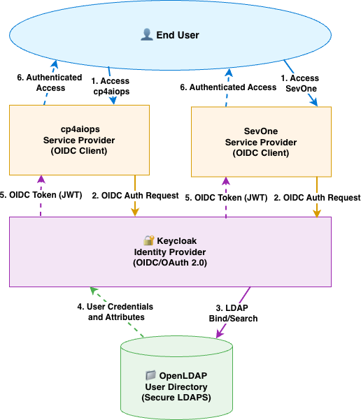
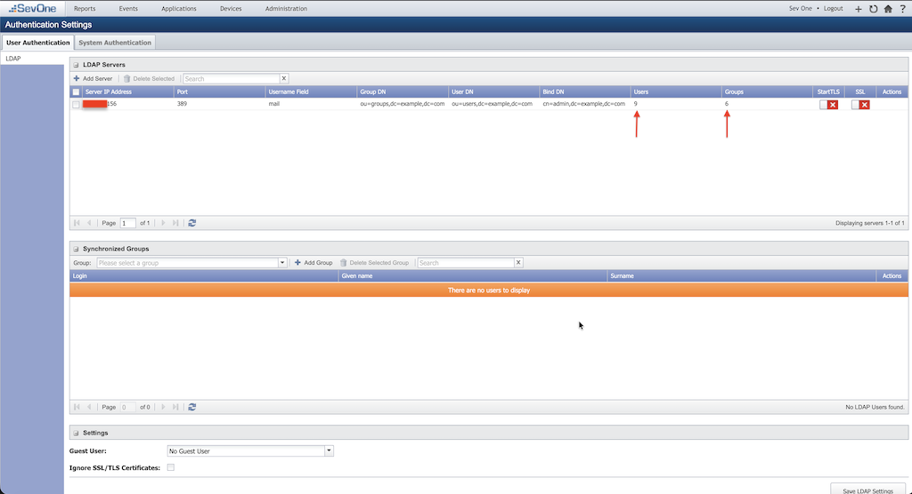
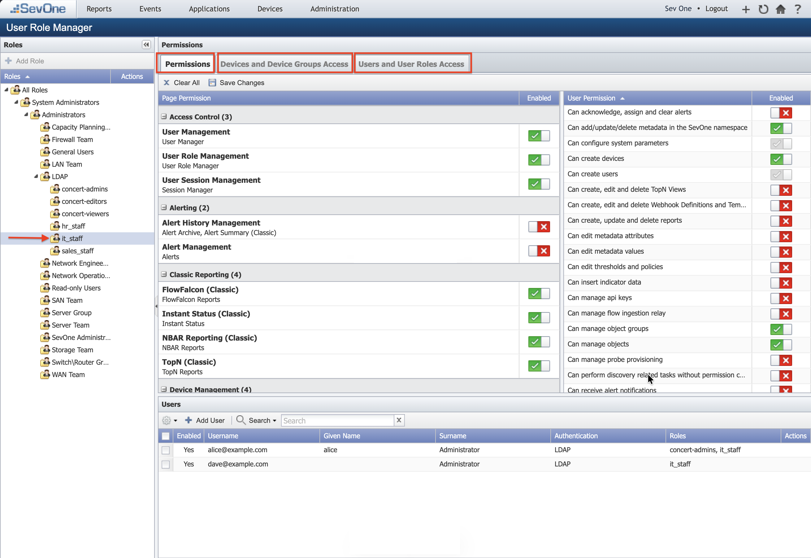
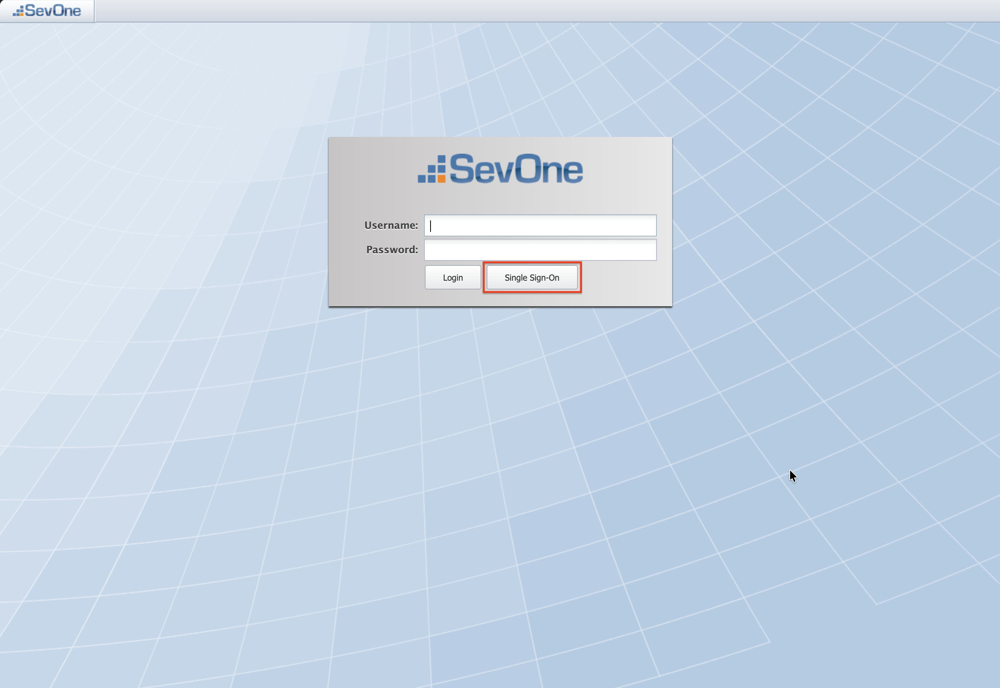
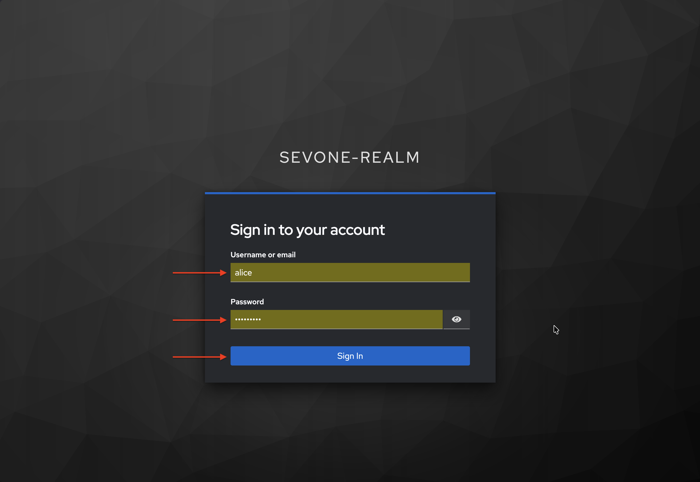
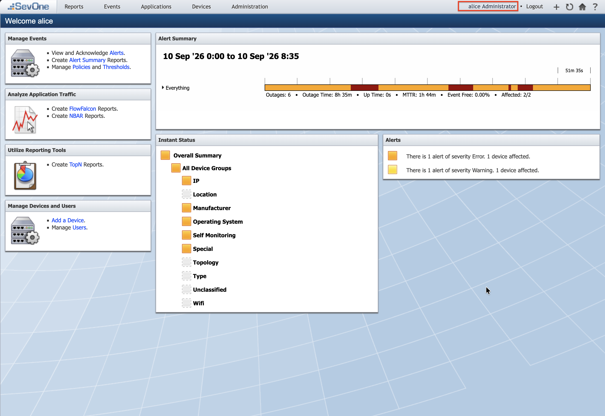

---
description:
    SevOne NMS SSO
sidebar_position: 1
---

# SevOne NMS SSO

This section describes how to configure Single Sign-On (SSO) for IBM SevOne Network Management System (NMS) using Keycloak as the OpenID Connect (OIDC) Identity Provider and OpenLDAP as the user directory. It can also be used as a reference to build launch in context for SevOne devices from Cloud Pak for AIOps / Concert Operate. 

## Overview and Architecture
Single Sign-On (SSO) is an authentication method that lets a user log in once and access multiple applications or systems without signing in again.

Single Sign-On (SSO) between Cloud Pak for AIOps and SevOne is typically achieved by integrating both platforms with a common OIDC or SAML provider, such as Keycloak, and a common user and groups directory provider, such as LDAP, or Active Directory, rather than by establishing a direct authentication relationship between the two products. In this model, users authenticate once through the shared identity provider, which validates credentials against the organization’s directory service and then issues the identity and access claims required by each application. This approach provides a consistent login experience across Cloud Pak for AIOps and SevOne, simplifies user administration, centralizes authentication policy, and supports role-based access control through mapped groups or claims.

This guide configures Single Sign-On (SSO) for IBM SevOne NMS 8.2 using Keycloak as the OIDC Identity Provider (IdP) and OpenLDAP as the user directory. SevOne NMS acts as the Relying Party (RP) — it delegates user authentication to Keycloak, which validates credentials against OpenLDAP and returns a signed JWT token containing the user's groups and roles.

<div align="center">

</div>

| Component | Role | Protocol |
|---------|-------|-------|
| OpenLDAP | User directory — single source of truth for users and groups | LDAP / port 389 (non-secure) |
| Keycloak | OpenID Connect (OIDC) Identity Provider — federates users from LDAP, issues OIDC tokens | HTTPS / port 8443 |
| SevOne NMS | Relying Party — consumes OIDC tokens, enforces RBAC | HTTPS / port 443 (secure) |

## Prerequisites

| Software | Version | Notes |
|---------|-------|-------|
| OpenLDAP | 2.6.x | Running on port 389 (or 636 for LDAPS), users must have uid and mail attributes |
| Keycloak | 26.x or later | Secure Keycloak with Self Signed Certificate or CA signed, configured with SAN (Subject Alternative Names),admin credentials required |
| SevOne NMS | 8.2 | Running, admin access available, FQDN or IP used for redirect URIs |

## OpenLDAP Verification
Before configuring Keycloak, verify that OpenLDAP is running and accessible from SevOne NMS VM. You can use the 'ldapsearch' command to query the LDAP server and check for user entries. 
For example, assuming my ldap server is running on `openldap.example.com` and the base DN is `dc=example,dc=com`, 
you can run the following command to search for users in the `ou=users` organizational unit:

```bash title="Host: SevOne NMS"
podman exec -it nms-nms-nms bash

ldapsearch -x -H ldap://openldap.example.com:389  \
 -D "cn=admin,dc=example,dc=com" -w 'secret' -b "ou=users,dc=example,dc=com" -L
```
The LDAP structure that we will use for this example is as follows:

```
dc=example,dc=com (Base DN)
├── ou=users (Organizational Unit for users)
│   ├── uid=alice 
│   ├── uid=bob 
│   └── uid=charlie 
└── ou=groups (Organizational Unit for groups)
    ├── cn=network_ops_engineer 
    ├── cn=network_admin 
    └── cn=network_svc_mgr 
```

## Keycloak Configuration: TLS Cert, Subject Alternate Name (SAN), Realm, LDAP Federation & Client
Keycloak must serve a TLS certificate with a Subject Alternative Name (SAN) matching its hostname. Go 1.15+ rejects certificates that only have a Common Name (CN). 
SevOne Data Insight component uses Go — it will fail with x509: certificate relies on legacy Common Name field if the cert has no SAN.

### Keycloak Config: TLS Cert, Subject Alternate Name (SAN)
Below is an example of a SAN configuration file for generating a self-signed certificate for Keycloak. 
You can use this configuration with OpenSSL to create a certificate that includes the necessary SAN entries.

```bash title="Host: Keycloak"
cat > /opt/keycloak/conf/keycloak-san.cnf << 'EOF'
[req]
default_bits       = 2048
prompt             = no
default_md         = sha256
distinguished_name = dn
x509_extensions    = v3_req

[dn]
CN = keycloak.example.com

[v3_req]
subjectAltName   = @alt_names
keyUsage         = critical, digitalSignature, keyEncipherment
extendedKeyUsage = serverAuth

[alt_names]
DNS.1 = keycloak.example.com
DNS.2 = keycloak
EOF
```

```bash title="Host: Keycloak"
sudo openssl req -x509 -newkey rsa:2048 -nodes \
  -keyout /opt/keycloak/conf/keycloak.key \
  -out    /opt/keycloak/conf/keycloak.crt \
  -days 825 -config /opt/keycloak/conf/keycloak-san.cnf

# Verify SAN is present
openssl x509 -in /opt/keycloak/conf/keycloak.crt -noout -text \
  | grep -A3 "Subject Alternative Name"

sudo systemctl restart keycloak
```

:::important 
Substitute Keycloak hostname, keycloak.example.com in the above example. 
Keycloak hostname, keycloak.example.com used in the configuration must be changed to actual Keycloak hostname or ipAddress in your environment. 
:::

### Keycloak Config: Realm, LDAP Federation & Client
#### Log in to Keycloak Admin Console
1. Login to Keycloak Admin Console from your browser using the URL: https://keycloak.example.com:8443/admin/master/console/ (replace keycloak.example.com with your Keycloak hostname).
2. Accept the certificate warning if prompted.
3. Log in with your Keycloak admin credentials.

#### Create Realm: sevone-realm
1. On Keycloak Admin Console, hover over the realm dropdown (top-left, shows Master).
2. Click Create Realm.
3. Set Realm name: `sevone-realm`.
4. Set Enabled: `ON`.
5. Click **Create**.

:::note
Keycloak switches to the new realm automatically. Confirm sevone-realm is shown in the realm dropdown before continuing all subsequent steps.
:::

#### Create OIDC Client: sevonenms
1. In sevone-realm, click **Clients** → **Create client**
2. Configure **General Settings**:
   - Client Type: `OpenID Connect`
   - Client ID: `sevonenms`
   - Name: `SevOne NMS SSO Client`
   - Description: `SevOne NMS SSO Client`
3. Click Next
4. Configure **Capability config**:
   - Client authentication: `ON`
   - Standard flow: `ON`
   - Direct access grants: `ON`
   - Service accounts roles: `ON`
   - Implicit flow: `ON`
   - Standard Token Exchange: `OFF`
   - JWT Authorization Grant: `OFF`
   - OAuth 2.0 Device Authorization Grant: `OFF`
   - OIDC CIBA Grant: `OFF`
5. Click Next
6. Configure **Login settings**:
   - Root URL: `Leave empty`
   - Home URL: `Leave empty`
   - Valid redirect URIs: `https://sevonenms.example.com/callback.php`
   - Valid post logout redirect URIs: `https://sevonenms.example.com/` <br/>
                                      `https://sevonenms.example.com/*` <br/>
                                      `https://sevonenms.example.com` <br/>
   - Web origins: `Leave empty`
   - Admin URL: `Leave empty`
7. Click Save

:::important 
Substitute SevOne NMS hostname, sevonenms.example.com in the above example. 
SevOne NMS hostname, sevonenms.example.com used in the configuration must be changed to actual SevOne NMS hostname or ipAddress in your environment. 
:::

#### Retrieve Client Secret
1. In `sevone-realm`, on the `sevonenms` client page, click the `Credentials` tab
2. Copy the `Client Secret` value — you will need it in next steps to configure SevOne NMS SSO.
3. Save it: `oidc_client_secret`: `<paste-here>`

#### Configure LDAP User Federation
1. In `sevone-realm`, click `User federation` in the left navigation
2. Click `Add Ldap providers`
3. Configure **General Settings**:
   - UI Display Name: `openldap`
   - Vendor: `Other`
4. Configure **Connection and Authentication Settings**:
   - Connection URL: `ldap://openldap.example.com:389`
   - Enable StartTLS: `OFF`
   - Use Truststore SPI: `Never`
   - Connection Pooling: `ON`
   - Bind Type: `simple`
   - Bind DN: `cn=admin,dc=example,dc=com`
   - Bind Credential: `<your-ldap-admin-password>`
5. Click **Test connection** button and verify it succeeds where a green banner on top right corner indicates : "Successfully connected to LDAP"
6. Click **Test authentication** button and verify it succeeds where a green banner on top right corner indicates : "Successfully connected to LDAP"
7. Configure **LDAP Searching and Updating**:
   - Edit mode: `READ_ONLY`
   - Users DN: `ou=users,dc=example,dc=com`
   - Relative user creation DN: `Leave empty`
   - Username LDAP attribute: `uid`
   - RDN LDAP attribute: `uid`
   - UUID LDAP attribute: `entryUUID`
   - User Object Classes: `inetOrgPerson, organizationalPerson`
   - User LDAP filter: `Leave empty`
   - Search scope: `One Level`
   - Read timeout: `Leave empty`
   - Pagination: `ON`
   - Referral: `Leave empty`
8. Configure **Synchronization settings**:
   - Import Users: `ON`
   - Sync Registrations: `OFF`
   - Batch size: `1000`
   - Periodic full sync: `ON`
   - Full sync period: `604800`
   - Periodic changed users sync: `ON`
   - Changed users sync period: `86400`
   - Remove invalid users during searches: `ON`
9. Configure **Kerberos integration**:
   - Allow Kerberos authentication: `OFF`
   - Use Kerberos for password authentication: `OFF`
10. Configure **Cache settings**:
   - Cache policy: `DEFAULT`
11. Configure **Advanced settings**:
   - Enable the LDAPv3 password modify extended operation: `OFF`
   - Validate password policy: `OFF`
   - Trust Email: `OFF`
   - Connection trace: `OFF`
12. Click Save to save the User Federation settings

#### Synchronize Users from LDAP
1. In `sevone-realm`, on `User federation` page, click `openldap` tile
2. Click `Action` → `Sync all users`
3. Expect: "3 users imported"
4. Go to Users — verify `alice`, `bob`, `charlie` appear with Federation link: `openldap`

#### Create Group Mapper
1. In `sevone-realm`, on `User federation` page → `openldap` tile → `Mappers` tab
2. Click `Add mapper`
3. Configure **Mapper settings**:
   - Name: `ldap-group-mapper`
   - Mapper type: `group-ldap-mapper`
   - LDAP Groups DN: `ou=groups,dc=example,dc=com`
   - Relative creation DN: `Leave empty`
   - Group Name LDAP Attribute: `cn`
   - Group Object Classes: `groupOfNames`
   - Preserve Group Inheritance: `ON`
   - Ignore Missing Groups: `OFF`
   - Membership LDAP Attribute: `member`
   - Membership Attribute Type: `DN`
   - Membership User LDAP attribute: `uid`
   - Mode: `READ_ONLY`
   - User Roles Retrieve Strategy: `LOAD_GROUPS_BY_MEMBER_ATTRIBUTE`
   - Member-Of LDAP Attribute: `memberOf`
   - Mapped Group Attributes: `Leave empty`
   - Drop non-existing groups during sync: `OFF`
   - Groups Path: `/`
4. Click Save

#### Synchronize Groups from LDAP
1. In `sevone-realm`, on the same page, click `Action` → `Sync LDAP groups to Keycloak`
2. Expect: "3 groups imported"
3. Logout from Keycloak.

## SevOne NMS Config: OIDC configuration
### Trust the Keycloak Certificate in SevOne NMS
Since Keycloak uses a self-signed or internal CA certificate, SevOne NMS must trust it. Copy the Keycloak CA cert to the SevOne host and add it to the system trust store.
1. Login to SevOne NMS as `admin` user
2. Go to Administration → Access Configuration → Authentication Settings → System Authentication tab
3. Click **+ Add Certificate**
4. Take **Upload SSL/TLS Root Certificate** option and upload the Keycloak CA certificate (keycloak.crt)

Alternatively, you can add the Keycloak certificate to the SevOne NMS trust store using the command line:

```bash title="Host: SevOne NMS"
podman exec -it nms-nms-nms bash

SevOne-act add-certificates --file /path/to/keycloak.crt
```

### Modify MySQL LDAP Criteria for OpenLDAP Compatibility
SevOne NMS is shipped with default LDAP filters configured for Active Directory. Because this setup uses OpenLDAP, the filters must be updated in the SevOne MariaDB database:
```bash title="Host: SevOne NMS"
# Check current LDAP settings before updating
mysqldata -e "SELECT * from settings where setting like '%ldap%';"

# Update LDAP filters for OpenLDAP compatibility
mysqlconfig -e "UPDATE settings SET value = '(|(groupType=*)(objectClass=group)(objectClass=posixGroup)(objectClass=groupOfNames)(objectClass=organizationalUnit)(objectClass=groupOfUniqueNames))'  WHERE setting = 'ldap_group_criteria';"
mysqlconfig -e "UPDATE settings SET value = 'member,memberUid,uniqueMember'  WHERE setting = 'ldap_possible_members';"
mysqlconfig -e "UPDATE settings SET value = 'user,posixAccount,organizationalPerson'  WHERE setting = 'ldap_member_criteria';"
mysqlconfig -e "UPDATE settings SET value = 'group,posixGroup'  WHERE setting = 'ldap_subgroup_criteria';"
mysqlconfig -e "UPDATE settings SET value = '(|(objectClass=user)(objectCategory=person))  '  WHERE setting = 'ldap_member_criteria_ad';"

# Verify the updates
mysqldata -e "SELECT * from settings where setting like '%ldap%';"

# Exit the container
exit
```

### Configure LDAP Config in SevOne NMS Administration UI
1. Login to SevOne NMS as `admin` user
2. Click **Administration** in the top navigation bar
3. Go to **Access Configuration** → **Authentication Settings**
4. Click the **User Authentication** tab
5. Under **LDAP Servers**, click **Add Server**
6. Configure **LDAP Server settings**:
   - Server: `openldap.example.com`
   - Port: `389`
   - Bind DN: `cn=admin,dc=example,dc=com`
   - Bind Password: `<your-ldap-admin-password>`
   - Confirm Password: `<your-ldap-admin-password>`
   - Group DN: `ou=groups,dc=example,dc=com`
   - User DN: `ou=users,dc=example,dc=com`
   - Username Field: `mail`
   - Encryption: `No Encryption`
7. Click **Save**
8. After saving, a cron job which has already been configured in the NMS to run it once every hour at the 50th minute will synchronize the users and groups from LDAP to SevOne NMS. 
Below is the cron job on the SevOne NMS container:
```bash title="Host: SevOne NMS"
50 * * * * root /usr/local/scripts/SevOne-act ldap sync-groups --log-timestamp --log-start-stop 2>&1 | logger -t SevOne-act-ldap-sync-groups
```

9. Alternatively, you can manually trigger the synchronization by running the following command in the SevOne NMS container:

```bash title="Host: SevOne NMS"
podman exec -it nms-nms-nms bash

/usr/local/scripts/SevOne-act ldap sync-groups --log-timestamp --log-start-stop
```
You will see total number of LDAP users and groups imported in the page.

<div align="center">

</div> 

:::important 
Set Username Field to mail — not sAMAccountName. The sAMAccountName field is Active Directory-specific. OpenLDAP uses mail as the unique user identifier. Using the wrong field causes "User Not Registered" errors after successful Keycloak login. 
:::

:::note
OIDC Discovery
SevOne NMS uses OIDC Discovery to automatically resolve all endpoint URLs (authorization, token, userinfo, JWKS, end-session) from the Authority / Issuer URL. You do not need to enter them individually. You can verify the discovery document at:
https://keycloak.example.com:8443/realms/sevone-realm/.well-known/openid-configuration
:::

### Configure LDAP Synchronized Groups
1. On **User Authentication** tab → LDAP → Synchronized Groups, click **+ Add Group**
2. Pick LDAP server hostname or ipAddress from the dropdown, select all LDAP groups and click **Add** button.
3. We will use these groups to map to SevOne NMS roles in the subsequent steps.

### Configure OIDC Settings in SevOne NMS Administration UI
1. Still in SevOne NMS Administration page, go to **Cluster Manager** → **Cluster Settings**
2. Click the **Login** option on the vertical menu options
3. Go to **Single Sign-On** section
4. Set **SSO Protocol** to `OpenID Connect (OIDC)`
5. Configure **OIDC Settings**:
   - Enable SSO: `ON`
   - Enable Peer Certificate Verification: `Leave Unchecked`
   - OpenID-Connect Issuer URL: `https://keycloak.example.com:8443/realms/sevone-realm`
   - OpenID-Connect Client ID: `sevonenms`
   - OpenID-Connect Client Secret: `oidc_client_secret` (from Keycloak client credentials for sevonenms client)
   - Single Sign-On Authentication Mode: `Allow both SSO and Local Authentication`

### Assign permissions to LDAP Groups in SevOne NMS
LDAP-synchronized groups have no permissions by default. You must assign SevOne NMS permissions to each group to enable access.

1. Navigate to **Administration** → **Access Configuration** → **User Role Manager**
2. In the Role Hierarchy tree, expand the **All Roles** → **System Administrators** → **Administrators** → **LDAP** folder
3. Click each LDAP group as stated below and assign the appropriate `Permissions`, `Devices and Devices Groups Access` and `Users and User Roles Access` by checking the boxes in the right panel.
   - `network_admin`
   - `network_ops_engineer`
   - `network_svc_mgr`

:::important 
Role Assignment to LDAP group
Assign Role starting from LDAP group with more and greater privileges. A child role can never exceed it's parent, so you need to set all that you potentially want in any of the sub groups.
:::

<div align="center">

</div> 

We have now completed the SevOne NMS SSO configuration. Next, we will verify and test the SSO login.

## SevOne NMS SSO Login: Verification and Testing
### Verify SSO Login Button
1. Launch new Private/Incognito Firefox window and login to SevOne NMS from your browser using the URL: https://sevonenms.example.com (replace sevonenms.example.com with your actual SevOne NMS hostname).
2. You should see the standard Login button plus an "Single Sign-On" button

<div align="center">

</div> 

3. Click the **Single Sign-On** button. You should be redirected to Keycloak login page.
4. On Keycloak login page, enter your OpenLDAP user credentials (e.g., alice, bob, charlie) and click **Sign In**.

<div align="center">

</div> 

5. You should be redirected back to SevOne NMS and logged in successfully.

<div align="center">

</div> 

================================
===================================

# Congratulations! You have successfully configured SevOne NMS SSO with Keycloak and OpenLDAP. 
You can now log in to SevOne NMS using your LDAP credentials through Keycloak.
We encourage you to experience SevOne Data Insights SSO configuration next. 
Please refer to the [SevOne Data Insights SSO guide](../sevone-di-sso/index.mdx) for detailed instructions.

================================
===================================

