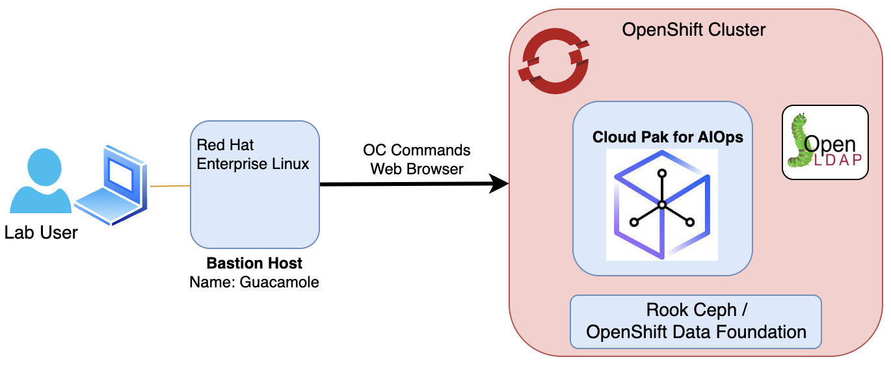
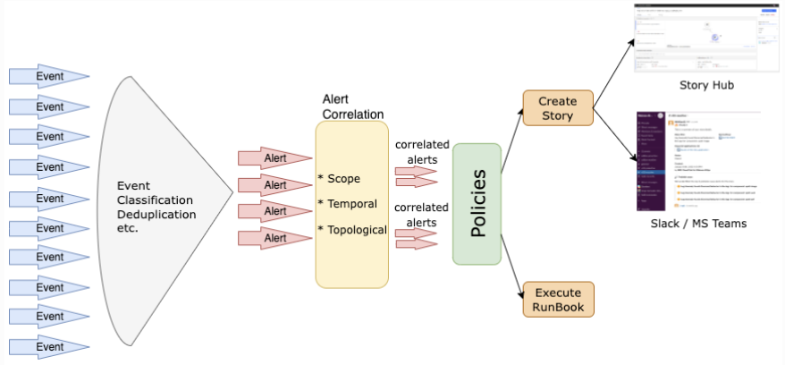

Welcome to the Cloud Pak for AIOps Alert Correlation & Grouping Lab.
The following diagram describes the infrastructure available for the Lab:

:::note
- For any instructions that use the "oc" command (interacting with your
  cluster), use your "bastion" VM
:::

### Terms Definition
Lets define some key Cloud Pak for AIOps concepts and terms that will help you understand the Lab:

**Events**: An event is a record containing structured data summarizing key attributes of an occurrence on a managed entity, which might be a network resource, some part of that resource, or other key element associated with your network, services, or applications. An event may or may not indicate something anomalous and is a point-in-time, immutable statement about the managed entity in question.

The Event *severity* range is  6: Critical, 5: Major, 4: Minor, 3: Warning, 2: Informational, 1: Indeterminate

**Alerts**: Alerts are created when one or more events indicate an anomalous condition. Alerts represent an ongoing anomalous condition against a single managed entity. Unlike events, alerts might evolve over time as the condition changes. Alerts have a start and an end time. The creation and evolution of alerts are informed by events. The Cloud Pak for AIOps automatically correlates alerts to determine what alerts are likely to share a common cause. This is determined based on a combination of:

* Scope-based correlation - Any alerts which have the same value for the resource field are correlated.

* Temporal correlation - The system continually analyzes past alerts to determine which alerts tend to frequently co-occur. When these alerts occur together again, they are correlated.

* Topological correlation - Any alerts which refer to resources close to each other (from a topology point of view) are correlated.

The Alert *severity* range is the same as Events 6: Critical, 5: Major, 4: Minor, 3: Warning, 2: Informational, 1: Indeterminate.  
Alerts have *state* which can be Open, Clear, or Closed. Note that the Alert *state* can go from Clear back to Open if new related events arrive 
during the same time window. 

**Incidents**: Incidents represent the context which is currently severely impacting IT Operations. This includes all alerts that are related to the incident ranked by probable cause and information about how the affected topology resources are related. The creation and evolution of incidents are informed by alerts. Incidents help build the understanding of the current situation and also can drive the remediation steps by suggesting runbooks that can help with the solution of the problem. 

Incidents are categorized by *priority* from 1 (highest) to 5 (lowest). 
Incidents have also *status* which can be Unassigned, In progress, On-hold, or Resolved. 

**Policies**: Policies are rules that contain a condition and a set of actions that can be manual or automated. They can be triggered to automatically promote events to alerts, reduce noise by grouping alerts into an Incident, and assign runbooks to remediate alerts. Each policy has an execution priority number which determines which policy runs first.

**Runbooks**: A runbook is a controlled set of automated and manual steps that support system and network operational processes. A runbook orchestrates all types of infrastructure elements, such as applications, network components, or servers. We can also use runbooks to document standard procedures that can be leveraged by IT operations.

**Actions**: Actions are the collection of several predefined steps into a single automated tested entity that can be shared by multiple runbooks. Actions improve runbook efficiency by encapsulating procedures and operations.

The following chart shows how all these terms are related:

### Lab Content

[ TODO:  update this!]

In this Lab, we will focus in a subset of the main features available in **Resource Management** such as:

* how to collect topology data
* how to use rules to merge topology elements
* how to use templates to gather resources into logical groups
* how to define applications from groups and business criticality

The complete set of **Resource Management** capabilities can be found in the [**documentation**](https://www.ibm.com/docs/en/cloud-paks/cloud-pak-watson-aiops/3.7.1?topic=operating-managing-topologies).