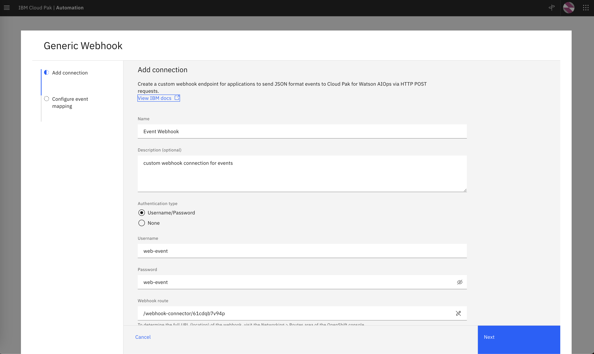
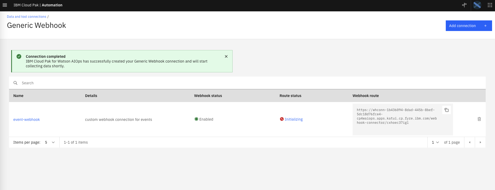

In this section, we will configure a generic Webhook connection. If a dedicated connection is 
not available for a data source, you can use the generic 
webhook connection. It provides an endpoint for applications to send JSON format events
to Cloud Pak for AIOps via HTTP POST requests. You can also include *JSONata* that maps 
incoming JSON payloads to the Cloud Pak for AIOps event data scheme. The webhook endpoint
is exposed via an OpenShift edge route that includes a unique, automatically-generated ID.
This route can be regenerated if needed.


## 2.1: Creating a Webhook Connection

Log into the Cloud Pak for AIOps: 
* from the burger menu in the top-left navigate to: **Define → Data and tool connections**
* from the **Data and tool connections** page click on **Add connection**
* from the **Add connections** page search for **webhook**, click on the
 **Generic Webhook** tile and click **Connect**. 

Fill the **Add connection** form with these values: 

* Name: Event-Webhook
* Description: custom webhook connection for events
* Authentication type: *select Username/Password*
* Username: test
* Password: test

Your complete form should look like this (note that your route will be different)



Click **Next**. 

In the **Configure event mapping** form:

* Confirm the **Enable webhook** slider is green (On)
* The webhook connector leverages JSONata which is a simple expression language to transform JSON data. 
You can read about JSONata [here](https://jsonata.org/). In this Lab, we provide the JSON event format
as expected by the Cloud Pak for AIOPs, therefore the JSONata is just a "passthrough". In a real scenario, 
you will find this mapping capability very useful. Enter the following JSONata configuration:

```json
{
   "sender":{
      "service": sender.service,
      "name": sender.name,
      "type": sender.type
   },
   "resource":{
      "name": resource.name,
      "hostname": resource.hostname,
      "type": resource.type,
      "ipaddress": resource.ipaddress,
      "location": resource.location
   },
   "type":{
      "classification": type.classification,
      "eventType": type.eventType
   },
   "severity": severity,
   "summary": summary,
   "occurrenceTime": occurrenceTime,
   "expirySeconds": expirySeconds
}
```

Click on **Done**.
You will see a new webhook created as shown below:




## 2.2: Create the Event Loader Script

We will create a simple bash script that will read an event file and will call the webhook 
URL or route with every event as a parameter. Create a new file called *webhook-event-load.sh*, paste 
this script below and assign the WEBHOOK_URL value with the webhook route of the webhook 
you just created in the previous step.

```sh
#!/bin/bash

# Check if a file is provided as a parameter
if [ $# -eq 0 ]; then
  echo "Please provide an event file as a parameter."
  exit 1
fi

WEBHOOK_URL='<insert webhook URL here>'
AUTH=test:test

# Read the event file line by line and submit the event via webhook
while IFS= read -r line; do
  curl -X POST -u $AUTH --insecure -H 'Content-Type: application/json' $WEBHOOK_URL -d "$line"
  echo ""
done < "$1"
```
