Temporal grouping is an unsupervised learning algorithm that groups alerts which co-occur over time. 
When a problem arises, there are typically multiple parts of a system or environment that are impacted. 
When alerts in different areas co-occur, it makes sense to look at them together and treat them 
as one problem to try and determine what might have happened.

Grouping co-occurring alerts together reduces the number of tickets and incidents opened and the number 
of people looking at the same problem. It helps you to understand the context of an issue so you can 
prioritize, triage, and resolve it more quickly. When alerts are grouped based on whether 
they occur together, you can view the details in your Alert viewer.

This AI algorithm can start to discover groups after a pattern is learned, which could be hours or days. 
For example, if a problem occurs the first week of January, the fourth week of January, and again in 
March, it will learn the alerts that tend to co-occur when that problem happens.

Temporal grouping will generate a set of alert grouping policies that you can review and selectively deploy 
or they can get all deployed automatically.


## 4.1: Validate the Absence of Correlation


First, we will load a set of events to validate that there is no correlation from the 
alerts created by these events. 

Create a new local file, name it *temp-events-inference.json* and paste the following content into it:

```
{ "sender": { "service": "DemoMon", "name": "https://myapp.example.com", "type": "Netcool/OMNIbus" }, "resource": { "name": "https://myapp.example.com", "type": "Service", "service": "https://myapp.example.com" }, "type": { "classification": "Synthetic test failed:++:Synthetic test", "eventType": "problem" }, "severity": 5, "summary": "Synthetic test failed for >1min on https://myapp.example.com", "occurrenceTime": "2021-09-28T21:41:57.948Z", "expirySeconds": 0}
{ "sender": { "service": "DemoMon", "name": "front-end-svc.myapp.example.com", "type": "Netcool/OMNIbus" }, "resource": { "name": "front-end-svc.myapp.example.com", "hostname": "front-end-svc.myapp.example.com", "type": "Service", "service": "front-end-svc.myapp.example.com" }, "type": { "classification": "High error rate:++:Error rate", "eventType": "problem" }, "severity": 4, "summary": "High error rate on front-end-svc.myapp.example.com", "occurrenceTime": "2021-09-28T21:41:47.948Z", "expirySeconds": 0}
{ "sender": { "service": "DemoMon", "name": "newsletter-svc.myapp.example.com", "type": "Netcool/OMNIbus" }, "resource": { "name": "newsletter-svc.myapp.example.com", "hostname": "newsletter-svc.myapp.example.com", "type": "Service", "service": "newsletter-svc.myapp.example.com" }, "type": { "classification": "Error rate high:++:Error rate", "eventType": "problem" }, "severity": 4, "summary": "Newsletter service error rate high", "occurrenceTime": "2021-09-27T21:41:37.948Z", "expirySeconds": 0 }
{ "sender": { "service": "DemoMon", "name": "newsletters.myapp.example.com", "type": "Netcool/OMNIbus" }, "resource": { "name": "newsletters.myapp.example.com", "hostname": "newsletters.myapp.example.com", "type": "Service", "service": "newsletters.myapp.example.com" }, "type": { "classification": "Newsletter not received in 5 min:++:Newsletter self test", "eventType": "problem" }, "severity": 3, "summary": "Newsletter test email not received within 5 minutes - emails may not be working", "occurrenceTime": "2021-09-27T21:43:47.948Z", "expirySeconds": 0 }

```

Now lets submit the events via the webhook script created in the previous section by running the following command:

```
bash event-load-webhook.sh temp-events-inference.json
```

* From the burger menu in the top-left navigate to: **Operate → Incidents and alerts**.
* From the **Incidents and alerts** page, click on the **Alerts** tab. 

Now we can see that the four alerts are independent from each other and not correlated. Also,
if you click on the **View correlation** icon in the top-right, the **Correlation** column shows
no correlation information for these alerts. 

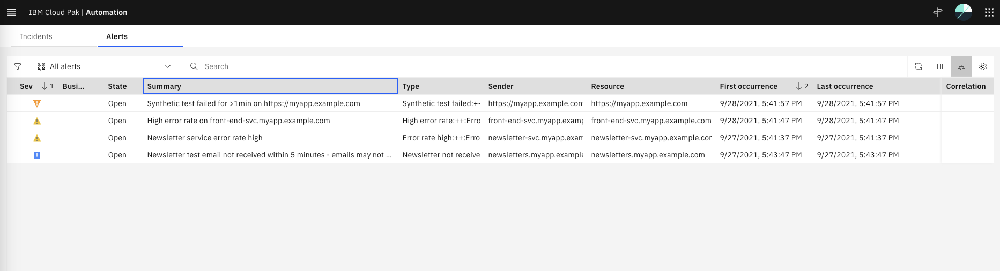

Lets clear these alerts before we test the temporal correlation.
Select all the alerts, right-click and select **Clear**. Make sure all four alerts have **Clear** under 
the **State** column. Move to the next step in the Lab, the alerts will disappear after 2-3 minutes


## 4.2: Loading Historical Event Data

For the purpose of this Lab, we will manually load historical alerts directly into the Cloud Pak for AIOps 
historical alerts database. What is unique about this data is that different alerts co-occur about the 
same time during multiple days. This data characteristic will trigger the creation of alert grouping policies.
In a real production deployment, the historical alerts database will have the alerts of the last 90 days that
can be used by the temporal training algorithm. 

Create a new local file, name it *temp-events-training.json* and paste the following content into it:

```
{"tenantid":"cfd95b7e-3bc7-4006-a4a8-a73a79c71255","requestid":"d5f5cfca-1415-499e-9e6d-5b9eed2181a0","notificationTime":"2023-06-23T20:41:12.420Z","type":"created","entityType":"alert","entity":{"deduplicationKey":"https://myapp.example.com->Synthetic test failed","sender":{"service":"DemoMon","name":"https://myapp.example.com","type":"Netcool/OMNIbus"},"resource":{"name":"https://myapp.example.com","type":"Service","service":"https://myapp.example.com"},"type":{"classification":"Synthetic test failed:++:Synthetic test","eventType":"problem"},"severity":5,"summary":"Synthetic test failed for >1min on https://myapp.example.com","occurrenceTime":"2023-03-19T23:02:59.628Z","expirySeconds":0,"signature":"{name=https://myapp.example.com, service=https://myapp.example.com, type=Service}-Synthetic test failed:++:Synthetic test-","firstOccurrenceTime":"2023-03-19T23:02:59.628Z","lastOccurrenceTime":"2023-03-19T23:02:59.628Z","eventCount":1,"state":"open","id":"83eff4b1-c6f5-4819-8feb-ce4c2d41d652","langId":"en_US","team":"","owner":"","insights":[],"links":[]}}
{"tenantid":"cfd95b7e-3bc7-4006-a4a8-a73a79c71255","requestid":"76e5ff14-04ef-440d-a062-035399eb3c83","notificationTime":"2023-06-23T20:41:12.421Z","type":"created","entityType":"alert","entity":{"deduplicationKey":"front-end-svc.myapp.example.com->High error rate","sender":{"service":"DemoMon","name":"front-end-svc.myapp.example.com","type":"Netcool/OMNIbus"},"resource":{"name":"front-end-svc.myapp.example.com","hostname":"front-end-svc.myapp.example.com","type":"Service","service":"front-end-svc.myapp.example.com"},"type":{"classification":"High error rate:++:Error rate","eventType":"problem"},"severity":4,"summary":"High error rate on front-end-svc.myapp.example.com","occurrenceTime":"2023-03-19T23:02:49.628Z","expirySeconds":0,"signature":"{hostname=front-end-svc.myapp.example.com, name=front-end-svc.myapp.example.com, service=front-end-svc.myapp.example.com, type=Service}-High error rate:++:Error rate-","firstOccurrenceTime":"2023-03-19T23:02:49.628Z","lastOccurrenceTime":"2023-03-19T23:02:49.628Z","eventCount":1,"state":"open","id":"e1261cee-28de-4b7e-a3da-238d8d86bac2","langId":"en_US","team":"","owner":"","insights":[],"links":[]}}
{"tenantid":"cfd95b7e-3bc7-4006-a4a8-a73a79c71255","requestid":"5e1d2ca0-ec9f-4962-b183-b4114094114e","notificationTime":"2023-06-23T20:41:12.428Z","type":"created","entityType":"alert","entity":{"deduplicationKey":"https://myapp.example.com->Synthetic test failed","sender":{"service":"DemoMon","name":"https://myapp.example.com","type":"Netcool/OMNIbus"},"resource":{"name":"https://myapp.example.com","type":"Service","service":"https://myapp.example.com"},"type":{"classification":"Synthetic test failed:++:Synthetic test","eventType":"problem"},"severity":5,"summary":"Synthetic test failed for >1min on https://myapp.example.com","occurrenceTime":"2023-04-06T01:02:59.628Z","expirySeconds":0,"signature":"{name=https://myapp.example.com, service=https://myapp.example.com, type=Service}-Synthetic test failed:++:Synthetic test-","firstOccurrenceTime":"2023-04-06T01:02:59.628Z","lastOccurrenceTime":"2023-04-06T01:02:59.628Z","eventCount":1,"state":"open","id":"51d554bb-a6d5-4afe-9d1e-825a85209fd0","langId":"en_US","team":"","owner":"","insights":[],"links":[]}}
{"tenantid":"cfd95b7e-3bc7-4006-a4a8-a73a79c71255","requestid":"d0b49916-9004-4cea-8383-f742b754e603","notificationTime":"2023-06-23T20:41:12.430Z","type":"created","entityType":"alert","entity":{"deduplicationKey":"front-end-svc.myapp.example.com->High error rate","sender":{"service":"DemoMon","name":"front-end-svc.myapp.example.com","type":"Netcool/OMNIbus"},"resource":{"name":"front-end-svc.myapp.example.com","hostname":"front-end-svc.myapp.example.com","type":"Service","service":"front-end-svc.myapp.example.com"},"type":{"classification":"High error rate:++:Error rate","eventType":"problem"},"severity":4,"summary":"High error rate on front-end-svc.myapp.example.com","occurrenceTime":"2023-04-06T01:02:49.628Z","expirySeconds":0,"signature":"{hostname=front-end-svc.myapp.example.com, name=front-end-svc.myapp.example.com, service=front-end-svc.myapp.example.com, type=Service}-High error rate:++:Error rate-","firstOccurrenceTime":"2023-04-06T01:02:49.628Z","lastOccurrenceTime":"2023-04-06T01:02:49.628Z","eventCount":1,"state":"open","id":"e3318d78-b09d-4488-8e1a-237ad93d8641","langId":"en_US","team":"","owner":"","insights":[],"links":[]}}
{"tenantid":"cfd95b7e-3bc7-4006-a4a8-a73a79c71255","requestid":"f410f245-3f54-4039-8ece-d3d677ea8f7b","notificationTime":"2023-06-23T20:41:12.432Z","type":"created","entityType":"alert","entity":{"deduplicationKey":"https://myapp.example.com->Synthetic test failed","sender":{"service":"DemoMon","name":"https://myapp.example.com","type":"Netcool/OMNIbus"},"resource":{"name":"https://myapp.example.com","type":"Service","service":"https://myapp.example.com"},"type":{"classification":"Synthetic test failed:++:Synthetic test","eventType":"problem"},"severity":5,"summary":"Synthetic test failed for >1min on https://myapp.example.com","occurrenceTime":"2023-04-20T19:02:59.628Z","expirySeconds":0,"signature":"{name=https://myapp.example.com, service=https://myapp.example.com, type=Service}-Synthetic test failed:++:Synthetic test-","firstOccurrenceTime":"2023-04-20T19:02:59.628Z","lastOccurrenceTime":"2023-04-20T19:02:59.628Z","eventCount":1,"state":"open","id":"c744910b-6d72-485f-9ff6-3940eefa3603","langId":"en_US","team":"","owner":"","insights":[],"links":[]}}
{"tenantid":"cfd95b7e-3bc7-4006-a4a8-a73a79c71255","requestid":"04bfce26-a681-4b7c-bcf5-5b028f529848","notificationTime":"2023-06-23T20:41:12.434Z","type":"created","entityType":"alert","entity":{"deduplicationKey":"front-end-svc.myapp.example.com->High error rate","sender":{"service":"DemoMon","name":"front-end-svc.myapp.example.com","type":"Netcool/OMNIbus"},"resource":{"name":"front-end-svc.myapp.example.com","hostname":"front-end-svc.myapp.example.com","type":"Service","service":"front-end-svc.myapp.example.com"},"type":{"classification":"High error rate:++:Error rate","eventType":"problem"},"severity":4,"summary":"High error rate on front-end-svc.myapp.example.com","occurrenceTime":"2023-04-20T19:02:49.628Z","expirySeconds":0,"signature":"{hostname=front-end-svc.myapp.example.com, name=front-end-svc.myapp.example.com, service=front-end-svc.myapp.example.com, type=Service}-High error rate:++:Error rate-","firstOccurrenceTime":"2023-04-20T19:02:49.628Z","lastOccurrenceTime":"2023-04-20T19:02:49.628Z","eventCount":1,"state":"open","id":"eac09557-f0c8-42b5-b401-4390a9bab52d","langId":"en_US","team":"","owner":"","insights":[],"links":[]}}
{"tenantid":"cfd95b7e-3bc7-4006-a4a8-a73a79c71255","requestid":"991c39bb-486c-4f9b-8362-fc160ad16cf8","notificationTime":"2023-06-23T20:41:12.440Z","type":"created","entityType":"alert","entity":{"deduplicationKey":"https://myapp.example.com->Synthetic test failed","sender":{"service":"DemoMon","name":"https://myapp.example.com","type":"Netcool/OMNIbus"},"resource":{"name":"https://myapp.example.com","type":"Service","service":"https://myapp.example.com"},"type":{"classification":"Synthetic test failed:++:Synthetic test","eventType":"problem"},"severity":5,"summary":"Synthetic test failed for >1min on https://myapp.example.com","occurrenceTime":"2023-05-07T21:02:59.628Z","expirySeconds":0,"signature":"{name=https://myapp.example.com, service=https://myapp.example.com, type=Service}-Synthetic test failed:++:Synthetic test-","firstOccurrenceTime":"2023-05-07T21:02:59.628Z","lastOccurrenceTime":"2023-05-07T21:02:59.628Z","eventCount":1,"state":"open","id":"ddf42e30-e3f2-418c-8397-e1c6bf46ae3c","langId":"en_US","team":"","owner":"","insights":[],"links":[]}}
{"tenantid":"cfd95b7e-3bc7-4006-a4a8-a73a79c71255","requestid":"56da040d-875b-408b-988f-71a473a37d5b","notificationTime":"2023-06-23T20:41:12.445Z","type":"created","entityType":"alert","entity":{"deduplicationKey":"front-end-svc.myapp.example.com->High error rate","sender":{"service":"DemoMon","name":"front-end-svc.myapp.example.com","type":"Netcool/OMNIbus"},"resource":{"name":"front-end-svc.myapp.example.com","hostname":"front-end-svc.myapp.example.com","type":"Service","service":"front-end-svc.myapp.example.com"},"type":{"classification":"High error rate:++:Error rate","eventType":"problem"},"severity":4,"summary":"High error rate on front-end-svc.myapp.example.com","occurrenceTime":"2023-05-07T21:02:49.628Z","expirySeconds":0,"signature":"{hostname=front-end-svc.myapp.example.com, name=front-end-svc.myapp.example.com, service=front-end-svc.myapp.example.com, type=Service}-High error rate:++:Error rate-","firstOccurrenceTime":"2023-05-07T21:02:49.628Z","lastOccurrenceTime":"2023-05-07T21:02:49.628Z","eventCount":1,"state":"open","id":"30e0a1ea-7c99-4535-8452-8adedbaf2284","langId":"en_US","team":"","owner":"","insights":[],"links":[]}}
{"tenantid":"cfd95b7e-3bc7-4006-a4a8-a73a79c71255","requestid":"2b7b6444-1e6b-4082-909e-415ae82047c5","notificationTime":"2023-06-23T20:41:12.450Z","type":"created","entityType":"alert","entity":{"deduplicationKey":"https://myapp.example.com->Synthetic test failed","sender":{"service":"DemoMon","name":"https://myapp.example.com","type":"Netcool/OMNIbus"},"resource":{"name":"https://myapp.example.com","type":"Service","service":"https://myapp.example.com"},"type":{"classification":"Synthetic test failed:++:Synthetic test","eventType":"problem"},"severity":5,"summary":"Synthetic test failed for >1min on https://myapp.example.com","occurrenceTime":"2023-05-17T08:02:59.628Z","expirySeconds":0,"signature":"{name=https://myapp.example.com, service=https://myapp.example.com, type=Service}-Synthetic test failed:++:Synthetic test-","firstOccurrenceTime":"2023-05-17T08:02:59.628Z","lastOccurrenceTime":"2023-05-17T08:02:59.628Z","eventCount":1,"state":"open","id":"67f00180-102f-45f6-845a-c97c0820c8b5","langId":"en_US","team":"","owner":"","insights":[],"links":[]}}
{"tenantid":"cfd95b7e-3bc7-4006-a4a8-a73a79c71255","requestid":"f6cb14d7-f75a-4baa-8853-36ebdee0759e","notificationTime":"2023-06-23T20:41:12.451Z","type":"created","entityType":"alert","entity":{"deduplicationKey":"front-end-svc.myapp.example.com->High error rate","sender":{"service":"DemoMon","name":"front-end-svc.myapp.example.com","type":"Netcool/OMNIbus"},"resource":{"name":"front-end-svc.myapp.example.com","hostname":"front-end-svc.myapp.example.com","type":"Service","service":"front-end-svc.myapp.example.com"},"type":{"classification":"High error rate:++:Error rate","eventType":"problem"},"severity":4,"summary":"High error rate on front-end-svc.myapp.example.com","occurrenceTime":"2023-05-17T08:02:49.628Z","expirySeconds":0,"signature":"{hostname=front-end-svc.myapp.example.com, name=front-end-svc.myapp.example.com, service=front-end-svc.myapp.example.com, type=Service}-High error rate:++:Error rate-","firstOccurrenceTime":"2023-05-17T08:02:49.628Z","lastOccurrenceTime":"2023-05-17T08:02:49.628Z","eventCount":1,"state":"open","id":"fa7db321-2c3f-46ca-8b5e-0901fdf4b555","langId":"en_US","team":"","owner":"","insights":[],"links":[]}}
{"tenantid":"cfd95b7e-3bc7-4006-a4a8-a73a79c71255","requestid":"40b9afb0-5025-4500-853d-97a4b654ee58","notificationTime":"2023-06-23T20:41:12.453Z","type":"created","entityType":"alert","entity":{"deduplicationKey":"https://myapp.example.com->Synthetic test failed","sender":{"service":"DemoMon","name":"https://myapp.example.com","type":"Netcool/OMNIbus"},"resource":{"name":"https://myapp.example.com","type":"Service","service":"https://myapp.example.com"},"type":{"classification":"Synthetic test failed:++:Synthetic test","eventType":"problem"},"severity":5,"summary":"Synthetic test failed for >1min on https://myapp.example.com","occurrenceTime":"2023-05-23T01:02:59.628Z","expirySeconds":0,"signature":"{name=https://myapp.example.com, service=https://myapp.example.com, type=Service}-Synthetic test failed:++:Synthetic test-","firstOccurrenceTime":"2023-05-23T01:02:59.628Z","lastOccurrenceTime":"2023-05-23T01:02:59.628Z","eventCount":1,"state":"open","id":"ee31a41f-4747-4e0f-ba8f-d98208e8cd0f","langId":"en_US","team":"","owner":"","insights":[],"links":[]}}
{"tenantid":"cfd95b7e-3bc7-4006-a4a8-a73a79c71255","requestid":"6a8ef260-fbe0-414a-8592-9d11ac063968","notificationTime":"2023-06-23T20:41:12.455Z","type":"created","entityType":"alert","entity":{"deduplicationKey":"front-end-svc.myapp.example.com->High error rate","sender":{"service":"DemoMon","name":"front-end-svc.myapp.example.com","type":"Netcool/OMNIbus"},"resource":{"name":"front-end-svc.myapp.example.com","hostname":"front-end-svc.myapp.example.com","type":"Service","service":"front-end-svc.myapp.example.com"},"type":{"classification":"High error rate:++:Error rate","eventType":"problem"},"severity":4,"summary":"High error rate on front-end-svc.myapp.example.com","occurrenceTime":"2023-05-23T01:02:49.628Z","expirySeconds":0,"signature":"{hostname=front-end-svc.myapp.example.com, name=front-end-svc.myapp.example.com, service=front-end-svc.myapp.example.com, type=Service}-High error rate:++:Error rate-","firstOccurrenceTime":"2023-05-23T01:02:49.628Z","lastOccurrenceTime":"2023-05-23T01:02:49.628Z","eventCount":1,"state":"open","id":"6fcc3d46-5dc6-49b6-93e4-146f8cdcbbd4","langId":"en_US","team":"","owner":"","insights":[],"links":[]}}
{"tenantid":"cfd95b7e-3bc7-4006-a4a8-a73a79c71255","requestid":"d8c7dd0b-ccd3-41f6-8899-370982f87758","notificationTime":"2023-06-23T20:41:12.509Z","type":"created","entityType":"alert","entity":{"deduplicationKey":"newsletter-svc.myapp.example.com->High error rate","sender":{"service":"DemoMon","name":"newsletter-svc.myapp.example.com","type":"Netcool/OMNIbus"},"resource":{"name":"newsletter-svc.myapp.example.com","hostname":"newsletter-svc.myapp.example.com","type":"Service","service":"newsletter-svc.myapp.example.com"},"type":{"classification":"Error rate high:++:Error rate","eventType":"problem"},"severity":4,"summary":"Newsletter service error rate high","occurrenceTime":"2023-01-31T06:02:39.630Z","expirySeconds":0,"signature":"{hostname=newsletter-svc.myapp.example.com, name=newsletter-svc.myapp.example.com, service=newsletter-svc.myapp.example.com, type=Service}-Error rate high:++:Error rate-","firstOccurrenceTime":"2023-01-31T06:02:39.630Z","lastOccurrenceTime":"2023-01-31T06:02:39.630Z","eventCount":1,"state":"open","id":"3638b612-40c5-4990-a08d-a4019e9b5437","langId":"en_US","team":"","owner":"","insights":[],"links":[]}}
{"tenantid":"cfd95b7e-3bc7-4006-a4a8-a73a79c71255","requestid":"7b73cbdb-be35-4ff7-8369-ce2e8f3d21b2","notificationTime":"2023-06-23T20:41:12.510Z","type":"created","entityType":"alert","entity":{"deduplicationKey":"newsletters.myapp.example.com->High error rate","sender":{"service":"DemoMon","name":"newsletters.myapp.example.com","type":"Netcool/OMNIbus"},"resource":{"name":"newsletters.myapp.example.com","hostname":"newsletters.myapp.example.com","type":"Service","service":"newsletters.myapp.example.com"},"type":{"classification":"Newsletter not received in 5 min:++:Newsletter self test","eventType":"problem"},"severity":3,"summary":"Newsletter test email not received within 5 minutes - emails may not be working","occurrenceTime":"2023-01-31T06:04:49.630Z","expirySeconds":0,"signature":"{hostname=newsletters.myapp.example.com, name=newsletters.myapp.example.com, service=newsletters.myapp.example.com, type=Service}-Newsletter not received in 5 min:++:Newsletter self test-","firstOccurrenceTime":"2023-01-31T06:04:49.630Z","lastOccurrenceTime":"2023-01-31T06:04:49.630Z","eventCount":1,"state":"open","id":"b8bf18ad-e5e3-4adb-b8de-30344cdc48f2","langId":"en_US","team":"","owner":"","insights":[],"links":[]}}
{"tenantid":"cfd95b7e-3bc7-4006-a4a8-a73a79c71255","requestid":"fea8b84f-70e7-4fa3-b1b3-f308b8498b03","notificationTime":"2023-06-23T20:41:12.512Z","type":"created","entityType":"alert","entity":{"deduplicationKey":"newsletter-svc.myapp.example.com->High error rate","sender":{"service":"DemoMon","name":"newsletter-svc.myapp.example.com","type":"Netcool/OMNIbus"},"resource":{"name":"newsletter-svc.myapp.example.com","hostname":"newsletter-svc.myapp.example.com","type":"Service","service":"newsletter-svc.myapp.example.com"},"type":{"classification":"Error rate high:++:Error rate","eventType":"problem"},"severity":4,"summary":"Newsletter service error rate high","occurrenceTime":"2023-03-18T23:02:39.630Z","expirySeconds":0,"signature":"{hostname=newsletter-svc.myapp.example.com, name=newsletter-svc.myapp.example.com, service=newsletter-svc.myapp.example.com, type=Service}-Error rate high:++:Error rate-","firstOccurrenceTime":"2023-03-18T23:02:39.630Z","lastOccurrenceTime":"2023-03-18T23:02:39.630Z","eventCount":1,"state":"open","id":"d145054b-e65a-4e5d-8cbb-b5a7e947700a","langId":"en_US","team":"","owner":"","insights":[],"links":[]}}
{"tenantid":"cfd95b7e-3bc7-4006-a4a8-a73a79c71255","requestid":"2d5defa6-ce71-4f1e-a4a9-85be2653de14","notificationTime":"2023-06-23T20:41:12.513Z","type":"created","entityType":"alert","entity":{"deduplicationKey":"newsletters.myapp.example.com->High error rate","sender":{"service":"DemoMon","name":"newsletters.myapp.example.com","type":"Netcool/OMNIbus"},"resource":{"name":"newsletters.myapp.example.com","hostname":"newsletters.myapp.example.com","type":"Service","service":"newsletters.myapp.example.com"},"type":{"classification":"Newsletter not received in 5 min:++:Newsletter self test","eventType":"problem"},"severity":3,"summary":"Newsletter test email not received within 5 minutes - emails may not be working","occurrenceTime":"2023-03-18T23:04:49.630Z","expirySeconds":0,"signature":"{hostname=newsletters.myapp.example.com, name=newsletters.myapp.example.com, service=newsletters.myapp.example.com, type=Service}-Newsletter not received in 5 min:++:Newsletter self test-","firstOccurrenceTime":"2023-03-18T23:04:49.630Z","lastOccurrenceTime":"2023-03-18T23:04:49.630Z","eventCount":1,"state":"open","id":"360e2340-73a0-45fe-bd91-33a08767d36a","langId":"en_US","team":"","owner":"","insights":[],"links":[]}}
{"tenantid":"cfd95b7e-3bc7-4006-a4a8-a73a79c71255","requestid":"c3036d91-af11-462c-adfc-f6931ec690ed","notificationTime":"2023-06-23T20:41:12.514Z","type":"created","entityType":"alert","entity":{"deduplicationKey":"newsletter-svc.myapp.example.com->High error rate","sender":{"service":"DemoMon","name":"newsletter-svc.myapp.example.com","type":"Netcool/OMNIbus"},"resource":{"name":"newsletter-svc.myapp.example.com","hostname":"newsletter-svc.myapp.example.com","type":"Service","service":"newsletter-svc.myapp.example.com"},"type":{"classification":"Error rate high:++:Error rate","eventType":"problem"},"severity":4,"summary":"Newsletter service error rate high","occurrenceTime":"2023-04-05T01:02:39.630Z","expirySeconds":0,"signature":"{hostname=newsletter-svc.myapp.example.com, name=newsletter-svc.myapp.example.com, service=newsletter-svc.myapp.example.com, type=Service}-Error rate high:++:Error rate-","firstOccurrenceTime":"2023-04-05T01:02:39.630Z","lastOccurrenceTime":"2023-04-05T01:02:39.630Z","eventCount":1,"state":"open","id":"987858c0-bac3-4471-93c5-895f46bae987","langId":"en_US","team":"","owner":"","insights":[],"links":[]}}
{"tenantid":"cfd95b7e-3bc7-4006-a4a8-a73a79c71255","requestid":"66a83ef5-8c80-4e51-a809-9c98abc6d6dc","notificationTime":"2023-06-23T20:41:12.516Z","type":"created","entityType":"alert","entity":{"deduplicationKey":"newsletters.myapp.example.com->High error rate","sender":{"service":"DemoMon","name":"newsletters.myapp.example.com","type":"Netcool/OMNIbus"},"resource":{"name":"newsletters.myapp.example.com","hostname":"newsletters.myapp.example.com","type":"Service","service":"newsletters.myapp.example.com"},"type":{"classification":"Newsletter not received in 5 min:++:Newsletter self test","eventType":"problem"},"severity":3,"summary":"Newsletter test email not received within 5 minutes - emails may not be working","occurrenceTime":"2023-04-05T01:04:49.630Z","expirySeconds":0,"signature":"{hostname=newsletters.myapp.example.com, name=newsletters.myapp.example.com, service=newsletters.myapp.example.com, type=Service}-Newsletter not received in 5 min:++:Newsletter self test-","firstOccurrenceTime":"2023-04-05T01:04:49.630Z","lastOccurrenceTime":"2023-04-05T01:04:49.630Z","eventCount":1,"state":"open","id":"f3306094-ace3-45f2-b8d1-d9be2f1308db","langId":"en_US","team":"","owner":"","insights":[],"links":[]}}
{"tenantid":"cfd95b7e-3bc7-4006-a4a8-a73a79c71255","requestid":"386f0a09-b18b-44d3-8b0d-be83443f8e21","notificationTime":"2023-06-23T20:41:12.517Z","type":"created","entityType":"alert","entity":{"deduplicationKey":"newsletter-svc.myapp.example.com->High error rate","sender":{"service":"DemoMon","name":"newsletter-svc.myapp.example.com","type":"Netcool/OMNIbus"},"resource":{"name":"newsletter-svc.myapp.example.com","hostname":"newsletter-svc.myapp.example.com","type":"Service","service":"newsletter-svc.myapp.example.com"},"type":{"classification":"Error rate high:++:Error rate","eventType":"problem"},"severity":4,"summary":"Newsletter service error rate high","occurrenceTime":"2023-04-19T19:02:39.630Z","expirySeconds":0,"signature":"{hostname=newsletter-svc.myapp.example.com, name=newsletter-svc.myapp.example.com, service=newsletter-svc.myapp.example.com, type=Service}-Error rate high:++:Error rate-","firstOccurrenceTime":"2023-04-19T19:02:39.630Z","lastOccurrenceTime":"2023-04-19T19:02:39.630Z","eventCount":1,"state":"open","id":"e1ccc6d7-00f6-4288-9550-42ef3ab981c6","langId":"en_US","team":"","owner":"","insights":[],"links":[]}}
{"tenantid":"cfd95b7e-3bc7-4006-a4a8-a73a79c71255","requestid":"70d57671-1c66-4603-881f-3609a3b43f48","notificationTime":"2023-06-23T20:41:12.519Z","type":"created","entityType":"alert","entity":{"deduplicationKey":"newsletters.myapp.example.com->High error rate","sender":{"service":"DemoMon","name":"newsletters.myapp.example.com","type":"Netcool/OMNIbus"},"resource":{"name":"newsletters.myapp.example.com","hostname":"newsletters.myapp.example.com","type":"Service","service":"newsletters.myapp.example.com"},"type":{"classification":"Newsletter not received in 5 min:++:Newsletter self test","eventType":"problem"},"severity":3,"summary":"Newsletter test email not received within 5 minutes - emails may not be working","occurrenceTime":"2023-04-19T19:04:49.630Z","expirySeconds":0,"signature":"{hostname=newsletters.myapp.example.com, name=newsletters.myapp.example.com, service=newsletters.myapp.example.com, type=Service}-Newsletter not received in 5 min:++:Newsletter self test-","firstOccurrenceTime":"2023-04-19T19:04:49.630Z","lastOccurrenceTime":"2023-04-19T19:04:49.630Z","eventCount":1,"state":"open","id":"d2680e22-a29c-4b2a-81fb-a76341aeadaf","langId":"en_US","team":"","owner":"","insights":[],"links":[]}}
{"tenantid":"cfd95b7e-3bc7-4006-a4a8-a73a79c71255","requestid":"dd9c479f-1541-4c9d-8186-ff9153685fb3","notificationTime":"2023-06-23T20:41:12.520Z","type":"created","entityType":"alert","entity":{"deduplicationKey":"newsletter-svc.myapp.example.com->High error rate","sender":{"service":"DemoMon","name":"newsletter-svc.myapp.example.com","type":"Netcool/OMNIbus"},"resource":{"name":"newsletter-svc.myapp.example.com","hostname":"newsletter-svc.myapp.example.com","type":"Service","service":"newsletter-svc.myapp.example.com"},"type":{"classification":"Error rate high:++:Error rate","eventType":"problem"},"severity":4,"summary":"Newsletter service error rate high","occurrenceTime":"2023-05-06T21:02:39.630Z","expirySeconds":0,"signature":"{hostname=newsletter-svc.myapp.example.com, name=newsletter-svc.myapp.example.com, service=newsletter-svc.myapp.example.com, type=Service}-Error rate high:++:Error rate-","firstOccurrenceTime":"2023-05-06T21:02:39.630Z","lastOccurrenceTime":"2023-05-06T21:02:39.630Z","eventCount":1,"state":"open","id":"6bea8463-05c6-4699-8058-be0dc622f721","langId":"en_US","team":"","owner":"","insights":[],"links":[]}}
{"tenantid":"cfd95b7e-3bc7-4006-a4a8-a73a79c71255","requestid":"e669c9c0-285e-41de-b20f-50c12428454e","notificationTime":"2023-06-23T20:41:12.522Z","type":"created","entityType":"alert","entity":{"deduplicationKey":"newsletters.myapp.example.com->High error rate","sender":{"service":"DemoMon","name":"newsletters.myapp.example.com","type":"Netcool/OMNIbus"},"resource":{"name":"newsletters.myapp.example.com","hostname":"newsletters.myapp.example.com","type":"Service","service":"newsletters.myapp.example.com"},"type":{"classification":"Newsletter not received in 5 min:++:Newsletter self test","eventType":"problem"},"severity":3,"summary":"Newsletter test email not received within 5 minutes - emails may not be working","occurrenceTime":"2023-05-06T21:04:49.630Z","expirySeconds":0,"signature":"{hostname=newsletters.myapp.example.com, name=newsletters.myapp.example.com, service=newsletters.myapp.example.com, type=Service}-Newsletter not received in 5 min:++:Newsletter self test-","firstOccurrenceTime":"2023-05-06T21:04:49.630Z","lastOccurrenceTime":"2023-05-06T21:04:49.630Z","eventCount":1,"state":"open","id":"4ce6a583-3004-42f2-bfae-389d76b9917a","langId":"en_US","team":"","owner":"","insights":[],"links":[]}}
{"tenantid":"cfd95b7e-3bc7-4006-a4a8-a73a79c71255","requestid":"c8e7b98b-3216-4e6a-9c40-b4790e34837e","notificationTime":"2023-06-23T20:41:12.523Z","type":"created","entityType":"alert","entity":{"deduplicationKey":"newsletter-svc.myapp.example.com->High error rate","sender":{"service":"DemoMon","name":"newsletter-svc.myapp.example.com","type":"Netcool/OMNIbus"},"resource":{"name":"newsletter-svc.myapp.example.com","hostname":"newsletter-svc.myapp.example.com","type":"Service","service":"newsletter-svc.myapp.example.com"},"type":{"classification":"Error rate high:++:Error rate","eventType":"problem"},"severity":4,"summary":"Newsletter service error rate high","occurrenceTime":"2023-05-16T08:02:39.630Z","expirySeconds":0,"signature":"{hostname=newsletter-svc.myapp.example.com, name=newsletter-svc.myapp.example.com, service=newsletter-svc.myapp.example.com, type=Service}-Error rate high:++:Error rate-","firstOccurrenceTime":"2023-05-16T08:02:39.630Z","lastOccurrenceTime":"2023-05-16T08:02:39.630Z","eventCount":1,"state":"open","id":"41559511-19b5-49c3-8c88-18a88fbd7e3e","langId":"en_US","team":"","owner":"","insights":[],"links":[]}}
{"tenantid":"cfd95b7e-3bc7-4006-a4a8-a73a79c71255","requestid":"03da5ec6-cf87-40e6-b50d-b5882e3e2862","notificationTime":"2023-06-23T20:41:12.525Z","type":"created","entityType":"alert","entity":{"deduplicationKey":"newsletters.myapp.example.com->High error rate","sender":{"service":"DemoMon","name":"newsletters.myapp.example.com","type":"Netcool/OMNIbus"},"resource":{"name":"newsletters.myapp.example.com","hostname":"newsletters.myapp.example.com","type":"Service","service":"newsletters.myapp.example.com"},"type":{"classification":"Newsletter not received in 5 min:++:Newsletter self test","eventType":"problem"},"severity":3,"summary":"Newsletter test email not received within 5 minutes - emails may not be working","occurrenceTime":"2023-05-16T08:04:49.630Z","expirySeconds":0,"signature":"{hostname=newsletters.myapp.example.com, name=newsletters.myapp.example.com, service=newsletters.myapp.example.com, type=Service}-Newsletter not received in 5 min:++:Newsletter self test-","firstOccurrenceTime":"2023-05-16T08:04:49.630Z","lastOccurrenceTime":"2023-05-16T08:04:49.630Z","eventCount":1,"state":"open","id":"685fa56f-3bfc-4cb8-be77-edb29672646f","langId":"en_US","team":"","owner":"","insights":[],"links":[]}}

```

Now lets load these alerts into the historical alerts database via a kafka topic. 
We will use the kafka script created in the previous section. Since this kafka script requires 
a CLI (Command Line Interface) connection to the cluster, lets connect to the OpenShift
cluster first by running the *oc login* command below:

```
oc login -u kubeadmin -p <password> <cluster URL>>
```

Now run the following command:

```
bash event-load-kafka.sh temp-events-training.json cp4waiops-cartridge.irdatalayer.replay.alerts
```

## 4.3: Running Temporal Training

Now that we have loaded historical alert data, we can run the temporal training.

* From the burger menu in the top-left navigate to: **Operate → AI model management**.
* From the **AI model management** page, click on the **Temporal grouping** tile. 

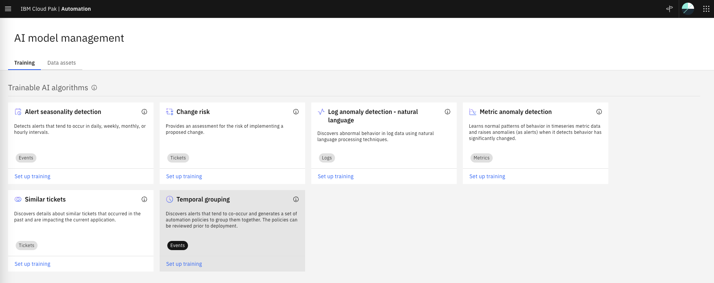

From the **Set up training** pop-up:

* In the **Getting started** page, read the description and click **Next**
* In the **Schedule training** page, leave **Schedule training** Off and click **Next**
* In the **Deploy policies** page, leave **Review and manually deploy policies** selected and 
click **Done** as shown below:

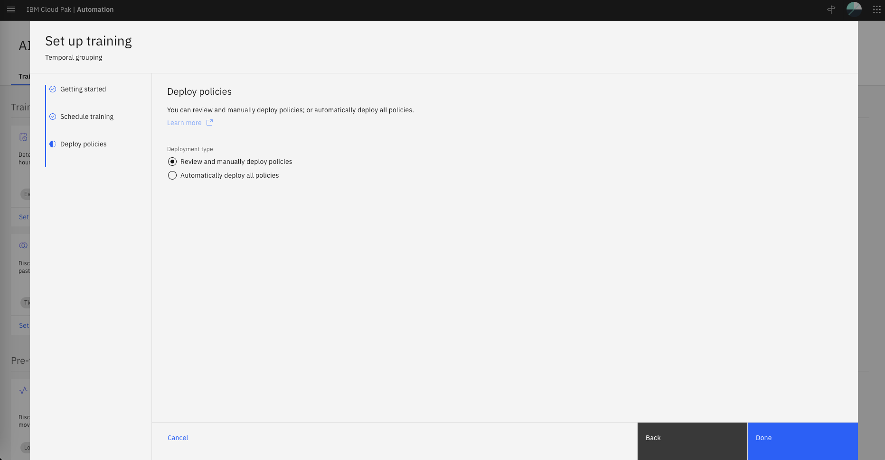

* From the **AI model management** page, click again on the **Temporal grouping** tile. 
* From the **Temporal grouping** page, click **Train model and create policies** on the right of the page.

You will see a pop-up message that confirms that training has started:

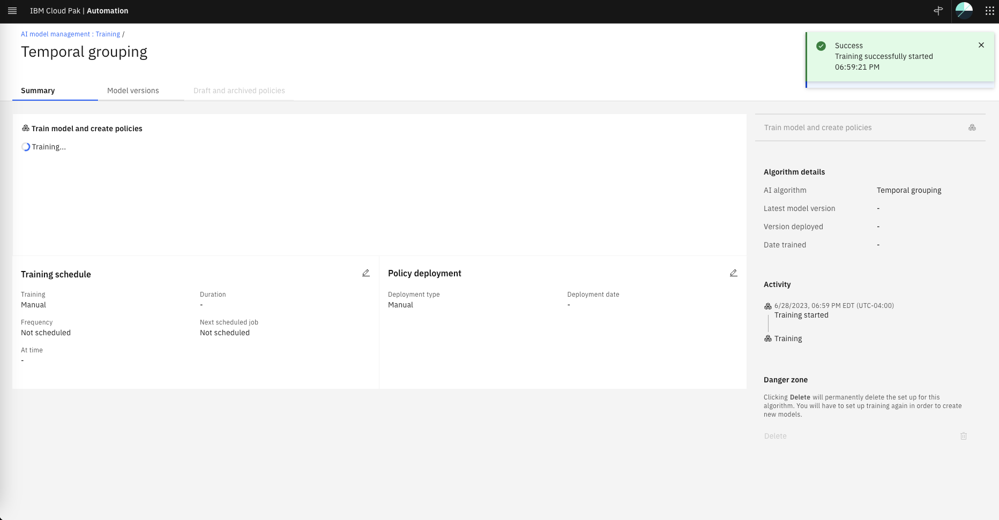

After about 4 minutes, you will see that the training has finished in the **Activity** log on the right:

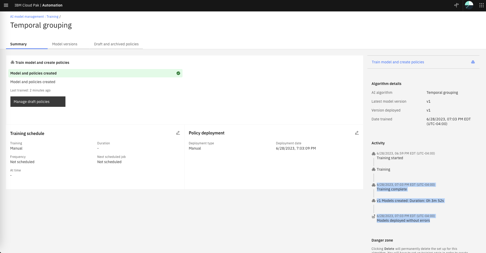

Click on the **Model versions** tab. Note that a new Model v1 shows as **Deployed**. 

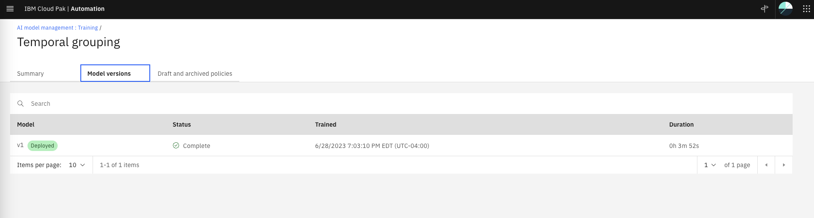

Click on the **Draft and archived policies** tab. Note that two draft Policies have been created. 

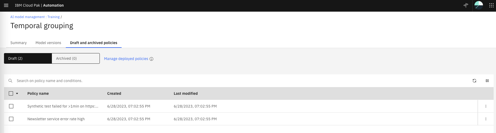


## 4.4: Review and Deploy Temporal Policies

Lets review the newly created temporal policies based on the historical alert data.

### Policy Logic

Click on the first policy name. On the right-side slider, click on the **Specification** tab

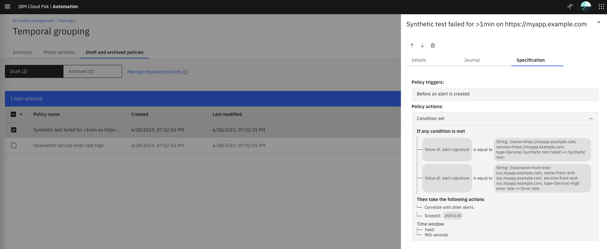

Note that this policy will correlate any alerts that:
1. Have the alert.signature value equal to any of the two values listed. These values came from 
Alerts in the historical training data that have co-occurred in the past.
2. Happen within a 900 seconds (15 minutes) fixed time window.

Close the right-side slider by clicking on the X. 

Click on the second policy name and repeat the review process.

### Policy Justification

Now lets explore the policy Justification. On the first policy, click on the three dots on the 
right and select **View justification**, as shown below:

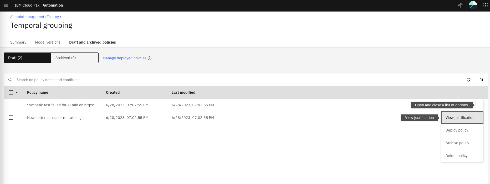

The policy justification page shows the alerts that have co-occurred in the past. For this policy,
we see that two alerts with severities Major and Minor have co-occurred on May 22, May 17, May 7, 
Apr 20 and Apr 5. All during 2023. 

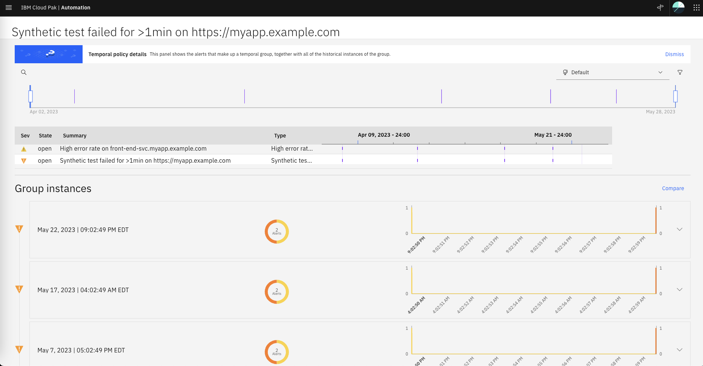

Click on the previous browser tab to get back to the list of the two draft policies and repeat the
justification review with the second policy. 

### Policy Deployment

Now that we have reviewed the logic and the justification for each draft policy, we will deploy them.
From the **Temporal Grouping** page under the **Draft and archived policies** tab, select both policies and
click Deploy, as shown below. Confirm the deployment on the confirmation pop-up. 

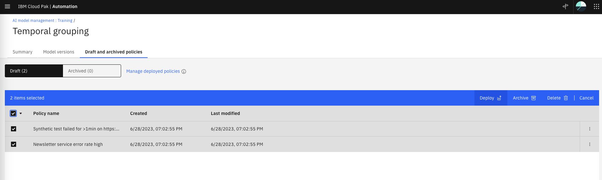

After the two policies are deployed, they are removed from the draft list. Click on the **Manage deployed policies**
link, as shown below:

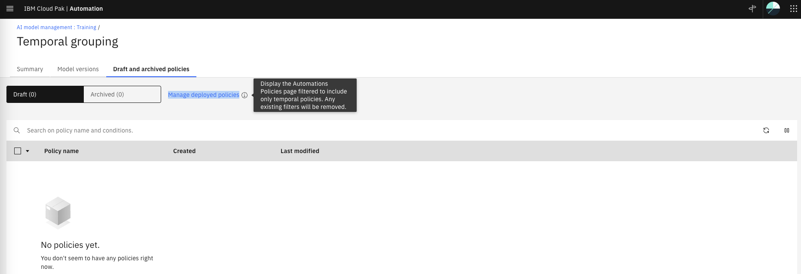

Now we are in the Automations page, under the Policies tab with a preset filter for temporal policies. We 
can see that the two temporal polices are now deployed and enabled. Note that the **Last run** column is empty 
and the status is **Policy has not been attempted** (hover over the status to see the legend).

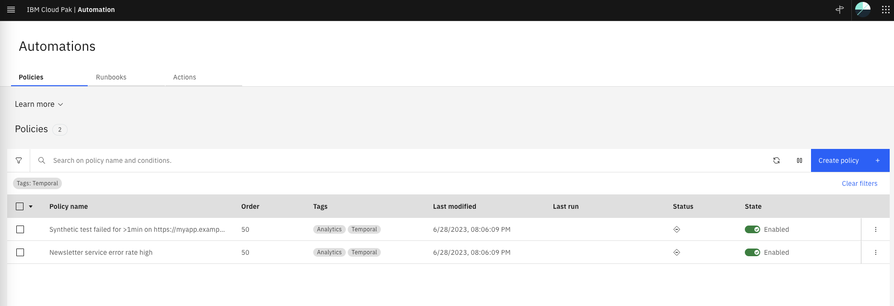


## 4.5: Test the Temporal Policies

Before testing the new temporal policies, lets recap what we have done so far:
1. We submitted four co-occurring alerts. We saw that that they don't get grouped or correlated 
because we don't have any temporal policy deployed yet. 
2. We loaded historical alerts directly into the Cloud Pak for AIOps historical alerts database.
This data have the same alerts from the previous step that co-occur multiple times in the past. 
3. We manually run a temporal training job that will leverage this historical alert data.
4. After the job finished, two things happened: a new temporal model was deployed and two draft
temporal policies were created.
5. We reviewed both, the logic and the justification of the draft temporal policies. 
6. Finally we deployed both temporal policies.

To test the deployed temporal policies, we will submit the same four co-occurring alerts
we tried in the first step.

Lets resubmit the same four events via the webhook script created in the previous section by running the following command:

```
bash event-load-webhook.sh temp-events-inference.json
```

* From the burger menu in the top-left navigate to: **Operate → Incidents and alerts**.
* From the **Incidents and alerts** page, click on the **Alerts** tab. 

Now we can see that there are two alert groups as shown below:

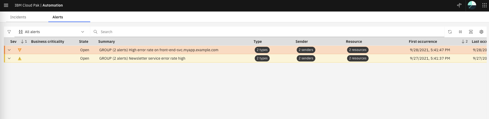

Click on the chevron icon (^) for each group to expand them. Also,
click on the **View correlation** icon in the top-right, the **Correlation** column shows
the temporal correlation icon for these alerts. 

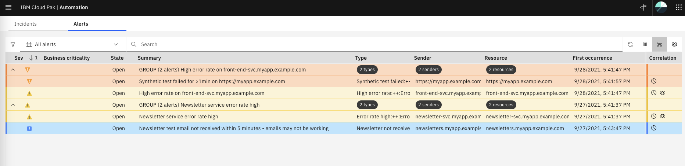

Now click on the temporal correlation icon of the first alert. Note that there is a 
calendar that shows which days these two alerts have co-occurred in the past. Hover on the
calendar to see the dates.

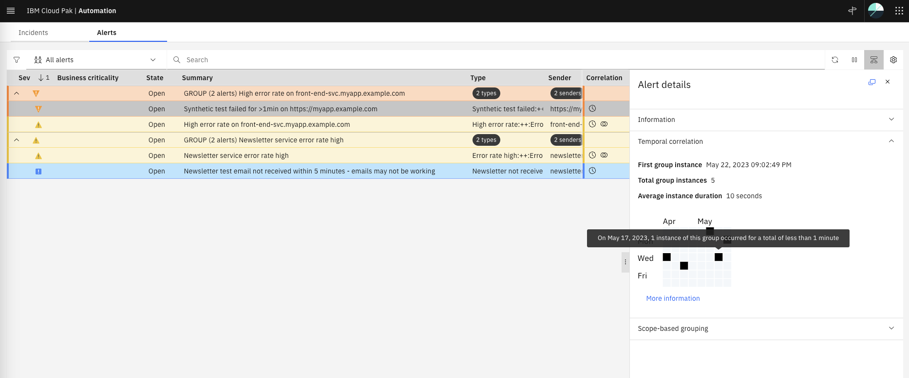

Finally, if you click on the **More information** link, you will see the same justification page
that we saw while reviewing the draft policies.

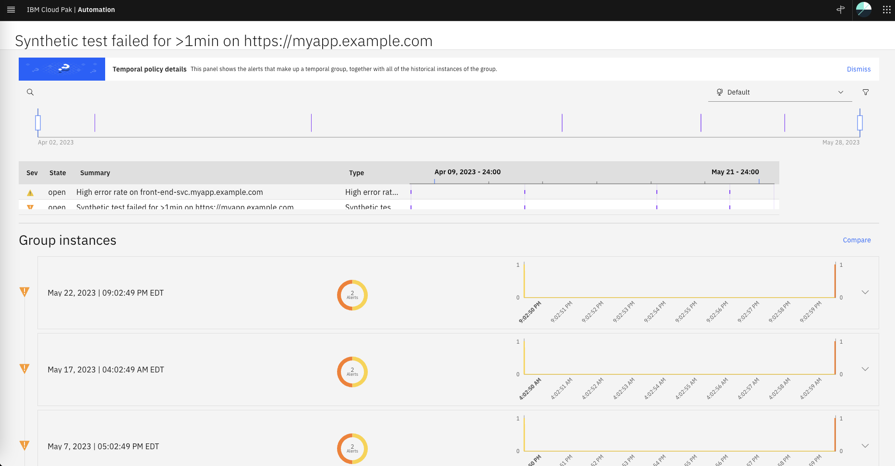

Lets clear these alerts before we move to the next section in the Lab.
Select all the alerts, right-click and select **Clear**. Make sure all four alerts have **Clear** under 
the **State** column. Move to the next step in the Lab, the alerts will disappear after 2-3 minutes


