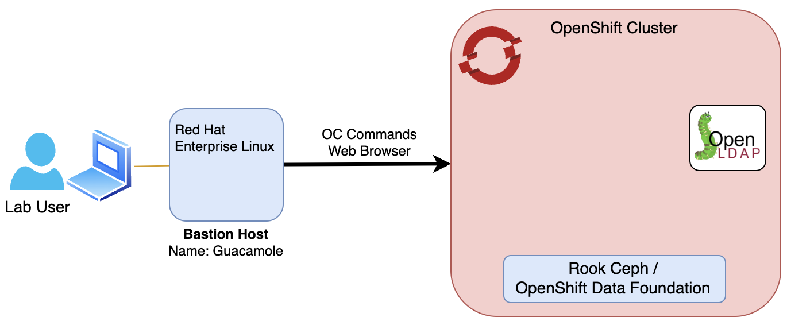

Welcome to the Cloud Pak for AIOps installation lab.
The following chart describes the infrastructure for the lab

:::note

- For any instructions that use the "oc" command (interacting with your
  cluster), use your "bastion" VM

- One key objective of this Lab is to expose the product public documentation 
to the practitioners. With this in mind, each installation steps will reference 
the public documentation (***Doc Link***) for the actual commands to run.

:::
