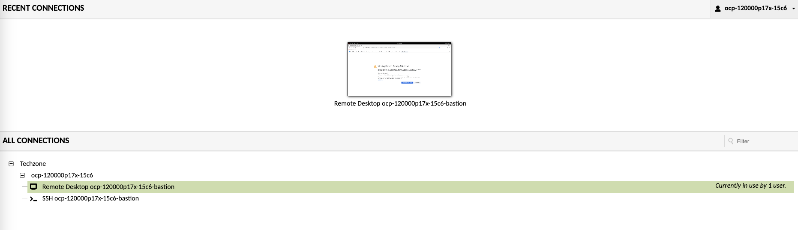
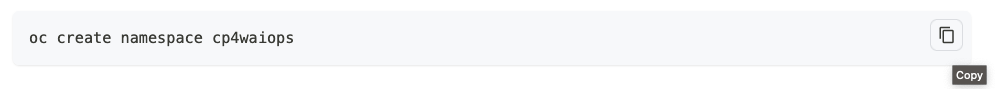

## 2.1: Overview

This module focuses on the initial deployment of the Cloud Pak for Watson AIOps. 
This deployment scenario will assume you are deploying onto the IBM Technology Zone, 
[Jam-in-a-Box for AIOps](https://techzone.ibm.com/collection/jam-in-a-box-for-aiops/environments) environments. 
Note that the same steps would generally apply to an OpenShift cluster deployed on
another cloud provider, or on-premises.

If you don't have a **Jam-in-a-Box: CP4AIOps - Install** environment already, reserve one
by selecting the **Jam-in-a-Box: CP4AIOps - Install** tile from the 
[environment list](https://techzone.ibm.com/collection/jam-in-a-box-for-aiops/environments) 
and fill the reservation form. 

You will need an IBM ID to request an entitlement key. You can create an IBM ID from [here](https://www.ibm.com/account/reg/us-en/signup?formid=urx-19776).


## 2.2: Obtain your Entitlement key

Navigate to
[**this link**](https://myibm.ibm.com/products-services/containerlibrary) to
obtain your **entitlement key** that is assigned to your IBM ID which will grant
you access to the IBM Entitled Registry. Copy this into a text editor in
preparation for the next step. This will be needed for deploying an instance of
the product.

You can check your entitlement for the Cloud Pak for AIOPs by clicking **View Library**


:::info

If your entitlement key is not valid for the Cloud Pak for AIOPs, you can
register for a 60 day trial using the following link:
[Request trial](https://www.ibm.com/account/reg/us-en/login?formid=urx-51074).

:::

## 2.3: Access the OpenShift cluster


During this module, you will need to login to a bastion virtual machine (VM) on which
the `oc` utility is already installed, so that you can run certain commands to
install the product.

* From the IBM technology Zone [My reservations](https://techzone.ibm.com/my/reservations) page,
select the **Jam-in-a-Box: CP4AIOps - Install** reservation. 
* From the **Jam-in-a-Box: CP4AIOps - Install** environment details page, click on the **Desktop URL**
link to access the bastion VM.
* From the bastion VM RECENT CONNECTIONS page, select the **Remote Desktop** connection as shown below
(note that you may not have the picture of a remote desktop running)




* From the bastion VM desktop, open a **Terminal** window (you may need to click on **Activities** in the
top-left to remove the screen-saver)
* In the **Terminal** window, copy & paste the **oc** command below to login into the cluster. Get your 
**kubeadmin** password from your environment details page. This command will make a connection to your cluster 
and authenticate you, so you will be ready to start installing the product by issuing various commands against it.

```
oc login --server=https://api.ocp.techzone.lan:6443 --username kubeadmin --password <your password>
```


## 2.4: Install the Cloud Pak for Watson AIOps Operator

In this section, our objective will be to deploy the product Operator which will
then pull down the software images to the cluster, so that we can deploy an instance
of the Cloud Pak for Watson AIOps in the next section. You will be copying, pasting and
running the following commands from the **Terminal** window. 

:::caution
* It is essential to ensure the indentation is correctly copied from the documentation.
* When you copy the commands, use the Copy helper on the right side as shown below:

:::

### Create a custom project (namespace)

Lets start by creating the project (namespace) where we will install the product. It is 
important to know which project/namespace you are in when issuing `oc`
commands. Run the following command:

```
oc create namespace cp4waiops
```

If interested, this install step is documented [***here***](https://www.ibm.com/docs/en/cloud-paks/cloud-pak-watson-aiops/4.1.0?topic=aiops-starter-installation#exp_namespace).

### Create an OperatorGroup in your custom project (namespace)

The Operator requires an Operator Group, which provides multitenant configuration to
installed Operators. An Operator group selects target namespaces in which to generate 
required RBAC (Role Base Access Control) access for its member Operators. Run the following command:

```
cat << EOF | oc apply -f -
apiVersion: operators.coreos.com/v1
kind: OperatorGroup
metadata:
  name: cp4waiops-operator-group
  namespace: cp4waiops
spec:
  targetNamespaces:
    - cp4waiops
EOF
```

If interested, this install step is documented [***here***](https://www.ibm.com/docs/en/cloud-paks/cloud-pak-watson-aiops/4.1.0?topic=aiops-starter-installation#op_group).

### Create the entitlement key pull secret

Now we will store the entitlement key that you obtained previously into a secret. This secret 
will be used to pull installation images. Copy & paste the following command into the **Text Editor** 
in the bastion VM, add your entitlement key and run the command from the **Terminal**: 

```
oc create secret docker-registry ibm-entitlement-key \
    --docker-username=cp\
    --docker-password=<entitlement-key> \
    --docker-server=cp.icr.io \
    --namespace=cp4waiops
```


If interested, this install step is documented [***here***](https://www.ibm.com/docs/en/cloud-paks/cloud-pak-watson-aiops/4.1.0?topic=aiops-starter-installation#exp_pull_secret).

### Usage data collection

To help the development of IBM Cloud Pak for Watson AIOps, daily aggregated usage data is collected 
to analyze how the product is used. The usage data is collected by the cp4waiops-metricsprocessor pod, 
and is sent to and stored in IBM controlled GDPR-compliant systems. For the purpose of this Lab,
we will skip this step.

If interested, this install step is documented [***here***](https://www.ibm.com/docs/en/cloud-paks/cloud-pak-watson-aiops/4.1.0?topic=aiops-starter-installation#usage_secret).

### Ensure external traffic access to AI Manager

Run the following command to update the endpointPublishingStrategy.type. This is done to allow traffic 
in case the ingresscontroller its set to HostNetwork. Run the following command:

```
if [ $(oc get ingresscontroller default -n openshift-ingress-operator -o jsonpath='{.status.endpointPublishingStrategy.type}') = "HostNetwork" ]; then oc patch namespace default --type=json -p '[{"op":"add","path":"/metadata/labels","value":{"network.openshift.io/policy-group":"ingress"}}]'; fi
```

If interested, this install step is documented [***here***](https://www.ibm.com/docs/en/cloud-paks/cloud-pak-watson-aiops/4.1.0?topic=aiops-starter-installation#exp_ingress).

### Create the catalog source

After installation, the ibm-operator-catalog CatalogSource object determines whether the upgrade of 
your Cloud Pak for Watson AIOps deployment is initiated automatically when a new patch becomes available.
The ibm-operator-catalog CatalogSource object can be configured to automatically poll for and retrieve 
a newer catalog by enabling the polling attribute, *spec.updateStrategy.registryPoll*. If a newer catalog 
for a patch is found and retrieved, then an automatic upgrade of your Cloud Pak for Watson AIOps 
deployment is initiated. For the purpose of this Lab, we will disable the automatic initiation of patch upgrades.
Run the following two commands:

```
cat << EOF | oc apply -f -
apiVersion: operators.coreos.com/v1alpha1
kind: CatalogSource
metadata:
  name: ibm-operator-catalog
  namespace: openshift-marketplace
spec:
  displayName: ibm-operator-catalog
  publisher: IBM Content
  sourceType: grpc
  image: icr.io/cpopen/ibm-operator-catalog:latest
EOF
```

```
IMGDIGEST=`oc get pods -n openshift-marketplace -l=olm.catalogSource=ibm-operator-catalog --no-headers -o=jsonpath="{.items[0].status.containerStatuses[0].imageID}" -n openshift-marketplace` && \
oc patch catalogsource ibm-operator-catalog -n openshift-marketplace --type=json -p "[{ "op": "test", "path": "/spec/image", "value": "\"icr.io/cpopen/ibm-operator-catalog:latest\"" }, { "op": "replace", "path": "/spec/image", "value": "\"$IMGDIGEST\"" }]"
```

If interested, this install step is documented [***here***](https://www.ibm.com/docs/en/cloud-paks/cloud-pak-watson-aiops/4.1.0?topic=aiops-starter-installation#exp_catalog).

### Verify cluster readiness

In order to finish the Lab on time, we will skip the section regarding verifying the cluster readiness. 
Remember to run this verification in a production implementation.

If interested, this install step is documented [***here***](https://www.ibm.com/docs/en/cloud-paks/cloud-pak-watson-aiops/4.1.0?topic=aiops-starter-installation#prereq_check).

### Install the Cloud Pak for Watson AIOps operator

Finally, we are ready to install the Operator. Run the following command:

```
cat << EOF | oc apply -f -
apiVersion: operators.coreos.com/v1alpha1
kind: Subscription
metadata:
  name: ibm-aiops-orchestrator
  namespace: cp4waiops
spec:
  channel: v4.1
  installPlanApproval: Automatic
  name: ibm-aiops-orchestrator
  source: ibm-operator-catalog
  sourceNamespace: openshift-marketplace
EOF
```

Do not move to the next step until you can confirm that the Operator is fully installed
by running the verification command listed below. Verify that all of the components except 
**IBM Elastic**, have a state of Succeeded. The **IBM Elastic** installation depends on the next step.
You should see three **Succeeded** messages.

```
oc get csv -n cp4waiops | egrep "ibm-aiops-orchestrator|ibm-automation|ibm-common-service"
```

If interested, this install step is documented [***here***](https://www.ibm.com/docs/en/cloud-paks/cloud-pak-watson-aiops/4.1.0?topic=aiops-starter-installation#exp_operator).


## 2.5: Deploy an instance of Cloud Pak for Watson AIOps

This final step involves deploying a running instance of the product onto the OpenShift cluster.
Note in the following command that we specify **accept** the license, that the installation
size is **small**, and the name of the file and block **storage classes**. In a real deployment,
you will have to define the storage classes in advance. We will get deeper into storage classes later
in the Lab. 

Note also that we specify the **TopologyModel**. This is the terminology to use in the product when defining 
collections of topology resource groups. Valid values for TopologyModel are "application" or "service". 
Run the following command:

```
export LICENSE_ACCEPT=true
export INSTALL_SIZE=small
export STORAGE_CLASS_FILE=ocs-storagecluster-cephfs
export STORAGE_CLASS_BLOCK=ocs-storagecluster-ceph-rbd
export TOPOLOGY_MODEL=application

cat << EOF | oc apply -f -
apiVersion: orchestrator.aiops.ibm.com/v1alpha1
kind: Installation
metadata:
  name: ibm-cp-watson-aiops
  namespace: cp4waiops
spec:
  imagePullSecret: ibm-entitlement-key
  license:
    accept: ${LICENSE_ACCEPT}
  pakModules:
  - name: aiopsFoundation
    enabled: true
  - name: applicationManager
    enabled: true
  - name: aiManager
    enabled: true
  - name: connection
    enabled: false
  size: ${INSTALL_SIZE}
  storageClass: ${STORAGE_CLASS_FILE}
  storageClassLargeBlock: ${STORAGE_CLASS_BLOCK}
  topologyModel: ${TOPOLOGY_MODEL}
EOF
```

Run the following command to check that the PHASE of your installation is **Updating**:

```
oc get installations.orchestrator.aiops.ibm.com -n cp4waiops
```

It takes around 60-90 minutes for the installation to complete (subject to the speed with which images can be pulled). 
When installation is complete and successful, the PHASE of your installation changes to **Running**. 

:::tip
While you wait for the installation to finish, complete the following Lab sections:
* Custom Sizing Tool
* Storage, HA and FIPS Considerations
:::


If your installation phase does not change to **Running** after 60-90 minutes, use the following command to find out which components are not ready:

```
oc get installation.orchestrator.aiops.ibm.com -o yaml | grep 'Not Ready'
```


If interested, this install step is documented [***here***](https://www.ibm.com/docs/en/cloud-paks/cloud-pak-watson-aiops/4.1.0?topic=aiops-starter-installation#exp_instance).


## 2.6: Log in to the Cloud Pak for Watson AIOps console

Now you are going to locate the console URL and the admin login credentials from your newly deployed
instance of the Cloud Pak for Watson AIOps. 

Find the URL to access the console with the following command:

```
oc get route -n cp4waiops cpd -o jsonpath='{.spec.host}'
```

Find the password for the **admin** username by running the following command:

```
oc -n ibm-common-services get secret platform-auth-idp-credentials -o jsonpath='{.data.admin_password}' | base64 -d
```

:::tip
Now complete the final Lab section:
* LDAP Integration
:::


If interested, this install step is documented [***here***](https://www.ibm.com/docs/en/cloud-paks/cloud-pak-watson-aiops/4.1.0?topic=aiops-starter-installation#exp_login).

