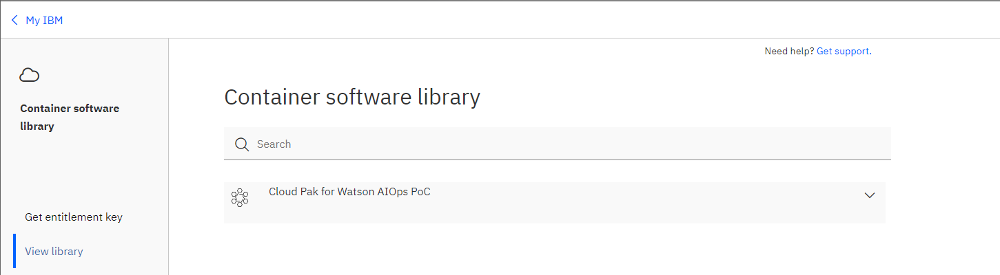

## 2.1: Overview

This module focuses on the initial deployment of the Cloud Pak for Watson AIOps. 
This deployment scenario will assume you are deploying onto the IBM Cloud
however the steps would generally apply to an OpenShift cluster deployed on
another cloud provider, or on-premises. The exception to this would be the setup
of the persistent storage but this is covered later in the lab.


## 2.2: Obtain your Entitlement key

Navigate to
[**this link**](https://myibm.ibm.com/products-services/containerlibrary) to
obtain your **entitlement key** that is assigned to your IBM ID which will grant
you access to the IBM Entitled Registry. Copy this into a text editor in
preparation for the next step. This will be needed for deploying an instance of
the product.

You can check your entitlement for the Cloud Pak for AIOPs by clicking **View Library**



:::info

If your entitlement key is not valid for the Cloud Pak for AIOPs, you can
register for a 60 day trial using the following link:
[Request trial](https://www.ibm.com/account/reg/us-en/login?formid=urx-51074).

:::

## 2.3: Access the OpenShift cluster


During this module, you will need to log in a "control" virtual machine on which
the `oc` utility is already installed, so that you can run certain commands to
install the product.

Open a web browser and log in to:
[https://cloud.ibm.com](https://cloud.ibm.com). In the top-right corner of the
screen, ensure that the right account is selected from the drop-down menu. Next,
click on the menu button in the top-left corner, select **OpenShift**, then
**Clusters**.

Click on your "AIops" OpenShift cluster, then click the blue **OpenShift web
console** button to open the main OpenShift UI:


Next, we need to obtain the login command to connect to and authenticate with
the OpenShift cluster.

In the top-right corner of the OpenShift UI, click on your username, then select
**Copy Login Command**. You should get a new tab open with a link to **Display
Token**. Click on this link to reveal the cluster login command that you will
need to authenticate to the OpenShift cluster.


Copy the full **oc login** command displayed under **Log in with this token**
and save it into Notepad or a local text editor.

Go to your terminal session (either local or on a remote host) and paste the
full "oc login" command, and press Enter. This command will make a connection to
your cluster and authenticate you, so you will be ready to start preparing the
cluster by issuing various commands against it.


## 2.4: Install the Cloud Pak for Watson AIOps Operator

In this first part, our objective will be to deploy the product Operator which will
then pull down the software images to the cluster, so that we can deploy an instance
of the Cloud Pak for Watson AIOps in the next section.

:::caution

It is essential to ensure the indentation is correctly copied from the documentation.

:::

### Create a custom project (namespace)

Lets start by creating the project (namespace) where we will install the product. It is 
important to know which project/namespace you are in when issuing `oc`
commands. All of the subsequent commands need to be run in the `cp4waiops`
project/namespace otherwise the various elements you create may not be available
to use in later steps. [***Doc Link***](https://www.ibm.com/docs/en/cloud-paks/cloud-pak-watson-aiops/4.1.0?topic=aiops-starter-installation#exp_namespace)

### Create an OperatorGroup in your custom project (namespace)

The Operator requires an Operator Group, which provides multitenant configuration to
installed Operators. An Operator group selects target namespaces in which to generate 
required RBAC (Role Base Access Control) access for its member Operators. [***Doc Link***](https://www.ibm.com/docs/en/cloud-paks/cloud-pak-watson-aiops/4.1.0?topic=aiops-starter-installation#op_group)

### Create the entitlement key pull secret

Now we will store the entitlement key that you obtained previously into a secret. This secret 
will be used to pull installation images. [***Doc Link***](https://www.ibm.com/docs/en/cloud-paks/cloud-pak-watson-aiops/4.1.0?topic=aiops-starter-installation#exp_pull_secret)

### Configure usage data collection

Now we will configure the usage data collector. This is a collector of usage data that is
 all numeric, and does not include email addresses, passwords, or other personal details. 
 This usage information is really important for driving the future roadmap of the product.
Use the values shown below for the environment variables. [***Doc Link***](https://www.ibm.com/docs/en/cloud-paks/cloud-pak-watson-aiops/4.1.0?topic=aiops-starter-installation#usage_secret)

```sh
export CUSTOMER_NAME=ACME
export CUSTOMER_ICN=ACME123
export CUSTOMER_ENVIRONMENT=trial
export PROJECT_CP4WAIOPS=cp4waiops
```

### Ensure external traffic access to AI Manager

Run the following command to update the endpointPublishingStrategy.type. This is done to allow traffic 
in case the ingresscontroller its set to HostNetwork. [***Doc Link***](https://www.ibm.com/docs/en/cloud-paks/cloud-pak-watson-aiops/4.1.0?topic=aiops-starter-installation#exp_ingress)

### Create the catalog source

Now we will install the Catalog Source. An Operator Lifecycle Manager (OLM) CatalogSource 
is a collection of operator metadata. OLM uses CatalogSources to build the list of available 
operators that can be installed from OperatorHub in the OpenShift web console. In the documentation, 
disregard the section about disabling the automatic initiation of patch upgrades. [***Doc Link***](https://www.ibm.com/docs/en/cloud-paks/cloud-pak-watson-aiops/4.1.0?topic=aiops-starter-installation#exp_catalog)

### Verify cluster readiness

In order to finish the Lab on time, we will skip the section regarding verifying the cluster readiness. 
Remember to run this verification in a real scenario!.

### Install the AI Manager operator

Finally, we are ready to install the Operator. Do not move to the next step until you can confirm that
 the Operator is fully installed by running the verification command provided in the documentation. [***Doc Link***](https://www.ibm.com/docs/en/cloud-paks/cloud-pak-watson-aiops/4.1.0?topic=aiops-starter-installation#exp_operator)


The Cloud Pak for Watson AIOps Operator is now installed and ready to create a product instance.


## 2.5: Deploy an instance of Cloud Pak for Watson AIOps

This final step of deployment involves deploying a running instance of the product onto the OpenShift cluster.
Make sure you have updated the following values in the yaml file before running the command [***Doc Link***](https://www.ibm.com/docs/en/cloud-paks/cloud-pak-watson-aiops/4.1.0?topic=aiops-starter-installation#exp_instance)

* <license_acceptance> must be set to **true** to agree to the license terms
* <storage_class_name> this is the **file storage class** provided by the instructor
* <large_block_storage_class_name> this is the **block storage class** provided by the instructor


The deployment of your instance will normally take about 30 to 40 minutes. You
can monitor the deployment's progress both from Installed Operators page as well
as from: **Workloads > Pods** page. Ensure that the Project drop-down menu at
the top of the page is set to your namespace ("cp4waiops"). Once all the pods have
deployed and are showing with a Status of Running and 1/1 or 2/2, you will know
that your deployment has completed. You can sort your pods by "Ready" status,
and filter on all pods except for "Completed" jobs to monitor the deployment
progress.

:::tip

Don't worry if you see some pods report an error state during the course of the
deployment. This is simply because many pods are dependent on others, and so
complain if they come up before those others. The system will simply retry to
deploy these pods over and over, and so eventually everything will deploy and
come up in the end.

:::


This can also be confirmed by returning to the Installed Operators page and
seeing: **Phase: Running** next to your deployment:


Congratulations! You have successfully deployed an instance of the
Cloud Pak for Watson AIOps.


## 2.6: Configure Certificates and Locate Login Credentials


### Configure signed certificates for NGINX

In a real deployment scenario, you will procure valid CA (Certificate Authority) signed
certificates and patch the AutomationUIConfig instance with a new secret that contains these
ingress certificates. In this Lab, we will just use the default self signed certificates therefore
we can skip this step.


### Verify the installation

In order to finish the Lab on time, we will skip the section regarding verifying the installation. 
Remember to run this verification in a real scenario!.


### Log in to the IBM Cloud Pak Automation console

Now you are going to locate the admin login credentials from your newly deployed
instance of the Cloud Pak for Watson AIOps. Follow the steps in the documentation and make sure to save 
both the console URL and the password for the admin username. [***Doc Link***](https://www.ibm.com/docs/en/cloud-paks/cloud-pak-watson-aiops/4.1.0?topic=aiops-starter-installation#exp_login)

