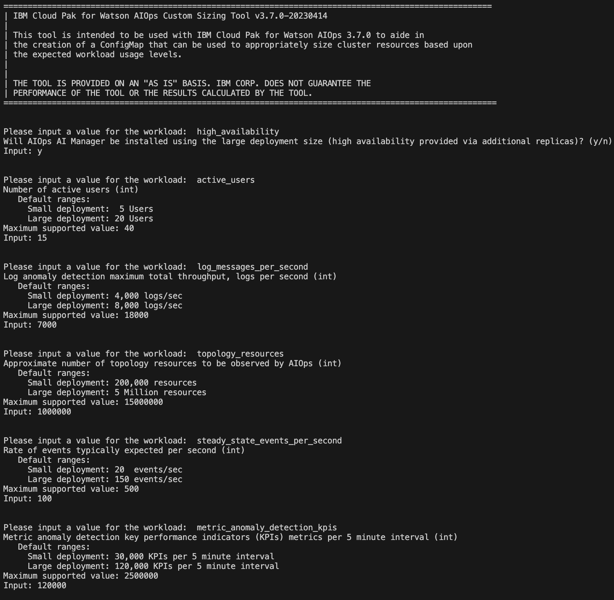
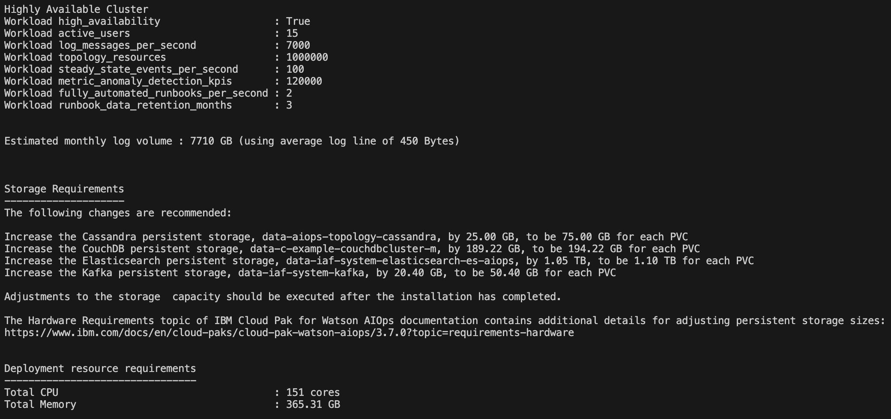
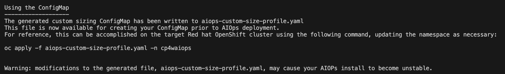
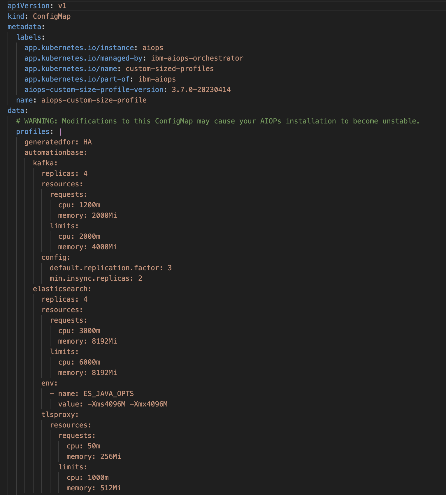

## 3.1: Overview

Both, the OpenShift cluster and the Cloud Pak for AIOps can be sized in two different ways. 
One is following a fixed T-Shirt guidance (starter or production) or 
it can be custom sized based on actual workloads and functionality needs.
For production deployments, its recommended to do a custom sizing using 
the Custom Sizing Tool.

The IBM Cloud Pak for AIOps Custom Sizing Tool is intended to be used 
to aide in the creation of:

* OpenShift cluster CPU and Memory deployment resource requirements to help sizing the actual cluster
* a ConfigMap that is used to appropriately size pods, replicas, etc. based upon the expected workload 
usage levels. This is applied **before** the installation
* a list of adjustments to the PVC storage capacity. This is applied **after** the installation has completed. 

The tool itself is standalone that is packaged as a binary executable. It can run 
on a local workstation, and it does not need to access to any external resources. 
There are binaries for Windows, macOS, and Linux.

:::note
At the time this Lab was written, only IBM technical teams have access to the tool. Additional workload and
infrastructure sizing details are available in [***Seismic***](https://ibm.seismic.com/Link/Content/DCGC24h392CmqG4DCFCQp8jXgWPj)
:::

## 3.2 Running the Custom Sizing Tool

The tool will ask various workload questions as shown below:

Then it will create the sizing output and a configMap file called aiops-custom-size-profile.yaml

Finally, it provides guidance on how to apply the configMap:

Sample configMap file:

