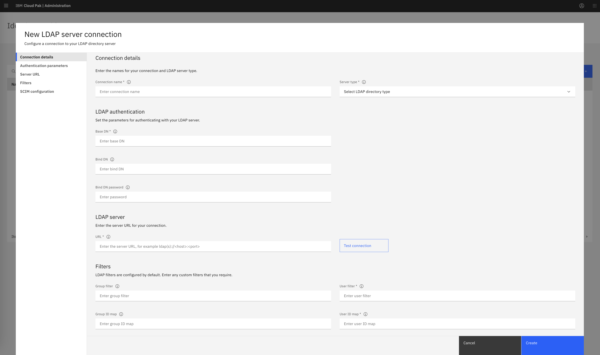
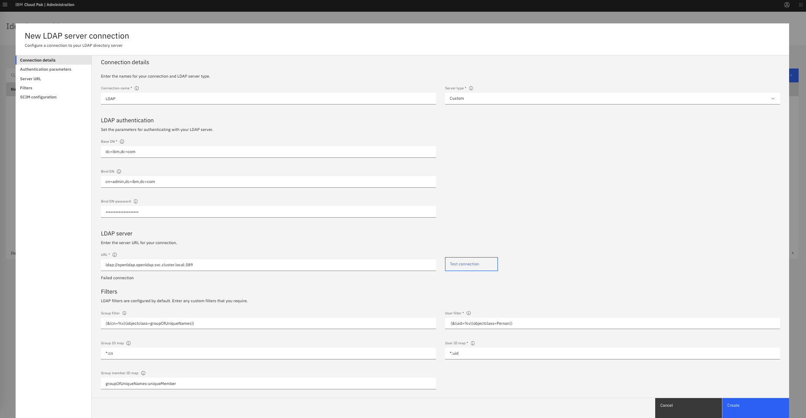
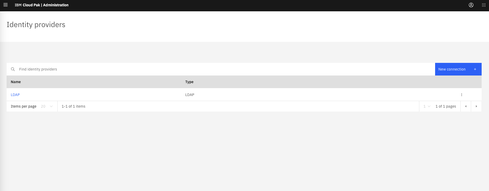
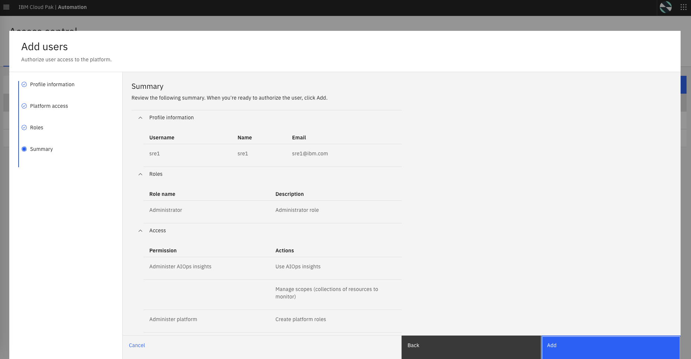

## 5.1: Overview

In this chapter, we will configure the integration with a Lightweight Directory Access Protocol (LDAP) 
server that has been preinstalled into our environment to manage access for users and user groups.
With an LDAP connection created, we can add users from the LDAP directory to the platform for IBM Cloud 
Pak for AIOps for accessing the different capabilities. When we are adding a user from an LDAP server to the product, 
we can search users by their name, email address, or username. The LDAP login ID for the user is 
considered to be the username for that user.

The following LDAP types are supported:

* IBM Tivoli Directory Server
* IBM Lotus Domino
* IBM SecureWay Directory Server
* Novell eDirectory
* Sun Java™ System Directory Server
* Netscape Directory Server
* Microsoft Active Directory
* Custom

## 5.2: Obtaining Connection parameters

From the bastion VM, connect to the cluster by running the **oc login** command and
run the commands listed below to obtain the LDAP connection information

```sh
echo -e "\n\n# This command will get the password of the LDAP admin"
oc get secret openldap-admin-secret --template={{.data.password}} -n openldap | base64 --decode
echo -e "\n\n# This command will get the generic password for all users"
oc get secret openldap-users-secret --template={{.data.password}} -n openldap | base64 --decode
echo -e "\n\n"
```


## 5.3: Connecting to the LDAP Directory

We will now setup the integration:

* Log on to the IBM Cloud Pak for AIOps console using the admin credentials obtained previously.
* From the navigation menu, click **Administration** > **Access control**.
* From the Access control page, click **Identity provider configuration** in the top right.
* On the Identity providers page, click **New connection**. 
* On the Identity providers **New connection** pop-up, select "LDAP" as protocol type and click "Next"

The "LDAP connection" page is displayed as shown below:



Enter the following details to set up the LDAP connection:

* Connection name: LDAP
* Server type: Custom
* Base DN: dc=ibm,dc=com
* Bind DN: cn=admin,dc=ibm,dc=com
* Bind DN password: *get the LDAP admin password from previous step*
* LDAP server URL: ldap://openldap.openldap.svc.cluster.local:389

Now, click *Test connection*. You should get Successful connection.

Lets fill out the rest of the fields. Leave the default values for Group filter, Group ID map, User ID map 
and Group member ID map. Only update the field below: 

* User filter:          (&(uid=%v)(objectclass=Person))

Now the "LDAP connection" page should be filled as displayed below:



Click the **Create** button.

You should get a LDAP entry in the provider list, as shown below:




## 5.4: Creating a New User

We will now create a new Cloud Pak for AIOps user with the role Administrator,
that will leverage the LDAP connection we just created.

* As you are now in the Cloud Pak Administration portal, click on the top 
right icon (Cloud Pak switcher) and select **IBM Automation** to get back to 
the home page in the Cloud Pak for AIOps.
* From the navigation menu, click **Administration** > **Access control**.
* From the Access control page under the Users tab, click **Add users**.
* From the Add users - Profile information page, search for **sre** and select the **sre1** user.
* Click on **Next**.
* From the Add users - Platform access page, select **Assign roles directly**.
* Click on **Next**.
* From the Add users - Roles page, check the **Administrator** role.
* Click on **Next**.
You should see a final Add users - Summary page as shown below:



* Click on **Add**.


## 5.5: Login as the New User

We will now login to the Cloud Pak for AIops as the new user we just created.

* From the top right icon, click on **Log out** and confirm on the pop-up.
* Click on the **Log in** button, to get back to the Login page.
* From the Cloud Pak for AIOps login page:
    * under **Log in with** select **Enterprise LDAP**.
    * under **Username**, type **sre1**.
    * under **Password**, copy/paste the *generic password for all users* you obtained before. Note that this credential has been pre-stored in the LDAP server.
    * click on **Log in**.

You have now logged in as the new **sre1** user with the **Administrator** role. 
