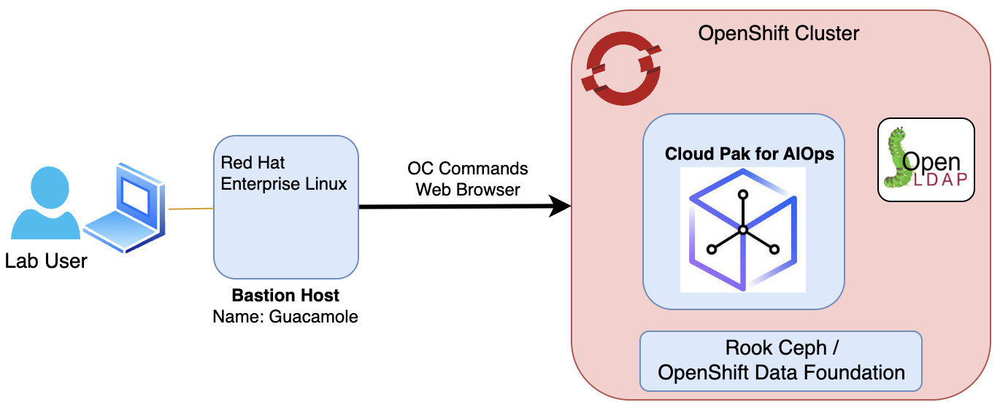
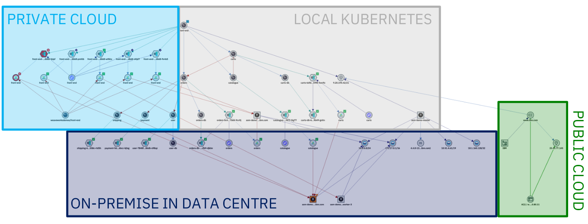

Welcome to the Cloud Pak for AIOps Topology Lab.
The following diagram describes the infrastructure available for the Lab:

:::note

- For any instructions that use the "oc" command (interacting with your
  cluster), use your "bastion" VM

:::

The **Resource Management** capabilities in the Cloud Pak for AIOps provide operations teams with complete up-to-date visibility and control over dynamic infrastructure and services. They let ITOps teams query a specific networked resource, and then presents a configurable topology view of it within its ecosystem of relationships and states, both in real time and within a definable time window. 

Services and applications are increasingly deployed in environments that take advantage of distributed and often virtualized infrastructure. For example, parts of a network might be cloud-based, with other connected elements contained within, or tethered to, legacy systems that exploit tried and tested on-prem capability. The result is often a highly distributed and increasingly complex hybrid network that requires an agile and dynamic resource management capability in order to leverage and exploit its rapidly evolving technologies.

**Resource Management** allows the real-time view, support and management of highly dynamic infrastructures and services. By visualizing complex network topologies in real-time, updated dynamically or on-demand, and allowing further investigation of events, incidents and performance, operational efficiency is improved, problems are detected and solved faster, false alarms are reduced, and automation and collaboration between operational teams is improved. Also, data can be leveraged more efficiently both in real time and historically, thereby empowering teams and systems to create and nurture differentiated services for different customers.

Topology information adds enormous value to your deployment as it provides visibility into your environment and brings it to-life. With topology in your
environment, you can:

- Visualize a seamless end-to-end view of your environment
- Create and view groups of resources that logically belong together
- Perform topology-based event correlation for events occurring within a group
  of related resources

The topology capability can ingest topology data from many different sources. The multiple disparate pieces of topology can then be stitched together, where it makes sense to do so, allowing you to see your end-to-end environment with all the logical and physical connections represented.

### Resources, Resource Groups and Applications

Resource Management has three categories of data: **Resources**, **Resource groups**, and **Applications**:

#### Resources

Resources are the lowest level of element in the system and are what is represented in topology visualizations, search experience, and APIs. They also form the basis of any topology-based event analytics. Resources are created in the system from observations of different technologies, in addition to allowing for proprietary data direct from you. These resources can represent a multitude of different things from the different layers of the application and infrastructure stack, for example host, vm, network interfaces, people, and locations. These resources are interconnected by relationships and their properties, which describe how the resources relate to one another. The relationship types can represent physical connections or logical connections, for example, the network interface partOf a host; the pod runs on a host; person owns this service. All the resources form together to create a connected representation of your environment, which is ideally ‘end to end’ across data sources and management silos.

#### Resource groups

Resource groups are an abstraction layer on top of resources. They aim to form collections of resources that capture some business or technical context within the environment for both search and correlation purposes. It might be something simple like a namespace or geographical region, but might also capture a network layer, protocol-specific constructs (like a VLAN), or a collection of resources that represent a running service instance. Resource groups are created either directly from Observers as they are observed from the various technologies ingesting topological data or can be created by defining templates that produce resource groups based on a particular criteria, which is an example topology structure or set of tags. The templates allow you to provide business logic to define how a grouping is created. The Cloud Pak for AIOps uses that template to dynamically create groups and maintain the dynamic membership. It is important to remember that resource groups are always responsible for ensuring the collection is up to date, and dynamically changing as the environment changes. Groups are useful because they allow us to impart meaning to potentially opaque resources, for example, a network interface problem can be prioritized far more effectively if it is known that the resource is part of an important customer’s service. You might want to create many thousands of groups depending on their environment, for example, you can provide tens of thousands of services to your customers or have one hundred thousand geographical locations.

Resource groups are used to manage specific resources. You can have resource groups within an application and also separate from any application. These groups can be from different sources. Resource groups can be created and managed through a connected inventory provider, such as Kubernetes, VMware, or Instana, or through a group template. The resources within a group must be created and managed through the connection with the inventory provider. If you need to change the resources within a resource group, do not directly manipulate your group. Use the group template or manage the group within the connected inventory provider.

When created and available, resource groups display on the Resource groups tab of the Resource management page and can be viewed in the Topology viewer and included within applications.

#### Applications

Applications (or more generally, ‘services’), are the highest level of abstraction, considered the starting point for correlating the current environment and managing it in a more coarse-grained and abstract way. Applications are simply a collection/group of resources groups that best represent the customer's application or service in terms of its composition given no one source or group is likely to have end-to-end visibility. For example, an application might be formed by a number of virtual machines and their hypervisors, network equipment, cloud-native services, a build pipeline, and a supporting organizational personnel. All of this can be provided to form a single holistic representation of the application, which can be used as a shared context between many different teams. It is important to note that while the Cloud Pak for AIOps can be seen as ‘application centric’, it is sufficiently flexible to model services or general groups-of-groups that you might need, that is to say that it can be ‘bent’ to business service management.

These applications, when combined with resource-level event correlation and grouping mechanisms, provide customers with rapid visibility of overall state, which allows them prioritize root cause analysis and remediation work. They also allow operators to focus on specific sets of resources that are known to relate to a specific application, so they can exclude resources and groups of resources that are not of interest.

### Lab Content

In this Lab, we will focus in a subset of the main features available in **Resource Management** such as:

* how to collect topology data
* how to use rules to merge topology elements
* how to use templates to gather resources into logical groups
* how to define applications from groups and business criticality

The complete set of **Resource Management** capabilities can be found in the [**documentation**](https://www.ibm.com/docs/en/cloud-paks/cloud-pak-watson-aiops/3.7.1?topic=operating-managing-topologies).