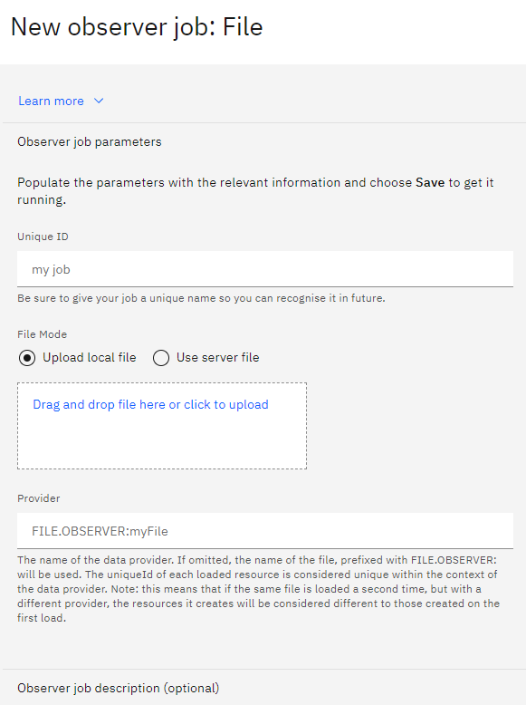
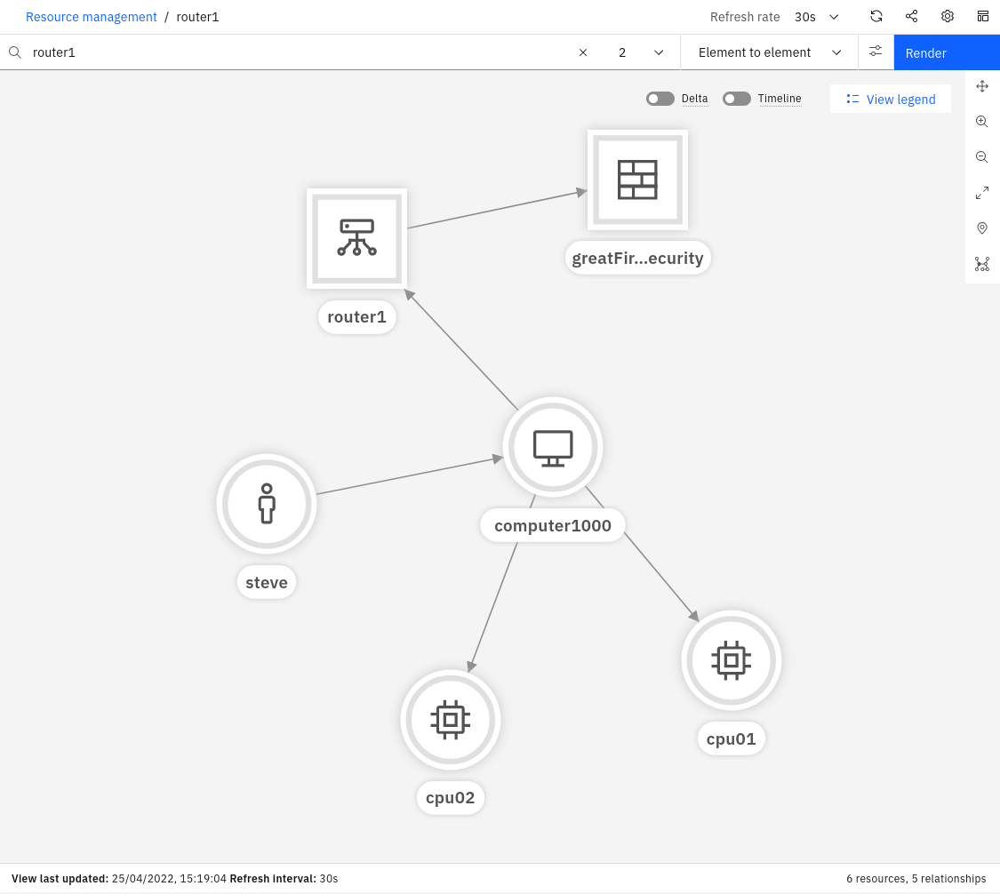

An Observer is a service that extracts resource information and inserts it into the Resource Management database.
Using the Observer UI, different observer jobs can be configured and run. 

At the time of writing this Lab, there are 33 different Observers available. The Observers
 are designed to connect to specific types of end-points, such as
ServiceNow, Dynatrace, or VMware vCenter. Two of the Observers are generic:
the File Observer (for ingesting file-based topology data) and the REST Observer
(for ingesting topology data programmatically via an API).

:::note

In order to save resources, only a subset of Observers are enabled by default. You can see the full list
of Observers and the steps to enable them by following the [**documentation**](https://www.ibm.com/docs/en/cloud-paks/cloud-pak-watson-aiops/3.7.1?topic=defining-observer-jobs)
:::

In this Lab, we will only leverage the File Observer, but a similar process applies to the other Observers. 
By the end of this module, you will have created various topology Observer jobs and ingested different sets of topology data. 


## 2.1: Creating Topology Files

This first step involves the following tasks:

- Create two sample files with topology data
- Load this data using the File Observer

In a real-world scenario, it is likely that you would be using a number of
off-the-shelf Observers to get your topology data from your environment. It is
also likely however that you would also leverage the File or REST Observers
either to ingest data for which an off-the-shelf Observer doesn't exist, or to
manually create relationships between Resources in your topology for which there
is no import source. For example, you may wish to create connections between
resources to represent logical connections or dependencies that aren't included
in the data sets. In any case, this exercise will give you the skills to use the
File Observer, which will also equip you with a little more knowledge of what's
going on under the covers.

In this scenario, we will have one set of topology data that represents
**physical infrastructure**, and a second set of topology data that represents
some **applications** running on that physical infrastructure. An analogy to
this might be physical topology data ingested from an orchestrator, such as
OpenStack, and application data, coming from an application management tool,
such as AppDynamics.

Create a file called **infrastructure.txt** with the following content:

```sh title="infrastructure.txt"
V:{"_operation":"InsertReplace","uniqueId":"379177a8-0a6a-4068-817c-d6d6e870437e","matchTokens":["379177a8-0a6a-4068-817c-d6d6e870437e","router1"],"tags":["WAIOpsDemo"],"name":"router1","entityTypes":["router"]}
V:{"_operation":"InsertReplace","uniqueId":"9c1f90e0-7dc4-40d8-8721-40ea2f3af453","matchTokens":["9c1f90e0-7dc4-40d8-8721-40ea2f3af453","Intel"],"tags":["WAIOpsDemo"],"name":"Intel","entityTypes":["cpu"]}
V:{"_operation":"InsertReplace","uniqueId":"222-9c1f90e0-7dc4-40d8-8721-40ea2f3af453","matchTokens":["222-9c1f90e0-7dc4-40d8-8721-40ea2f3af453","AMD"],"tags":["WAIOpsDemo"],"name":"AMD","entityTypes":["cpu"]}
V:{"_operation":"InsertReplace","uniqueId":"7598a194-27a0-4d0b-9c49-cbc0070c99c9","matchTokens":["7598a194-27a0-4d0b-9c49-cbc0070c99c9","greatFireWallOfSecurity"],"tags":["WAIOpsDemo"],"name":"greatFireWallOfSecurity","entityTypes":["firewall"]}
V:{"_operation":"InsertReplace","uniqueId":"974d1788-1312-4151-8a62-73fa1854e807","matchTokens":["974d1788-1312-4151-8a62-73fa1854e807","computer1000"],"tags":["WAIOpsDemo"],"name":"computer1000","entityTypes":["computer"]}
V:{"_operation":"InsertReplace","uniqueId":"5c6f968a-2006-4b43-96b5-dd53df6b0afb","matchTokens":["5c6f968a-2006-4b43-96b5-dd53df6b0afb","steve"],"tags":["WAIOpsDemo"],"name":"steve","entityTypes":["person"]}
E:{"_toUniqueId":"379177a8-0a6a-4068-817c-d6d6e870437e","_edgeType":"connectedTo","_fromUniqueId":"974d1788-1312-4151-8a62-73fa1854e807"}
E:{"_toUniqueId":"7598a194-27a0-4d0b-9c49-cbc0070c99c9","_edgeType":"uses","_fromUniqueId":"379177a8-0a6a-4068-817c-d6d6e870437e"}
E:{"_toUniqueId":"974d1788-1312-4151-8a62-73fa1854e807","_edgeType":"uses","_fromUniqueId":"5c6f968a-2006-4b43-96b5-dd53df6b0afb"}
E:{"_toUniqueId":"9c1f90e0-7dc4-40d8-8721-40ea2f3af453","_edgeType":"contains","_fromUniqueId":"974d1788-1312-4151-8a62-73fa1854e807"}
E:{"_toUniqueId":"222-9c1f90e0-7dc4-40d8-8721-40ea2f3af453","_edgeType":"contains","_fromUniqueId":"974d1788-1312-4151-8a62-73fa1854e807"}
```

Create a second file called **application.txt **with the following content:

```sh title="application.txt"
V:{"_operation":"InsertReplace","uniqueId":"111-379177a8-0a6a-4068-817c-d6d6e870437e","matchTokens":["111-379177a8-0a6a-4068-817c-d6d6e870437e","billing"],"tags":["WAIOpsDemo"],"name":"billing","entityTypes":["application"]}
V:{"_operation":"InsertReplace","uniqueId":"111-9c1f90e0-7dc4-40d8-8721-40ea2f3af453","matchTokens":["111-9c1f90e0-7dc4-40d8-8721-40ea2f3af453","webserver"],"tags":["WAIOpsDemo"],"name":"webserver","entityTypes":["application"]}
V:{"_operation":"InsertReplace","uniqueId":"111-974d1788-1312-4151-8a62-73fa1854e807","matchTokens":["111-974d1788-1312-4151-8a62-73fa1854e807","computer1000"],"tags":["WAIOpsDemo"],"name":"computer1000","entityTypes":["computer"]}
E:{"_toUniqueId":"111-974d1788-1312-4151-8a62-73fa1854e807","_edgeType":"runsOn","_fromUniqueId":"111-379177a8-0a6a-4068-817c-d6d6e870437e"}
E:{"_toUniqueId":"111-974d1788-1312-4151-8a62-73fa1854e807","_edgeType":"runsOn","_fromUniqueId":"111-9c1f90e0-7dc4-40d8-8721-40ea2f3af453"}
```

#### File Observer Format Overview

The JSON format in these two sample files is the format expected by the File Observer, and contains
topology directives, one per line. A line that begins with a **V** represents a
"Vertex" (or Resource). A line that begins with an **E** represents
an "Edge" (or Relationship).

:::note

Other format information can be found in the [**documentation**](https://www.ibm.com/docs/en/cloud-paks/cloud-pak-watson-aiops/3.7.1?topic=jobs-file-observer)
:::

#### Vertex

Some notes about the Vertex (Resource) properties follow:

- \_operation: A value of "InsertReplace" means that this Resource will be
  inserted into the topology if it does not already exist, and replace the
  current one if it does.

- uniqueId: This must be a globally unique identifier for the Resource. The
  off-the-shelf Observers will ensure uniqueness automatically. When using the
  File Observer, care must be taken to ensure uniqueness, otherwise you may
  inadvertently overwrite existing Resources with new ones.

- matchTokens: These values (comma separated list) are used to match the
  Resource against the incoming event stream, specifically against the Node and
  NodeAlias fields. Where there is a match, the event will be associated with
  the Resource and be visible from the topology view.

- tags: Tags can be handy to group Resources together, or for searching across
  resources that share a common tag. A resource can have multiple tags and
  represents a kind of group membership. One way that topology-based event
  correlation is across events that share a common tag. For example, you might
  tag all Resources that run an Oracle database with: "App:Oracle". Then you
  could create a tag-based correlation group template based on that tag.

- name: This is the primary identity of the Resource, and would normally be its
  most recognisable and human-readable name. The name attribute is normally the
  one shown in the topology viewer against a Resource.

- entityTypes: This defines what type of Resource is being created - for
  example: a computer or a database - and will also dictate which icon it will
  use in the topology view. A resource can have multiple values in the
  entityTypes field, although normally it would just have one entry.

#### Edge

Some notes about the Edge (Relationship) properties follow:

- \_fromUniqueId and \_toUniqueId: These parameters represent the start and end
  points for the Relationship - ie. which two Resources is it connecting. The
  values they have refer to the uniqueId parameters of the Vertex objects - ie.
  the Resources.

- \_edgeType: This parameter specifies the type of Relationship this relates to.
  For example, is it indicating a "uses" type of relationship, or a "contains"
  type?

A list of default Edge types (for the parameter \_edgeType) is documented [**here**](https://www.ibm.com/docs/en/cloud-paks/cloud-pak-watson-aiops/3.7.1?topic=reference-edge-types).


## 2.2: Creating File Observer Jobs

Log into the Cloud Pak for AIOps: 
* from the burger menu in the top-left navigate to: **Define → Data and tool connections**
* from the **Data and tool connections** page click on **Add connection**
* from the **Add connections** page click on **Topology** and select **configure, schedule, and manage other observer jobs **
* from the **Observer jobs** page click on the **Add a new job** button
* from the **Add a new job** pop-up select **File**


In the **New observer job: File** form, fill the Unique ID field as "infrastructure". Keep the 
**File Mode** as **Upload local file**, upload the **infrastructure.txt** file that you created in the previous 
step and click the **Save** button.



:::note
The Provider will be automatically populated when you click Save.
:::

Repeat the process by creating a second File Observer job with the Unique ID as "application" and this time load the
**application.txt** file.

Each job will run the moment it is saved. After you have done this, your
Observer jobs screen should look like the one below. You can verify that your jobs ran successfully by confirming the Ready status
for each job:


We will now search the topology for your newly added resources. 
From the burger menu in the top-left, navigate to: **Operate → Resource management**.
In the **Resource management** page, click on the **Resources** tab and search for *WAIOpsDemo*, which
is the tag that all of your Resources in both your files were tagged with. You
should see nine resources listed:


:::note

There are two resources in the list called "computer1000". One is from the
topology segment ingested from the infrastructure.txt file and the other one is
from the topology segment ingested from the application.txt file. We will be
merging these two Resources together in the next chapter, via a Merge Rule.

:::

Click on **router1** and it will open the topology view. Increase the number of
hops to 2 and click **Render** and you should see something like the following:



You can click Back on your browser window and click on one of the other
Resources ingested via the **application** job (e.g. billing). You will see a
representation of the topology segment created by ingesting that file.

