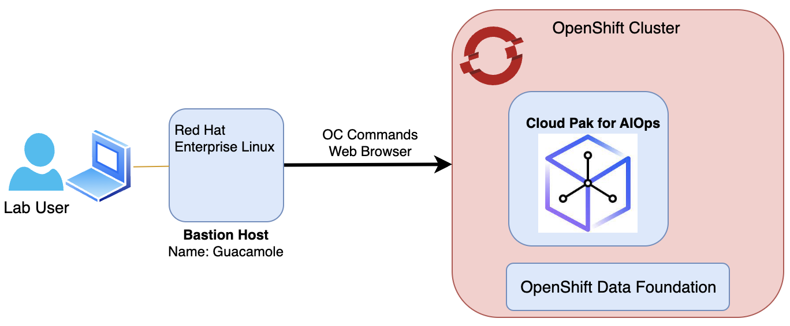

In this Lab, you will have access to one OpenShift cluster via a bastion virtual machine that has installed Red Hat Enterprise Linux (RHEL). Note
that inside OpenShift, the cluster has installed the Cloud Pak for AIOps. It also has installed the Red Hat OpenShift Data Foundation (ODF) which 
is a software-defined, container-native storage solution that provides storage classes that will be used 
by the Cloud Pak for AIOps to dynamically request storage. 

The following diagram describes the initial infrastructure for the Lab:

## 2.1: Requesting a Lab Environment

:::info
Follow
[these instructions](/waiops-tech-jam/labs/jam-in-a-box/#requesting-a-lab-environment)
for step by step guidance on requesting a new lab environment in IBM Tech Zone.
:::

Request Tech Zone environment:

- [Jam-in-a-Box: CP4WAIOps - Explore](https://techzone.ibm.com/my/reservations/create/64c2a0166c515100179d63e2)

## 2.2: Accessing your Lab Environment

:::info
Once you have received an eMail confirming that your environment is ready, follow
[these instructions](/waiops-tech-jam/labs/jam-in-a-box/#accessing-a-lab-environment)
for step by step guidance on accessing your lab environment in IBM Tech Zone.
:::

