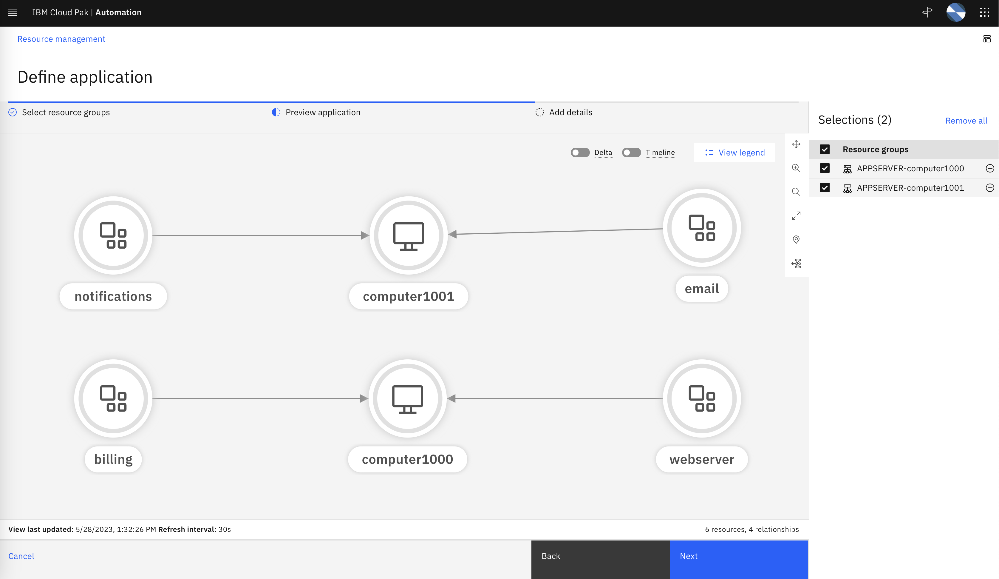

As we discussed in the **Introduction** chapter, Applications (or more generally, ‘services’), 
are the highest level of abstraction, considered the starting point for correlating the 
current environment and managing it in a more coarse-grained and logical way. 

## 5.1: Business Criticality

The business criticality of a resource provides an indication of how critical to the business
that resource is, and therefore how important any related problems might be. You can define the levels 
of business criticality for your applications, resource groups and resources, 
and then view a list of them on the Business criticality page.

Business Criticality plays a major factor in making sure that Policies reflect business priorities in terms
of what applications affect business operations the most. 
Policies can be defined in a way that considers the Business criticality as a factor to take an action
such as promoting Alerts to an Incident that IT Ops. personnel can see in the Incident View. 

:::note
The definition of **Policies** is outside the scope of this Lab, but additional information can be found in the product 
[**documentation**](https://www.ibm.com/docs/en/cloud-paks/cloud-pak-watson-aiops/3.7.1?topic=policies-creating).
:::

### Defining Business Criticality

Now we will define some business criticality values that can then be assigned to an application later in the Lab.

* From the burger menu in the top-left, navigate to: **Operate → Resource management**.
* In the **Resource management** page, click on the **Settings** gear icon in the top-right and select 
**Topology configuration**. 
* From the **Topology configuration** page, in the **Business criticality** card, select **Configure**. 

The Business criticality page is displayed listing any existing criticality definitions in a table format
by name, description, and criticality value, in sortable columns. For purpose of the Lab, we will use 
the predefined criticality values but note that you can custom define these values to better represent 
your specific IT environment. 

Click on **Start with presets**, inspect the preset values and click on **Add**. 

We have now defined three tiers of business criticality as shown below:

## 5.2: Applications

Applications, in this context, are simply a collection of resource groups that best represent business critical
application [TODO: rephrase] or service in terms of its composition given no one source or group 
is likely to have end-to-end visibility.

These applications, when combined with resource-level event correlation and grouping mechanisms, 
provide roll-up incident visibility. In other words, Alerts impacting resources will also surface
as impacting the Applications that those resources belong to. This improves overall visibility, 
allows the prioritization of incident resolution based on the business criticality.

### Defining Applications

You define and edit applications by adding (or removing) resource groups, icons and tags, 
assigning business criticality levels, and setting service disruption costs.

* From the burger menu in the top-left, navigate to: **Operate → Resource management**.
* In the **Resource management** page, click the **Define application** button in the top-right. 
* In the Define application page, we will select a subset of the resource groups defined in the previous 
chapter, that belong to our application. Lets select APPSERVER-computer1000, APPSERVER-computer1001 and 
ROUTER-router1 as shown below: 

* Click **Next** to preview the application. 

As we preview an application, we can use the checkbox to deselect resource groups on the right sidebar
in order to visualize the application without those groups. 

* In this preview step, we realize that we don't need the ROUTER-router1 resource group, so click on the (-) minus sign to remove
the ROUTER-router1 resource group from this application. You should be left with the topology preview as
shown below:

* Click **Next** to add additional details.
* Enter a name for the application, for example **Order Capture Backend**
* Set an icon for the application, using the drop-down list select the **backend** icon. This icon is used to identify the application 
resource type in the topology view of your applications.
* Mark the application as a favorite by clicking on the hart icon. 
* In the **Add tags** field, type **orderBackend** and select (Create new tag). Tags can be used to 
identify similar applications and to distinguish applications from other applications.
* In the **Business criticality** field, select **Tier 1**.
* In the Estimated cost per minute for service disruption, type 750. This numerical value, represents the 
estimated disruption cost (in local currency) for the business per minute if this application is down. 
This information is used on the **AIOps insights** dashboard.

You should see the application details as shown below: 

* Click **Define application**. 

Now the application is added to the list of all applications on the page, as shown below. Note that from this 
view we can see total number of resources, the active Incidents and Alerts related to the application.

 

#######################

**This concludes the Topology Lab**

#######################

