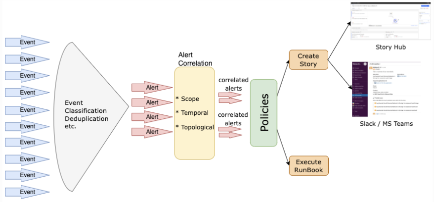

:::caution
This Lab has been tested only with the Cloud Pak for Watson AIOps v4.1.0 
:::

Welcome to the Cloud Pak for Watson AIOps Alert Correlation & Grouping Lab.
The following diagram describes the infrastructure available for the Lab:


:::note
- For any instructions that use the "oc" command (interacting with your
  cluster), use your "bastion" VM
:::


### Terms Definition
Lets define some key Cloud Pak for Watson AIOps concepts and terms that will help you understand the Lab:

**Events**: An event is a record containing structured data summarizing key attributes of an occurrence on a managed entity, which might be a network resource, some part of that resource, or other key element associated with your network, services, or applications. An event may or may not indicate something anomalous and is a point-in-time, immutable statement about the managed entity in question.

The Event *severity* range is  6: Critical, 5: Major, 4: Minor, 3: Warning, 2: Informational, 1: Indeterminate

**Alerts**: Alerts are created when one or more events indicate an anomalous condition. Alerts represent an ongoing anomalous condition against a single managed entity. Unlike events, alerts might evolve over time as the condition changes. Alerts have a start and an end time. The creation and evolution of alerts are informed by events. The Cloud Pak for Watson AIOps automatically correlates alerts to determine what alerts are likely to share a common cause.

The Alert *severity* range is the same as Events 6: Critical, 5: Major, 4: Minor, 3: Warning, 2: Informational, 1: Indeterminate.  
Alerts have *state* which can be Open, Clear, or Closed. Note that the Alert *state* can go from Clear back to Open if new related events arrive 
during the same time window. 

**Alerts Groups**: An alert group is a group of two or more alerts that Cloud Pak for Watson AIOps has correlated together because the underlying analytics have determined that these alerts belong together. Alerts can be added to an alert group because of one or more of these factors:

| Correlation Type      | Example |
| ----------- | ----------- |
| **Scope-based** groups: the alerts occur on a user defined scope.  | An administrator defines a ScopeID based on properties that define the scope for how alerts are grouped. Any alerts that match the scope and occur within a default time window are then automatically grouped together. An example would be where an alert storm occurs on the london145.acme.com server. All of the alerts in that storm will be grouped together as they match the alert.resource.location= london145.acme.com, and they occur within the default time window. These alerts are grouped into a scope-based subgroup.  |
| **Temporal groups:** The system continually analyzes past alerts to determine which alerts tend to frequently co-occur. When these alerts occur together again, they are correlated.      | A "Latency" alert on a server is regularly followed by a "Ping response time high" alert on that same server. These alerts are grouped into a temporal subgroup.       |
| **Topological groups**: the alerts occur on resources within a predefined section of your network topology.   | If there is a predefined section of the network that groups together a specific switch and all the nodes that depend on that switch, then any alerts occurring on that specific switch or the nodes connected to it are grouped together. These alerts are grouped into a topological subgroup.        |


**Incidents**: Incidents represent the context which is currently severely impacting IT Operations. This includes all alerts that are related to the incident ranked by probable cause and information about how the affected topology resources are related. The creation and evolution of incidents are informed by alerts. Incidents help build the understanding of the current situation and also can drive the remediation steps by suggesting runbooks that can help with the solution of the problem. 

Incidents are categorized by *priority* from 1 (highest) to 5 (lowest). 
Incidents have also *status* which can be Unassigned, In progress, On-hold, or Resolved. 

**Policies**: Policies are rules that contain a condition and a set of actions that can be manual or automated. They can be triggered to automatically promote events to alerts, reduce noise by grouping alerts into an Incident, and assign runbooks to remediate alerts. Each policy has an execution priority number which determines which policy runs first.

**Runbooks**: A runbook is a controlled set of automated and manual steps that support system and network operational processes. A runbook orchestrates all types of infrastructure elements, such as applications, network components, or servers. We can also use runbooks to document standard procedures that can be leveraged by IT operations.

**Actions**: Actions are the collection of several predefined steps into a single automated tested entity that can be shared by multiple runbooks. Actions improve runbook efficiency by encapsulating procedures and operations.


The following chart shows how all these terms are related:




### Normalized Event Schema

This is the normalized event schema for the Generic Webhook and Kafka Connection. In this Lab we will leverage the Generic Webhook. 

```json
{
    "$schema": "http://json-schema.org/draft-04/schema#",
    "title": "Normalized Event schema",
    "description": "Normalized Event for None mapping use case",
    "type": "object",
    "properties": {
        "sender": {
            "description": "Identifies the resource which sent this event. This may be the resource that is the subject of the event, or it may be some external system which is monitoring the subject.",
            "type": "object",
            "properties": {
                "service": {
                    "description": "The identifier of the service",
                    "type": "string"
                },
                "name": {
                    "description": "The descriptive name of the service",
                    "type": "string"
                },
                "type": {
                    "description": "Data source name. For examples, PagerDuty, Netcool/OMNIbus",
                    "type": "string"
                }
            },
            "required": [
                "service",
                "name",
                "type"
            ]
        },
        "resource": {
            "description": "Identifies the resource that is the subject of this event. This is made up of multiple fields that describe the resource. There are a set of standard fields which should be used where applicable, but additional fields may be set.",
            "type": "object",
            "properties": {
                "name": {
                    "description": "The name of the resource. For example, myhost.example.com",
                    "type": "string"
                },
                "hostname": {
                    "description": "The hostname of the resource.",
                    "type": "string"
                },
                "type": {
                    "description": "The type of resource. For example, host",
                    "type": "string"
                },
                "ipaddress": {
                    "description": "The IP address of the resource.",
                    "type": "string"
                },
                "location": {
                    "description": "The location of the resource. For example, Dallas 10",
                    "type": "string"
                }
            },
            "required": [
                "name",
                "hostname",
                "type",
                "ipaddress",
                "location"
            ]
        },
        "type": {
            "description": "Indicates whether the source alert is a problem or a resolution along with its classification.",
            "type": "object",
            "properties": {
                "classification": {
                    "description": "Description of the type of the event. E.g. Utilization, System status, Threshold breach",
                    "type": "string"
                },
                "eventType": {
                    "description": "String description of whether the event is 'problem' or 'resolution'. Note: Only these two values are permitted.",
                    "type": "string"
                }
            },
            "required": [
                "classification",
                "eventType"
            ]
        },
        "severity": {
            "description": "Indicates the event severity level, which indicates how the perceived capability of the managed object has been affected.",
            "type": "integer",
            "minimum": 0,
            "maximum": 6
        },
        "summary": {
            "description": "A human-readable description of the event.",
            "type": "string"
        },
        "occurrenceTime": {
            "description": "The time at which this event occurred. (ISO format: yyyy-mm-ddThh:mm:ss.SSSZ)",
            "type": "string",
            "pattern": "\\d{4}-[01]\\d-[0-3]\\dT[0-2]\\d:[0-5]\\d:[0-5]\\d(?:\\.\\d+)Z"
        },
        "expirySeconds": {
            "description": "The number of seconds before the event should automatically expire. A value of zero indicates that there is no expiration.",
            "type": "integer",
            "minimum": 0
        }
    },
    "required": [
        "sender",
        "resource",
        "type",
        "severity",
        "summary",
        "occurrenceTime",
        "expirySeconds"
    ]
}
```

**Sample Event**

This is a sample event based on the previous schema:

```json
{
    "sender": {
        "service": "Mun SelfMonitoring",
        "name": "Mun SelfMonitoring",
        "type": "Datadog Observability"
    },
    "resource": {
        "name": "AGG_P",
        "hostname": "samplehost.ibm.com",
        "type": "host",
        "ipaddress": "10.1.96.24",
        "location": "Dal10"
    },
    "type": {
        "classification": "CEASelfMonitoring",
        "eventType": "problem"
    },
    "severity": 6,
    "summary": "Web Service - getTransferAmount() timeout",
    "occurrenceTime": "2023-05-05T14:50:38.000Z",
    "expirySeconds": 0
}
```

### Event Deduplication

Occurrences of the same event are deduplicated into a single alert instance. The default correlation policy 
constructs a **deduplication key** for events from the following elements:

    {{ event.resource }}-{{ event.type.classification }}-{{ event.type.condition }}

When the same event occurs multiple times (the resource, classification, and condition fields are the same), then deduplication increments the event count of the current alert instance to show how many times the event occurred.

Problem events (type.eventType = problem) create an alert (if one does not exist). Meanwhile, resolution events (type.eventType = resolution) do not become alerts and are not visible in the Alert Viewer. They clear an alert if one exists and ignore if none exists. For a resolution event to clear a problem alert instance, it must have the same deduplication key as the problem event that the alert was created from. Also, it must have occurred after the last problem event that contributed to the alert.

#### Type fields and alert correlation

Since the same alert arises for all events with same type fields, these fields must clearly indicate the specific fault condition and have separate values for different conditions. The resource fields are important for both alert correlation and topology lookups. Therefore, they must accurately describe the resource that exhibits the fault condition. By default, alerts with the same resource.name field that occur within 15 minutes of each other are correlated together.

Additionally, all resource fields are used to look up each alert in the topology. Therefore, where possible one or more of these fields must be in the same form as the match tokens for the corresponding topology resource.

Alerts are also correlated by using temporal correlation. Temporal correlation looks for historic patterns of co-occurrence and uses this information to predict future correlation. This correlation relies on consistent value of the type fields over time for the same conditions against the same resources. Therefore, the values of these fields must be deterministic.


### Lab Content

In this Lab, we will focus on different capabilities that help IT Operations personnel 
with event and alert noise reduction:

* How to load sample event and alert data using a generic webhook and kafka topic
* Scope-based alert correlation
* Temporal alert correlation
* Topological alert correlation

