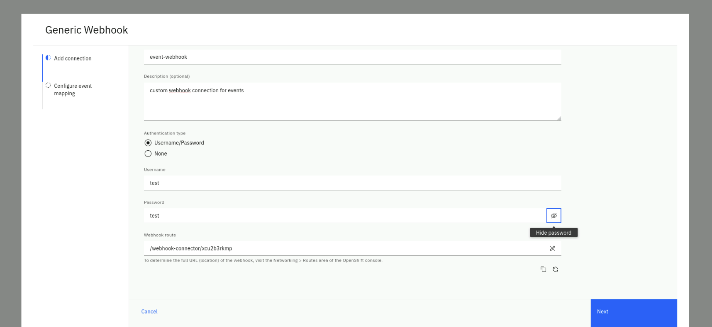
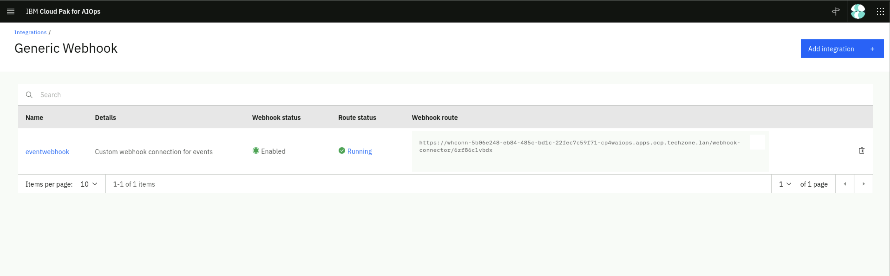

In this section, we will configure a generic Webhook connection. If a dedicated connection is 
not available for a data source, you can use the generic webhook connection to provide an endpoint
for applications to send JSON format events to the Cloud Pak for AIOps via HTTP POST requests. 
You can also include a *JSONata* file to map incoming JSON payloads to the Cloud Pak for AIOps 
event data scheme. The webhook endpoint is exposed via an OpenShift edge route that includes a unique, 
automatically-generated ID.

Also in this section, we will create a couple of bash scripts. The first script will be used to load data
via the webhook connection and the second script will be used to load data into a kafka topic. 
The usage of these two scripts will become more clear as you move into the different sections of the Lab. 


## 4.1: Creating a Webhook Connection

Log into the Cloud Pak for AIOps: 
* from the burger menu in the top-left navigate to: **Define → Data and tool connections**
* from the **Data and tool connections** page click on **Add connection**
* from the **Add connections** page search for **webhook**, click on the
 **Generic Webhook** tile and click **Connect**. 

Fill the **Add connection** form with these values: 

* Name: Event-Webhook
* Description: custom webhook connection for events
* Authentication type: *select Username/Password*
* Username: pick a username (e.g. test)
* Password: pick a password (e.g. test)

Your complete form should look like this (note that your route will be different)



Click **Next**. 

In the **Configure event mapping** form:

* Confirm the **Enable webhook** slider is green (On)
* The webhook connector leverages JSONata which is a simple expression language to transform JSON data. 
You can read about JSONata [here](https://jsonata.org/). In this Lab, we provide the JSON event format
as expected by the Cloud Pak for AIOPs, therefore the JSONata is just a "passthrough". In a real scenario, 
you will find this mapping capability very useful. Enter the following JSONata configuration:

```json
{
   "sender":{
      "service": sender.service,
      "name": sender.name,
      "type": sender.type
   },
   "resource":{
      "name": resource.name,
      "hostname": resource.hostname,
      "type": resource.type,
      "service": resource.service,
      "ipaddress": resource.ipaddress,
      "location": resource.location
   },
   "type":{
      "classification": type.classification,
      "eventType": type.eventType
   },
   "severity": severity,
   "summary": summary,
   "occurrenceTime": occurrenceTime,
   "expirySeconds": expirySeconds
}
```

Click on **Done**.
You will see a new webhook created as shown below:




## 4.2: Create the Webhook Event Loader Script

We will create a simple bash script that will read an event file and will call the webhook 
URL or route with every event as a parameter. Create a new file called *event-load-webhook.sh*, paste 
this script below and assign the WEBHOOK_URL value with the webhook route of the webhook 
you just created in the previous step.

```sh
#!/bin/bash

# Check if a file is provided as a parameter
if [ $# -eq 0 ]; then
  echo "Please provide an event file as a parameter."
  exit 1
fi

WEBHOOK_URL='<insert the webhook URL here>'
# Note below there is a colon character ':' between the username and password. E.g. test:test
AUTH=<insert your chosen user name>:<insert your chosen password>

# Read the event file line by line and submit the event via webhook
while IFS= read -r line; do
  curl -X POST -u $AUTH --insecure -H 'Content-Type: application/json' $WEBHOOK_URL -d "$line"
  echo ""
done < "$1"
```

## 4.3: Create a Kafka Event Loader Script

Finally, we will create another simple bash script that will take an event or alert file and a 
kafka topic as parameters and it will load this data into the kafka topic. 
Create a new file called *event-load-kafka.sh* and paste this script below.

```sh
#!/bin/bash

# Check parameters
if [ $# -lt 2 ]; then
  echo "Please provide an event file and a kafka topic as parameters"
  exit 1
fi

export EVENTS_FILE="$1"
export KAFKA_TOPIC="$2"

oc project cp4waiops
oc extract secret/iaf-system-cluster-ca-cert --keys=ca.crt --to=- > ca.crt
export sasl_password=$(oc get secret cp4waiops-cartridge-kafka-auth-0 --template={{.data.password}} | base64 --decode)
export BROKER=$(oc get routes iaf-system-kafka-bootstrap -o=jsonpath='{.status.ingress[0].host}{"\n"}'):443

kcat \
-X debug=msg \
-X security.protocol=SASL_SSL \
-X ssl.ca.location=ca.crt \
-X sasl.mechanisms=SCRAM-SHA-512 \
-X sasl.username=cp4waiops-cartridge-kafka-auth-0 \
-X sasl.password=$sasl_password \
-X enable.ssl.certificate.verification=false \
-b $BROKER \
-P \
-t $KAFKA_TOPIC \
-l $EVENTS_FILE
```