Scope-based grouping is very powerful and provides significant event reduction by virtue of grouping alerts, 
thereby effectively reducing the "noise" presented to IT operations personnel.

Scope-based alert grouping is based on a basic premise that alerts occurring at 
 "around the same place", and "about the same time" are likely related.

For example, a hardware failure causes the storage service to fail. This creates a failure
of a database service which impact web services that leverage this database. Assuming we have
the right observability in place, there will be anomalous events coming from the database and from
the web service, around the same time. In this case, the scope might be a common application or service name.

The objective here is to be able to group alerts based on common properties and time of occurrence to 
identify when issues might be related. When related alerts are grouped based on their scope, 
you can view the details in the Alert Viewer.

The default scope-based policy in Cloud Pak for AIOps is a correlation on alert.resource.name 
constrained by a rolling window of 15 minutes. This will become more clear in the next steps. 


## 5.1: Create a Scope-based Event Grouping Policy 

Scope-based grouping enable operations teams to provide local knowledge on how alerts should be grouped
by defining scope-based grouping policies. 

We will play the role of an SRE (Site Reliability Engineer) that is responsible for an application that is deployed independently in two 
public cloud regions, US-SOUTH and US-EAST. We have observability tools deployed that monitor each application stack
layer including databases (DB2), application servers (Liberty) and web services (APIs) on top. The challenge is that alerts
related to each stack layer are not correlated despite the fact that belong to the same overall application stack.

To facilitate your SRE work, you will create a new scope-based policy that will group alerts that have 
the common resource value alert.resource.application and that belong to the two cloud regions US-SOUTH and US-EAST.
Also, we want the alert grouping to happen within a 15 minute rolling window. In other words, alerts separated by more than 
15 minutes will not be grouped together. 

We will first review the default scope-based policies that come with the product. Log into the Cloud Pak for AIOps:

* From the burger menu in the top-left navigate to: **Operate → Automations**
* From the **Automations** page, we will explore the existing scope-based policies that come out-of-the-box
    * Click on **Filter** icon on the left, check **scope-based** and click **Apply**

* 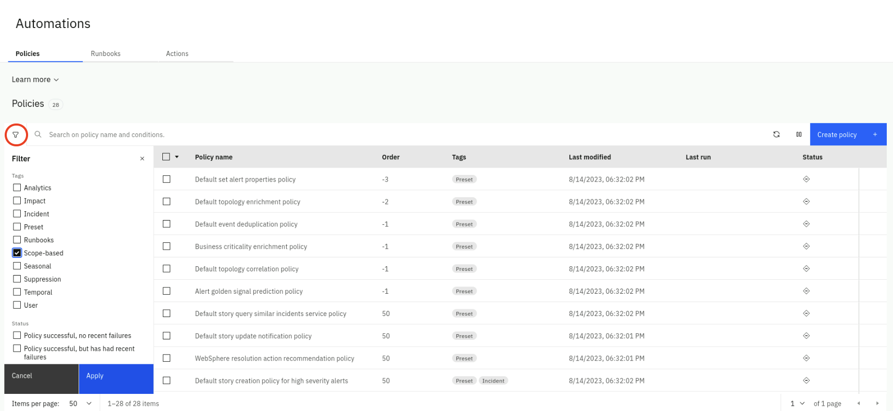
    * Note that there are two scope-based policies already defined
    * Select on the **Policy name** of the first policy
* 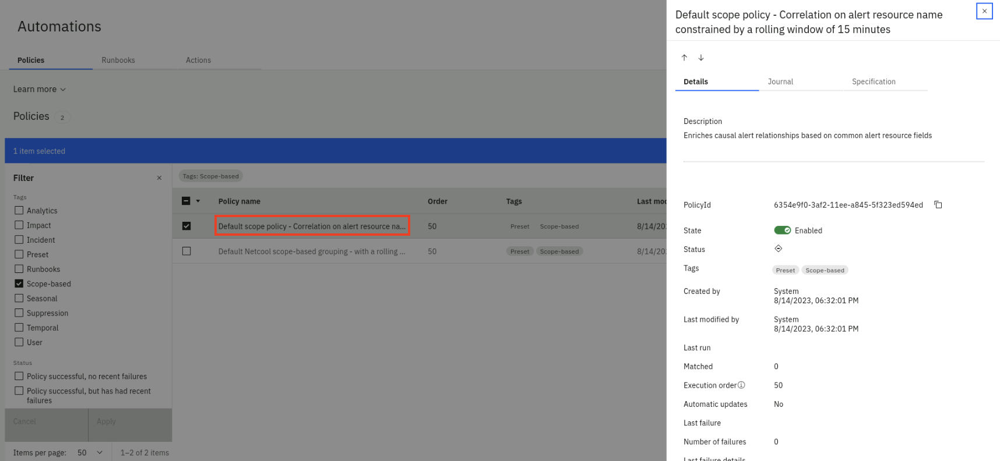    
    * On the right-side slider, click on the **Specification** tab and explore the **Policy action** rule logic
* 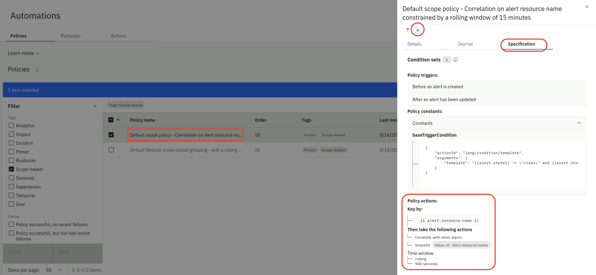    
    * Now click on the down-arrow and explore the **Policy action** rule logic of the second scope-based policy
    * Click on the X to close the slider

Now we will create a new scope-based policy:


* From the same **Automations** page, select the **Policies** tab and click the **Create policy** button
* From the **Policy templates** page, select the **Group alerts based on scope** tile
* From the **Group alerts based on scope** page: 
    * Make sure the **Policy** is **Enabled** (green)
    * Under **Policy details**, set the **Policy name** as "Group Alerts coming from 2 Locations by Location-Application"
    * Change the **Execution order** slider value to **40**
    * Under Policy triggers, check **Before an alert is created**
    * Under **Condition sets**:
        * click on **Add condition** and select **Alert property**
        * 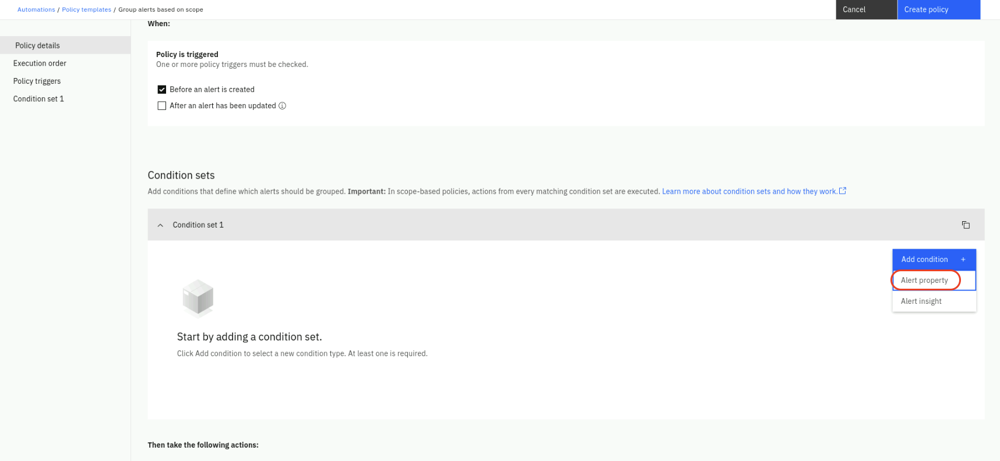  
        * Leave **AND** selected
        * For **Property** select **alert.resource.location**
        * For **Operator** select **contains**
        * For **Matches** select **any of**
        * For **Value** type (use uppercase in both) US-SOUTH and select String: US-South, type US-EAST and select String: US-EAST
    * Under **Create a scope-based grouping**:
        * select **resource.location**
        * type the colon character **:** and select **String: :**
        * select **resource.application**
        * Your final value for ScopeID should be 
            * **Value of: alert.resource.location String: : Value of: alert.resource.application** 
            * as shown below
            * 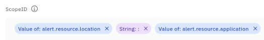 

    * Under **Time window**:
        * For time period field type 900. This represents 900 seconds (15 min)
        * Under **Type**, select **Rolling**. This means that alerts will be grouped as long as they are not separated by more than 15 min

Your new policy should look like the charts below:

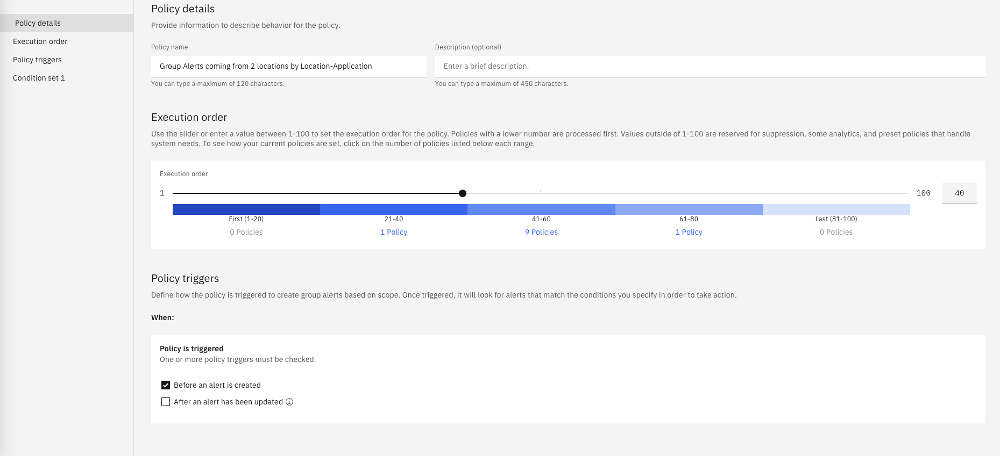
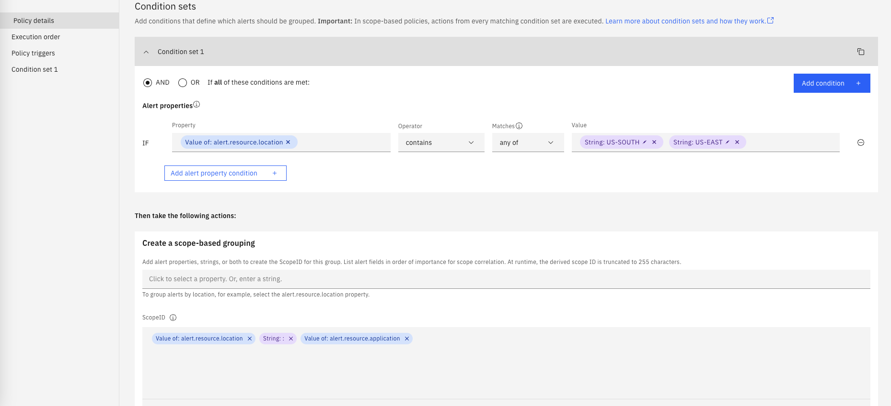
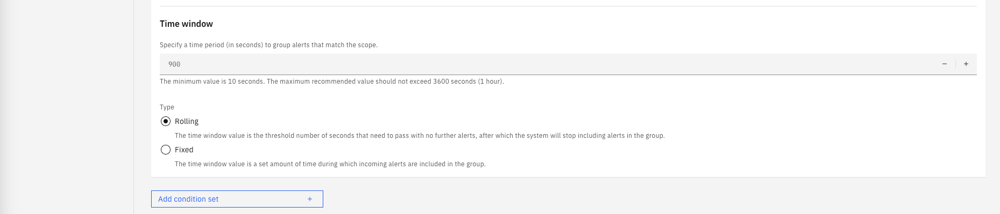

* Finally, click on **Create Policy** on the top-right.

Now you should have 3 scope-based policies. We will first submit events with all scope
policies disabled and later we will resubmit the same events with the new policy enabled.
Make sure to **disable all three policies** as shown below. You may be asked to confirm the action
(the values in the **Status** column may be different).

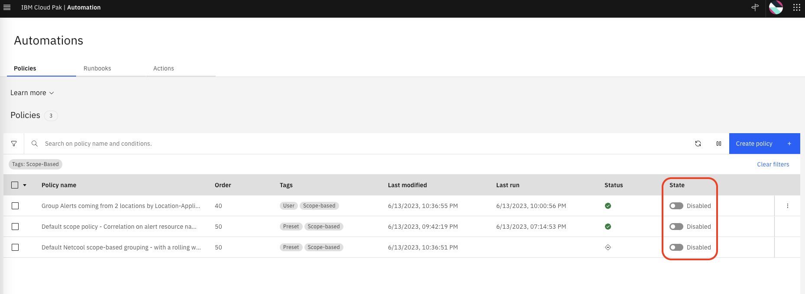 


## 5.2: Submit Events with the scope-based Policy Disabled

Create a new file called *scope_events.json* by running the following command in the **Terminal** window to open the text editor,
 **copy** the event data below, **paste** it into the text editor, 
click on the **Save** button in the text editor and **close** the editor window (click on the X). 

```
gedit scope_events.json
```


```
{ "sender":{ "service":"Zabbix Middleware Monitoring", "name":"US-SOUTH CEA SelfMonitoring @AGG_P", "type":"Zabbix" }, "resource":{ "application":"NetCash", "name":"DB2server2", "hostname":"DB2server2.company.com", "type":"host", "ipaddress":"10.1.96.24", "location":"US-SOUTH" }, "type":{ "classification":"System status", "eventType":"problem" }, "severity":3, "summary":"/dev/sda1 is 70% full", "occurrenceTime":"2023-05-05T14:40:38.000Z", "expirySeconds":0 }
{ "sender":{ "service":"Zabbix Middleware Monitoring", "name":"US-EAST CEA SelfMonitoring @AGG_P", "type":"Zabbix" }, "resource":{ "application":"NetCash", "name":"DB2server2", "hostname":"DB2server2.company.com", "type":"host", "ipaddress":"10.1.96.28", "location":"US-EAST" }, "type":{ "classification":"System status", "eventType":"problem" }, "severity":5, "summary":"/dev/sda1 is 90% full", "occurrenceTime":"2023-05-05T14:45:20.000Z", "expirySeconds":0 }
{ "sender":{ "service":"Zabbix Middleware Monitoring", "name":"EU-CENTRAL CEA SelfMonitoring @AGG_P", "type":"Zabbix" }, "resource":{ "application":"NetCash", "name":"DB2server2", "hostname":"DB2server2.company.com", "type":"host", "ipaddress":"10.1.96.29", "location":"EU-CENTRAL" }, "type":{ "classification":"System status", "eventType":"problem" }, "severity":6, "summary":"DB2ERR=667 THE CLUSTERING INDEX FOR A PARTITIONED TABLESPACE CANNOT BE EXPANDED", "occurrenceTime":"2023-05-05T14:46:10.000Z", "expirySeconds":0 }
{ "sender":{ "service":"Zabbix Middleware Monitoring", "name":"US-SOUTH CEA SelfMonitoring @AGG_P", "type":"Zabbix" }, "resource":{ "application":"NetCash", "name":"Liberty Server 1", "hostname":"liberty1.company.com", "type":"host", "ipaddress":"10.1.96.30", "location":"US-SOUTH" }, "type":{ "classification":"System status", "eventType":"problem" }, "severity":4, "summary":"PH31839: LIBERTY 20.0.0.3 IS NOT ABLE TO CONNECT TO DB2 AFTER 3 ATTEMPTS", "occurrenceTime":"2023-05-05T14:47:22.000Z", "expirySeconds":0 }
{ "sender":{ "service":"Zabbix Middleware Monitoring", "name":"US-EAST CEA SelfMonitoring @AGG_P", "type":"Zabbix" }, "resource":{ "application":"NetCash", "name":"Liberty Server 1", "hostname":"liberty1.company.com", "type":"host", "ipaddress":"10.1.96.33", "location":"US-EAST" }, "type":{ "classification":"System status", "eventType":"problem" }, "severity":5, "summary":"exception=The DB server rejected the connection. DSRA0010E: SQL State = 08004, Error Code = -99,999, id=jdbc/database", "occurrenceTime":"2023-05-05T14:48:55.000Z", "expirySeconds":0 }
{ "sender":{ "service":"Zabbix Middleware Monitoring", "name":"EU-CENTRAL CEA SelfMonitoring @AGG_P", "type":"Zabbix" }, "resource":{ "application":"NetCash", "name":"Liberty Server 1", "hostname":"liberty1.company.com", "type":"host", "ipaddress":"10.1.96.01", "location":"EU-CENTRAL" }, "type":{ "classification":"System status", "eventType":"problem" }, "severity":5, "summary":"exception=The DB server is unresponsive. DSRA0010E: SQL State = 099, Error Code = -77, id=jdbc/database", "occurrenceTime":"2023-05-05T14:49:55.000Z", "expirySeconds":0 }
{ "sender":{ "service":"Instana Application Monitoring", "name":"US-SOUTH API Layer SelfMonitoring", "type":"Instana" }, "resource":{ "application":"NetCash", "name":"NetCash Services", "hostname":"netcash-api.company.com", "type":"host", "ipaddress":"10.1.96.66", "location":"US-SOUTH" }, "type":{ "classification":"API availability", "eventType":"problem" }, "severity":5, "summary":"API: cash-transfer web service time out ", "occurrenceTime":"2023-05-05T14:50:13.000Z", "expirySeconds":0 }
{ "sender":{ "service":"Instana Application Monitoring", "name":"US-EAST API Layer SelfMonitoring", "type":"Instana" }, "resource":{ "application":"NetCash", "name":"NetCash Services", "hostname":"netcash-api.company.com", "type":"host", "ipaddress":"10.1.96.69", "location":"US-EAST" }, "type":{ "classification":"API availability", "eventType":"problem" }, "severity":5, "summary":"API: account-balance web service time out ", "occurrenceTime":"2023-05-05T14:51:18.000Z", "expirySeconds":0 }
```

Now lets submit the events via the webhook script created in the previous section by running the following command in the **Terminal** window:

```
bash event-load-webhook.sh scope_events.json
```

* From the burger menu in the top-left navigate to: **Operate → Incidents and alerts** and click on the **Alerts** tab
* Click on the **Refresh alerts** icon on the right, to see the alerts we just loaded.
* Lets add some color to this page:
    * Click on the **gear** icon in the right and select **User preferences**.
    * From the **User preferences for alerts** pop-up, click on the **Row coloring** slider to On (green).
    * Click on **Save**.

Note that all the Alerts are reflected in this Alerts view (now with color) but there is no grouping done
as shown below:

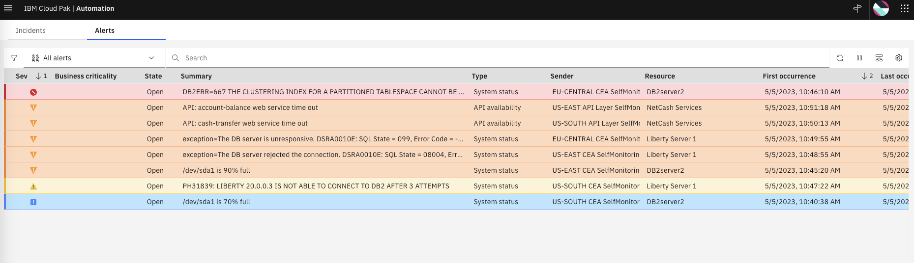 

Before resubmitting events again, we will clear all these Alerts in the view:

* Select all the Alerts, right-click and select **Clear**.
* The Alerts will change state from **Open** to **Clear** and eventually to **Closed**. 
* Wait 2-3 minutes until the Alert view is empty. Click the **Refresh** icon to see changes.


## 5.3: Submit Events with the scope-based Policy Enabled

We will now confirm that the scope-based correlation policy is actually working as expected, by
enabling the policy and resubmitting the events.

* From the burger menu in the top-left navigate to: **Operate → Automations**
* From the **Automations** page, click on **Filter** icon on the left, check **scope-based** and click **Apply** (this may be already done).
* Enable the scope-based policy "Group Alerts coming from 2 Locations by Location-Application" that you created in the previous step.

You should see one policy enabled, as shown below:

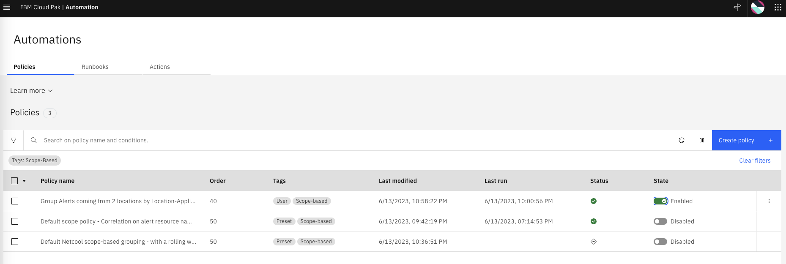 

Now lets submit the events again via the webhook script created in the previous section by running the following command from the **Terminal** window

```
bash event-load-webhook.sh scope_events.json
```

Lets see the Alerts view again:

* From the burger menu in the top-left navigate to: **Operate → Incidents and alerts** and click on the **Alerts** tab

Note that now, the Alerts are grouped by Location and Application. Note also that 
Alerts from the region EU-CENTRAL are not grouped as shown below.

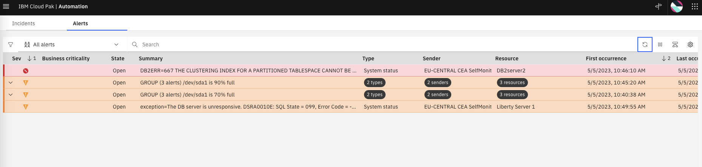 

Expand the groups by clicking on the "twisty" icon on the left for each group, as shown below

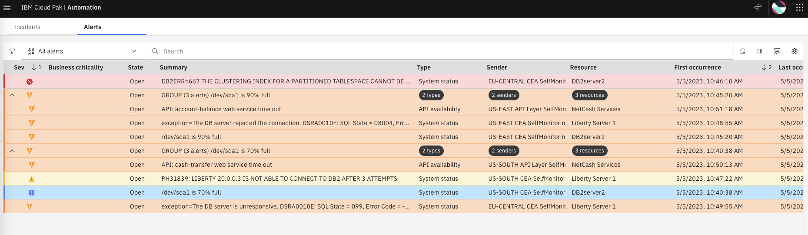 

Scroll to the right and check the view correlation icon on the top-right to create a new column called **Correlation**. You will see 
that the grouped Alerts have the scope correlation icon in each row.

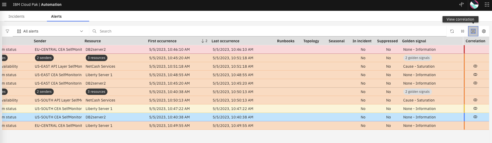 


## 5.4: Recap

We created a new **scope-based correlation policy** that groups alerts within a 15 minute rolling window by alert.resource.location 
and alert.resource.application and where the location is one of two cloud regions US-SOUTH and US-EAST.


Finally, we will clear all these Alerts in the view before we move to the next section

* Select each group of Alerts, right-click and select **Clear**. Do the same with the ungrouped Alerts.
* The Alerts will change state from **Open** to **Clear** and eventually to **Closed**. 
* Wait 2-3 minutes until the Alert view is empty. Click the **Refresh** icon to see changes.

Also, lets disable the scope policy so it does not interfere with the rest of the Lab:

* From the burger menu in the top-left navigate to: **Operate → Automations**
* From the **Automations** page, if there is no **Scope-based** filter set already, click on Filter icon on the left, check **Scope-based** and click **Apply**.
* Click on the slider on the policy that is **Enabled** in green to change it to **Disabled** in grey as shown below

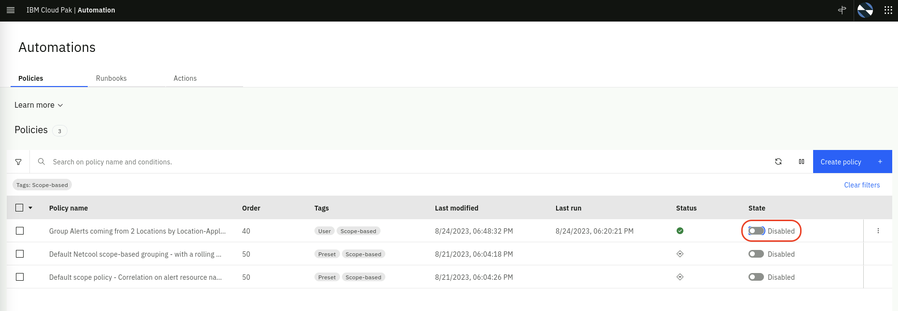 

