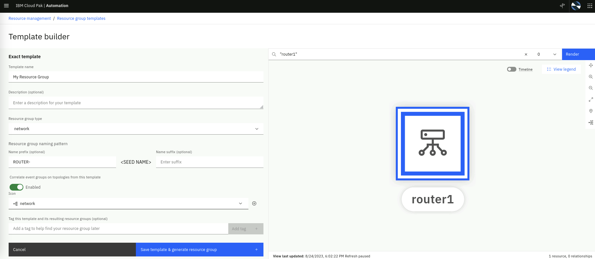
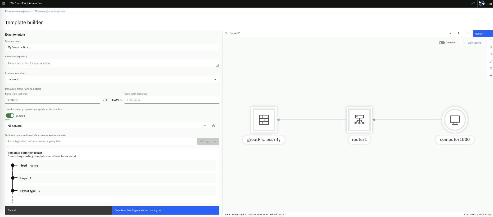

This AI algorithm is an unsupervised learning algorithm that groups alerts based
on the topology resource groups in which those alerts occur. For example, if you
have a resource group made up of all the resources within a given Kubernetes
namespace, then any alerts on pods, microservices, or other resources in that
namespace will be grouped together in a single topological alert group.

Topological alert grouping helps you understand when alerts are connected based
on their topology, providing valuable context information for why related alerts
might occur together. This algorithm is enabled by default so when related
alerts are grouped based on their topology, Site Reliability Engineers (SREs)
and other users responsible for application and service availability will be
able to view the details of the alert in the context of the topology resources
that are impacted.

## 7.1: Validate the Absence of Correlation

First, we will load a set of events to validate that there is no correlation
whatsoever for the alerts created from these events.

Create a new file called _topology-events.json_ by running the following command
in the Terminal window to open the text editor, **copy** the event data below,
**paste** it into the text editor, click on the **Save** button in the text
editor and **close** the editor window (click on the X).

```
gedit topology-events.json
```

```
{ "sender":{ "service":"Zabbix Middleware Monitoring", "name":"US-SOUTH CEA SelfMonitoring @AGG_P", "type":"Zabbix" }, "resource":{ "application":"eCom2 web server", "name":"computer1000", "hostname":"computer1000.company.com", "type":"host", "ipaddress":"10.1.96.24", "location":"US-SOUTH" }, "type":{ "classification":"System status", "eventType":"problem" }, "severity":3, "summary":"CPU at 80% utilization", "occurrenceTime":"2023-05-05T14:40:38.000Z", "expirySeconds":0 }
{ "sender":{ "service":"Zabbix Middleware Monitoring", "name":"US-SOUTH CEA SelfMonitoring @AGG_P", "type":"Zabbix" }, "resource":{ "application":"eCom2 api layer", "name":"router1", "hostname":"", "type":"device", "ipaddress":"10.1.96.28", "location":"US-SOUTH" }, "type":{ "classification":"System status", "eventType":"problem" }, "severity":5, "summary":"Unscheduled device restart. Review log files", "occurrenceTime":"2023-05-05T14:45:20.000Z", "expirySeconds":0 }
{ "sender":{ "service":"Zabbix Middleware Monitoring", "name":"US-SOUTH CEA SelfMonitoring @AGG_P", "type":"Zabbix" }, "resource":{ "application":"eCom2 security layer", "name":"greatfirewallofsecurity", "hostname":"", "type":"device", "ipaddress":"10.1.96.29", "location":"US-SOUTH" }, "type":{ "classification":"System status", "eventType":"problem" }, "severity":6, "summary":"Unable to load firewall rules after reboot", "occurrenceTime":"2023-05-05T14:46:10.000Z", "expirySeconds":0 }
```

Now lets submit the events via the webhook script created in the previous
section by running the following command from the **Terminal** window:

```
bash event-load-webhook.sh topology-events.json
```

- From the burger menu in the top-left navigate to: **Operate → Alerts**
- Click on the **Refresh alerts** icon on the right

Now we can see that the three alerts are independent from each other and not
correlated. Also, if you click on the **View correlation** icon in the
top-right, the **Correlation** column shows no correlation information for these
alerts.


Lets clear these alerts before we create topology resources and test the
topological correlation. Select all the alerts, right-click and select
**Clear**. Lets move to the next step in the Lab, the alerts will disappear
after 2-3 minutes

## 7.2: Creating Topology Resources

As we have discussed before, topological alert correlation requires the
definition of topology groups and to create these groups, first we need to
create topology resources.

In a real-world scenario, it is likely that you would be using a number of
off-the-shelf Topology Observers to get your topology data from your
environment. It is also likely that you would also leverage the File or REST
Topology Observers either to ingest data for which an off-the-shelf Topology
Observer doesn't exist, or to manually create relationships between Resources in
your topology for which there is no source.

In this scenario, we will have one set of topology data that represents
**physical infrastructure** and we will load this topology using a File Topology
Observer.

Create a file called **infrastructure.txt** with the following content:

Create a new file called _infrastructure.txt_ by running the following command
in the Terminal window to open the text editor, **copy** the topology data
below, **paste** it into the text editor, click on the **Save** button in the
text editor and **close** the editor window (click on the X).

```
gedit infrastructure.txt
```

```sh
V:{"_operation":"InsertReplace","uniqueId":"379177a8-0a6a-4068-817c-d6d6e870437e","matchTokens":["379177a8-0a6a-4068-817c-d6d6e870437e","router1"],"tags":["WAIOpsDemo"],"name":"router1","entityTypes":["router"],"_references":[{"_toUniqueId":"7598a194-27a0-4d0b-9c49-cbc0070c99c9","_edgeType":"uses"}]}
V:{"_operation":"InsertReplace","uniqueId":"9c1f90e0-7dc4-40d8-8721-40ea2f3af453","matchTokens":["9c1f90e0-7dc4-40d8-8721-40ea2f3af453","Intel"],"tags":["WAIOpsDemo"],"name":"Intel","entityTypes":["cpu"],"_references":[]}
V:{"_operation":"InsertReplace","uniqueId":"222-9c1f90e0-7dc4-40d8-8721-40ea2f3af453","matchTokens":["222-9c1f90e0-7dc4-40d8-8721-40ea2f3af453","AMD"],"tags":["WAIOpsDemo"],"name":"AMD","entityTypes":["cpu"],"_references":[]}
V:{"_operation":"InsertReplace","uniqueId":"7598a194-27a0-4d0b-9c49-cbc0070c99c9","matchTokens":["7598a194-27a0-4d0b-9c49-cbc0070c99c9","greatFireWallOfSecurity"],"tags":["WAIOpsDemo"],"name":"greatFireWallOfSecurity","entityTypes":["firewall"],"_references":[]}
V:{"_operation":"InsertReplace","uniqueId":"974d1788-1312-4151-8a62-73fa1854e807","matchTokens":["974d1788-1312-4151-8a62-73fa1854e807","computer1000"],"tags":["WAIOpsDemo"],"name":"computer1000","entityTypes":["computer"],"_references":[{"_toUniqueId":"379177a8-0a6a-4068-817c-d6d6e870437e","_edgeType":"connectedTo"},{"_toUniqueId":"9c1f90e0-7dc4-40d8-8721-40ea2f3af453","_edgeType":"contains"},{"_toUniqueId":"222-9c1f90e0-7dc4-40d8-8721-40ea2f3af453","_edgeType":"contains"}]}
V:{"_operation":"InsertReplace","uniqueId":"5c6f968a-2006-4b43-96b5-dd53df6b0afb","matchTokens":["5c6f968a-2006-4b43-96b5-dd53df6b0afb","steve"],"tags":["WAIOpsDemo"],"name":"steve","entityTypes":["person"],"_references":[{"_toUniqueId":"974d1788-1312-4151-8a62-73fa1854e807","_edgeType":"uses"}]}
```

The pseudo JSON format in this topology file is the format expected by the File
Observer, and contains topology directives, one per line.

:::note

Other format information can be found in the
[**documentation**](https://www.ibm.com/docs/en/cloud-paks/cloud-pak-aiops/4.8.1?topic=jobs-file-observer)

:::

#### Creating a File Topology Observer

We will create a file topology observer to load the topology file we just
created.

Log into the Cloud Pak for AIOps:

- from the burger menu in the top-left navigate to: **Define → Integrations**
- from the **Integrations** page, click on **Add integration**
- from the **Add integrations** page, under **Category** click on **Topology**
  then search for **File** tile. Click on the **File** tile and select **Get
  started** on the right


In the **New observer job: File** form, fill the Unique ID field as
"infrastructure". Keep the **File Mode** as **Upload local file**. Click on
**Drag and drop file here or click to upload** and from the pop-up file
selection window, find the **infrastructure.txt** file under **sysadmin/lab**.

Leave the **Provider** field unchanged, as shown below:


Click the **Save** button.

The File Observer job will run the moment it is saved. After you have done this,
your **Observer jobs** page should look like the one below. You can verify that
your job ran successfully by confirming the **Ready** status for each job:


## 7.3: Creating a Topology Resource Group

Now that we have topology resources, we will create a topology group using the
"exact" topology group template. This template is useful for when you have a
specific collection of resources that are unique in your environment that may be
of particular importance. Perhaps you want to be able to find this group of
resources quickly and easily, or visualize them on the screen.

- From the burger menu in the top-left, navigate to: **Operate → Resource
  management**.
- In the **Resource management** page, click on the **Resource group templates**
  icon in the top-right.


- In the **Resource group templates** page, click on **Create a new template**,
  select **Exact template** and click **Start**.


You will be presented with a **Template builder** page. From here, use the
following steps to configure a new exact template:

- Set the **Template name** as **My Resource Group**.
- Skip the optional **Description**.
- Choose the **Resource group type: network**
- Under **Resource group naming pattern**, in the **Name prefix** field type
  **ROUTER-**
- Enable **Correlate event groups on topologies from this template**. This is
  actually the objective of this Lab section after all. We will correlate events
  that affect the resources in the same topology group. This template will
  create such group of topology resources.
- In the **Search for a resource to get started** on the right, type **router1**
  and hit Enter
- Choose **router1** from the list of resources. Your screen should look like
  this



- On the top-right, change the view to 1 hop and click **Render**


In summary, we have selected 3 resources that will be part of a topology
resource group, as render in the view. Your form should look like this:



- Finally, click **Save template & generate resource group**

Click on **Resource group templates** in the top-left.


In the **Resource group templates** screen, you will see your new template:


Click on **Resource management** in the top-left and click on the **Resource
groups** tab:


If you click on the name **ROUTER-router1**, you will be able to view the
topology group, which consists of 3 resources:


## 7.4: Validate Topological Correlation

Now we have a group of topology resources that we can use to validate
topological correlation. We will reload the same set of events. Because these
events impact resources we have in our topology map and there is a resource
group that clump these resources together, these alerts will be correlated.

From the **Terminal** window, lets submit again the events via the webhook
script created in the previous section by running the following command from the
**Terminal** window:

```
bash event-load-webhook.sh topology-events.json
```

Lets verify how the alerts are shown in the topology view:

- From the burger menu in the top-left navigate to: **Operate → Resource
  management**.
- From the **Resource management** page, click on the **Resource groups** tab.

Now we can see the three alerts in the **Resource alerts** column, as shown
below:


Click on the resource group **ROUTER-router1** to see the resource details. Now
we can see the three resources, each with one alert. Click on the **Topology
activity** on the bottom to show the alert severity breakdown over time.


Lets validated that these alerts are indeed correlated.

- From the burger menu in the top-left navigate to: **Operate → Alerts**

Now we can see that the three alerts have been correlated under a single group.


Click on the chevron icon on the left to expand the group. Also click on the
**View correlation** icon in the top-right, the **Correlation** column shows the
topological group icon.


## 7.5: Lab Recap

Congratulations if you made it here!. We have seen a lot of features in a short
period of time. If there is a single thought that you can take away from this
Lab, this is it:

_Event Management is a core feature of the Cloud Pak for AIOps, as it can
consume IT Ops events from multiple sources and apply advanced event noise
reduction capabilities, including event classification, deduplication,
correlation, suppression, etc. This allows IT operations teams to respond
quickly and proactively to slowdowns and outages, with end-to-end visibility and
context._
