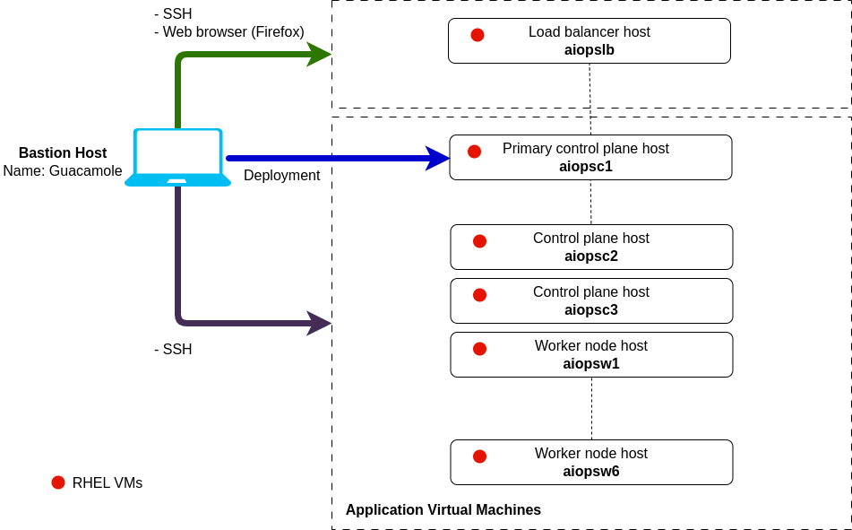

import RequestingLabEnvironment from "@site/src/components/requestingLabEnvironment/RequestingLabEnvironment"
import ObtainingEntitlementKey from "@site/src/components/obtainingEntitlementKey/ObtainingEntitlementKey"
import CreateIbmId from "@site/src/components/createIbmId/CreateIbmId"
import AiopsTrialLicenseAdmonition from "@site/src/components/trialLicense/TrialLicense"

In this lab, you will initially connect to a bastion virtual machine that has Red Hat Enterprise Linux (RHEL) installed on it from which you will carry out the deployment. Once you have finished your installation, you will open a Firefox browser on this bastion host and log in to your newly installed AIOps instance.

In your environment, you will also have a set of ten Linux virtual machines installed with Red Hat Enterprise Linux 9.4. The specification and eventual use of these machines will be as follows:

* 1 x load balancer server - `aiopslb` - 2 CPU, 16 Gi RAM, 500 Gi disk
* 3 x control plane nodes - `aiopsc1` to `aiopsc3` - 16 CPU 16 Gi RAM, 200 Gi disk + (2 x 200 Gi disks)
* 6 x worker nodes - `aiopsw1` to `aioipsw6`- 16 CPU, 46 Gi RAM, 200 Gi disk + (1 x 200 Gi disk)

:::note

A pre-provisioned Netcool server (`netcoolvm`) is also set up for you to use in subsequent labs.

:::

:::note

One key objective of this lab is to expose the product public documentation to
the students. With this in mind, each installation steps will reference the
product documentation.

:::

## 2.1: Prerequisites

<CreateIbmId />

<ObtainingEntitlementKey />

<AiopsTrialLicenseAdmonition />

## 2.2: Requesting a Lab Environment

<RequestingLabEnvironment
   environmentName="Cloud Pak for AIOps - Installation (Linux)"
   environmentUrl="https://techzone.ibm.com/my/reservations/create/68cc9f3836fd9c28fe0ba16b"
/>
