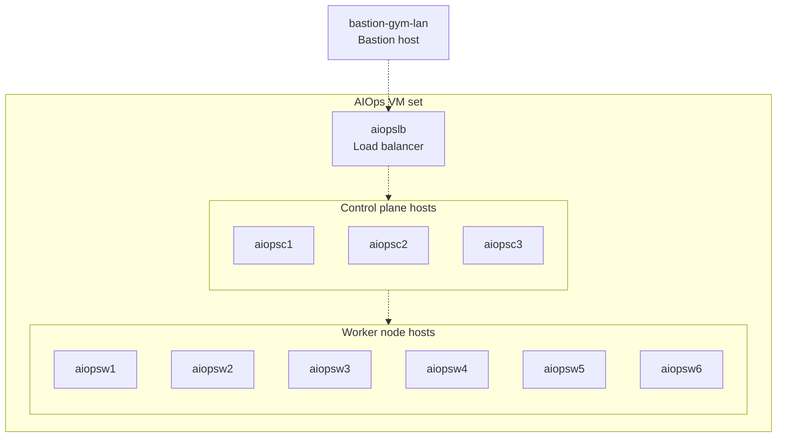
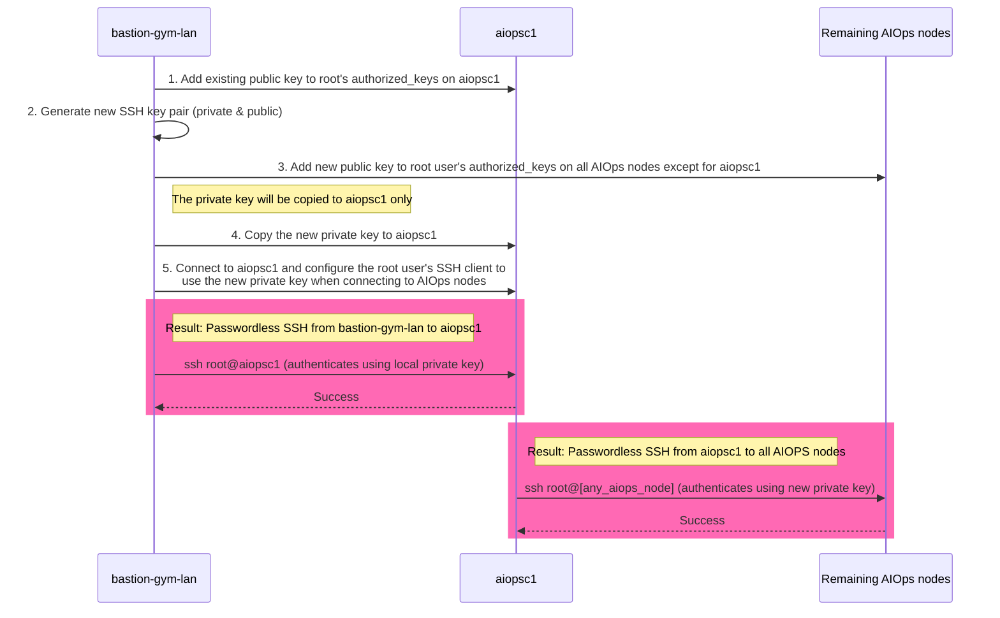

## 3.1: Overview

This module focuses on the initial deployment of the Cloud Pak for AIOps using the Linux VM based installer. It will include the prerequisite steps of preparing the virtual machines prior to installation.

The product documentation for this installation process is published [here](https://www.ibm.com/docs/en/cloud-paks/cloud-pak-aiops/4.11.1?topic=linux-online-installation).

:::tip

In a POC environment without DNS, it is requirement to add all hostnames and IP addresses to all of the hosts before beginning the setup of AIOps. All machines provided in this lab are in DNS already, hence no hosts file setup is required.

:::



:::note

An additional VM is included in your environment (`netcoolvm`) and is preinstalled with Netcool/OMNIbus and Netcool/Impact. It is included so that you can continue with the other labs included in this series. It is not used in this installation lab however.

:::

:::tip

It is recommended to open the lab instructions inside Firefox inside the bastion host. This can make it easier to copy and paste the various commands.

:::

## 3.2: Permit root login on all AIOps cluster nodes

The AIOps installation process connects to the various hosts as the **root** user so we will need to enable **PermitRootLogin** on each of the AIOps cluster nodes. The first step to enabling this is to update each host's SSH configuration to allow logins as the **root** user.

Run the following command block as the default **admin** user on the **bastion host** to enable this:

```sh title="Host: bastion-gym-lan"
export SSH_OPTIONS="-o StrictHostKeyChecking=no"
for host in aiopsc1 aiopsc2 aiopsc3 aiopsw1 aiopsw2 aiopsw3 aiopsw4 aiopsw5 aiopsw6; do
    ssh -t $SSH_OPTIONS jammer@$host 'sudo bash -s' << 'EOF'
        echo "Updating sshd_config on $(hostname)..."
        sed -i 's/^PermitRootLogin.*/PermitRootLogin yes/' /etc/ssh/sshd_config

        echo "Restarting sshd on $(hostname)..."
        systemctl restart sshd

        echo "PermitRootLogin set on $(hostname)"
EOF
done
```

:::note

**StrictHostKeyChecking** is set to "no" to avoid the need to manually accept the SSH key for
the machines that we have not connected to yet.

:::

## 3.3: Set up SSH key authentication

The installation of AIOps is done from the **bastion host** `bastion-gym-lan` through the primary control plane node `aiopsc1`. You will first need to copy the local public key on the bastion host to the `authorized_keys` file on `aiopsc1`, then create a new SSH key pair that will be used by the primary control node to connect to all other AIOps nodes in the cluster.



1. Copy local public key from `bastion-gym-lan` to `aiopsc1` to enable passwordless connection
2. Create a new SSH key pair to use for all the other AIOps cluster nodes
3. Add the new SSH public key to the `root` user's `authorized_keys` file on **all AIOps nodes except for** `aiopsc1`
4. Copy the new private key to the `aiopcs1` host
5. Add the private key to the root user's `.ssh` directory on `aiopsc1` and set permissions
5. Ensure the new SSH key is used by `aiopsc1` when connecting to the other AIOps cluster nodes

Ensure you are on the `bastion-gym-lan` host and logged in as the `admin` user. Open a terminal window.

Run the following command as the default **admin** user on the **bastion host** to store the local public SSH key on `bastion-gym-lan` in the environment variable `PUBLIC_KEY` and then add it to the `root` user's `authorized_keys` file on `aiopsc1`. This will allow connection between `bastion-gym-lan` and `aiopsc1` without having to enter a password.

```php title="Host: bastion-gym-lan"
PUBLIC_KEY=$(cat ~/.ssh/id_rsa.pub)
ssh jammer@aiopsc1 "sudo -i bash -c 'echo \"$PUBLIC_KEY\" >> ~/.ssh/authorized_keys' && echo \"SSH key added to $i successfully\""
```

Run the following command as the default **admin** user on the **bastion host** to create a new SSH key that will be used for the AIOps installation onto the AIOps cluster node hosts:

```bash title="Host: bastion-gym-lan"
ssh-keygen -t rsa -f ~/.ssh/aiops-cluster -N "" -C "AIOps Cluster Key"
```

Run the following command as the default **admin** user on the **bastion host** to store the new public SSH key in the environment variable `PUBLIC_KEY` and then add it to the `root` user's `authorized_keys` file on all the AIOps cluster nodes *except* for `aiopsc1`.

```php title="Host: bastion-gym-lan"
PUBLIC_KEY=$(cat ~/.ssh/aiops-cluster.pub)
for i in aiopsc2 aiopsc3 aiopsw1 aiopsw2 aiopsw3 aiopsw4 aiopsw5 aiopsw6; do
  ssh jammer@$i "sudo -i bash -c 'mkdir -p ~/.ssh && chmod 700 ~/.ssh && echo \"$PUBLIC_KEY\" >> ~/.ssh/authorized_keys && chmod 600 ~/.ssh/authorized_keys' && echo \"SSH key added to $i successfully\""
done
```

Finally, run the following commands as the default **admin** user on the **bastion host** set up the `root` user on `aiopsc1` to use the new SSH private key to connect to the other AIOps cluster nodes:

```sh title="Host: bastion-gym-lan"
scp ~/.ssh/aiops-cluster jammer@aiopsc1:/tmp/aiops_key && echo "Key copied successfully" && \
ssh jammer@aiopsc1 "sudo -i bash -c 'mkdir -p ~/.ssh && chmod 700 ~/.ssh && \
mv /tmp/aiops_key ~/.ssh/aiops-cluster && chmod 600 ~/.ssh/aiops-cluster && chown root:root ~/.ssh/aiops-cluster && \
echo \"Host aiopsc2 aiopsc3 aiopsw1 aiopsw2 aiopsw3 aiopsw4 aiopsw5 aiopsw6 192.168.252.11 192.168.252.12 192.168.252.13 192.168.252.21 192.168.252.22 192.168.252.23 192.168.252.24 192.168.252.25 192.168.252.26\" > ~/.ssh/config && \
echo \"    User root\" >> ~/.ssh/config && \
echo \"    IdentityFile ~/.ssh/aiops-cluster\" >> ~/.ssh/config && \
echo \"    StrictHostKeyChecking no\" >> ~/.ssh/config && \
chmod 600 ~/.ssh/config && echo \"All operations completed successfully\"'"
```

Now the host `aiopsc1` has access to the private SSH key that matches the public key that has been added to the other hosts.

You will now be able to SSH as the default **admin** user from the **bastion host** `bastion-gym-lan` to `aiopsc1`, and from `aiopsc1` to any other node in the cluster, as the **root** user, without entering a password - eg. `ssh root@aiopsw1`.

## 3.4: Install prerequisite software on nodes

The next step is to install software and update the operating systems on the set of VMs so that they are at the latest patch levels.

### 3.4.1 Install lvm2

Run the following commands as the default **admin** user on the **bastion host** to install **lvm2** on each host in the cluster:

```sh title="Host: bastion-gym-lan"
export SSH_OPTIONS="-o StrictHostKeyChecking=no"
for host in aiopsc1 aiopsc2 aiopsc3 aiopsw1 aiopsw2 aiopsw3 aiopsw4 aiopsw5 aiopsw6; do
    ssh -t $SSH_OPTIONS jammer@$host 'sudo yum install -y lvm2'
    echo "Installation complete on $host"
done
```

<details>
<summary>Update the host operating systems</summary>

:::warning Do not perform these steps

You should not perform the steps in this sub-section. It is for information only.

:::

This step updates the operating system of all hosts to ensure they are fully up-to-date with the latest patches. While it is very important to do this in a real-world deployment, it is not essential in order to complete this lab. Also, it will require significant downloads and take a considerable amount of time, therefore do not complete this step for this lab.

To fully patch the host operating systems, run the following commands as the default **admin** user on the **bastion host** to update **all** hosts and reboot them one-by-one:

```sh title="Host: bastion-gym-lan"
export SSH_OPTIONS="-o StrictHostKeyChecking=no"
for host in aiopslb aiopsc1 aiopsc2 aiopsc3 aiopsw1 aiopsw2 aiopsw3 aiopsw4 aiopsw5 aiopsw6; do
    ssh -t $SSH_OPTIONS jammer@$host 'sudo yum update -y'
    ssh -t $SSH_OPTIONS jammer@$host 'sudo shutdown -r now'
    echo "Update complete on $host"
done
```

</details>

## 3.5: Configure your local volumes

The control plane nodes are provisioned with two additional disks and the worker nodes with one additional disk. These must be prepared for use before attempting the installation.

:::note

It is not strictly mandatory to have additional disks provisioned when installing Cloud Pak for AIOps on Linux. It is recommended however to avoid a partition filling up affecting the whole server. For this reason, this lab follows this best practice guidance and uses separate disks.

:::

All steps in this section (3.5) need to be completed as the **root** user.  Ensure you change to the root user therefore after connecting to each of the boxes indicated in this section before completing the steps - for example:

```sh title="Host: bastion-gym-lan"
ssh jammer@aiopsw1
```

```sh title="Host: aiopsc1 aiopsc2 aiopsc3 aiopsw1 aiopsw2 aiopsw3 aiopsw4 aiopsw5 aiopsw6"
sudo -i
```

### 3.5.1 Preparing the control plane nodes

Run the following command block as the **root** user on each of your **control plane** hosts to discover your what your additional disks are for each one:

```sh title="Host: aiopsc1 aiopsc2 aiopsc3"
APP_DISK=$(lsblk -o NAME,SIZE,TYPE,MOUNTPOINT | awk '
  $2 == "200G" && $3 == "disk" {
    cmd = "lsblk -n /dev/" $1 " | wc -l";
    cmd | getline lines;
    close(cmd);
    if (lines == 1) print $1;
  }
' | head -1)

PLATFORM_DISK=$(lsblk -o NAME,SIZE,TYPE,MOUNTPOINT | awk '
  $2 == "200G" && $3 == "disk" {
    cmd = "lsblk -n /dev/" $1 " | wc -l";
    cmd | getline lines;
    close(cmd);
    if (lines == 1) print $1;
  }
' | grep -v "$APP_DISK" | head -1) # <- This is the difference between APP_DISK and PLATFORM_DISK
echo "Your additional disks are:"
echo APP_DISK: /dev/$APP_DISK
echo PLATFORM_DISK: /dev/$PLATFORM_DISK
```

Example output:

```
...
Your additional disks are:
APP_DISK: /dev/sdc
PLATFORM_DISK: /dev/sdd
[root@aiopsc1 ~]#
```

In this case, you can see the primary control plane node `aiopsc1` has two additional 200G disks: `/dev/sdc` and `/dev/sdd`. After you have configured your local volumes, one will be allocated for the storage of AIOps application data and one will be allocated for the storage of the Kubernetes platform data.

:::note

The control plane nodes will have two additional disks as described above. The worker nodes however will only have one additional disk for the storage of AIOps application data. They do not need the Kubernetes platform storage directory like the control plane nodes do.

:::

Following on from the previous step, run the following command block as the **root** user on each of your **control plane** hosts to set your storage environment variables according to the names of the additional drives:

```sh title="Host: aiopsc1 aiopsc2 aiopsc3"
export APP_DRIVE_NAMES=(
  /dev/$APP_DISK
)
export PLATFORM_DRIVE_NAMES=(
  /dev/$PLATFORM_DISK
)
export APP_STORAGE_PATH="/var/lib/aiops/storage"
export PLATFORM_STORAGE_PATH="/var/lib/aiops/platform"
```

:::note

You can use either one of your additional drives for application storage and the other for platform storage. The above example uses `/dev/sdc` and `/dev/sdd` which it is taking from the previous step via the environment variables. Take care that you enter the correct drive names. They may be different on each control plane node host.

:::

Finally, run the following commands as the **root** user on each **control plane** host to create the partitions and verify that they have been created correctly:

```sh title="Host: aiopsc1 aiopsc2 aiopsc3"
# Create physical volumes
pvcreate "${APP_DRIVE_NAMES[@]}"
pvcreate "${PLATFORM_DRIVE_NAMES[@]}"

# Create volume groups
vgcreate aiops "${APP_DRIVE_NAMES[@]}"
vgcreate aiopspl "${PLATFORM_DRIVE_NAMES[@]}"

# Create logical volumes on the volume groups
lvcreate aiops -n aiops -l 100%FREE
lvcreate aiopspl -n aiopspl -l 100%FREE

# Format the new logical volumes
export APP_DMPATH=$(lvs --noheadings -o dmpath aiops | sed -e 's/^[[:space:]]*//')
export PLATFORM_DMPATH=$(lvs --noheading -o dmpath aiopspl | sed -e 's/^[[:space:]]*//')
mkfs.xfs -L aiops "${APP_DMPATH}"
mkfs.xfs -L aiopspl "${PLATFORM_DMPATH}"

# Create filesystem directories
mkdir -p "${APP_STORAGE_PATH}"
mkdir -p "${PLATFORM_STORAGE_PATH}"

# Add the new filesystem directories to `/etc/fstab`
echo "${APP_DMPATH}  ${APP_STORAGE_PATH}     xfs    defaults        0 0" >> /etc/fstab
echo "${PLATFORM_DMPATH}  ${PLATFORM_STORAGE_PATH}     xfs    defaults        0 0" >> /etc/fstab

# Mount the filesystems into the directories
systemctl daemon-reload
mount "${APP_STORAGE_PATH}"
mount "${PLATFORM_STORAGE_PATH}"

lsblk -o NAME,SIZE,TYPE,MOUNTPOINT
```

As you successfully configure your volumes, you should see something like the following on your **control plane** hosts output:

```
NAME                SIZE TYPE MOUNTPOINT
sda                 200G disk
--sda1                1G part /boot/efi
--sda2                1G part /boot
--sda3               38G part
  --sysvg-lv_root    12G lvm  /
  --sysvg-lv_swap     1G lvm  [SWAP]
  --sysvg-lv_audit    4G lvm  /var/log/audit
  --sysvg-lv_log      4G lvm  /var/log
  --sysvg-lv_var    207G lvm  /var
  --sysvg-lv_tmp      4G lvm  /tmp
  --sysvg-lv_opt      2G lvm  /opt
  --sysvg-lv_home     4G lvm  /home
sdb                 200G disk
--sdb1              200G part
  --sysvg-lv_var    207G lvm  /var
sdc                 200G disk
--aiops-aiops       200G lvm  /var/lib/aiops/storage
sdd                 200G disk
--aiopspl-aiopspl   200G lvm  /var/lib/aiops/platform
```

### 3.5.2 Preparing the worker nodes

Whereas the control plane nodes have two additional disks for the platform and application storage, the worker nodes only have one additional disk for the application storage.

:::note

Whereas section 3.5.1 steps through the additional disk identification and setup tasks individually, the following command block performs the additional disk identification and setup across all the worker nodes in one go for convenience, now that you understand the steps required.

:::

Run the following command block as the default **admin** user from the **bastion host** to set up your application storage disk on all your worker node hosts:


```sh title="Host: bastion-gym-lan"
for HOST in aiopsw1 aiopsw2 aiopsw3 aiopsw4 aiopsw5 aiopsw6; do
  ssh root@$HOST << 'EOF'
    echo "$(hostname) - Finding the 200G disk"

    # 1. Find the 200G disk that isn't partitioned
    APP_STORAGE_DISK=$(lsblk -o NAME,SIZE,TYPE,MOUNTPOINT | awk '
      $2 == "200G" && $3 == "disk" {
        cmd = "lsblk -n /dev/" $1 " | wc -l";
        cmd | getline lines;
        close(cmd);
        if (lines == 1) print $1;
      }
    ' | head -1)

    # 2. Confirm the disk was found
    if [ -z "$APP_STORAGE_DISK" ]; then
      echo "$(hostname) - ERROR: No suitable 200G disk found. Aborting."
      exit 1
    fi

    echo "$(hostname) - Found disk: /dev/$APP_STORAGE_DISK"

    # 3. Set variables
    export APP_DRIVE_NAMES=(
      /dev/$APP_STORAGE_DISK
    )
    export APP_STORAGE_PATH="/var/lib/aiops/storage"

    # 4. Create a Physical Volume
    echo "$(hostname) - Creating PV on ${APP_DRIVE_NAMES[@]}"
    pvcreate "${APP_DRIVE_NAMES[@]}"

    # 5. Create the Volume Group
    echo "$(hostname) - Creating VG 'aiops'"
    vgcreate aiops "${APP_DRIVE_NAMES[@]}"

    # 6. Create the Logical Volume
    echo "$(hostname) - Creating LV 'aiops'"
    lvcreate aiops -n aiops -l 100%FREE

    # 7. Format the new LV
    echo "$(hostname) - Formatting logical volume"
    export APP_DMPATH=$(lvs --noheadings -o dmpath aiops | sed -e 's/^[[:space:]]*//')
    mkfs.xfs -L aiops "${APP_DMPATH}"

    # 8. Create mount point
    echo "$(hostname) - Creating mount point ${APP_STORAGE_PATH}"
    mkdir -p "${APP_STORAGE_PATH}"

    # 9. Add to /etc/fstab
    echo "$(hostname) - Updating /etc/fstab"
    if ! grep -q "${APP_DMPATH}" /etc/fstab; then
      echo "${APP_DMPATH}  ${APP_STORAGE_PATH}     xfs    defaults        0 0" >> /etc/fstab
    else
      echo "$(hostname) - fstab entry already exists. Skipping."
    fi

    # 10. Mount the filesystem
    echo "$(hostname) - Reloading systemd and mounting"
    systemctl daemon-reload
    mount "${APP_STORAGE_PATH}"

    echo "$(hostname) - Configuration complete. Final disk layout:"
    lsblk -o NAME,SIZE,TYPE,MOUNTPOINT
EOF

  echo "$HOST completed"
done
```

As you successfully configure your volumes, you should see something like the following in the output for each of your **worker node** hosts:

```
NAME                SIZE TYPE MOUNTPOINT
sda                 200G disk
--sda1                1G part /boot/efi
--sda2                1G part /boot
--sda3               38G part
  --sysvg-lv_root    12G lvm  /
  --sysvg-lv_swap     1G lvm  [SWAP]
  --sysvg-lv_audit    4G lvm  /var/log/audit
  --sysvg-lv_log      4G lvm  /var/log
  --sysvg-lv_var    207G lvm  /var
  --sysvg-lv_tmp      4G lvm  /tmp
  --sysvg-lv_opt      2G lvm  /opt
  --sysvg-lv_home     4G lvm  /home
sdb                 200G disk
--sdb1              200G part
  --sysvg-lv_var    207G lvm  /var
sdc                 200G disk
--aiops-aiops       200G lvm  /var/lib/aiops/storage
```

:::important

Do not proceed past this point until all the additional volumes have been configured. After completing this step, you should have two additional volumes configured on each of the control plane nodes and one additional volume configured on each of the worker nodes.

:::

## 3.6: Install and configure the load balancer

For resiliency, AIOps is designed to run using a load-balancer that proxies connections to its control plane nodes. This helps to load balance cluster interactions with external clients.

In this lab, we have a load balancer host provisioned (`aiopslb`). In this section, we will install and configure **HAProxy** to provide this service.

Connect as the **jammer** user to the **load balancer** host:

```sh title="Host: bastion-gym-lan"
ssh jammer@aiopslb
```

Next, run the following command as the **jammer** user on the **load balancer** host to change to the **root** user:

```sh title="Host: aiopslb"
sudo -i
```

Next, run the following command as the **root** user on the **load balancer** host to install **HAProxy**:

```sh title="Host: aiopslb"
dnf install -y haproxy
```

Next, run the following commands as the **root** user on the **load balancer** host to update the HAProxy configuration file, enable HAProxy, and start the HAProxy service:

```sh title="Host: aiopslb"
(cat > /etc/haproxy/haproxy.cfg << EOF
global
  log         127.0.0.1 local2
  chroot      /var/lib/haproxy
  pidfile     /var/run/haproxy.pid
  maxconn     4000
  user        haproxy
  group       haproxy
  daemon
  stats socket /var/lib/haproxy/stats

defaults
  mode                    http
  log                     global
  option                  httplog
  option                  dontlognull
  option http-server-close
  option forwardfor       except 127.0.0.0/8
  option                  redispatch
  retries                 3
  timeout http-request    10s
  timeout queue           1m
  timeout connect         10s
  timeout client          1m
  timeout server          1m
  timeout http-keep-alive 10s
  timeout check           10s
  maxconn                 3000

frontend aiops-frontend-plaintext
  bind *:80
  mode tcp
  option tcplog
  default_backend aiops-backend-plaintext

frontend aiops-frontend
  bind *:443
  mode tcp
  option tcplog
  default_backend aiops-backend

frontend k3s-frontend
  bind *:6443
  mode tcp
  option tcplog
  default_backend k3s-backend

backend aiops-backend
  mode tcp
  option tcp-check
  balance roundrobin
  default-server inter 10s downinter 5s
  server server0 aiopsc1:443 check
  server server1 aiopsc2:443 check
  server server2 aiopsc3:443 check

backend k3s-backend
  mode tcp
  option tcp-check
  balance roundrobin
  default-server inter 10s downinter 5s
  server server0 aiopsc1:6443 check
  server server1 aiopsc2:6443 check
  server server2 aiopsc3:6443 check

backend aiops-backend-plaintext
  mode tcp
  option tcp-check
  balance roundrobin
  default-server inter 10s downinter 5s
  server server0 aiopsc1:80 check
  server server1 aiopsc2:80 check
  server server2 aiopsc3:80 check
EOF
) && haproxy -c -f /etc/haproxy/haproxy.cfg && systemctl enable haproxy && systemctl start haproxy
```

Finally, run the following command as the **root** user on the **load balancer** host to validate your configuration by checking the status of the HAProxy service:

```sh title="Host: aiopslb"
systemctl status haproxy
```

You should see something like the following:

```
haproxy.service - HAProxy Load Balancer
     Loaded: loaded (/usr/lib/systemd/system/haproxy.service; enabled; preset: disabled)
     Active: active (running) since Fri 2025-11-07 12:21:34 UTC; 2min 5s ago
    Process: 139217 ExecStartPre=/usr/sbin/haproxy -f $CONFIG -f $CFGDIR -c -q $OPTIONS (code=exited, status=0/>
   Main PID: 139219 (haproxy)
      Tasks: 3 (limit: 22813)
     Memory: 6.3M
        CPU: 125ms
     CGroup: /system.slice/haproxy.service
             --139219 /usr/sbin/haproxy -Ws -f /etc/haproxy/haproxy.cfg -f /etc/haproxy/conf.d -p /run/haproxy.>
             --139221 /usr/sbin/haproxy -Ws -f /etc/haproxy/haproxy.cfg -f /etc/haproxy/conf.d -p /run/haproxy.>

Nov 07 12:21:36 aiopslb haproxy[139221]: [NOTICE]   (139221) : path to executable is /usr/sbin/haproxy
Nov 07 12:21:36 aiopslb haproxy[139221]: [ALERT]    (139221) : backend 'aiops-backend' has no server available!
Nov 07 12:21:37 aiopslb haproxy[139221]: [WARNING]  (139221) : Server k3s-backend/server0 is DOWN
Nov 07 12:21:39 aiopslb haproxy[139221]: [WARNING]  (139221) : Server k3s-backend/server1 is DOWN
Nov 07 12:21:40 aiopslb haproxy[139221]: [WARNING]  (139221) : Server k3s-backend/server2 is DOWN
Nov 07 12:21:40 aiopslb haproxy[139221]: [ALERT]    (139221) : backend 'k3s-backend' has no server available!
Nov 07 12:21:41 aiopslb haproxy[139221]: [WARNING]  (139221) : Server aiops-backend-plaintext/server0 is DOWN
Nov 07 12:21:42 aiopslb haproxy[139221]: [WARNING]  (139221) : Server aiops-backend-plaintext/server1 is DOWN
Nov 07 12:21:43 aiopslb haproxy[139221]: [WARNING]  (139221) : Server aiops-backend-plaintext/server2 is DOWN
Nov 07 12:21:43 aiopslb haproxy[139221]: [ALERT]    (139221) : backend 'aiops-backend-plaintext' has no server
```

:::note

Don't worry if you see ALERT and WARNING messages in the status output at this point. This is because the AIOps end-points don't exist yet.

:::

## 3.7: Prepare AIOps environment file

Your VM environment is now ready to begin the installation of K3S and AIOps.

First, run the following command block as the default **admin** user on the **bastion host** to create the AIOps environment variable file called `aiops_var.sh`:

```sh title="Host: bastion-gym-lan"
cat > /home/admin/aiops_var.sh << EOF
# IBM Cloud Pak for AIOps installation variables (Linux)
export TARGET_USER="root"
export ACCEPT_LICENSE=true # Set to true to agree to the license terms.

# # IBM Entitled Registry
export IBM_ENTITLEMENT_KEY=<ibm-entitlement-key>

# Hostnames
export LOAD_BALANCER_HOST="aiopslb"
export CONTROL_PLANE_NODE="aiopsc1"
export ADDITIONAL_CONTROL_PLANE_NODES=(
  "aiopsc2"
  "aiopsc3"
)
export WORKER_NODES=(
  "aiopsw1"
  "aiopsw2"
  "aiopsw3"
  "aiopsw4"
  "aiopsw5"
  "aiopsw6"
)

# Set your deployment type
export DEPLOY_TYPE="base"

# Storage
export APP_STORAGE_PATH="/var/lib/aiops/storage"
export PLATFORM_STORAGE_PATH="/var/lib/aiops/platform"

# Network configuration
export CLUSTER_CIDR="" # Default: 10.42.0.0/16
export SERVICE_CIDR="" # Default: 10.43.0.0/16
EOF

```

Next, run the following command as the default **admin** user on the **bastion host** to edit the AIOps environment variable file to set your IBM entitlement key:

```sh title="Host: bastion-gym-lan"
vi /home/admin/aiops_var.sh
```

:::note

Your IBM entitlement key needs to be copied and pasted into this file against the variable: `IBM_ENTITLEMENT_KEY`.

:::

## 3.8: Install AIOps

The installation of AIOps involves the following steps:
- Install the K3S Kubernetes cluster to the control plane and worker node hosts
- Patch the network settings
- Check the cluster storage performance (check with instructor)
- Run the AIOps install command

### 3.8.1 Install the K3S Kubernetes cluster

First, run the following command as the default **admin** user on the **bastion host** to source the environment file you created:

```sh title="Host: bastion-gym-lan"
. /home/admin/aiops_var.sh
```

Next, run the following commands as the default **admin** user on the **bastion host** to install `aiopsctl` and initialise the K3S Kubernetes cluster on the primary control plane host.

:::note

It is important to run the following commands one at a time as listed, and not as a block. This is because the login banner on lab environment machines interferes with block execution of SSH commands.

:::

```sh title="Host: bastion-gym-lan"
AIOPSCTL_TAR="aiopsctl-linux_amd64.tar.gz"
AIOPSCTL_INSTALL_URL="https://github.com/IBM/aiopsctl/releases/download/v4.11.1/${AIOPSCTL_TAR}"
```

```sh title="Host: bastion-gym-lan"
ssh ${TARGET_USER}@${CONTROL_PLANE_NODE} curl -LO "${AIOPSCTL_INSTALL_URL}"
```

```sh title="Host: bastion-gym-lan"
ssh ${TARGET_USER}@${CONTROL_PLANE_NODE} tar xf "${AIOPSCTL_TAR}"
```

```sh title="Host: bastion-gym-lan"
ssh ${TARGET_USER}@${CONTROL_PLANE_NODE} mv aiopsctl /usr/local/bin/aiopsctl
```

```sh title="Host: bastion-gym-lan"
echo "Installing main control plane node ${CONTROL_PLANE_NODE}"
ssh ${TARGET_USER}@${CONTROL_PLANE_NODE} aiopsctl cluster node up --accept-license=${ACCEPT_LICENSE} --role=control-plane --registry-token="${IBM_ENTITLEMENT_KEY}" --app-storage="${APP_STORAGE_PATH}" --platform-storage="${PLATFORM_STORAGE_PATH}" --load-balancer-host="${LOAD_BALANCER_HOST}" ${CLUSTER_CIDR_FLAG}${SERVICE_CIDR_FLAG}${CLUSTER_DNS_FLAG}
```

```sh title="Host: bastion-gym-lan"
K3S_TOKEN=$(ssh ${TARGET_USER}@${CONTROL_PLANE_NODE} aiopsctl cluster node info --token-only)
```

```sh title="Host: bastion-gym-lan"
K3S_HOST=$(ssh ${TARGET_USER}@${CONTROL_PLANE_NODE} aiopsctl cluster node info --server-url-only)
```

Verify that your K3S token and host variables have been set:

```sh title="Host: bastion-gym-lan"
echo K3S_TOKEN: ${K3S_TOKEN}
echo K3S_HOST: ${K3S_HOST}
```

Next, run the following command block as the default **admin** user on the **bastion host** to install `aiopsctl` and initialise the K3S Kubernetes cluster on the other two control plane hosts:

```sh title="Host: bastion-gym-lan"
echo "Installing additional control plane nodes"
for CP_NODE in "${ADDITIONAL_CONTROL_PLANE_NODES[@]}"; do
  ssh ${TARGET_USER}@${CONTROL_PLANE_NODE} ssh ${TARGET_USER}@${CP_NODE} curl -LO "${AIOPSCTL_INSTALL_URL}"
  ssh ${TARGET_USER}@${CONTROL_PLANE_NODE} ssh ${TARGET_USER}@${CP_NODE} tar xvf "${AIOPSCTL_TAR}"
  ssh ${TARGET_USER}@${CONTROL_PLANE_NODE} ssh ${TARGET_USER}@${CP_NODE} mv aiopsctl /usr/local/bin/aiopsctl
  ssh ${TARGET_USER}@${CONTROL_PLANE_NODE} ssh ${TARGET_USER}@${CP_NODE} aiopsctl cluster node up --accept-license=${ACCEPT_LICENSE} --role=control-plane --server-url="${K3S_HOST}" --token="${K3S_TOKEN}" --registry-token="${IBM_ENTITLEMENT_KEY}" --app-storage="${APP_STORAGE_PATH}" --platform-storage="${PLATFORM_STORAGE_PATH}" --load-balancer-host="${LOAD_BALANCER_HOST}" ${CLUSTER_CIDR_FLAG}${SERVICE_CIDR_FLAG}${CLUSTER_DNS_FLAG}
done
```

Finally, run the following command block as the default **admin** user from the **bastion host** to install `aiopsctl` and initialise the K3S Kubernetes cluster on the worker node hosts:

```sh title="Host: bastion-gym-lan"
echo "Installing worker nodes"
K3S_LB_HOST="https://${LOAD_BALANCER_HOST}:6443"
for WORKER_NODE in "${WORKER_NODES[@]}"; do
  ssh ${TARGET_USER}@${CONTROL_PLANE_NODE} ssh ${TARGET_USER}@${WORKER_NODE} curl -LO "${AIOPSCTL_INSTALL_URL}"
  ssh ${TARGET_USER}@${CONTROL_PLANE_NODE} ssh ${TARGET_USER}@${WORKER_NODE} tar xvf "${AIOPSCTL_TAR}"
  ssh ${TARGET_USER}@${CONTROL_PLANE_NODE} ssh ${TARGET_USER}@${WORKER_NODE} mv aiopsctl /usr/local/bin/aiopsctl
  ssh ${TARGET_USER}@${CONTROL_PLANE_NODE} ssh ${TARGET_USER}@${WORKER_NODE} aiopsctl cluster node up --accept-license=${ACCEPT_LICENSE} --role=worker --server-url="${K3S_LB_HOST}" --token="${K3S_TOKEN}" --registry-token="${IBM_ENTITLEMENT_KEY}" --app-storage="${APP_STORAGE_PATH}"
done
```

After the setup has completed, run the following commands as the default **admin** user on the **bastion host** to check the status of the cluster:

```sh title="Host: bastion-gym-lan"
export SSH_OPTIONS="-o StrictHostKeyChecking=no"
ssh -t $SSH_OPTIONS root@aiopsc1 'aiopsctl cluster status'
```

You should see something like the following in the output:

```
o- [07 Nov 25 14:09 UTC] Getting cluster status
Control Plane Node(s):
    aiopsc1 Ready
    aiopsc2 Ready
    aiopsc3 Ready

Worker Node(s):
    aiopsw1 Ready
    aiopsw2 Ready
    aiopsw3 Ready
    aiopsw4 Ready
    aiopsw5 Ready
    aiopsw6 Ready
```

### 3.8.2 Patch the network settings

Run the following command as the default **admin** user on the **bastion host** to patch the network settings on all cluster member hosts:

```sh title="Host: bastion-gym-lan"
export SSH_OPTIONS="-o StrictHostKeyChecking=no"
for host in aiopslb aiopsc1 aiopsc2 aiopsc3 aiopsw1 aiopsw2 aiopsw3 aiopsw4 aiopsw5 aiopsw6; do
    ssh -t $SSH_OPTIONS jammer@$host 'sudo ethtool -K flannel.1 tx-checksum-ip-generic off'
    echo "Update complete on $host"
done
```

:::note

Per [section 4.4 of the documentation](https://www.ibm.com/docs/en/cloud-paks/cloud-pak-aiops/4.11.1?topic=linux-online-installation#install_tool), we need to apply this step to all the AIOps cluster nodes because the lab infrastructure is built on VSphere. Hence, this step is needed to rectify connectivity issues.

:::

### 3.8.4 Install AIOps

Now that the K3S cluster is ready, you will now perform the installation of AIOps.

<details>
<summary>Check the cluster storage performance</summary>

:::warning Do not perform these steps

You should not perform the steps in this sub-section. It is for information only.

:::

In a real deployment, it is prudent to test the performance of your storage to ensure AIOps will perform adequately. Poorly performing storage is frequently the root cause of many issues experienced in production environments.

This step instructs the cluster to pull a storage performance testing image from IBM and then run a series of demanding read and write actions against the cluster storage. At the end of the test, it will give you its results and let you know if there are any potential performance issues. The test can take **up to 10 minutes** to complete.

It is not necessary to carry out this test for the purposes of this lab.

Run the following commands on the **bastion host** to create the `aiops` namespace and then run the storage performance test job:

```sh title="Host: bastion-gym-lan"
ssh ${TARGET_USER}@${CONTROL_PLANE_NODE} kubectl create namespace aiops
ssh ${TARGET_USER}@${CONTROL_PLANE_NODE} aiopsctl benchmark storage

```

</details>

Run the following command as the default **admin** user on the **bastion host** to install AIOps:

```sh title="Host: bastion-gym-lan"
ssh ${TARGET_USER}@${CONTROL_PLANE_NODE} aiopsctl server up --load-balancer-host="${LOAD_BALANCER_HOST}" --mode "${DEPLOY_TYPE}" --wait-timeout 1800
```

**The deployment will take up to 60 minutes to complete.**

<details>
<summary>What if my installation attempt fails?</summary>

:::warning Only perform these steps if your installation fails

You should not perform the steps in this sub-section unless your installation fails.

:::

The virtualised lab environments can occasionally experience latency and other intermittent connectivity issues. This can sometimes interrupt connectivity between the cluster members, which can cause the installation to fail. If this happens, you will need to re-run the install command with the addition of the `--force` switch. This tells the installer to attempt to continue the installation of any remaining uninstalled components, without having to start the installation from scratch.

Run the following command as the default **admin** user on the **bastion host** to re-attempt the installation of AIOps:

```sh title="Host: bastion-gym-lan"
ssh ${TARGET_USER}@${CONTROL_PLANE_NODE} aiopsctl server up --load-balancer-host="${LOAD_BALANCER_HOST}" --mode "${DEPLOY_TYPE}" --wait-timeout 1800 --force
```

</details>

<details>
<summary>What if my reinstallation attempt also fails?</summary>

:::warning Only perform these steps if your installation fails

You should not perform the steps in this sub-section unless your installation fails and the re-installation steps also fail.

:::

If the `--force` option has not succeeded, it may be necessary to remove the K3S cluster and re-start the installation. This involves uninstalling the cluster members and re-running the installation.

To remove the AIOps installation, first run the following command block as the default **admin** user on the **bastion host** to create the AIOps environment variable file called `aiops_uninstall_var.sh`:

```sh title="Host: bastion-gym-lan"
cat > /home/admin/aiops_uninstall_var.sh << EOF
export TARGET_USER="root"
export CONTROL_PLANE_NODE="aiopsc1"
export ADDITIONAL_CONTROL_PLANE_NODES=(
  "aiopsc2"
  "aiopsc3"
)
export WORKER_NODES=(
  "aiopsw1"
  "aiopsw2"
  "aiopsw3"
  "aiopsw4"
  "aiopsw5"
  "aiopsw6"
)
export APP_STORAGE_PATH="/var/lib/aiops/storage"
EOF
```

Next, run the following command as the default **admin** user on the **bastion host** to source the uninstall environment file you created:

```sh title="Host: bastion-gym-lan"
. /home/admin/aiops_uninstall_var.sh
```

Finally, run the following commands as the default **admin** user on the **bastion host** to uninstall the failed installation attempt of AIOps:

```sh title="Host: bastion-gym-lan"
for WORKER_NODE in "${WORKER_NODES[@]}"
do
  ssh ${TARGET_USER}@${WORKER_NODE} aiopsctl cluster node down --role worker --app-storage=${APP_STORAGE_PATH}
done
```

```sh title="Host: bastion-gym-lan"
for CP_NODE in "${ADDITIONAL_CONTROL_PLANE_NODES[@]}"
do
  ssh ${TARGET_USER}@${CP_NODE} aiopsctl cluster node down --role control-plane
done
```

```sh title="Host: bastion-gym-lan"
ssh ${TARGET_USER}@${CONTROL_PLANE_NODE} aiopsctl cluster node down --role control-plane
```

After you have finished uninstalling the cluster nodes, go back to the beginning of section [3.8: Install AIOps](/waiops-tech-jam/labs/cloud-pak-aiops/install-lab-linux/installation/#38-install-aiops) and re-run the installation steps for AIOps.

</details>

After the installation has completed, run the following command as the default **admin** user on the **bastion host** to verify the installation:

```sh title="Host: bastion-gym-lan"
ssh ${TARGET_USER}@${CONTROL_PLANE_NODE} aiopsctl status
```

You should see something like the following in the output:

```
o- [03 Nov 25 13:48 UTC] Getting cluster status
Control Plane Node(s):
    aiopsc1 Ready
    aiopsc2 Ready
    aiopsc3 Ready
npm run start
Worker Node(s):
    aiopsw1 Ready
    aiopsw2 Ready
    aiopsw3 Ready
    aiopsw4 Ready
    aiopsw5 Ready
    aiopsw6 Ready

o- [03 Nov 25 13:48 UTC] Checking AIOps installation status

  16 Ready Components
    kafka
    aimanager
    baseui
    zenservice
    lifecycletrigger
    aiopsui
    cluster.opensearch
    aiopsanalyticsorchestrator
    aiopsedge
    asm
    issueresolutioncore
    rediscp
    cluster.aiops-orchestrator-postgres
    lifecycleservice
    commonservice
    cassandra

  AIOps installation healthy
```

## 3.9: Log in to the Cloud Pak for AIOps console

The final section of the lab covers retrieval of the AIOps login details, updating the local hosts file for GUI access, and logging in to the AIOps console.

First, run the following command as the default **admin** user on the **bastion host** to obtain the AIOps login credentials:

```sh title="Host: bastion-gym-lan"
ssh ${TARGET_USER}@${CONTROL_PLANE_NODE} aiopsctl server info --show-secrets
```

You should see something like the following in the output:

```
Cluster Access Details
URL:      aiops-cpd.aiopslb
Username: cpadmin
Password: ZeIOTJzqblDMHjPrTWmLGLX5yqT1tvWS
```

Next, run the following command as the default **admin** user on the **bastion host** to edit the local hosts file:

```sh title="Host: bastion-gym-lan"
sudo vi /etc/hosts
```

Add the following entries to the local hosts file, save, then exit:

```
192.168.252.9 aiops-cpd.aiopslb
192.168.252.9 cp-console-aiops.aiopslb
```

Finally, open a Firefox web browser session on your **bastion host** and go to the AIOps login page:

```
https://aiops-cpd.aiopslb
```

:::note

Since we are using self-signed certificates, your browser window will give you certificate security warnings. Simply accept and continue several times to eventually get to the AIOps login page.

:::

Use the credentials obtained to log in to the console.

Congratulations, this concludes the installation of AIOps on Linux VMs!

