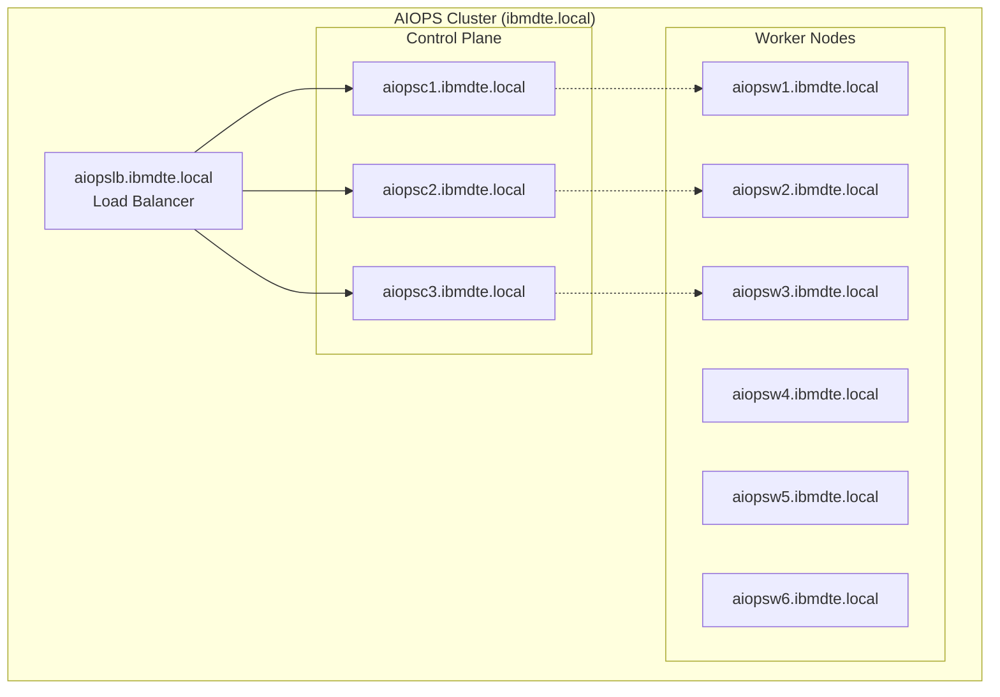
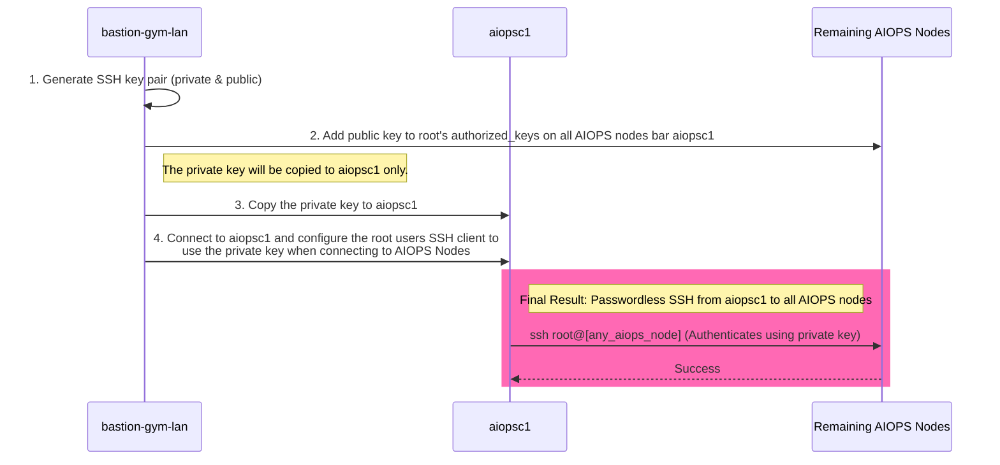

## 3.1: Overview

This module focuses on the initial deployment of the Cloud Pak for AIOps using the Linux VM based installer. It will include the prerequisite steps of preparing the virtual machines prior to installation.

All machines provided in this lab are in DNS already hence no hosts file setup is required.

:::tip

In a POC environment without DNS, it is requirement to add all hostnames and IP addresses to all of the hosts before beginning the setup of AIOps.

:::




:::note

An additional VM is included in your environment (`netcoolvm`) and is preinstalled with Netcool/OMNIbus and Netcool/Impact. It is included so that you can continue with the other labs included in this series. It is not used in this installation lab.

:::

## 3.2: Permit Root Login on AIOps Cluster Nodes

The installation process connects to the hosts as the root user so we will need to *PermitRootLogin* on each node. The first step to enabling this is to update each hosts SSH config to allow logins as the root user. Run the following code block:

:::note

StrictHostKeyChecking is set to no to avoid the need to accept the SSH key for
the machines that we have not connected to yet.

:::

```sh title="Host: bastion-gym-lan"
export SSH_OPTIONS="-o StrictHostKeyChecking=no"

for host in aiopsc1 aiopsc2 aiopsc3 aiopsw1 aiopsw2 aiopsw3 aiopsw4 aiopsw5 aiopsw6; do
    ssh -t $SSH_OPTIONS jammer@$host 'sudo bash -s' << 'EOF'
        echo "Updating sshd_config on $(hostname)..."
        sed -i 's/^PermitRootLogin.*/PermitRootLogin yes/' /etc/ssh/sshd_config

        echo "Restarting sshd on $(hostname)..."
        systemctl restart sshd

        echo "PermitRootLogin set on $(hostname)"
EOF
done
```

## 3.3: Setup SSH key authentication

The installation of AIOps is done through the primary control plane node *aiopsc1*. You need to create an SSH key that will be used by the primary control node to connect to all other AIOps nodes in the cluster.



1. Create a new ssh key pair
2. Add the public key to the root user on **all AIOps nodes except for aiopsc1**
3. Copy the private key to the **aiopcs1** host
4. Add the private key to the root users .ssh directory and set permissions on **aiopsc1**
5. Ensure the new ssh key is used by by **aiopsc1** when connecting to all other AIOps nodes.

Ensure you are on the **bastion-gym-lan** host and operating as the **admin**
user.

Run the following commands to create a new ssh key.

```bash title="Host: bastion-gym-lan"
ssh-keygen -t rsa -f ~/.ssh/aiops-cluster -N "" -C "AIOps Cluster Key"
```
Run the following to store the new key in the
environment variable *PUBLIC_KEY* and add the new public ssh key to the root user on
all the AIOps nodes except for aiopsc1.

```php title="Host: bastion-gym-lan"
PUBLIC_KEY=$(cat ~/.ssh/aiops-cluster.pub)
for i in aiopsc2 aiopsc3 aiopsw1 aiopsw2 aiopsw3 aiopsw4 aiopsw5 aiopsw6; do
  ssh jammer@$i "sudo -i bash -c 'mkdir -p ~/.ssh && chmod 700 ~/.ssh && echo \"$PUBLIC_KEY\" >> ~/.ssh/authorized_keys && chmod 600 ~/.ssh/authorized_keys' && echo \"SSH key added to $i successfully\""
done
```

Finally setup the **root** user on **aiopsc1** to use the new ssh key to connect to the other AIOps nodes:

```sh title="Host: bastion-gym-lan"
scp ~/.ssh/aiops-cluster jammer@aiopsc1:/tmp/aiops_key && echo "Key copied successfully" && \
ssh jammer@aiopsc1 "sudo -i bash -c 'mkdir -p ~/.ssh && chmod 700 ~/.ssh && \
mv /tmp/aiops_key ~/.ssh/aiops-cluster && chmod 600 ~/.ssh/aiops-cluster && chown root:root ~/.ssh/aiops-cluster && \
echo \"Host aiopsc2 aiopsc3 aiopsw1 aiopsw2 aiopsw3 aiopsw4 aiopsw5 aiopsw6 192.168.252.11 192.168.252.12 192.168.252.13 192.168.252.21 192.168.252.22 192.168.252.23 192.168.252.24 192.168.252.25 192.168.252.26\" > ~/.ssh/config && \
echo \"    User root\" >> ~/.ssh/config && \
echo \"    IdentityFile ~/.ssh/aiops-cluster\" >> ~/.ssh/config && \
echo \"    StrictHostKeyChecking no\" >> ~/.ssh/config && \
chmod 600 ~/.ssh/config && echo \"All operations completed successfully\"'"
```

Now the host **aiopsc1** has access to the private ssh key that matches the public key that has been added to the other hosts.

From **aiopsc1** as the root user you will now be able to ssh to any node in the cluster without a password e.g. `ssh root@aiopsw1`.


## 3.4: Install prerequisite software on nodes

The next step is to install software and update the operating systems on the set of VMs so that they are at the latest patch levels.

Run the following commands to install **lvm2** on each host of the cluster

```sh title="Host: bastion-gym-lan"
export SSH_OPTIONS="-o StrictHostKeyChecking=no"

for host in aiopsc1 aiopsc2 aiopsc3 aiopsw1 aiopsw2 aiopsw3 aiopsw4 aiopsw5 aiopsw6; do
    ssh -t $SSH_OPTIONS jammer@$host 'sudo yum install -y lvm2'
    echo "Installation complete on $host"
done
```

Finally, run the following to update **all** hosts and reboot them:
```
yum update -y
shutdown -r now
```

## 3.5: Configure your local volumes

The control plane nodes are provisioned with two additional disks and the worker nodes with one additional disk. These must be prepared for use before attempting any installation.

Connect to each of your cluster nodes and `su` to the `root` user:
```
[admin@bastion-gym-lan ~]$ ssh jammer@aiopsc1
[jammer@aiopsc1 ~]$ sudo su -
[root@aiopsc1 ~]#
```
Run the following command block on each of your **control plane** hosts to discover your what your additional disks are for each one:
```
DISK_ONE=$(lsblk -o NAME,SIZE,TYPE,MOUNTPOINT | awk '
  $2 == "200G" && $3 == "disk" {
    cmd = "lsblk -n /dev/" $1 " | wc -l";
    cmd | getline lines;
    close(cmd);
    if (lines == 1) print $1;
  }
' | head -1)

DISK_TWO=$(lsblk -o NAME,SIZE,TYPE,MOUNTPOINT | awk '
  $2 == "200G" && $3 == "disk" {
    cmd = "lsblk -n /dev/" $1 " | wc -l";
    cmd | getline lines;
    close(cmd);
    if (lines == 1) print $1;
  }
' | grep -v "$DISK_ONE" | head -1) # <- This is the difference between DISK_ONE and DISK_TWO
echo "Your additional disks are:"
echo /dev/$DISK_ONE
echo /dev/$DISK_TWO
```
Example output:
```
...
Your additional disks are:
/dev/sdc
/dev/sdd
[root@aiopsc1 ~]#
```
In this case, you can see the primary control plane node `aiopsc1` has two additional 200G disks: `/dev/sdc` and `/dev/sdd`. When you configure your local volumes, one will be allocated for the storage of AIOps application data (`APP_STORAGE_PATH`), and one will be allocated for the storage of the Kubernetes platform data (`PLATFORM_STORAGE_PATH`).

Run the following command block on each of your **worker node** hosts to discover your what your additional disk is for each one:
```
DISK_ONE=$(lsblk -o NAME,SIZE,TYPE,MOUNTPOINT | awk '
  $2 == "200G" && $3 == "disk" {
    cmd = "lsblk -n /dev/" $1 " | wc -l";
    cmd | getline lines;
    close(cmd);
    if (lines == 1) print $1;
  }
' | head -1)

echo "Your additional disk is:"
echo /dev/$DISK_ONE
```
Example output:
```
...
Your additional disk is:
/dev/sdc
[jammer@aiopsw1 ~]$
```

:::note

The control plane nodes will have two additional disks as described above. The worker nodes however will only have one additional disk for the storage of AIOps application data. They do not need the Kubernetes platform storage directory like the control plane nodes do. You will need to run the `lsblk` command on each node to check which volume(s) to use and map them accordingly.

:::

Now you have identified your additional disks for each host, follow the steps on the link below to set these volumes up:

[https://www.ibm.com/docs/en/cloud-paks/cloud-pak-aiops/4.11.1?topic=requirements-configuring-local-volumes](https://www.ibm.com/docs/en/cloud-paks/cloud-pak-aiops/4.11.1?topic=requirements-configuring-local-volumes)

After you have successfully configured your volumes, you should see something like the following for your **control plane** hosts:

```
[root@aiopsc1 ~]# lsblk -o NAME,SIZE,TYPE,MOUNTPOINT
NAME                SIZE TYPE MOUNTPOINT
sda                 200G disk
--sda1                1G part /boot/efi
--sda2                1G part /boot
--sda3               38G part
  --sysvg-lv_root    12G lvm  /
  --sysvg-lv_swap     1G lvm  [SWAP]
  --sysvg-lv_audit    4G lvm  /var/log/audit
  --sysvg-lv_log      4G lvm  /var/log
  --sysvg-lv_var    207G lvm  /var
  --sysvg-lv_tmp      4G lvm  /tmp
  --sysvg-lv_opt      2G lvm  /opt
  --sysvg-lv_home     4G lvm  /home
sdb                 200G disk
--sdb1              200G part
  --sysvg-lv_var    207G lvm  /var
sdc                 200G disk
--aiops-aiops       200G lvm  /var/lib/aiops/storage
sdd                 200G disk
--aiopspl-aiopspl   200G lvm  /var/lib/aiops/platform
[root@aiopsc1 ~]#
```

After you have successfully configured your volumes, you should see something like the following for your **worker node** hosts:

```
[root@aiopsw1 ~]# lsblk -o NAME,SIZE,TYPE,MOUNTPOINT
NAME                SIZE TYPE MOUNTPOINT
sda                 200G disk
--sda1                1G part /boot/efi
--sda2                1G part /boot
--sda3               38G part
  --sysvg-lv_root    12G lvm  /
  --sysvg-lv_swap     1G lvm  [SWAP]
  --sysvg-lv_audit    4G lvm  /var/log/audit
  --sysvg-lv_log      4G lvm  /var/log
  --sysvg-lv_var    207G lvm  /var
  --sysvg-lv_tmp      4G lvm  /tmp
  --sysvg-lv_opt      2G lvm  /opt
  --sysvg-lv_home     4G lvm  /home
sdb                 200G disk
--sdb1              200G part
  --sysvg-lv_var    207G lvm  /var
sdc                 200G disk
--aiops-aiops       200G lvm  /var/lib/aiops/storage
[root@aiopsw1 ~]#
```

:::caution

Do not proceed past this point until all the additional volumes have been configured. After completing this step, you should have two additional volumes configured on each of the control plane nodes and one additional volume configured on each of the worker nodes.

:::

## 3.6: Install and configure the load balancer

For resiliency, AIOps is designed to run using a load-balancer that proxies connections to its control plane nodes. This helps to load balance cluster interactions with external clients.

In this lab, we have a load-balancer host provisioned (*aiopslb*). In this section, we will install and configure **haproxy**.

Connect to the load balancer host and become root:

```sh title="Host: bastion-gym-lan"
ssh jammer@aiopslb
sudo -i
```

Install HAProxy:

```sh title="Host: bastion-gym-lan"
yum install -y haproxy
```

Apply the `haproxy.cfg` file as-is (no changes are necessary) by runing the following command.

```sh title="Host: aiopslb"
(cat > /etc/haproxy/haproxy.cfg << EOF
global
  log         127.0.0.1 local2
  chroot      /var/lib/haproxy
  pidfile     /var/run/haproxy.pid
  maxconn     4000
  user        haproxy
  group       haproxy
  daemon
  stats socket /var/lib/haproxy/stats

defaults
  mode                    http
  log                     global
  option                  httplog
  option                  dontlognull
  option http-server-close
  option forwardfor       except 127.0.0.0/8
  option                  redispatch
  retries                 3
  timeout http-request    10s
  timeout queue           1m
  timeout connect         10s
  timeout client          1m
  timeout server          1m
  timeout http-keep-alive 10s
  timeout check           10s
  maxconn                 3000

frontend aiops-frontend-plaintext
  bind *:80
  mode tcp
  option tcplog
  default_backend aiops-backend-plaintext

frontend aiops-frontend
  bind *:443
  mode tcp
  option tcplog
  default_backend aiops-backend

frontend k3s-frontend
  bind *:6443
  mode tcp
  option tcplog
  default_backend k3s-backend

backend aiops-backend
  mode tcp
  option tcp-check
  balance roundrobin
  default-server inter 10s downinter 5s
  server server0 aiopsc1:443 check
  server server1 aiopsc2:443 check
  server server2 aiopsc3:443 check

backend k3s-backend
  mode tcp
  option tcp-check
  balance roundrobin
  default-server inter 10s downinter 5s
  server server0 aiopsc1:6443 check
  server server1 aiopsc2:6443 check
  server server2 aiopsc3:6443 check

backend aiops-backend-plaintext
  mode tcp
  option tcp-check
  balance roundrobin
  default-server inter 10s downinter 5s
  server server0 aiopsc1:80 check
  server server1 aiopsc2:80 check
  server server2 aiopsc3:80 check
EOF
) && haproxy -c -f /etc/haproxy/haproxy.cfg && systemctl reload haproxy
```
Enable and start the `haproxy` service.

:::note

Don't worry if you see some errors in the status output at this point, since the AIOps end points don't exist yet.

:::

```sh title="Host: aiopslb"
systemctl enable haproxy
systemctl start haproxy
systemctl status haproxy
```

## 3.7: Follow the AIOps installation steps

Your VM environment is now ready to start the AIOps deployment.

Go to the following link and complete the installation. Note that you can skip steps 1 and 2 since you already have your entitlement key and we will not be using any custom certificates.

[https://www.ibm.com/docs/en/cloud-paks/cloud-pak-aiops/4.11.1?topic=linux-online-installation#env_vars](https://www.ibm.com/docs/en/cloud-paks/cloud-pak-aiops/4.11.1?topic=linux-online-installation#env_vars)

:::note

Unless indicated otherwise, you will be running all the steps from the deployment machine. Your deployment machine in this case will be the **bastion** host.

:::

:::note

Take note of section 4.4 during installation. Running the `ethtool` command as the `root` user is needed on each of the control plane nodes and worker nodes since this infrastructure is running on VMware vSphere VMs.

:::

:::tip

Copy the installation command blocks into a Text Editor on your **bastion** host first, make any needed changes, then copy from there into your command line terminal. This helps to avoid any copy-and-paste errors.

:::

The deployment itself should take around an hour to complete.

After the installation has completed, run `aiopsctl status` from the primary control plane node (`aiopsc1`) to verify successful installation:
```
[admin@bastion-gym-lan ~]$ ssh root@aiopsc1
[root@aiopsc1 ~]# aiopsctl status
o- [03 Nov 25 13:48 UTC] Getting cluster status
Control Plane Node(s):
    aiopsc1 Ready
    aiopsc2 Ready
    aiopsc3 Ready

Worker Node(s):
    aiopsw1 Ready
    aiopsw2 Ready
    aiopsw3 Ready
    aiopsw4 Ready
    aiopsw5 Ready
    aiopsw6 Ready

o- [03 Nov 25 13:48 UTC] Checking AIOps installation status

  16 Ready Components
    kafka
    aimanager
    baseui
    zenservice
    lifecycletrigger
    aiopsui
    cluster.opensearch
    aiopsanalyticsorchestrator
    aiopsedge
    asm
    issueresolutioncore
    rediscp
    cluster.aiops-orchestrator-postgres
    lifecycleservice
    commonservice
    cassandra

  AIOps installation healthy
[root@aiopsc1 ~]#
```

## 3.8: Log in to the Cloud Pak for AIOps console

The final step in the installation process reveals the Cluster Access Details.

Edit the `/etc/hosts` file on your **bastion host** and add the the following entries:
```
[admin@bastion-gym-lan ~]$ sudo su -
[root@bastion-gym-lan ~]# vi /etc/hosts
...
192.168.252.9 aiops-cpd.aiopslb
192.168.252.9 cp-console-aiops.aiopslb
```

See the following documentation link for further information on DNS requirements:

[https://www.ibm.com/docs/en/cloud-paks/cloud-pak-aiops/4.11.0?topic=linux-planning#dns](https://www.ibm.com/docs/en/cloud-paks/cloud-pak-aiops/4.11.0?topic=linux-planning#dns)

Finally, open a Firefox web browser session on your bastion host and go to the AIOps login page.
```
https://aiops-cpd.aiopslb
```
:::note

You will likely have to accept and continue if you hit any certificate warnings several times before you eventually get to the AIOps login page.

:::

To get the login credentials, SSH to `aiopsc1` and run the following command:
```
[admin@bastion-gym-lan ~]$ ssh root@aiopsc1
[root@aiopsc1 ~]# aiopsctl server info --show-secrets
Cluster Access Details
URL:      aiops-cpd.aiopslb
Username: cpadmin
Password: ZeIOTJzqblDMHjPrTWmLGLX5yqT1tvWS
[root@aiopsc1 ~]#
```

Use `cpadmin` and the password given to you to log in to the console.

Congratulations, this concludes the installation of AIOps on Linux VMs!

