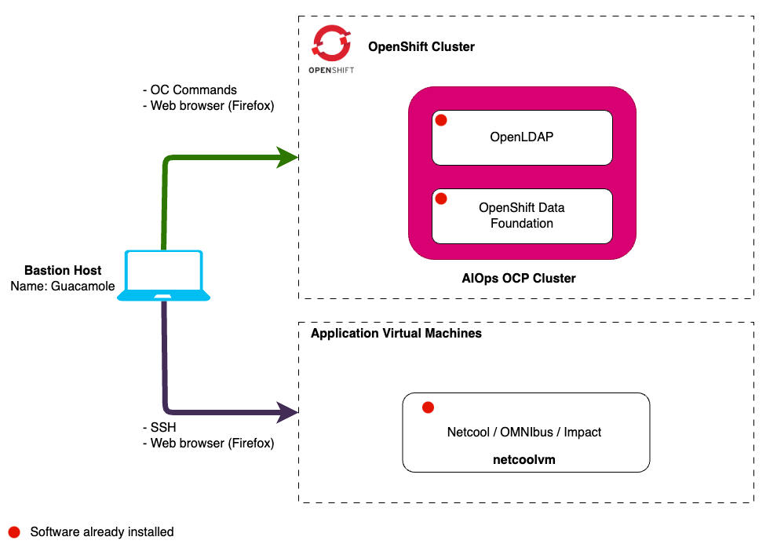
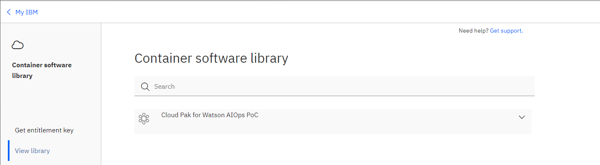

In this Lab, you will have access to one OpenShift cluster via a bastion virtual
machine that has installed Red Hat Enterprise Linux (RHEL). Note that inside
OpenShift, the cluster has installed a Lightweight Directory Access Protocol
(LDAP) server called OpenLDAP that will be used later in the lab. It also has
installed the Red Hat OpenShift Data Foundation (ODF) which is a
software-defined, container-native storage solution that provides storage
classes that will be used by the Cloud Pak for AIOps to dynamically request
storage.

The following diagram describes the initial infrastructure for the Lab:

:::note

One key objective of this Lab is to expose the product public documentation to
the practitioners. With this in mind, each installation steps will reference the
product documentation.

:::

## 2.1: Prerequisites

### Obtain your Entitlement key

You will need an IBM ID to request an entitlement key. You can create an IBM ID
from [here](https://www.ibm.com/account/reg/us-en/signup?formid=urx-19776).

To complete this lab you will need an entitlement key. Navigate to
[**this link**](https://myibm.ibm.com/products-services/containerlibrary) to
obtain your **entitlement key** that is assigned to your IBM ID which will grant
you access to the IBM Entitled Registry. Copy this into a text editor as we will
need it later in the Lab.

You can check your entitlement for the Cloud Pak for AIOPs by clicking **View
Library**

:::info

If your entitlement key is not valid for the Cloud Pak for AIOPs, you can
register for a 60 day trial using the following link:
[Request trial](https://www.ibm.com/account/reg/us-en/login?formid=urx-51074).

:::

## 2.2: Requesting a Lab Environment

import TechZoneStatus from "@site/src/components/techZoneStatus/techZoneStatus.tsx"

Below is a live chart showing Tech Zone capacity in each available region. When
requesting your environment it would be wise to select the region that has the
most capacity available.

<TechZoneStatus />

:::info

Follow
[these instructions](/waiops-tech-jam/labs/jam-in-a-box/#requesting-a-lab-environment)
for step by step guidance on requesting a new lab environment in IBM Tech Zone.

:::

Request Tech Zone environment:

- [Jam-in-a-Box: cp4aiops - Install](https://techzone.ibm.com/my/reservations/create/649aada63a6943001721722a)

## 2.3: Accessing your Lab Environment

:::info

Once you have received an eMail confirming that your environment is ready,
follow
[these instructions](/waiops-tech-jam/labs/jam-in-a-box/#accessing-a-lab-environment)
for step by step guidance on accessing your lab environment in IBM Tech Zone.

:::
