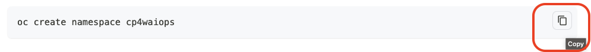
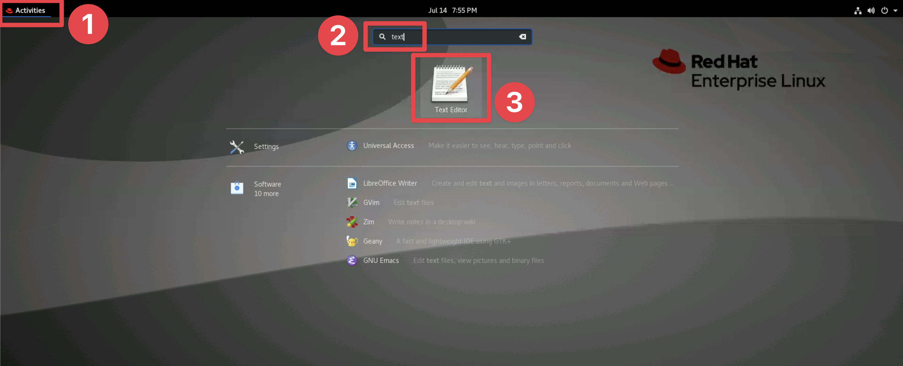
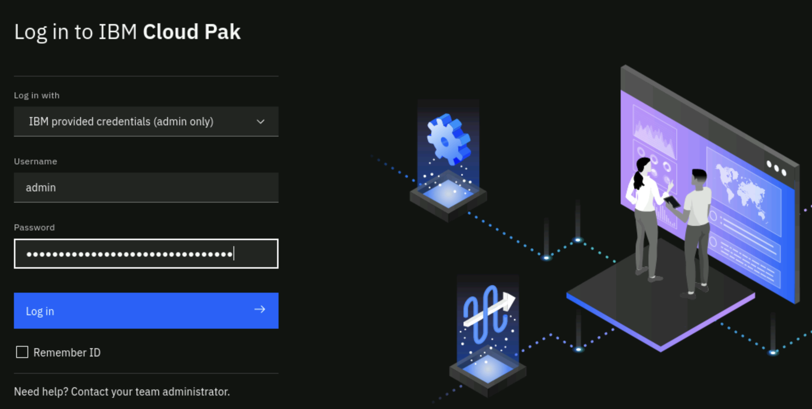

## 3.1: Overview

This module focuses on the initial deployment of the Cloud Pak for AIOps. This
deployment scenario will assume you are deploying onto the IBM Technology Zone,
[Jam-in-a-Box for AIOps](https://techzone.ibm.com/collection/jam-in-a-box-for-aiops/environments)
environments. Note that the same steps would generally apply to an OpenShift
cluster deployed on another cloud provider, or on-premises.

## 3.2: Connect to the OpenShift cluster from bastion VM

In the previous section, we described how to access the bastion VM. Ensure you
have access to the AIOps OCP cluster by running the following command:

```
export KUBECONFIG=/home/admin/kubeconfig-aiops
```

## 3.3: Install the Cloud Pak for AIOps Operator

In this section, our objective will be to deploy the product Operator which will
then pull down the software images to the cluster, so that we can deploy an
instance of the Cloud Pak for AIOps in the next section. You will be copying,
pasting and running the following commands from the **Terminal** window.

:::tip

- It is essential to ensure the indentation is correctly copied from the
  documentation.
- When you copy the commands, use the Copy helper on the right side as shown
  below: 

:::

:::caution

IBM Cloud Pak for AIOps and Infrastructure Automation can co-exist on the same
cluster, but you cannot have multiple instances of IBM Cloud Pak for AIOps or
Infrastructure Automation on the same cluster.

:::

If interested, this install steps we will begin to follow are documented
[**_here_**](https://www.ibm.com/docs/en/cloud-paks/cloud-pak-aiops/4.7.0?topic=installing-starter-installation#exp_namespace).

### Create a custom project (namespace)

Lets start by creating the project (namespace) where we will install the
product. It is important to know which project/namespace you are in when issuing
`oc` commands. Run the following command:

```
oc create namespace cp4aiops
```

### Create an OperatorGroup in your custom project (namespace)

The Operator requires an Operator Group, which provides multitenant
configuration to installed Operators. An Operator group selects target
namespaces in which to generate required RBAC (Role Base Access Control) access
for its member Operators. Run the following command:

```sh
cat << EOF | oc apply -f -
apiVersion: operators.coreos.com/v1
kind: OperatorGroup
metadata:
  name: cp4aiops-operator-group
  namespace: cp4aiops
spec:
  targetNamespaces:
    - cp4aiops
EOF

```

### Create the entitlement key pull secret

Now we will store the
[entitlement key that you obtained previously](https://ibm.github.io/waiops-tech-jam/labs/cloud-pak-aiops/install-lab/lab-environment/#obtain-your-entitlement-key)
into a secret. This secret will be used to pull installation images. Copy &
paste the following command into the **Text Editor** in the bastion VM, add your
entitlement key and run the command from the **Terminal**:

```sh
oc create secret docker-registry ibm-entitlement-key \
    --docker-username=cp \
    --docker-password=<entitlement-key> \
    --docker-server=cp.icr.io \
    --namespace=cp4aiops
```

:::tip

To open the **Text Editor** in the bastion VM, click on **Applications**, type
`text` into the search bar, and click on the **Text Editor** icon.



:::

If interested, this install step is documented
[**_here_**](https://www.ibm.com/docs/en/cloud-paks/cloud-pak-aiops/4.7.0?topic=installing-starter-installation#exp_pull_secret).

### Usage data collection

To help the development of IBM Cloud Pak for AIOps, daily aggregated usage data
is collected to analyze how the product is used. The usage data is collected by
the cp4waiops-metricsprocessor pod, and is sent to and stored in IBM controlled
GDPR-compliant systems. For the purpose of this Lab, we will skip this step.

If interested, this install step is documented
[**_here_**](https://www.ibm.com/docs/en/cloud-paks/cloud-pak-aiops/4.7.0?topic=installing-starter-installation#usage_secret).

### Ensure external traffic access

Run the following command to update the endpointPublishingStrategy.type. This is
done to allow traffic in case the ingresscontroller its set to HostNetwork. Run
the following command:

```
if [ $(oc get ingresscontroller default -n openshift-ingress-operator -o jsonpath='{.status.endpointPublishingStrategy.type}') = "HostNetwork" ]; then oc patch namespace default --type=json -p '[{"op":"add","path":"/metadata/labels","value":{"network.openshift.io/policy-group":"ingress"}}]'; fi
```

If interested, this install step is documented
[**_here_**](https://www.ibm.com/docs/en/cloud-paks/cloud-pak-watson-aiops/latest?topic=aiops-starter-installation#exp_ingress).

### Create the catalog sources

After installation, CatalogSource objects determine
whether the upgrade of your Cloud Pak for AIOps, Cert Manager or License Service deployments are initiated automatically when a new patch becomes available.

The CatalogSources object can be configured to automatically poll for and retrieve a
newer catalog by enabling the polling attribute,
_spec.updateStrategy.registryPoll_. If a newer catalog for a patch is found and
retrieved, then an automatic upgrade of the respective component is
initiated. For the purpose of this Lab, we will disable the automatic initiation
of patch upgrades. Run the following:

```sh
cat << EOF | oc apply -f -
apiVersion: operators.coreos.com/v1alpha1
kind: CatalogSource
metadata:
  name: ibm-aiops-catalog
  namespace: openshift-marketplace
spec:
  displayName: ibm-aiops-catalog
  publisher: IBM Content
  sourceType: grpc
  image: icr.io/cpopen/ibm-aiops-catalog@sha256:9c3abcfcff17f2dfb28efa697de35a7b6bdbade58f1412a81d90283c6b93fe38
---
apiVersion: operators.coreos.com/v1alpha1
kind: CatalogSource
metadata:
  name: ibm-cert-manager-catalog
  namespace: openshift-marketplace
spec:
  displayName: ibm-cert-manager
  publisher: IBM
  sourceType: grpc
  image: icr.io/cpopen/ibm-cert-manager-operator-catalog
---
apiVersion: operators.coreos.com/v1alpha1
kind: CatalogSource
metadata:
  name: ibm-licensing-catalog
  namespace: openshift-marketplace
spec:
  displayName: IBM License Service Catalog
  publisher: IBM
  sourceType: grpc
  image: icr.io/cpopen/ibm-licensing-catalog
EOF
```

If interested, this install step is documented
[**_here_**](https://www.ibm.com/docs/en/cloud-paks/cloud-pak-aiops/4.7.0?topic=installing-starter-installation#exp_catalog).

:::tip

The install step from the IBM Docs installation instructions also includes
details on how to fix the _ibm-operator-catalog_ CatalogSource to always use the
current image digest, instead of _icr.io/cpopen/ibm-operator-catalog:latest_.
This ensures that the ibm-operator-catalog CatalogSource pods do not pull the
latest image if a node reload or other issue causes them to restart.

:::

Confirm the CatalogSources are created by running the following command:

```sh
oc get CatalogSources -n openshift-marketplace
```

### Install Cert Manager

Install the IBM Cloud Pak Certificate Manager:

```sh
cat << EOF | oc apply -f -
apiVersion: v1
kind: Namespace
metadata:
  name: ibm-cert-manager
---
apiVersion: operators.coreos.com/v1
kind: OperatorGroup
metadata:
  name: ibm-cert-manager-operator-group
  namespace: ibm-cert-manager
---
apiVersion: operators.coreos.com/v1alpha1
kind: Subscription
metadata:
  name: ibm-cert-manager-operator
  namespace: ibm-cert-manager
spec:
  channel: v4.2
  installPlanApproval: Automatic
  name: ibm-cert-manager-operator
  source: ibm-cert-manager-catalog
  sourceNamespace: openshift-marketplace
EOF
```

Run the following command to ensure that the IBM Cert Manager pods have a STATUS
of Running before proceeding to the next step:

```sh
oc -n ibm-cert-manager get pods
```

Example output for a successful IBM Cert Manager installation:

```
NAME                                        READY   STATUS    RESTARTS   AGE
cert-manager-cainjector-674854c49d-vstq4    1/1     Running   0          8d
cert-manager-controller-646d4bd6fd-zwmqm    1/1     Running   0          8d
cert-manager-webhook-8598787c8-s4lkt        1/1     Running   0          8d
ibm-cert-manager-operator-c96957695-dkxnm   1/1     Running   0          8d
```

:::warning

Ensure you see all pods in a **Ready 1/1** state before proceeding to the next
step.

:::

### Install the License Service

IBM Cloud Pak for AIOps requires the installation of the IBM License Service.
You must install the IBM License Service on the Red Hat OpenShift cluster that
you are installing IBM Cloud Pak for AIOps on.

Run the following command to create the resource definitions that you need:

```sh
cat << EOF | oc apply -f -
apiVersion: v1
kind: Namespace
metadata:
  name: ibm-licensing
---
apiVersion: operators.coreos.com/v1
kind: OperatorGroup
metadata:
  name: ibm-licensing-operator-group
  namespace: ibm-licensing
spec:
  targetNamespaces:
  - ibm-licensing
---
apiVersion: operators.coreos.com/v1alpha1
kind: Subscription
metadata:
  name: ibm-licensing-operator-app
  namespace: ibm-licensing
spec:
  channel: v4.2
  installPlanApproval: Automatic
  name: ibm-licensing-operator-app
  source: ibm-licensing-catalog
  sourceNamespace: openshift-marketplace
EOF
```

Run the following command to ensure that the IBM License Server pods have a
STATUS of Running before proceeding to the next step.

```sh
oc -n ibm-licensing get pods
```

Example output for a successful IBM License Service installation:

```sh
NAME                                              READY   STATUS    RESTARTS   AGE
ibm-licensing-operator-db4cd746c-xzmlf            1/1     Running   0          8d
```

:::warning

Ensure you see all pods in a **Ready 1/1** state before proceeding to the next
step.

:::

### Verify cluster readiness

In order to finish the Lab on time, we will skip the section regarding verifying
the cluster readiness. Remember to run this verification in a production
implementation.

If interested, this install step is documented
[**_here_**](https://www.ibm.com/docs/en/cloud-paks/cloud-pak-aiops/4.7.0?topic=installing-starter-installation#prereq_check).

### Install the Cloud Pak for AIOps operator

Finally, we are ready to install the Operator. Run the following command:

```sh
cat << EOF | oc apply -f -
apiVersion: operators.coreos.com/v1alpha1
kind: Subscription
metadata:
  name: ibm-aiops-orchestrator
  namespace: cp4aiops
spec:
  channel: v4.7
  installPlanApproval: Automatic
  name: ibm-aiops-orchestrator
  source: ibm-aiops-catalog
  sourceNamespace: openshift-marketplace
EOF
```

After a few minutes you can confirm that the Operator is fully installed by
running the following command:

```
oc get csv -n cp4aiops | egrep "ibm-aiops-orchestrator"
```

You should see **Succeeded** messages as shown below:

```sh
ibm-aiops-orchestrator.v4.7.0         IBM Cloud Pak for AIOps               4.7.0   Succeeded
```

If interested, this install step is documented
[**_here_**](https://www.ibm.com/docs/en/cloud-paks/cloud-pak-aiops/4.7.0?topic=installing-starter-installation#exp_operator).

:::warning

Ensure you see the **Succeeded** status before proceeding to the next step.

:::

## 3.4: Deploy an instance of Cloud Pak for AIOps

This final step involves deploying a running instance of the product onto the
OpenShift cluster. Note in the following command that we specify **accept** the
license, that the installation size is **small**, and the name of the file and
block **storage classes**. In a real deployment, you will have to define the
storage classes in advance. We will get deeper into storage classes later in the
Lab.

Note also that we specify the **TopologyModel**. This is the terminology to use
in the product when defining collections of topology resource groups. Valid
values for TopologyModel are "application" or "service". Run the following
commands:

```sh
export LICENSE_ACCEPT=true
export INSTALL_SIZE=small
export STORAGE_CLASS_FILE=ocs-storagecluster-cephfs
export STORAGE_CLASS_BLOCK=ocs-storagecluster-ceph-rbd
export TOPOLOGY_MODEL=application

cat << EOF | oc apply -f -
apiVersion: orchestrator.aiops.ibm.com/v1alpha1
kind: Installation
metadata:
  name: ibm-cp-aiops
  namespace: cp4aiops
spec:
  imagePullSecret: ibm-entitlement-key
  license:
    accept: ${LICENSE_ACCEPT}
  pakModules:
  - name: aiopsFoundation
    enabled: true
  - name: applicationManager
    enabled: true
  - name: aiManager
    enabled: true
  - name: connection
    enabled: false
  - name: logAnomalyDetection
    enabled: false
  size: ${INSTALL_SIZE}
  storageClass: ${STORAGE_CLASS_FILE}
  storageClassLargeBlock: ${STORAGE_CLASS_BLOCK}
  topologyModel: ${TOPOLOGY_MODEL}
EOF
```

Run the following command to check that the _PHASE_ of your installation is
**Updating**:

```
oc get installations.orchestrator.aiops.ibm.com -n cp4aiops
```

It takes around 60-90 minutes for the installation to complete (subject to the
speed with which images can be pulled). When installation is complete and
successful, the PHASE of your installation changes to **Running**.

:::tip

While you wait for the installation to finish, you can complete the following
Lab sections and come back to complete this section when you are done.

- [Custom Sizing Tool](/labs/cloud-pak-aiops/install-lab/sizing-tool/)
- [Storage, HA and FIPS Considerations](/labs/cloud-pak-aiops/install-lab/storage-ha/)

:::

If your installation phase does not change to **Running** after 60-90 minutes,
use the following command to find out which components are not ready:

```
oc get installation.orchestrator.aiops.ibm.com -o yaml | grep 'Not Ready'
```

If interested, this install step is documented
[**_here_**](https://www.ibm.com/docs/en/cloud-paks/cloud-pak-aiops/4.7.0?topic=installing-starter-installation#exp_instance).

## 3.5: Log in to the Cloud Pak for AIOps console

Now you are going to locate the console URL and the admin login credentials from
your newly deployed instance of the Cloud Pak for AIOps.

Find the URL to access the console with the following command:

```
echo -e "https://$(oc get route -n cp4aiops cpd -o jsonpath='{.spec.host}')\n"
```

Find the password for the **cpadmin** username by running the following command:

```
oc -n cp4aiops get secret platform-auth-idp-credentials -o jsonpath='{.data.admin_password}' | base64 -d ; echo -e "\n"
```

Open a Firefox browser window and copy & paste the **Cloud Pak for AIOps URL**
that you got in the previous step. Note that you will get one or more security
**Warning: Potential Security Risk Ahead**. This is because we have used
self-signed certificates for this Lab. Just accept the risk and continue.

Make sure you can login as **cpadmin**, as shown below, using the password from
the previous command.

:::tip

If interested, the cluster access step is documented
[**_here_**](https://www.ibm.com/docs/en/cloud-paks/cloud-pak-aiops/4.7.0?topic=installing-starter-installation#exp_login).

:::



---

After confirming you can login as **cpadmin** you can read through the labs
**Custom Sizing Tool** and **Storage, HA and FIPS Considerations** and then
complete the final Lab section **LDAP Integration**
