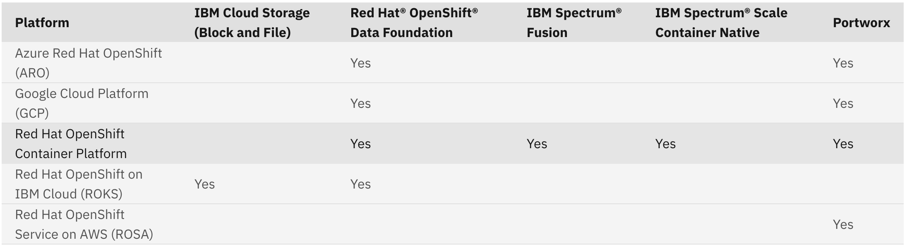
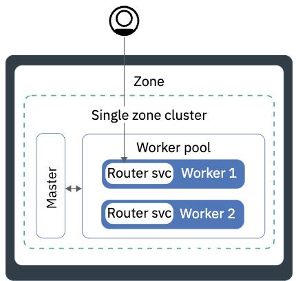
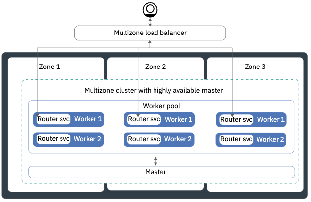

## 5.1: Storage Considerations

The Cloud Pak for AIOps requires persistent storage classes that support the RWO (read-write-once) and RWX (read-write-many) access modes.
Also, storage classes must have allowVolumeExpansion enabled. This allows persistent volumes to be expanded if necessary, to avoid 
storage from filling up and causing unrecoverable failures. 

:::note
If you require your Cloud Pak for AIOps environment to support the Federal Information Processing Standards (FIPS), there are storage
related requirements as described later in this section.
:::

### Recommended Storage Providers

The following table shows the tested and supported storage providers that are recommended for a deployment of the Cloud
Pak for AIOps. Note that these storage providers are the only providers that have been tested and validated for a deployment
the product. You can choose to use an alternate storage provider but they must meet the same storage and hardware requirements 
as the recommended storage providers. For instance, your chosen provider must support the required access modes and storage modes.

Additional storage information is available in the [***public documentation***](https://www.ibm.com/docs/en/cloud-paks/cloud-pak-watson-aiops/4.1.0?topic=planning-storage-requirements).

## 5.2: High Availability Considerations

### Background

As the Cloud Pak for AIOps is used to monitor a client's high value work loads, its important to deploy the solution in a way that
minimizes potential downtime of the product itself. This brings us two related capabilities:

* High-availability (HA) methods assume that an application remains available even when failures occur and is often
implemented through replicated services, replicated data and automatic load balancing that directs requests to 
healthy services. Recovery time is near zero and no data is lost in the recovery process. 
HA requires that two or more (depending on the storage technology) replicas of stateless services and 
stateful sets to be present.

* Disaster Recovery (DR) methods usually assume the total loss of a data center therefore the focus is on recovering the 
application back to an active state. This inherently introduces a non-zero recovery time, and often recovery point 
(in the asynchronous case), in failing over to the secondary site.

These two capabilities typically work in tandem as a variety of techniques are available. The technique chosen will likely
involve a combination/trade-off between cost, availability, and the amount of time or data that can be lost should 
recovery be necessary.

:::note
* Disaster Recovery (DR) methods are outside the scope of this Lab but additional information can be found in 
the [***public documentation***](https://www.ibm.com/docs/en/cloud-paks/cloud-pak-watson-aiops/4.1.0?topic=pak-backing-up-restoring-cloud-watson-aiops)
:::

#### Failure Domains

A failure domain defines the context of a failure in terms of the components of a system/application that are affected. The 
domain describes which capabilities are not available when a component or systems experience a failure.

Example **failure domains** for OpenShift applications are listed below. Each failure domain has implications on the availability of an application.

1.  An individual pod
2.  An OpenShift cluster node (master or worker)
3.  An availability zone (a zone can be represented by a data center or an autonomous section inside a data center)
4.  A geographical region (e.g. a city or region that may contain multiple data centers or zones)

:::note
At the time of writing this Lab: 
* only two deployment options are supported: single-zone and multi-zone deployments
* there is no support for geographical region failures (#4)
:::

### Single-Zone Deployment

OpenShift itself provides high availability for failure domains that include pods and, in some cases, 
cluster nodes within the same cluster though replicas and automated placement/movement. Stateful sets
can leverage cloud native storage and/or external storage (in other words, not local node storage) so that
pods can fail but the same storage can be accessed from another node to which the stateful set pods are moved in the cluster.

In practice, this means that most OpenShift components are HA by default. For example, there are multiple control
plane nodes and related controllers. If one fails, the survivors handle the workload. The stateful ETCD database
is replicated by default across the control plane.

In addition, OpenShift provides means for the workloads in the cluster to be HA without too many special considerations
at the application level. For stateless components, this is accomplished by simple pod replication. If one pod
fails, OpenShift simply routes the work to the surviving pods. Achieving HA in stateful components is more nuanced but
it can be achieved via storage replication at a layer which is mostly independent of OpenShift itself. It can also be 
achieved by the stateful containers themselves based on the way they choose to persist the data. Specifically in Cloud Pak for 
AIOps, stateful components are typically limited to data stores, with the majority of service pods being stateless components. 

In summary, a single-zone deployment supports:
* An individual pod failure (#1): Each pod the Cloud Pak for AIOps includes health check endpoints. When a pod reports it is not healthy, OpenShift will 
terminate it, and start a new instance.

* An Openshift cluster node failure (#2): When the Cloud Pak for AIOps is installed in Production/HA mode, 
multiple replicas will be created for most pods (note that some pods run as singletons as the processing they do is
not time-critical). In addition, each stateless pod in the product includes proper anti-affinity labels, 
to ensure that multiple replicas are spread across nodes.

### Multi-Zone Deployment

:::caution
Note that Multi-Zone support is only available for ROSA (Red Hat OpenShift on AWS) and is considered a "Tech Preview" feature for v4.1
:::

A multi-zone cluster is similar to a single zone cluster, but its worker nodes spread across multiple availability zones.
Each zone has isolated network, power etc, providing additional availability. This might mean multiple closely located
data centers, say in a cloud provider, or it could be as close as different server racks with isolated power/network etc.

These multiple zones ensure that common outages, such as network problems, power interruptions, etc do not affect the 
whole cluster therefore applications remain available, unless there is a widespread disaster that impact all zones (#4).

In summary, a multi-zone deployment adds support for:

* An availability zone failure (#3): As the pods have anti-affinity labels to be spread across nodes, in a multi-zone deployment
OpenShift will automatically spread these instances across nodes in different zones.

## 5.3: FIPS Considerations

The Federal Information Processing Standards (FIPS) are standards and guidelines that are issued by the National
Institute of Standards and Technology (NIST) for federal government computer systems. The standards are 
developed when compelling federal government requirements for standards, such as for security and 
interoperability, exist, but acceptable industry standards or solutions do not exist. Government 
agencies and financial institutions use these standards to ensure that products conform to specified 
security requirements.

### Encryption with FIPS Support Enabled

When FIPS support is enabled, the Cloud Pak for AIOps uses cryptographic modules that are compliant with 
Level 1 of the Federal Information Processing Standard FIPS-140-2. Certificates that are used internally 
are encrypted by using FIPS-approved cryptography algorithms. FIPS-approved modules can optionally be used 
for the transmission of data. Traffic inside the Cloud Pak for AIOps boundary is still secure, as traffic 
between nodes is automatically encrypted at the Red Hat OpenShift Container Platform level when TLS protection
is enabled, while traffic inside a given node happens in-memory and does not leave the node. This is also valid
for the IBM Cloud Pak foundational services that are used by the Cloud Pak for AIOps.

With FIPS enabled, Data is FIPS encrypted at rest and also inbound communications are FIPS encrypted. Outbound 
communications can support both FIPS enabled and non-enabled connections. For FIPS enabled connections, outbound 
connections rely on the server to ensure FIPS ciphers are chosen. To ensure that connections, including Observers, 
are FIPS enabled, an external service to mandate the use of FIPS compliant ciphers when negotiating encryption is required.

### Enabling FIPS Support

To enable FIPS support you need to install the product on a Red Hat OpenShift Container Platform cluster that 
is already running in a FIPS enabled mode. You also need to complete some tasks before and while you are installing the product on your 
cluster.

:::warning
You can only enable FIPS support when you are installing the product. You cannot upgrade a non-FIPS enabled environment to a 
FIPS enabled environment. You also cannot backup the Cloud Pak for AIOps from a non-FIPS enabled environment and 
restore it into a FIPS enabled environment.
:::

To enable FIPS support, the following links describe the tasks required for the OpenShift cluster and Cloud Pak for AIOps installation:

* [Installing Red Hat OpenShift Container Platform and storage tasks required for compliance](https://www.ibm.com/docs/en/cloud-paks/cloud-pak-watson-aiops/4.1.0?topic=fips-enabling-support-cloud-pak-watson-aiops#preinstall)
* [Installing Cloud Pak for AIOps tasks required for compliance](https://www.ibm.com/docs/en/cloud-paks/cloud-pak-watson-aiops/4.1.0?topic=fips-enabling-support-cloud-pak-watson-aiops#install_tasks)
* [Conditional tasks required for compliance](https://www.ibm.com/docs/en/cloud-paks/cloud-pak-watson-aiops/4.1.0?topic=fips-enabling-support-cloud-pak-watson-aiops#conditional)