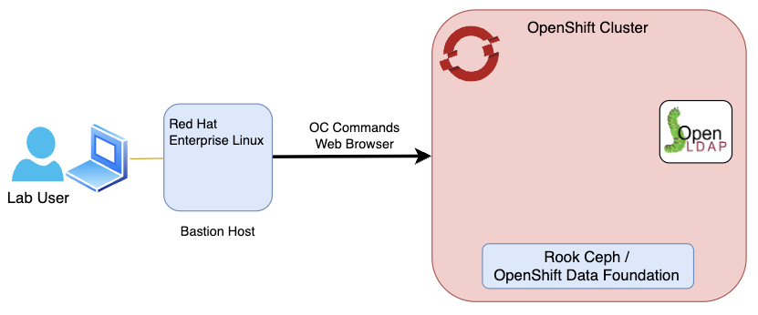

:::caution
This Lab has been tested only with the Cloud Pak for Watson AIOps v4.1.0 
:::

Welcome to the Cloud Pak for Watson AIOps installation lab.
The following chart describes the infrastructure for the Lab:

:::note
- One key objective of this Lab is to expose the product public documentation 
to the practitioners. With this in mind, each installation steps will reference 
the product documentation.
:::

### Lab Content

In this Lab, we will explore the following topics:

* How to install a small size deployment of the Cloud Pak for Watson AIOPs
* How to custom size deployments based on actual workloads and functionality needs using the "custom sizing tool"
* An overview of Storage requirements, support for High Availability and FIPS (Federal Information Processing Standard) considerations
* How to configure the integration with a Lightweight Directory Access Protocol (LDAP)
