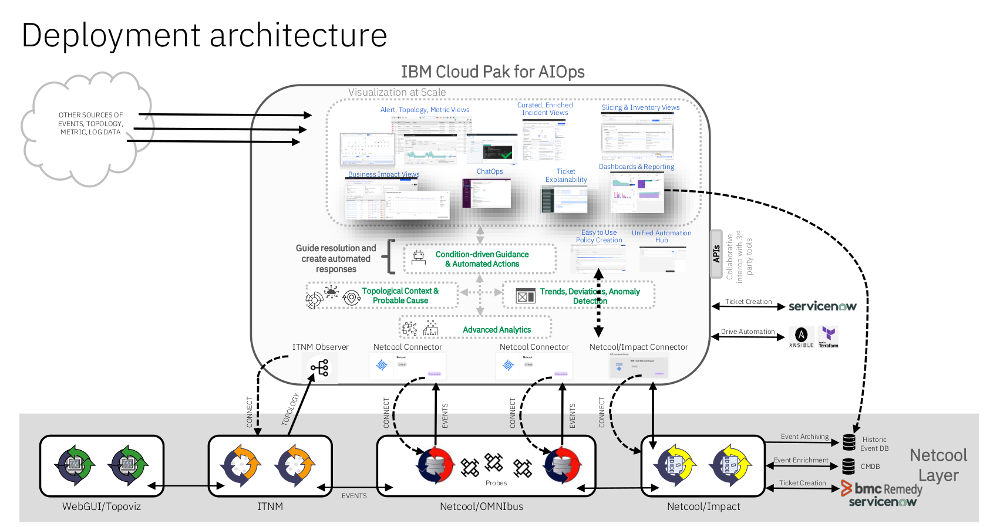

:::danger
This lab is still under construction and is not yet available. This banner will be removed when it is ready for use.
:::

After a successful installation of the IBM Cloud Pak for AIOps, a common task will be to integrate an existing Netcool deployment into AIOps.

AIOps will sit on top of an existing Netcool deployment, using Netcool/OMNIbus as an event source, and Netcool/Impact as an automation and integration engine. While some functions will be reimplemented in AIOps, many can remain in the Netcool layer, for example, event enrichment or ticketing integrations.

### Lab Content

In this Lab, we will explore the following topics:

- Set up the Netcool Connector to connect to an existing ObjectServer
- Set up the Netcool/Impact Connector to connect to an existing Netcool/Impact server
- Set up an AIOps event housekeeping automation using Netcool/Impact
- Create a right-click tool in AIOps that calls a Netcool/Impact policy

The lab should be executed in the numbered order that you see on the left side of the screen in the navigation pane as sections depend on work completed in prior sections.
