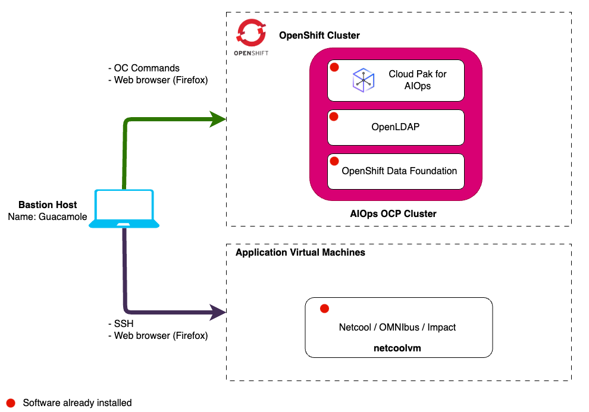
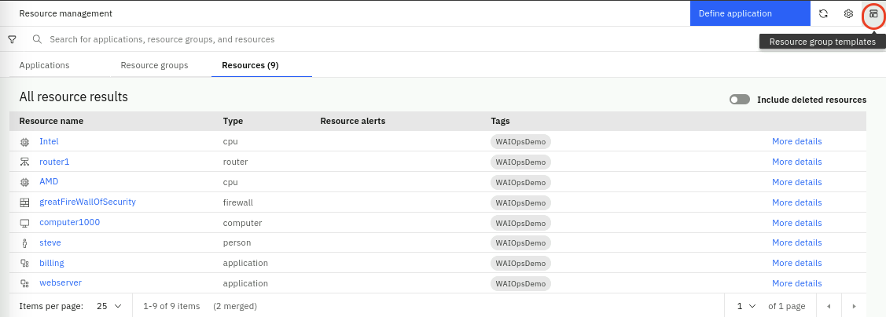
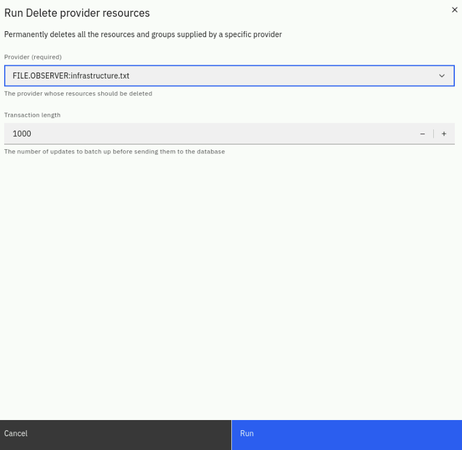

import RequestingLabEnvironment from "@site/src/components/requestingLabEnvironment/RequestingLabEnvironment"
import ObtainingEntitlementKey from "@site/src/components/obtainingEntitlementKey/ObtainingEntitlementKey"
import RunningOcCommands from "@site/src/components/runningOcCommands/RunningOcCommands"
import LogInAiopsConsole from "@site/src/components/logInAiopsConsole/LogInAiopsConsole"
import CreateIbmId from "@site/src/components/createIbmId/CreateIbmId"
import AiopsTrialLicenseAdmonition from "@site/src/components/trialLicense/TrialLicense"

In this Lab, you will have access to one OpenShift cluster via a bastion virtual
machine that has installed Red Hat Enterprise Linux (RHEL). Note that inside
OpenShift, the cluster has installed the Cloud Pak for AIOps. It also has
installed the Red Hat OpenShift Data Foundation (ODF) which is a
software-defined, container-native storage solution that provides storage
classes that will be used by the Cloud Pak for AIOps to dynamically request
storage.

The following diagram describes the infrastructure for the Lab:

:::note

There is also a regular virtual machine present that has Netcool/OMNIbus and
Netcool/Impact installed. A Simnet Probe is running and feeding a stream of
events into Netcool/OMNIbus. The Netcool assets on this virtual machine will be
used in this lab.

:::

## 2.1: Prerequisites

<CreateIbmId />

<ObtainingEntitlementKey />

<AiopsTrialLicenseAdmonition />

## 2.2: Requesting a Lab Environment

<RequestingLabEnvironment
   environmentName="Cloud Pak for AIOps - Migrate from Netcool"
   environmentUrl="https://techzone.ibm.com/my/reservations/create/6694a5c277b630001e0ce877"
/>

## 2.3: Logging In

### Connecting to the OpenShift Cluster

<RunningOcCommands />

### Cloud Pak for AIOps Console

<LogInAiopsConsole />

## 2.4: Lab Data Cleanup

If you have just provisioned a new lab environment from TechZone, you can skip this section.

Otherwise, if this environment has been used for a previous lab, **ask the Lab Instructor** if you need to remove any leftover configuration and data
before you proceed with the lab exercises. If you need to do a cleanup, follow the steps below. 

### Integrations Cleanup

From the burger menu in the top-left navigate to: **Define → Integrations**. 
Delete all integrations listed. To delete an integration: 
Select the integration type, and click on the trash can icon on the right, on the popup dialog type the integration name and click on **Delete**
 as shown below. Don't wait for the deletion to complete, you can proceed to the next step.

 

### Alert Cleanup

From the burger menu in the top-left navigate to: **Operate → Alerts**. If you see any alerts listed:

* Select all the Alerts, right-click and select **Clear**. Select **Continue** on the popup dialog.
* The Alerts will change state from Open to Clear and eventually to Closed.
* Don't need to wait for them to be Closed, you can proceed to the next step.

### Topology Cleanup: resource groups

From the burger menu in the top-left, navigate to: **Operate → Resource
management**. In the **Resource management** page, click on the **Resource group
templates** icon in the top-right.

In the **Resource group templates** page, select any existing templates and click on the **Delete topology template** in the top-right.
Click **Delete** on the popup dialog.

### Topology Cleanup: resources

From the burger menu in the top-left, navigate to: **Operate → Resource
management**. In the **Resource management** page, click on the **Settings**
gear icon in the top-right as shown below:

Select **Topology configuration**. From the **Topology configuration** page, in
the **Data administration routines** card shown below select **Configure**.
On the **Data administration routines** page, in the top-right select **Run a routine**
and on the popup dialog select **Delete provider resources** as shown below:

On the **Run delete provider resources** dialog, select FILE.OBSERVER:infrastructure.txt 
and click on **Run** as shown below. Click **Yes** on the popup dialog to confirm.

Repeat this step for every FILE.OBSERVER:*filename.txt* that you see listed.

### Topology Cleanup: observer jobs

* From the burger menu in the top-left navigate to: Define → Integrations
* From the Integrations page, click on **Manager observer jobs** and select **Configure, schedule, and manage observer jobs**
* Delete all existing jobs by clicking on the 3 dots on the right and selecting **Delete** as shown below. Confirm the deletion on the popup dialog.

