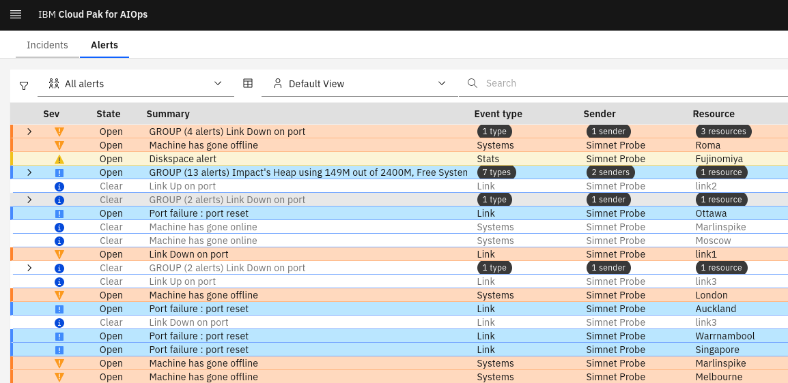
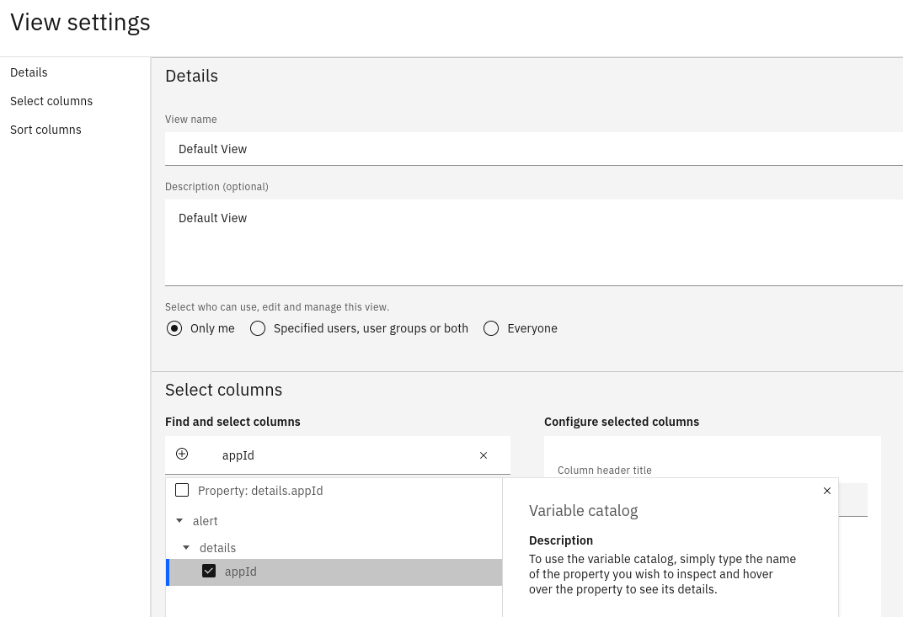
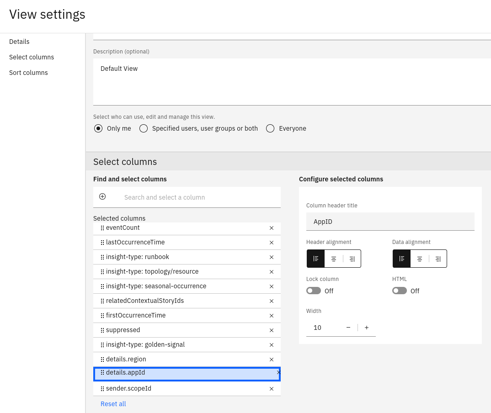
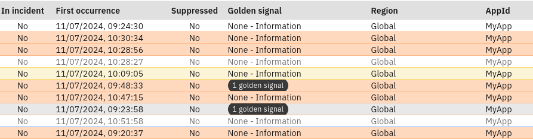

## 3.1: Overview

In this Lab, you will create an instance of the Netcool Connector to connect to an existing Netcool/OMNIbus ObjectServer. Most, if not all, AIOps deployments will include Netcool/OMNIbus components, including Probes and ObjectServers. Creating and configuring the Netcool Connector therefore is usually going to be a key part of any AIOps set-up.

This lab will include the tasks of creating and configuring the Netcool Connector instance, adding custom Netcool/OMNIbus fields to the mapping, and then updating the Alerts viewer View to include a custom attribute.

## 3.2: Create a Netcool Connector instance

Use the following steps to create an instance of the Netcool Connector:

- Log in to the AIOps console and select **Integrations** from the main menu
- Click the **Add integration** button to add a new integration
- Type **Netcool** into the Search bar
- Choose **IBM Netcool Operations Insight ObjectServer** and click **Get started** to create a new instance

### Configure ObjectServer

:::warning
Ignore the instructions in the UI and follow the steps below instead, which are specific to this lab.
:::

The first part of the Netcool Connector instance configuration, is to prepare the ObjectServer to be connected to by AIOps. This involves adding a few fields and a trigger that facilitates the two-way update mechanism between AIOps and Netcool.

Open a command terminal, connect to the ObjectServer VM via SSH. Use the following command (no password is required):
```
ssh jammer@netcoolvm
```

Login to the ObjectServer:
```
$OMNIHOME/bin/nco_sql -server AGG_P -user root -password netcool
```

Copy and paste the following SQL into the SQL prompt:
```
alter table alerts.status add column ScopeID varchar(255);
go

alter table alerts.status add column AIOpsAlertId varchar(64);
go

alter table alerts.status add column AIOpsState varchar(16);
go

create or replace trigger group NetcoolConnectorAutomation;
go

alter trigger group NetcoolConnectorAutomation set enabled true;
go

CREATE OR REPLACE TRIGGER netcool_connector_closed_alerts
GROUP NetcoolConnectorAutomation
PRIORITY 15
COMMENT 'Netcool Connector handle closed alerts in AIOps'
AFTER UPDATE ON alerts.status
FOR EACH ROW
WHEN get_prop_value('ActingPrimary') %= 'TRUE' and
	new.AIOpsState = 'closed'
begin

	delete from alerts.status via new.Identifier;
end;
go
```
:::warning
Make sure to type Enter/Return after the last `go` to execute the SQL.
Type `quit` to exit the SQL prompt.
:::

:::tip
In a production environment, this SQL would need to be added to both the primary and backup ObjectServers. In this lab however, we will only be using a single primary ObjectServer.
:::

### Add integration

This next step involves the setting up the connection details for the target ObjectServer. In a production scenario, you would enter the details for both the primary and the backup. In this lab, we will only be using the primary.

- **Name**: the label you want to give this integration instance
- **Description**: an optional description to give this instance
- **Deployment options**: Choose a **Local** instance (deployed on the OpenShift cluster)
- **Admin username**: enter `root`
- **Admin password**: enter `netcool`
- **Filters**: clear the contents of this box (ie. leave it blank)
- **Is TLS enabled?**: leave set to "No"
- **Hostname**: Enter: `netcoolvm`
- **Port**: enter: `4100`
- Click the **Test connection** button and verify the connection is OK
- Click the **Next** button to continue

:::tip
In a production environment, we would enter the connection details for both the primary and backup ObjectServers. In this lab however, we will only be using a single primary ObjectServer.
:::

### Collect event data

:::warning
Again, ignore the instructions in the UI and follow the steps below instead, which are specific to this lab.
:::

This final step is where you configure the mapping between ObjectServer fields and AIOps. Replace the mapping shown with the following mapping instead:

```
(
  $isIPAddr := function($i){ $contains($i,/^[0-9]+.[0-9]+.[0-9]+.[0-9]+$/)};
  $isProblem := function($v) { $v = 1 or $v = 3 or $v = 20 or ($v >= 7 and $v < 20) or $v = 0 };
  $isResolution := function($v) { $v = 2 or $v = 4 or $v = 21 };
  $isInformation := function($v) { $v = 13 }; 
  { 
    "summary": alert.@Summary,
    "deduplicationKey": alert.@Identifier,
    "sender": {
        "service": alert.@Agent ? alert.@Agent : undefined,
        "name": alert.@Manager ? alert.@Manager : alert.@ServerName,
        "connectorType": "netcool",
        "managedBySender": "true"
    },
    "resource": {
        "name": alert.@Node = "" ? alert.@NodeAlias = "" ? undefined : alert.@NodeAlias : alert.@Node,
        "location": alert.@Location = "" ? undefined : alert.@Location,
        "ipAddress": $isIPAddr(alert.@NodeAlias) ? alert.@NodeAlias : $isIPAddr(alert.@Node) ? alert.@Node : undefined,
        "hostname": $not($isIPAddr(alert.@Node)) ? alert.@Node : undefined,
        "sourceId": alert.@NodeAlias = "" ? undefined : alert.@NodeAlias,
        "service": alert.@Service = "" ? undefined : alert.@Service,
        "port": alert.@PhysicalPort = 0 ? undefined : alert.@PhysicalPort,
        "physicalslot": alert.@PhysicalSlot = 0 ? undefined : alert.@PhysicalSlot,
        "physicalcard": alert.@PhysicalCard = "" ? undefined : alert.@PhysicalCard,
        "scopeId": alert.@ScopeID = "" ? undefined : alert.@ScopeID
    },
    "type": {
        "eventType": alert.@Type = 2 ? "resolution" : alert.@Type = 4 ? "resolution" : "problem",
        "classification": alert.@EventId = "" ? alert.@AlertGroup: alert.@EventId
    },
    "eventCount": alert.@Tally,
    "signature": alert.@Identifier,
    "firstOccurrenceTime": alert.@FirstOccurrence,
    "lastOccurrenceTime": alert.@LastOccurrence,
    "severity": $isInformation(alert.@Type) ? 2 : alert.@Severity < 0 ? 1 : alert.@Severity = 0 ? 2 : alert.@Severity < 6 ? alert.@Severity + 1 : alert.@Severity >= 6 ? 6,
    "state": alert.@Severity = 0 ? (alert.@AIOpsAlertId = "" ? "open" : "clear") : "open",
    "acknowledged": alert.@Acknowledged = 1 ? true : false,
    "expirySeconds": alert.@ExpireTime = 0 ? undefined : alert.@ExpireTime,
    "suppressed": alert.@SuppressEscl = 4 ? true : false,
    "details": {
        "alertGroup": alert.@AlertGroup,
        "alertKey": alert.@AlertKey,
        "customer": alert.@Customer = "" ? undefined : alert.@Customer,
        "appId": alert.@AppID = "" ? undefined : alert.@AppID,
        "region": alert.@Region = "" ? undefined : alert.@Region
    },
    "insights": [
      {
        "details": {
          "lastProcessedEventOccurrenceTime": alert.@LastOccurrence
        },
        "id": "event-occurrence",
        "type": "aiops.ibm.com/insight-type/deduplication-details"
      }
    ]
  }
)
```

Click **Save** to save and create the Netcool Connector instance.

:::note
Custom fields are added as sub-attributes of the `details` attribute. In the above example, we are mapping the Netcool/OMNIbus custom fields `@AppId` and `@Region` to AIOps attributes, and hard-coding a further attribute `details.alertOrigin` to "OMNIbus" for events coming through this integration.
:::

## 3.3: Clear the events in Netcool/OMNIbus

The Netcool Connector won't pick up any events that already exist in the ObjectServer. For this reason, it is important to clear the contents of the ObjectServer and start with a clean slate.

Open a command terminal, connect to the ObjectServer VM via SSH, and log in to the ObjectServer:
```
ssh netcool@netcoolvm
$OMNIHOME/bin/nco_sql -server AGG_P -user root -password netcool
```

Copy and paste the following SQL into the SQL prompt:
```
delete from alerts.status;
go
```

::::warning
Make sure to exit the SSH session with the netcool VM by typing `exit`.
Your terminal prompt should show `admin@bastion-gym-lan` 
::::  

## 3.4: View the Alerts viewer

The final confirmation step is to log in to AIOps and inspect the **Alerts viewer**.

- Log in to the AIOps console and select **Alerts** from the main menu
- View the alerts coming through from Netcool/OMNIbus
- Double-click one of the alerts and inspect some of the attributes as defined in the Netcool Connector mapping



## 3.5 Add custom fields to your view

Finally, you will add your custom-mapped fields to your Alerts viewer **View**. To do this, click on the **View configuration** button, then select **Manage selected view**. 
Type in the name of the field (**details.appId**) in the **Search and select a column** box and check the ones you want to add:



Next, drag the field so it is in the correct order in the View. Finally, set the column heading, justification, and size in the **Configure selected columns** box:



Click **Save** to save your update and inspect the result in the Alerts viewer:


