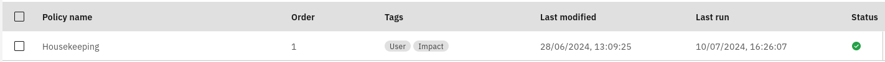
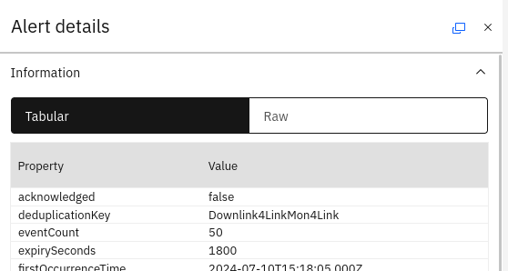

## 5.1: Overview

In this Lab, you will create an event housekeeping automation that will set the `expirySeconds` attribute for every event. When this attribute is set, an internal AIOps automation will automatically clear any events whose last occurrence is more than `expirySeconds` ago. Note that this is equivalent to setting the `@ExpireTime` field in Netcool/OMNIbus, which is then acted on by the `expire` trigger. Indeed, if you map the `@ExpireTime` field to the `expirySeconds` attribute in AIOps, it will achieve the same result. It is important to have a default event expiry automation in-place in AIOps in any case however, since not all events in AIOps originate in Netcool, and hence there needs to be some sort of régime in-place to cater to these events too.

## 5.2 Create a Netcool/Impact policy

In this section, you will create a JavaScript policy in Netcool/Impact that will be used to set the `expirySeconds` attribute in events, depending on the criteria that are define. In our case, we will create a policy that sets `expirySeconds` based on the severity of the event. Use the following steps to create the new housekeeping policy in Netcool/Impact:

- Navigate to the Netcool/Impact GUI: `https://netcoolvm:16311/ibm/console`
- Log in to Netcool/Impact as the user `impactadmin` and password `netcool`
- Click on **Policies**
- Click on the pull-down menu button on the new policy button and select **JavaScript Policy**
- Copy and paste the following sample policy into the policy editor:
```
// ONLY SET expirySeconds FOR EVENTS WHERE IT IS NOT SET
if (String(EventContainer.alert.expirySeconds) == "undefined") {
  // KEEP CRITICAL ALERTS FOR SEVEN DAYS
  if (Int(EventContainer.alert.severity) == 6) {
    aiopsUtils.patchAlertNoWait(EventContainer.alert.id,{expirySeconds:604800});}
  // KEEP MAJOR ALERTS FOR FIVE DAYS
  else if (Int(EventContainer.alert.severity) == 5) {
    aiopsUtils.patchAlertNoWait(EventContainer.alert.id,{expirySeconds:432000}); }
  // KEEP MINOR ALERTS FOR THREE DAYS
  else if (Int(EventContainer.alert.severity) == 4) {
    aiopsUtils.patchAlertNoWait(EventContainer.alert.id,{expirySeconds:259200}); }
  // KEEP WARNING ALERTS FOR ONE DAY
  else if (Int(EventContainer.alert.severity) == 3) {
    aiopsUtils.patchAlertNoWait(EventContainer.alert.id,{expirySeconds:86400}); }
  // KEEP INFORMATIONAL EVENTS FOR TWELVE HOURS
  else if (Int(EventContainer.alert.severity) == 2) {
    aiopsUtils.patchAlertNoWait(EventContainer.alert.id,{expirySeconds:43200}); }
  // KEEP INDETERMINATE EVENTS FOR SIX HOURS
  else if (Int(EventContainer.alert.severity) == 1) {
    aiopsUtils.patchAlertNoWait(EventContainer.alert.id,{expirySeconds:21600}); }
} 
```
- Click on the **Save** button and save the policy as: `AIOPS_Housekeeping`

## 5.3 Create a new AIOps policy

In this section, you will create an AIOps automation policy that will send events to the newly created Netcool/Impact policy.

Use the following steps to create the new AIOps automation policy:

- Log in to the AIOps console and select **Automations** from the main menu
- Click the **Create policy** button and choose **Invoke IBM Tivoli Netcool/Impact** to create a new policy
- **Policy name**: give your policy the name: `Housekeeping`
- **Trigger entity**: leave it set to `Alert`
- **Trigger entity type**: ensure **After an alert is created**`** is checked
- **Trigger entity type**: ensure **After an alert has been updated**`** is checked
- Set **Alert property** to **Value of: alert.eventCount** and **Change** to **changes**
- Under **Condition sets**, click the **Add condition** button and choose **Alert property**
- Under **Alert properties** set **Property** to **Value of: alert.eventCount**, **Operator** to **greater or equal**, **Matches** to **only**, and **Value** to **Number: 1**
- Scroll down to the section: **Then take the following actions:**
- Under **Impact connection**, select your Netcool/Impact integration
- Under **Impact policy**, select your Netcool/Impact housekeeping policy: `AIOPS_Housekeeping`
- Under **Impact policy parameter mapping options**, select **Send the full alert**
- Scroll back up to the top of the page and click on the **Create policy** button

:::tip
You can check that the policy is firing by checking the **Last run** timestamp in the Automations Policies view:

:::

## 5.4: Clear the events in Netcool/OMNIbus

Reset the event set in your system by clearing out all the old events in the source: Netcool/OMNIbus.

Open a command terminal, connect to the ObjectServer VM via SSH, and log in to the ObjectServer:
```
ssh netcool@netcoolvm
$OMNIHOME/bin/nco_sql -server AGG_P -user root -password netcool
```

Copy and paste the following SQL into the SQL prompt:
```
delete from alerts.status;
go
```

## 5.5: View the Alerts viewer

The final confirmation step is to log in to AIOps and inspect the **Alerts viewer**.

- Log in to the AIOps console and select **Alerts** from the main menu
- FInd some alerts coming through from Netcool/OMNIbus
- Double-click one of the alerts and check that the `expirySeconds` attribute is being set:

