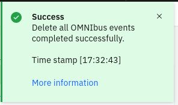
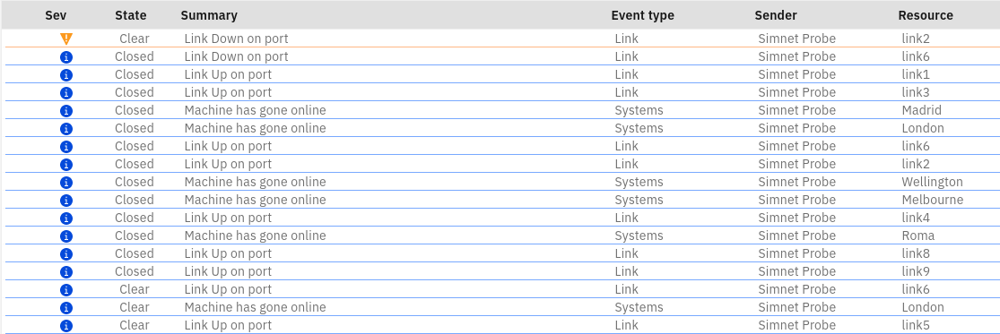

## 6.1: Overview

In this Lab, you will create a right-click tool that calls a Netcool/Impact policy that will delete all the events in the Netcool/OMNIbus event source. This will provide a convenient way to effectively refresh the event estate coming from Netcool/OMNIbus.

## 6.2 Create a Netcool/Impact policy

In this section, you will create a JavaScript policy in Netcool/Impact that will be used to delete all events in the Netcool/OMNIbus event source (ie. the ObjectServer). Use the following steps to create the new event deletion policy in Netcool/Impact:

- Navigate to the Netcool/Impact GUI: `https://netcoolvm:16311/ibm/console`
- Log in to Netcool/Impact as the user `impactadmin` and password `netcool`
- Click on **Policies**
- Click on the pull-down menu button on the new policy button and select **JavaScript Policy**
- Copy and paste the following sample policy into the policy editor:
```
MySQL = "delete from alerts.status";
DirectSQL("defaultobjectserver", MySQL, false, false);
```
- Click on the **Save** button and save the policy as: `AIOPS_DeleteEvents`

## 6.3 Create a new AIOps action

In this section, you will create an AIOps automation policy that will send events to the newly created Netcool/Impact policy.

Use the following steps to create the new AIOps automation policy:

- Log in to the AIOps console and select **Automations** from the main menu
- Click on the **Actions** tab and click on the **Create action** button
- **Type**: choose **HTTP**
- **Name**: enter: `Delete all OMNIbus events`
- Scroll down to the **Action HTTP request**
- **Target API**: choose **Custom API**
- **API endpoint**: enter: `https://netcoolvm:9081/restui/policyui/policy/AIOPS_DeleteEvents/run`
- **Method**: choose **GET**
- **Username**: enter: `impactadmin`
- **Password**: enter: `netcool`
- **Accept**: enter: `*/*`
- **Ignore certificate errors**: checked
- Click **Publish** to save your Action and make it available for selection

## 6.4 Create a right-click tool

In this section, you will create a right-click tool that calls the action you just created.

Use the following steps to create the new AIOps right-click tool:

- Log in to the AIOps console and select **Alerts** from the main menu
- Click on the little cogwheel icon in the top-right corner of the page and select **Configure alerts contextual menu**
- Click on the **Add menu item** button on the top right-corner of the page
- **Menu item label**: enter: `Delete all OMNIbus events`
- **Select who can use, edit and manage this menu item.**: set to **Everyone**
- **Everyone can**: set to **Use this menu item**
- Scroll down to the **Action definition** section
- **Select an action**: choose: **Delete all OMNIbus events**
- **Conditions**: ensure **Always show menu item in the contextual menu.** is selected
- Click on **Save** to save your new menu item
- Click on **Save** to save you new contextual menu layout
- Click on **Alerts** on the top-left corner of the page to return to the Alerts viewer
- Right-click on any event and select your new tool
- Observe the **Success** message in the top-right corner of the page



The tool will delete all events in the Netcool/OMNIbus ObjectServer. It will take a few moments for the deletion in Netcool/OMNIbus to propagate through to AIOps via the Netcool Connector. Click on the refresh button a few times until you see the Clear and Closed events visible in the Alerts viewer. Note that since the Probe is continuing to run, you will still see new events streaming in, despite all the older events now having been closed.




