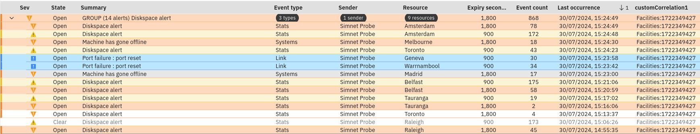

## 7.1 Overview

In this final Lab, you will work through the process of migrating a correlation from Netcool/OMNIbus to AIOps. We will start with the premise that we have an existing correlation whereby events are being correlated according to a custom automation. The custom automation resides in Netcool/Impact and is doing a lookup in an external database and setting the business unit attribute in the event. Events are then grouped according to this attribute. This migration process involves a number of steps:

- Modify the Netcool correlation so that it sets a common attribute within the event set that effectively links the event set together
- Map the linked attribute up into AIOps
- Create a scope-based automation policy in AIOps to correlate the events together

In this lab, you will complete the following tasks to simulate this exercise:

- Create a scope-based grouping policy in AIOps to correlate events according to your custom attribute
- Create a custom field in the ObjectServer to hold the correlation key
- Update the mapping in your Netcool Connector instance to map the correlation key
- Create a Netcool/Impact policy to set the correlation key
- Create and start a new Netcool/Impact Policy Activator service to run your Netcool/Impact policy
- Observe your new custom correlation in action

## 7.2 Create a scope-based grouping policy

In this section, you will create a new scope-based grouping policy automation in AIOps to correlate events that have been correlated together via your custom correlation automation. The policy will act when an alert is created or if the custom correlation field is updated. If the custom correlation field is not empty, it will correlate the events together based on the contents of this field, thereby effecting the correlation.
 
Use the following steps to create the new AIOps automation policy:

- From the hamburger menu in the top-left of the screen, navigate to: **Operate → Automations**
- Select the **Policies** tab and click the **Create policy** button
- From the **Policy templates** page, select the **Group alerts based on scope** tile
- From the **Group alerts based on scope** page:
  - Make sure the **Policy** is **Enabled** (green)
  - Under **Policy details**, set the **Policy name** as "Custom correlation"
  - Change the **Execution order** slider value to **40**
  - Under **Policy is triggered**, check **Before an alert is created**
  - Under **Policy is triggered**, check **After an alert has been updated**
  - Under **Alert property**, select **alert.details** and set **Change** to **Changes**
    - Under **Details name**, enter: `customCorrelation1`
  - Under **Condition sets**:
    - Click on **Add condition** and select **Alert property**
    - Leave **AND** selected
    - For **Property**, select **alert.details**
    - Change **Operator** to: **not empty**
    - For **Details name**, enter: `customCorrelation1`
  - Under **Create a scope-based grouping**:
    - Select **alert.details**
    - For **Details name**, enter: `customCorrelation1`
  - Under **Time window**:
    - For **Specify a time period**, enter: `300`. This represents 300 seconds (5 minutes).
    - Under **Type**, select **Rolling**. This means that alerts will continue to be grouped as long as they are not separated by more than 15 minutes.
- Finally, click on **Create Policy** on the top-right to create and save your new policy.

## 7.3 Create a custom field in Netcool/OMNIbus

In this section, you will create a custom field in Netcool/OMNIbus to hold the custom correlation attribute.

The first step is to create a custom field to hold the key data value that will tie each event set together.

Use the following steps to create the custom field in Netcool/OMNIbus:

- From the bastion host: `ssh jammer@netcoolvm` (no password required)
- `$OMNIHOME/bin/nco_sql -server AGG_P -user root -password netcool`
- Execute the following SQL at the SQL command prompt:
```
1> ALTER TABLE alerts.status ADD COLUMN CustomCorrelation1 VARCHAR(64)
2> go
```
- Type the following to validate the creation of your new field:
```
1> describe alerts.status
2> go
```
You should see your newly created field at the bottom of the table listing.

## 7.4 Update the Netcool Connector mapping

In this section, you will modify your Netcool Connector mapping to include your newly created custom correlation field.

Use the following steps to modify your Netcool Connector instance:

- Log in to the AIOps console and select **Integrations** from the main menu
- Select **IBM Netcool Operations Insight ObjectServer** from the already created integrations
- Click on the Netcool Connector instance you created in the earlier lab
- Click **Next** twice to get to the mapping screen
- Scroll down to the **details** section and update it so it includes your additional attribute mapping:
```
    "details": {
        "appId": alert.@AppID = "" ? undefined : alert.@AppID,
        "region": alert.@Region = "" ? undefined : alert.@Region,
        "customCorrelation1":alert.@CustomCorrelation1 = "" ? undefined : alert.@CustomCorrelation1
    },
```
- Click **Save** to update your Netcool Connector integration instance
- Wait a minute or two to allow the Netcool Connector to reinitialise

## 7.5 Create a Netcool/Impact policy

In this section, you will create a Netcool/Impact policy to set the correlation key value in different groups of events, to simulate the event enrichment process.

Use the following steps to create the new custom correlation policy in Netcool/Impact:

- Navigate to the Netcool/Impact GUI: `https://netcoolvm:16311/ibm/console`
- Log in to Netcool/Impact as the user `impactadmin` and password `netcool`
- Click on **Policies**
- Click on the pull-down menu button on the new policy button and select **IPL Policy**
- Copy and paste the following sample policy into the policy editor:
```
// CUSTOM CORRELATION

GroupKey = String(GetDate()); 

MySQL1 = "update alerts.status set CustomCorrelation1 = 'Networks:" + GroupKey + "'" +
        " where CustomCorrelation1 = ''" +
        " and Node in ('link1', 'link2', 'link3', 'link4', 'link5', 'link6', 'link7', 'link8', 'link9')";

DirectSQL("defaultobjectserver", MySQL1, false, false);
 
MySQL2 = "update alerts.status set CustomCorrelation1 = 'Finance:" + GroupKey + "'" +
        " where CustomCorrelation1 = ''" +
        " and Node in ('London', 'Washington', 'Singapore', 'Moscow', 'Tokyo', 'Beijing', 'Roma')";

DirectSQL("defaultobjectserver", MySQL2, false, false);
 
MySQL3 = "update alerts.status set CustomCorrelation1 = 'Operations:" + GroupKey + "'" +
        " where CustomCorrelation1 = ''" +
        " and Node in ('Hamilton', 'Auckland', 'Wellington', 'Fujinomiya', 'Ottawa', 'Marlinspike', 'Johannesburg')";

DirectSQL("defaultobjectserver", MySQL3, false, false);
 
MySQL4 = "update alerts.status set CustomCorrelation1 = 'Facilities:" + GroupKey + "'" +
        " where CustomCorrelation1 = ''" +
        " and Node in ('Warrnambool', 'Melbourne', 'Raleigh', 'Geneva', 'Madrid', 'Belfast', 'Tauranga', 'Toronto', 'Amsterdam')";

DirectSQL("defaultobjectserver", MySQL4, false, false);
```
- Click on the **Save** button and save the policy as: `AIOPS_CustomCorrelation`
- Click on the green **Play** button at the top of the policy creation screen

## 7.6 Observe your new correlation in action

In this final section, you will log in to the AIOps UI and observe your new correlation working.

- Log in to the AIOps console and select **Alerts** from the main menu
- Add the new **customCorrelation1** field to your View as you did in [lab 3.5](../3-netcool-connector/index.mdx)
- View your Simnet alerts with the **customCorrelation1** field populated
- See your Simnet alerts grouped via a scope-based correlation:



NOTE: Click on the green **Play** button again to set your **customCorrelation1** field for the new events, if your event set changes.

