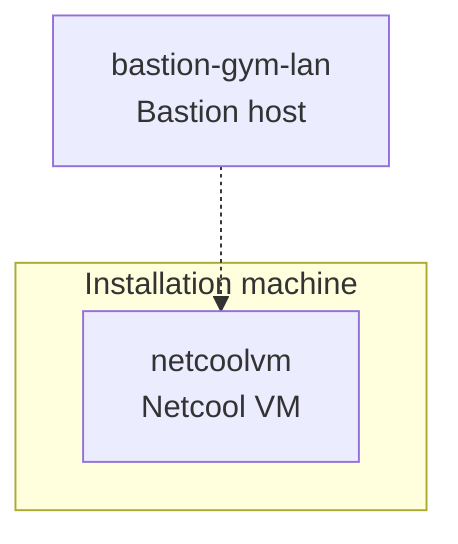

import RequestingLabEnvironment from "@site/src/components/requestingLabEnvironment/RequestingLabEnvironment"
import ObtainingEntitlementKey from "@site/src/components/obtainingEntitlementKey/ObtainingEntitlementKey"
import CreateIbmId from "@site/src/components/createIbmId/CreateIbmId"
import AiopsTrialLicenseAdmonition from "@site/src/components/trialLicense/TrialLicense"

In this lab, you will initially connect to a bastion virtual machine that has Red Hat Enterprise Linux (RHEL) installed on it from which you will carry out the installation and setup. A second virtual machine with RHEL on it will be the target for the installation of the Netcool software.

 Once you have finished your installation, you will start the Netcool/OMNIbus Native Event List to connect to Netcool/OMNIbus, and open a Firefox browser on this bastion host to log into Netcool/Impact.

The installation machine has the following specification:

* 1 x Netcool installation server - `netcoolvm` - 16 CPU, 32 Gi RAM, 500 Gi disk

## 2.1: Requesting a Lab Environment

<RequestingLabEnvironment
   environmentName="Cloud Pak for AIOps - Netcool installation"
   environmentUrl="https://techzone.ibm.com/my/reservations/create/6a27eefb58de6ed4d2585d65"
/>
