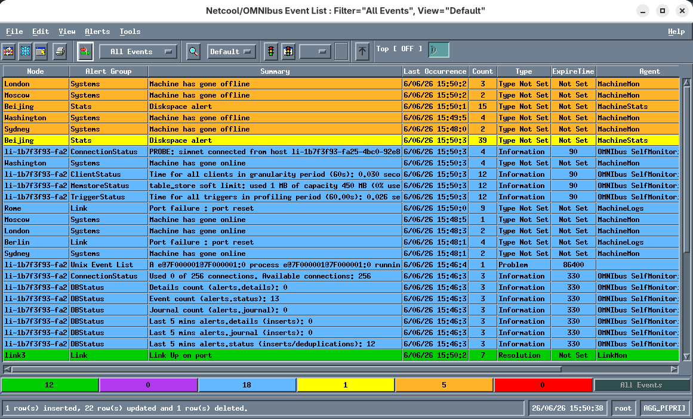
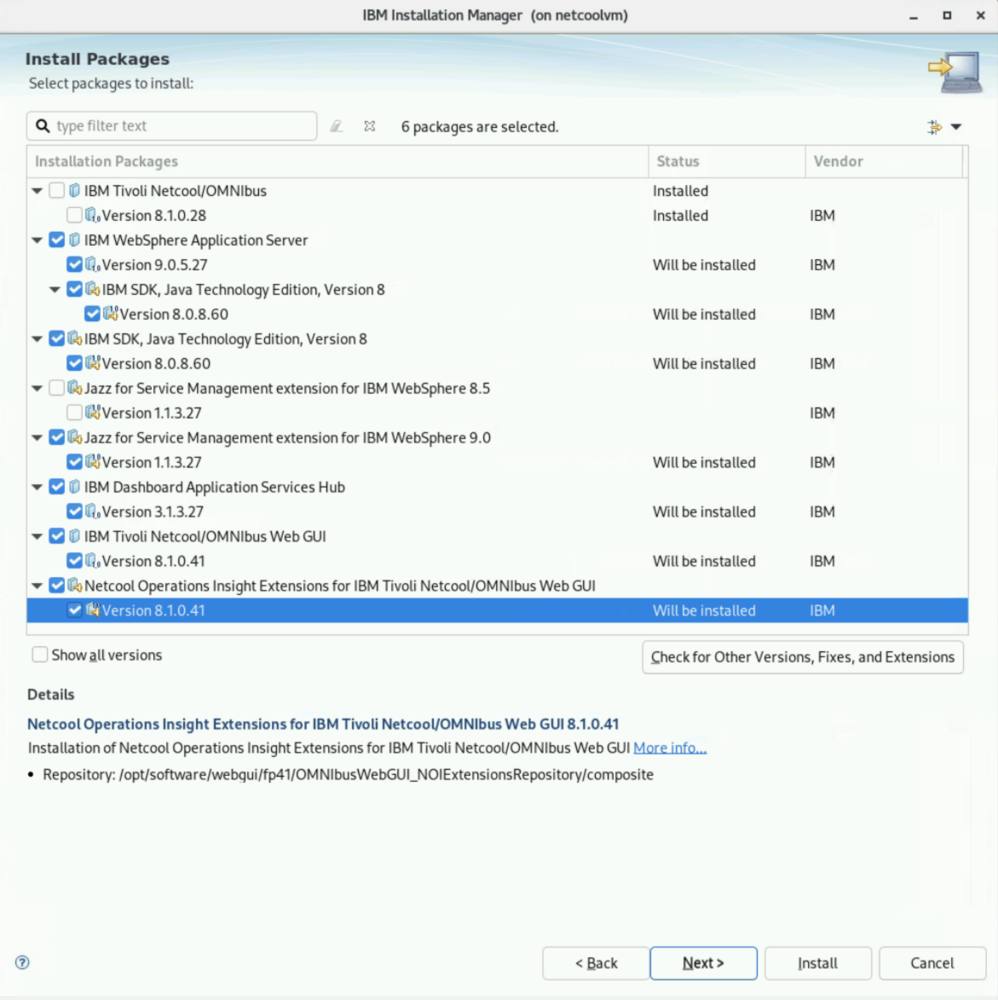
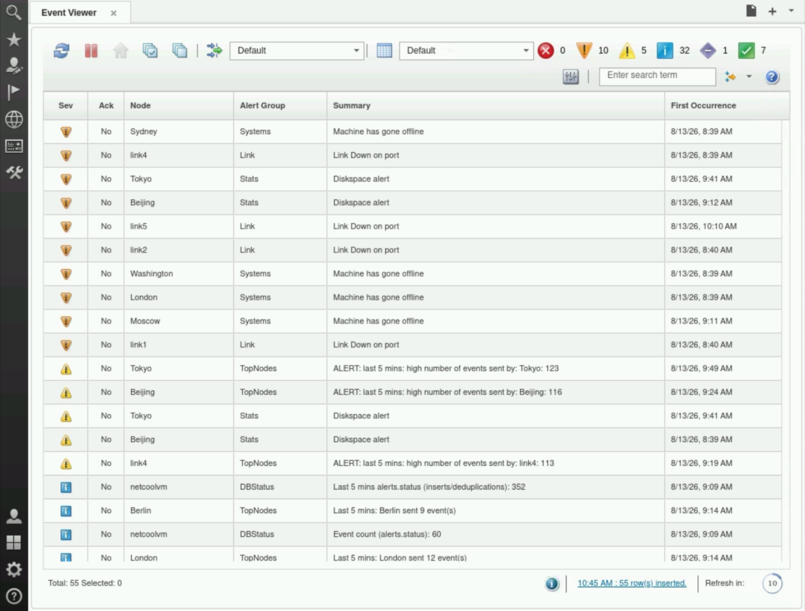

## 3.1: Overview

This module guides you through the process of installing the Netcool/OMNIbus and Netcool/WebGUI components to provide the necessary background knowledge and experience to complete the tasks in a real environment. Both components are installed on the same VM. In a true production scenario, it is more likely that each would have its own VM, as well as being in a failover pair.

:::note

This [link](https://www.ibm.com/docs/en/netcoolomnibus/8.1.0?topic=begin-standard-multitiered-architecture) has references to the Standard Multitier Architecture extension that comes with Netcool/OMNIbus, which is recommended for use in any real-world Netcool/OMNIbus deployment.

:::

## 3.2: Update the Netcool VM

The first step is to update the Netcool VM host and install an array of needed packages.

Run the following command block as the default **admin** user on the **bastion host** to connect to the Netcool VM:

```sh title="Host: bastion-gym-lan"
ssh jammer@netcoolvm
```

Run the following command block as the default **jammer** user on the **netcoolvm host** to change to the **root** user:

```sh title="Host: netcoolvm"
sudo -i
```

Run the following command block as the **root** user on the **netcoolvm host** to update the VM and to install the `unzip` utility:

```sh title="Host: netcoolvm"
yum update -y
yum install -y unzip
```

Run the following command block as the **root** user on the **netcoolvm host** to install the packages needed by Netcool/OMNIbus components:

```sh title="Host: netcoolvm"
yum install -y audit-libs
yum install -y expat
yum install -y libidn
yum install -y libuuid
yum install -y zlib
yum install -y glibc
yum install -y libgcc
yum install -y libstdc++
yum install -y libxcrypt-compat
yum install -y libstdc++.i686
yum install -y glibc.i686
yum install -y libgcc.i686
yum install -y libstdc++.i686
yum install -y fontconfig
yum install -y freetype
yum install -y libICE
yum install -y libSM
yum install -y libjpeg-turbo
yum install -y libpng
yum install -y libxcb
yum install -y motif
yum install -y libX11
yum install -y libXau
yum install -y libXext
yum install -y libXft
yum install -y libXmu
yum install -y libXp
yum install -y libXpm
yum install -y libXrender
yum install -y libXt
yum install -y libXcursor
yum install -y libXfixes
yum install -y libXi
yum install -y libXtst
yum install -y glibc
yum install -y libgcc
yum install -y libstdc++
yum install -y gtk2
yum install -y pam
yum install -y nss-softokn-freebl
```

Run the following command block as the **root** user on the **netcoolvm host** to reboot the box:

```sh title="Host: netcoolvm"
shutdown -r now
```

## 3.3: Create the netcool user and configure other system settings

Netcool software is typically installed as a non-root user. This next step creates a dedicated user for this purpose: `netcool` as well as the default `ncoadmin` group. It also sets up the `netcool` user's needed environment variables, sets up the file limits on the VM for Netcool/Impact, and sets up a system log which the Netcool/Probe for Syslog will read from.

Run the following command block as the default **admin** user on the **bastion host** to connect to the Netcool VM:

```sh title="Host: bastion-gym-lan"
ssh jammer@netcoolvm
```

Run the following command block as the default **jammer** user on the **netcoolvm host** to change to the **root** user:

```sh title="Host: netcoolvm"
sudo -i
```

Run the following command block as the **root** user on the **netcoolvm host** to create the `netcool` user and `ncoadmin` group, toset up the Netcool environment variables in the `netcool` user's profile, to configure needed `ulimit` settings on the host (for Netcool/Impact), and to set up a system messages file for the use of the Netcool Syslog Probe:

```sh title="Host: netcoolvm"
echo "Creating ncodamin group..."
groupadd ncoadmin

echo "Creating netcool user..."
mypwd=`echo netcool | openssl passwd -6 -stdin`
echo $mypwd
useradd netcool -u 1005 -p $mypwd
usermod -g ncoadmin netcool

echo "Changing ownership for /opt..."
chown -R netcool:ncoadmin /opt

echo "Setting up environment variables..."
echo "export NCHOME=/opt/IBM/tivoli/netcool" >> ~netcool/.bashrc
echo "export OMNIHOME=/opt/IBM/tivoli/netcool/omnibus" >> ~netcool/.bashrc

echo "Allowing X11Forwarding..."
sed -i 's/^X11Forwarding no/X11Forwarding yes/' /etc/ssh/sshd_config

echo "Restarting sshd..."
systemctl restart sshd
```

:::tip

The `netcool` user password is set to `netcool` for this lab.

:::

:::note

The Netcool software is provided for you in the `/opt/software` directory. This step assigns the software to the `netcool` user prior to installation.

:::

## 3.4: Unpack and prepare the Netcool software

The Netcool software is provided for you on the Netcool VM. This step unpacks the archives and prepares it for installation.

Run the following command block as the default **admin** user on the **bastion host** to connect to the Netcool VM:

```sh title="Host: bastion-gym-lan"
ssh netcool@netcoolvm
```

Run the following command block as the **netcool** user on the **netcoolvm host** to unpack the software bundle:

```sh title="Host: netcoolvm"
cd /opt/software/omnibus
unzip com.ibm.tivoli.omnibus.core.linux.x86_64.zip

cd /opt/software/jazz/base
unzip IINOI0_1.6.15_MP_ML.zip
unzip M0X6WML.zip

cd /opt/software/jazz/fp27
unzip 1.1.3-TIV-JazzSM-multi-FP027.codesigned.zip
unzip 1.1.3-TIV-JazzSM-multi-FP027.zip

cd /opt/software/websphere/base
unzip IINOI0_1.6.15_MP_ML.zip
unzip M0X76ML.zip

cd /opt/software/websphere/fp27
unzip 9.0.5-WS-WAS-FP027.zip

cd /opt/software/sdk/base
unzip ibm-java-sdk-8.0-8.60-linux-x64-installmgr.zip

cd /opt/software/webgui/base
unzip IINOI0_1.6.15_MP_ML_7.zip
unzip OMNIbus-v8.1.0-WebGUI-FP39-IM-Extensions-linux64.zip

cd /opt/software/webgui/fp41
unzip OMNIbus-v8.1.0-WebGUI-FP41-IM-Extensions-linux64-UpdatePack.codesigned.zip
unzip OMNIbus-v8.1.0-WebGUI-FP41-IM-Extensions-linux64-UpdatePack.zip
```

## 3.5: Install IBM Installation Manager

The next step is to install the IBM Installation Manager which will be used to install both Netcool/OMNIbus and Netcool/WebGUI.

Run the following command block as the default **admin** user on the **bastion host** to connect to the Netcool VM:

```sh title="Host: bastion-gym-lan"
ssh netcool@netcoolvm
```

Run the following command block as the **netcool** user on the **netcoolvm host** to install the IBM Installation Manager:

```sh title="Host: netcoolvm"
cd /opt/software/jazz/base/im.linux.x86_64
./userinstc -acceptLicense
```

:::note

This lab installs IBM Installation Manager in user mode. There are other options for installation mode, such as group mode. In a real world installation, consult the IBM Installation Manager documentation for more installation options.

:::

## 3.6: Configure IBM Installation Manager

The next step is to configure the IBM Installation Manager by adding the software repositories for Netcool/OMNIbus.

Run the following command block as the default **admin** user on the **bastion host** to connect to the Netcool VM:

```sh title="Host: bastion-gym-lan"
ssh netcool@netcoolvm
```

Run the following command block as the **netcool** user on the **netcoolvm host** to start the IBM Installation Manager:

```sh title="Host: netcoolvm"
cd /home/netcool/IBM/InstallationManager/eclipse/tools
./imcl -c
```

Navigate through the menu options to add the following software repository (option **P** for Preferences, then option **1** to Install software, then option **D** to add a new software repository):

```
/opt/software/omnibus/OMNIbusRepository/repository.xml
```

Type **A** to apply changes, then **R** to return to the main menu.

Save and exit to the main menu once this has been added.

## 3.7: Install Netcool/OMNIbus

Navigate through the IBM Installation Manager menus to install Netcool/OMNIbus first (option 1: "Install software packages").

Install the item labelled: **IBM Tivoli Netcool/OMNIbus 8.1.0.28**

Accept all the default settings for each step.

After successful installation, type **F** to Finish, and then **X** to exit IBM Installation Manager.

:::note

You will configure a Netcool/OMNIbus ObjectServer and a Probe before performing the Netcool/WebGUI installation.

:::

## 3.8: Configure and start an ObjectServer

Next, define and start an ObjectServer.

Run the following command block as the default **admin** user on the **bastion host** to connect to the Netcool VM:

```sh title="Host: bastion-gym-lan"
ssh netcool@netcoolvm
```

Run the following command block as the **netcool** user on the **netcoolvm host** to back up the default Netcool interfaces file, and then configure it for use:

```sh title="Host: netcoolvm"
cp $NCHOME/etc/omni.dat $NCHOME/etc/omni.dat.orig
cat > $NCHOME/etc/omni.dat << EOF
#
# omni.dat file as prototype for interfaces file
#
# Ident: $Id: omni.dat 1.5 1999/07/13 09:34:20 chris Development $
#
[AGG_P]
{
	Primary: netcoolvm 4100
}
[NCO_PA]
{
	Primary: netcoolvm 4200
}

EOF
```

Run the following command block as the **netcool** user on the **netcoolvm host** to generate the platform interfaces file, build an ObjectServer instance, and start the ObjectServer:

```sh title="Host: netcoolvm"
$NCHOME/bin/nco_igen
$OMNIHOME/bin/nco_dbinit -server AGG_P -customconfigfile $OMNIHOME/extensions/multitier/objectserver/aggregation.sql
$OMNIHOME/bin/nco_objserv -name AGG_P &
```

:::note

The `nco_dbinit` command leverages the multitier architecture configuration to build the ObjectServer as a primary Aggregation server via the `-customconfigfile` parameter. This should be the default for any standalone ObjectServer.

:::

## 3.9: Log in to the ObjectServer and configure the users

The next step is to set the ObjectServer super user password.

Run the following command block as the default **admin** user on the **bastion host** to connect to the Netcool VM:

```sh title="Host: bastion-gym-lan"
ssh netcool@netcoolvm
```

Run the following command block as the **netcool** user on the **netcoolvm host** to log into the ObjectServer:

```sh title="Host: netcoolvm"
$OMNIHOME/bin/nco_sql -server AGG_P -user root -password ZZ
```

Once logged in, execute the following SQL statements to set the ObjectServer `root` user password, create the `impactadmin` user, and set its group membership:

```
ALTER user 'root' set password 'netcool';
go
quit
```

## 3.10: Start a Netcool Simnet Probe

The next step is to start a Simnet Probe instance, so we can inject some sample alerts into the system. The Simnet Probe generates simulated network events (hence the name "SimNet") and is used for testing and demonstrations.

Run the following command block as the default **admin** user on the **bastion host** to connect to the Netcool VM:

```sh title="Host: bastion-gym-lan"
ssh netcool@netcoolvm
```

Run the following command block as the **netcool** user on the **netcoolvm host** to start a Simnet Probe instance:

```sh title="Host: netcoolvm"
$OMNIHOME/probes/nco_p_simnet -server AGG_P &
```

## 3.11: Configure the Netcool Process Agent (optional)

The Netcool Process Agent is a daemon process that starts and manages Netcool processes on a server. It is a standard component for any production Netcool deployment and is typically set up for POC and demo environments, too. In this lab, you have the option to configure and start the Netcool Process Agent, configure it to manage the Netcool processes, and configure the Netcool Process Agent to automatically start on machine boot. If you are limited on time, then you can skip this section.

Run the following command block as the default **admin** user on the **bastion host** to connect to the Netcool VM:

```sh title="Host: bastion-gym-lan"
ssh netcool@netcoolvm
```

Run the following command block as the **netcool** user on the **netcoolvm host** to back up the default Netcool Process Agent configuration file, and then configure it for this lab's usage:

```sh title="Host: netcoolvm"
cp $OMNIHOME/etc/nco_pa.conf $OMNIHOME/etc/nco_pa.conf.orig
cat > $OMNIHOME/etc/nco_pa.conf << EOF
#NCO_PA3
#
# Process Agent Daemon Configuration File 1.1
#
#

#
# List of processes
#

nco_process 'AGG_P'
{
	Command '$OMNIHOME/bin/nco_objserv -name AGG_P -pa NCO_PA' run as 1005
	Host		=	'netcoolvm'
	Managed		=	True
	RestartMsg	=	'${NAME} running as ${EUID} has been restored on ${HOST}.'
	AlertMsg	=	'${NAME} running as ${EUID} has died on ${HOST}.'
	RetryCount	=	0
	ProcessType	=	PaPA_AWARE
}

nco_process 'Simnet_Probe'
{
	Command '$OMNIHOME/probes/nco_p_simnet -server AGG_P' run as 1005
	Host		=	'netcoolvm'
	Managed		=	True
	RestartMsg	=	'${NAME} running as ${EUID} has been restored on ${HOST}.'
	AlertMsg	=	'${NAME} running as ${EUID} has died on ${HOST}.'
	RetryCount	=	0
	ProcessType	=	PaPA_AWARE
}

#
# List of Services
#
# NOTE:	To ensure that the service is started automatically, change the
# 	"ServiceStart" attribute to "Auto".
#
nco_service 'Core'
{
	ServiceType	=	Master
	ServiceStart	=	Auto
	process 'AGG_P' NONE
	process 'Simnet_Probe' 10
}

#
# ROUTING TABLE
#
# 'user'       -   (optional) only required for secure mode PAD on target host
#                  'user' must be member of UNIX group 'ncoadmin'
# 'password'   -   (optional) only required for secure mode PAD on target host
#                  use nco_pa_crypt to encrypt.
nco_routing
{
	host 'netcoolvm' 'NCO_PA' 'netcool' 'ECEDBJAGBJFHGD'
}

EOF
```

Note here that the Netcool/OMNIBus ObjectServer and Simnet Probe are all managed by the Netcool Process Agent. They are configured to automatically start at system startup, with the Probes having a 10 second delayed start. The routing table definition is used for communicating with other Netcool Process Agents running on other hosts. This function won't be used in this lab however.

Run the following command block as the **netcool** user on the **netcoolvm host** to stop all the Netcool processes and log out:

```sh title="Host: netcoolvm"
pkill nco_
exit
```

Run the following command block as the default **admin** user on the **bastion host** to connect to the Netcool VM:

```sh title="Host: bastion-gym-lan"
ssh jammer@netcoolvm
```

Run the following command block as the default **jammer** user on the **netcoolvm host** to change to the **root** user:

```sh title="Host: netcoolvm"
sudo -i
```

Run the following command block as the **root** user on the **netcoolvm host** to configure the Netcool Process Agent service on the Netcool VM:

```sh title="Host: netcoolvm"
cat > /etc/systemd/system/nco.service << EOF
#
# Licensed Materials - Property of IBM
#
# 5724O4800
#
# (C) Copyright IBM Corp. 1994, 2015. All Rights Reserved
#
# US Government Users Restricted Rights - Use, duplication
# or disclosure restricted by GSA ADP Schedule Contract
# with IBM Corp.
#
#
# systemd unit file for Netcool/OMNIbus service
#
[Unit]
Description=Netcool/OMNIbus
After=network.target

[Service]
Environment="NCHOME=/opt/IBM/tivoli/netcool" "OMNIHOME=$NCHOME/omnibus"
ExecStart=/opt/IBM/tivoli/netcool/omnibus/bin/nco_pad -name NCO_PA -authenticate none  -nodaemon
KillMode=control-group
Type=simple
PIDFile=/opt/IBM/tivoli/netcool/omnibus/var/NCO_PA.pid

[Install]
WantedBy=default.target

EOF
```

Run the following command block as the **root** user on the **netcoolvm host** to start Netcool Process Agent service on the Netcool VM:

```sh title="Host: netcoolvm"
systemctl enable nco.service
service nco.service start
```

Run the following command block as the **root** user on the **netcoolvm host** to see the status of the Netcool Process Agent service on the Netcool VM:

```sh title="Host: netcoolvm"
service nco.service status
```

You should see something like the following in the output:

```
[root@netcoolvm]# service nco.service status
Redirecting to /bin/systemctl status nco.service
● nco.service - Netcool/OMNIbus
     Loaded: loaded (/etc/systemd/system/nco.service; enabled; preset: disabled)
     Active: active (running) since Fri 2026-07-03 01:49:35 PDT; 3 days ago
   Main PID: 935 (nco_pad)
      Tasks: 122 (limit: 100400)
     Memory: 249.6M (peak: 251.6M)
        CPU: 51min 10.261s
     CGroup: /system.slice/nco.service
             ├─ 935 /opt/IBM/tivoli/netcool/omnibus/platform/linux2x86/bin64/nco_pad -name NCO_PA -authenticate none -nodaemon
             ├─1243 /opt/IBM/tivoli/netcool/omnibus/platform/linux2x86/bin64/nco_objserv -name AGG_P -pa NCO_PA
             ├─1243 /opt/IBM/tivoli/netcool/omnibus/platform/linux2x86/probes64/nco_p_simnet -server AGG_P

Jul 03 01:49:36 netcoolvm nco_pad[935]:         Administration Group Name     :        ncoadmin
Jul 03 01:49:36 netcoolvm nco_pad[935]:         Properties file               :        /opt/IBM/tivoli/netcool/omnibus/etc/NCO_PA.props
Jul 03 01:49:36 netcoolvm nco_pad[935]:         Message level                 :        Warning
Jul 03 01:49:36 netcoolvm nco_pad[935]:         Host Alias Lookups            :        True
Jul 03 01:49:36 netcoolvm NCO_PA[935]: [RESTORE_MSG]: Service 'Core' has been Started.
Jul 03 01:49:36 netcoolvm NCO_PA[935]: [RESTORE_MSG]: AGG_P running as 1005 has been restored on netcoolvm.
Jul 03 01:49:46 netcoolvm NCO_PA[935]: [RESTORE_MSG]: Simnet_Probe running as 1005 has been restored on netcoolvm.
[root@netcoolvm]# 
```

Run the following command block as the **root** user on the **netcoolvm host** to change to the **netcool** user:

```sh title="Host: netcoolvm"
su - netcool
```

Run the following command block as the **netcool** user on the **netcoolvm host** to see the status of the Netcool Process Agent:

```sh title="Host: netcoolvm"
$OMNIHOME/bin/nco_pa_status
```

You should see something like the following in the output:

```
----------------------------------------------------------------------------------------------
Service Name         Process Name         Hostname           User        Status           PID
----------------------------------------------------------------------------------------------
Core                 AGG_P                netcoolvm         netcool     RUNNING         1243
                     Simnet_Probe         netcoolvm         netcool     RUNNING         1742
----------------------------------------------------------------------------------------------
```

You have now successfully configured your Netcool processes to start on machine boot and be managed by the Netcool Process Agent.

## 3.13: Connect the Netcool/OMNIbus Native Event List

In this step, you will launch the Netcool/OMNIbus Native Event List and view events in the ObjectServer.

Run the following command block as the default **admin** user on the **bastion host** to connect to the Netcool VM as the **netcool** user:

```sh title="Host: bastion-gym-lan"
ssh -X netcool@netcoolvm
```

Run the following command block as the **netcool** user on the **netcoolvm host** to launch the Netcool/OMNIbus Native Event List:

```sh title="Host: netcoolvm"
$OMNIHOME/bin/nco_event -server AGG_P -user root -password netcool &
```

Under the `All Events` filter box, click on the `View` button to bring up the Event List:



If you scroll down within the Event List, you should see Simnet events present.

Click on the **File** menu, the **Exit** to quit the Native Event List.

## 3.14: Install Netcool/WebGUI

In this lab, you will have two options for the installation of Netcool/WebGUI. The first is to use the IBM Installation Manager GUI. In many situations, the GUI is not available however. In such a case, the only option is what's known as "silent installation". Note that console mode installation is not possible because one of the sub-components of WebGUI (JazzSM) does not support console mode installation.

In the lab, you will use either OPTION 1 below or scroll down to OPTION 2 for the silent installation option.

:::important

Do not attempt to complete both option 1 abnd 2 on the same environment. The second installation will fail.

:::

**OPTION 1: GUI INSTALLATION**

Run the following command block as the default **admin** user on the **bastion host** to connect to the Netcool VM:

```sh title="Host: bastion-gym-lan"
ssh -X netcool@netcoolvm
```

Run the following command block as the **netcool** user on the **netcoolvm host** to start the IBM Installation Manager in GUI mode:

```sh title="Host: netcoolvm"
cd /home/netcool/IBM/InstallationManager/eclipse
./IBMIM
```

The IBM Installation Manager GUI will launch on the screen.

Select the **File** menu, then **Preferences...***.

Select the **Repositories** left menu then click the **Add Repository...*** button to add a respository to IBM Installation Manager.

Add the following list of repositories, one at a time:

```
/opt/software/jazz/base/JazzSMRepository/disk1
/opt/software/jazz/fp27/JazzSMFPRepository/disk1
/opt/software/websphere/base/was.repo.90501.base.zip
/opt/software/websphere/fp27
/opt/software/sdk/base
/opt/software/webgui/base/OMNIbusWebGUIRepository
/opt/software/webgui/base/OMNIbusWebGUI_NOIExtensionsRepository
/opt/software/webgui/fp41/OMNIbusWebGUIRepository/composite
/opt/software/webgui/fp41/OMNIbusWebGUI_NOIExtensionsRepository/composite
```

:::tip

You can copy and paste the above paths in rather than browsing via the file browser.

:::

Click **Apply and Close** to save and return to the main window.

Next, click **Install** to "Install software packages".

Select the following components:

* IBM WebSphere Application Server  9.0.5.27
* IBM SDK Java Technology Edition 8.0.8.60
* Jazz for Service Management extension for IBM WebSphere 9.0 1.1.3.27
* IBM Dashboard Application Services Hub 3.1.3.27
* IBM Tivoli Netcool/OMNIbus Web GUI 8.1.0.41
* Netcool Operations Insight Extensions for IBM Tivoli Netcool/OMNIbus Web GUI 8.1.0.41

After you have selected the above packages, you should see something like the following:



:::important

Take care to select "Jazz for Service Management extension for IBM WebSphere 9.0" only, not 8.5, since we are installing WebSphere Application Server 9.0. Both 8.5 and 9.0 versions ship with the Jazz software bundle, so you need to be careful to choose the correct one.

:::

Click the **Next** button to continue.

Click on the radio button to "Accept the terms of the license agreements" then click the **Next** button to continue.

Accept the default "Installation Directory" and click the **Next** button to continue.

Accept the default translations to install and click the **Next** button to continue.

You will be presented with a summary of the packages to install. Click the **Next** button to continue.

The next screen lists the "Common Configurations" for WebSphere. Type `netcool123` into the **Password** and **Password confirmation** boxes.

Click the **Validate...** button to validate the configuration, then click the **Next** button to continue.

Accept all the default port settings, then click the **Next** button to continue.

Accept the default "Context Root", then click the **Next** button to continue.

You will be presented with a summary installation page. Click the **Install** button to begin the installation of WebGUI.

The installation will take around 20 to 30 minutes to complete. It's time for coffee! ☕

After successful installation, click the **Finish** button.

Finally, select the **File** menu, then **Exit**, to exit the IBM Installation Manager.

Congratulations, Netcool/WebGUI is now installed!

:::important

Skip to the [next section](/waiops-tech-jam/labs/cloud-pak-aiops/netcool-webgui-install/installation/#315-configure-netcoolwebgui-to-auto-start-on-machine-boot-optional) to continue this lab.

:::

**OPTION 2: SILENT INSTALLATION**

To install WebGUI in silent mode, you need a pre-configured silent installation file. One is provided for you in this lab.

By default, the administrative user `smadmin` password is set in the silent installation file to `netcool`. We will change the default password to `netcool123` in this lab so that you learn how to set the `smadmin` user password.

Run the following command block as the default **admin** user on the **bastion host** to connect to the Netcool VM:

```sh title="Host: bastion-gym-lan"
ssh netcool@netcoolvm
```

Run the following command as the **netcool** user on the **netcoolvm host** to encrypt the new password:

```sh title="Host: netcoolvm"
/home/netcool/IBM/InstallationManager/eclipse/tools/imutilsc encryptString netcool123
```
You should see the following output:
```
YFt7GdBp+Mf9c/HW3UKizg==
```

Run the following command block as the **netcool** user on the **netcoolvm host** to modify the silent install file with the updated password and change the installation location:

```sh title="Host: netcoolvm"
sed -i "s/MKzgom+ucqpj8e5dVuK8Dw==/YFt7GdBp+Mf9c\/HW3UKizg==/" /opt/software/JazzSM11327_WAS90527_JDK8865_WebGUI81FP41.xml
sed -i "s/value='netcool'/value='netcool123'/" /opt/software/JazzSM11327_WAS90527_JDK8865_WebGUI81FP41.xml
sed -i "s/\/opt\/IBM/\/home\/netcool\/IBM/" /opt/software/JazzSM11327_WAS90527_JDK8865_WebGUI81FP41.xml
```

:::note

The password for the WebSphere user property needs to be encrypted whereas the password for the DASH user property needs to be unencrypted in the silent installation file. Note also that the first of the three `sed` commands above escapes the back-slash character contained in the encrypted password. Care needs to be taken in such cases.

:::

Run the following command as the **netcool** user on the **netcoolvm host** to run the silent installation and install Netcool/WebGUI:

```sh title="Host: netcoolvm"
/home/netcool/IBM/InstallationManager/eclipse/tools/imcl -silent -input /opt/software/JazzSM11327_WAS90527_JDK8865_WebGUI81FP41.xml -acceptLicense
```

The installation will take around 20 to 30 minutes to complete. It's time for coffee! ☕

After successful installation, you should see lines like the following, and the command prompt return:

```
Installed com.ibm.websphere.BASE.v90_9.0.5027.20260306_2357 to the /opt/IBM/WebSphere/AppServer directory.
Installed com.ibm.java.jdk.v8_8.0.8060.20260119_0831 to the /opt/IBM/WebSphere/AppServer directory.
Installed com.ibm.tivoli.tacct.psc.install.was.security.extension_1.1.1000.202602260338 to the /opt/IBM/WebSphere/AppServer directory.
Installed com.ibm.tivoli.tacct.psc.tip.install_3.1.3100.202602260338 to the /opt/IBM/JazzSM directory.
Installed com.ibm.tivoli.netcool.omnibus.webgui_8.1.41.202605120452 to the /opt/IBM/netcool/gui directory.
Installed com.ibm.noi.ea_8.1.41.202605120452 to the /opt/IBM/netcool/gui directory.
```

Congratulations, Netcool/WebGUI is now installed!


## 3.15: Configure Netcool/WebGUI to auto-start on machine boot (optional)

It is a standard practice to configure Netcool/WebGUI to automatically start when the server starts. This optional section gets you to configure this. This is achieved by creating a new service.

You will first need to manually shut down the Netcool/WebGUI server before bringing it back up as a service.

Run the following command block as the default **admin** user on the **bastion host** to connect to the Netcool VM:

```sh title="Host: bastion-gym-lan"
ssh netcool@netcoolvm
```

Run the following command block as the **netcool** user on the **netcoolvm host** to shut down the Netcool/WebGUI server, then log out:

```sh title="Host: netcoolvm"
/home/netcool/IBM/JazzSM/profile/bin/stopServer.sh server1 -username smadmin -password netcool123
exit
```

Run the following command block as the default **admin** user on the **bastion host** to connect to the Netcool VM:

```sh title="Host: bastion-gym-lan"
ssh jammer@netcoolvm
```

Run the following command block as the default **jammer** user on the **netcoolvm host** to change to the **root** user:

```sh title="Host: netcoolvm"
sudo -i
```

Run the following command block as the **root** user on the **netcoolvm host** to configure the Netcool/WebGUI server service on the Netcool VM:

```sh title="Host: netcoolvm"
cat > /etc/systemd/system/webgui.service << EOF
[Unit]
Description=Netcool/WebGUI
After=network.target

[Service]
Type=forking
User=netcool
Group=ncoadmin
WorkingDirectory=/home/netcool/IBM/JazzSM/profile/bin
ExecStart=/bin/bash -c '/home/netcool/IBM/JazzSM/profile/bin/startServer.sh server1'
ExecStop=/bin/bash -c '/home/netcool/IBM/JazzSM/profile/bin/stopServer.sh server1 -username smadmin -password netcool123'

[Install]
WantedBy=multi-user.target

EOF
```

Run the following command block as the **root** user on the **netcoolvm host** to start the Netcool/WebGUI server service on the Netcool VM:

```sh title="Host: netcoolvm"
systemctl enable webgui.service
service webgui.service start
```

:::note

It can take up to 60 seconds or so for the WebGUI server to start.

:::

Run the following command block as the **root** user on the **netcoolvm host** to see the status of the Netcool/WebGUI server service on the Netcool VM:

```sh title="Host: netcoolvm"
service webgui.service status
```

You should see something like the following in the output:

```
[root@netcoolvm ~]# service webgui.service status
Redirecting to /bin/systemctl status webgui.service
? webgui.service - Netcool/WebGUI
     Loaded: loaded (/etc/systemd/system/webgui.service; enabled; preset: disabled)
     Active: active (running) since Thu 2026-08-13 14:27:57 UTC; 3s ago
    Process: 17142 ExecStart=/bin/bash -c /home/netcool/IBM/JazzSM/profile/bin/startServer.sh server1 (code=exited, s>
   Main PID: 17697 (java)
      Tasks: 149 (limit: 203131)
     Memory: 577.8M (peak: 670.5M)
        CPU: 1min 59.560s
     CGroup: /system.slice/webgui.service
             ??17697 /home/netcool/IBM/WebSphere/AppServer/java/8.0/bin/java -Dosgi.install.area=/home/netcool/IBM/We>

Aug 13 14:26:52 netcoolvm systemd[1]: Starting Netcool/WebGUI...
Aug 13 14:27:20 netcoolvm bash[17160]: ADMU0116I: Tool information is being logged in file
Aug 13 14:27:20 netcoolvm bash[17160]:            /home/netcool/IBM/JazzSM/profile/logs/server1/startServer.log
Aug 13 14:27:21 netcoolvm bash[17160]: ADMU0128I: Starting tool with the JazzSMProfile profile
Aug 13 14:27:21 netcoolvm bash[17160]: ADMU3100I: Reading configuration for server: server1
Aug 13 14:27:24 netcoolvm bash[17160]: ADMU3200I: Server launched. Waiting for initialization status.
Aug 13 14:27:24 netcoolvm java[17697]: IBM Java[17697]: JVMJ9VM135W /proc/sys/kernel/core_pattern setting "|/bin/fals>
Aug 13 14:27:57 netcoolvm bash[17160]: ADMU3000I: Server server1 open for e-business; process id is 17697
Aug 13 14:27:57 netcoolvm systemd[1]: Started Netcool/WebGUI.
[root@netcoolvm ~]# 
```

Run the following command block as the **root** user on the **netcoolvm host** to check the Netcool/Impact server and GUI server processes are now running on the Netcool VM:

```sh title="Host: netcoolvm"
ps -ef | grep -i jazz
```

You should see something like the following in the output:

```
netcool    17697       1 37 14:27 ?        00:01:03 /home/netcool/IBM/WebSphere/AppServer/java/8.0/bin/java -Dosgi.install.area=/home/netcool/IBM/WebSphere/AppServer -Dwas.status.socket=42133 -Dosgi.configuration.area=/home/netcool/IBM/JazzSM/profile/servers/server1/configuration -Djava.awt.headless=true -Dosgi.framework.extensions=com.ibm.cds,com.ibm.ws.eclipse.adaptors -Xshareclasses:name=webspherev9_8.0_64_%g,nonFatal -Dcom.ibm.xtq.processor.overrideSecureProcessing=true -Xcheck:dump -Djava.security.properties=/home/netcool/IBM/WebSphere/AppServer/properties/java.security -Djava.security.policy=/home/netcool/IBM/WebSphere/AppServer/properties/java.policy -Dcom.ibm.CORBA.ORBPropertyFilePath=/home/netcool/IBM/WebSphere/AppServer/properties -Xbootclasspath/p:/home/netcool/IBM/WebSphere/AppServer/java/8.0/jre/lib/ibmorb.jar -classpath /home/netcool/IBM/JazzSM/profile/properties:/home/netcool/IBM/WebSphere/AppServer/properties:/home/netcool/IBM/WebSphere/AppServer/lib/startup.jar:/home/netcool/IBM/WebSphere/AppServer/lib/bootstrap.jar:/home/netcool/IBM/WebSphere/AppServer/lib/lmproxy.jar:/home/netcool/IBM/WebSphere/AppServer/lib/urlprotocols.jar:/home/netcool/IBM/WebSphere/AppServer/deploytool/itp/batchboot.jar:/home/netcool/IBM/WebSphere/AppServer/deploytool/itp/batch2.jar:/home/netcool/IBM/WebSphere/AppServer/java/8.0/lib/tools.jar -Dibm.websphere.internalClassAccessMode=allow -verbose:gc -Xverbosegclog:/home/netcool/IBM/JazzSM/profile/logs/server1/verbosegc.%seq.log,10,7000 -Xms512m -Xmx768m -Xcompressedrefs -Xscmaxaot12M -Xscmx90M -Dws.ext.dirs=/home/netcool/IBM/WebSphere/AppServer/java/8.0/lib:/home/netcool/IBM/JazzSM/profile/classes:/home/netcool/IBM/WebSphere/AppServer/classes:/home/netcool/IBM/WebSphere/AppServer/lib:/home/netcool/IBM/WebSphere/AppServer/installedChannels:/home/netcool/IBM/WebSphere/AppServer/lib/ext:/home/netcool/IBM/WebSphere/AppServer/web/help:/home/netcool/IBM/WebSphere/AppServer/deploytool/itp/plugins/com.ibm.etools.ejbdeploy/runtime -Dderby.system.home=/home/netcool/IBM/WebSphere/AppServer/derby -Dcom.ibm.itp.location=/home/netcool/IBM/WebSphere/AppServer/bin -Djava.util.logging.configureByServer=true -Duser.install.root=/home/netcool/IBM/JazzSM/profile -Djava.ext.dirs=/home/netcool/IBM/WebSphere/AppServer/tivoli/tam:/home/netcool/IBM/WebSphere/AppServer/javaext:/home/netcool/IBM/WebSphere/AppServer/java/8.0/jre/lib/ext -Djavax.management.builder.initial=com.ibm.ws.management.PlatformMBeanServerBuilder -Dpython.cachedir=/home/netcool/IBM/JazzSM/profile/temp/cachedir -Dwas.install.root=/home/netcool/IBM/WebSphere/AppServer -Djava.util.logging.manager=com.ibm.ws.bootstrap.WsLogManager -Dserver.root=/home/netcool/IBM/JazzSM/profile -Dcom.ibm.security.jgss.debug=off -Dcom.ibm.security.krb5.Krb5Debug=off -Ddefault.client.encoding=UTF-8 -Dclient.encoding.override=UTF-8 -Djava.library.path=/home/netcool/IBM/WebSphere/AppServer/lib/native/linux/x86_64/:/home/netcool/IBM/WebSphere/AppServer/java/8.0/jre/lib/amd64/compressedrefs:/home/netcool/IBM/WebSphere/AppServer/java/8.0/jre/lib/amd64:/home/netcool/IBM/WebSphere/AppServer/bin:/home/netcool/IBM/WebSphere/AppServer/nulldllsdir:/usr/lib64:/usr/lib: -Djava.endorsed.dirs=/home/netcool/IBM/WebSphere/AppServer/endorsed_apis:/home/netcool/IBM/WebSphere/AppServer/java/8.0/jre/lib/endorsed -Djava.security.auth.login.config=/home/netcool/IBM/JazzSM/profile/properties/wsjaas.conf -Djava.security.policy=/home/netcool/IBM/JazzSM/profile/properties/server.policy com.ibm.wsspi.bootstrap.WSPreLauncher -nosplash -application com.ibm.ws.bootstrap.WSLauncher com.ibm.ws.runtime.WsServer /home/netcool/IBM/JazzSM/profile/config JazzSMNode01Cell JazzSMNode01 server1
```

You have now configured the Netcool/WebGUI server to run as a service and to automatically start when the machine boots.

:::note

You will need to wait a few minutes after starting the Netcool/WebGUI services before the GUI is ready to be logged into, for the next section.

:::

## 3.16: Log in to Netcool/WebGUI

Open Firefox on your bastion host machine and go to the following address:

```
https://netcoolvm.ibmdte.local:16311/ibm/console
```

Log in to the WebGUI UI using: `smadmin` / `netcool123`

Congratulations! You have now installed Netcool/WebGUI and are ready for productive use.

## 3.17: Configure a Netcool/WebGUI datasource (optional)

After successful installation, this last optional step is to connect WebGUI to the ObjectServer you set up at the beginning of the lab and then view the events in the Event Viewer.

The first step is to add the WebGUI roles to our administrative user `smadmin`. After having logged into WebGUI, do the following actions:

* Click on **Settings** icon button in the bottom left corner of the screen
* Select **User Roles**
* Click on the **Search** button to list all current users
* Click on the **smadmin** user to edit its roles
* Click on the "Select all items" check box
* Scroll to the bottom and click **Save** to save the newly added roles
* Click on the **User** icon button in the bottom left corner of the screen
* Select "Log out" to log out of WebGUI

:::note

You need to log out and back in again to refresh your user profile with the new roles.

:::

Log back in to Netcool/WebGUI as the `smadmin` user, again with password `netcool123`.

The next step is to configure WebGUI to point to our ObjectServer as an event data source:

* Click on the **Administration** icon button in the top left corner of the screen
* Select **Data Sources** (it may take up to a minute to load)
* Click on the "Create New Data Source" botton

On the first tab marked **General**, add the following properties:

* Name: OMNIBUS
* Host: netcoolvm.ibmdte.local
* Port: 4100
* User ID: root
* Password: netcool

:::note

These are the user credentials for the root ObjectServer user.

:::

Click the button **Test server connection** button and look for the successful connection message:

_"The ObjectServer at host 'netcoolvm.ibmdte.local' on port '4100' is available."_

On the fourth tab marked **Self Monitoring**, verify that the "Enable Self Monitoring" check box is selected, and enable the "Information events" for each of the Service Names.

Scroll down and click the **Save Datasource** button to save your changes.

Finally, open an Event Viewer and view your events in WebGUI.

* Click on the **Incident** icon button in the top left corner of the screen
* Select **Event Viewer**

The Event Viewer tab will then open, and you should be able to see events.



Congratulations! You have now installed Netcool/WebGUI and are ready for productive use.

This concludes the installation of Netcool/WebGUI lab.

