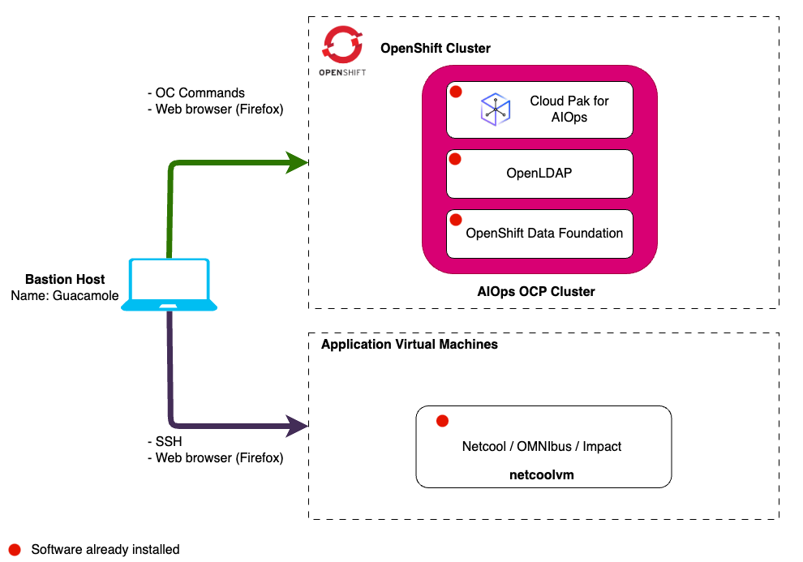
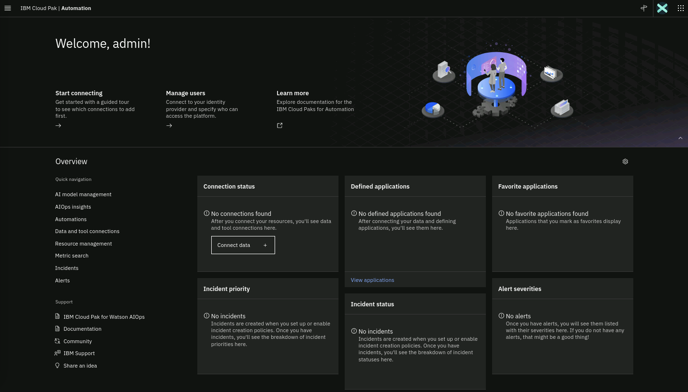

In this lab, you will have access to one OpenShift cluster via a bastion virtual machine that has installed Red Hat Enterprise Linux (RHEL). Note that inside
OpenShift, the cluster has installed the Cloud Pak for AIOps. It also has installed the Red Hat OpenShift Data Foundation (ODF) which is a
software-defined, container-native storage solution that provides storage classes that will be used by the Cloud Pak for AIOps to dynamically request
storage.

The following diagram describes the infrastructure for the Lab:



:::note

There is also a regular virtual machine present that has Netcool/OMNIbus and Netcool/Impact installed. A Simnet Probe is running and feeding a stream of events into Netcool/OMNIbus. The Netcool assets on this virtual machine will be used in this lab to inject a test alert at the end and in one of the runbook actions.

:::

## 2.1: Prerequisites

### Obtain your Entitlement key

You will need an IBM ID to request an entitlement key. You can create an IBM ID
from [here](https://www.ibm.com/account/reg/us-en/signup?formid=urx-19776).

To complete this lab you will need an entitlement key. Navigate to
[**this link**](https://myibm.ibm.com/products-services/containerlibrary) to
obtain your **entitlement key** that is assigned to your IBM ID which will grant
you access to the IBM Entitled Registry. Copy this into a text editor as we will
need it later in the Lab.

You can check your entitlement for the Cloud Pak for AIOPs by clicking **View
Library**


:::info

If your entitlement key is not valid for the Cloud Pak for AIOPs, you can
register for a 60 day trial using the following link:
[Request trial](https://www.ibm.com/account/reg/us-en/login?formid=urx-51074).

:::

## 2.2: Requesting a Lab Environment

import TechZoneStatus from "../../../_common/components/tech-zone-status.tsx"

Below is a live chart showing Tech Zone capacity in each available region. When
requesting your environment it would be wise to select the region that has the
most capacity available.

<TechZoneStatus />

:::info

Follow
[these instructions](/waiops-tech-jam/labs/jam-in-a-box/#requesting-a-lab-environment)
for step by step guidance on requesting a new lab environment in IBM Tech Zone.

:::

Request Tech Zone environment:

- [Cloud Pak for AIOps: Migrate from Netcool](https://techzone.ibm.com/my/reservations/create/6694a5c277b630001e0ce877)

## 2.3: Accessing your Lab Environment

:::info

Once you have received an eMail confirming that your environment is ready,
follow
[these instructions](/waiops-tech-jam/labs/jam-in-a-box/#accessing-a-lab-environment)
for step by step guidance on accessing your lab environment in IBM Tech Zone.

:::

## 2.4: Running 'oc' Commands to Connect to the Cluster

In the previous section, we described how to access the bastion VM. Now we will
connect to the OpenShift cluster using the OpenShift CLI (oc commands).

- From the bastion VM desktop, open a **Terminal** window (you may need to click
  on **Activities** in the top-left to remove the screen-saver)
- In the **Terminal** window, copy & paste the **oc** command below to login
  into the cluster. Get your **kubeadmin** password from your environment
  details page. This command will make a connection to your cluster and
  authenticate you, so you will be ready to start issuing oc commands during the
  Lab as needed.

```
oc login --server=https://api.ocp.techzone.lan:6443 --username kubeadmin --password <your password>
```

## 2.5: Log in to the Cloud Pak for AIOps console

Now you are going to locate the console URL and the admin login credentials from
your deployed instance of the Cloud Pak for AIOps.

Find the **Cloud Pak for AIOps URL** to access the console by running the
following command from the **Terminal** window:

```
echo -e "https://$(oc get route -n cp4aiops cpd -o jsonpath='{.spec.host}')\n"
```

Find the **password** for the **admin** username by running the following
command from the **Terminal** window:

```
oc -n cp4aiops get secret platform-auth-idp-credentials -o jsonpath='{.data.admin_password}' | base64 -d ; echo -e "\n"
```

Open a Firefox browser window and navigate to the AIOps dashboard using the url
you discovered in the previous step.

`https://cpd-cp4aiops.apps.ocp.techzone.lan`

:::tip

You will get one or more security **Warning: Potential Security Risk Ahead**.
This is because we have used self-signed certificates for this Lab. Just accept
the risk and continue.

:::

- Username: `cpadmin`
- Password: The password you found in the previous step.


After you login, you will land into the Cloud Pak for AIOps home page as shown
below:


