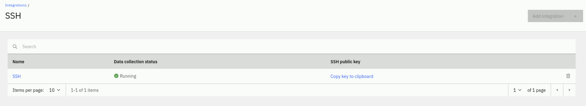

## 3.1: Overview

In this lab, you will set up an SSH integration with the `netcoolvm` Linux virtual machine which will be used by AIOps to execute our sample script. This lab will include the task of creating the new integration and then copying the SSH key to the target host so that the script we will run later will do so without requiring additional authentication.

## 3.2: Create an SSH integration

Use the following steps to set up the new SSH integration:

- Log in to the AIOps console
- Select **Integrations** from the **Quick navigation** menu or **Define** → **Integrations** from the main menu


- Click the **Add integration** button to add a new integration
- Type **SSH** into the Search bar
- Choose the **SSH** integration and click **Get started** to create a new instance
- Copy the SSH key the integration generates and save it to your clipboard
- Click **Next** to advance to the next screen
- Click **Done** to complete the setup - no need to enable a jump server

You should now see a successful SSH integration configured:



## 3.3 Configure Linux host for seamless SSH connection

Open a notepad window and paste the following:
```
export PUBLIC_KEY="<ssh-key-from-aiops-here>"
ssh jammer@netcoolvm "sudo -i bash -c 'mkdir -p /home/netcool/.ssh && chmod 700 /home/netcool/.ssh && echo \"${PUBLIC_KEY}\" >> /home/netcool/.ssh/authorized_keys && chmod 600 /home/netcool/.ssh/authorized_keys && chown -R netcool:ncoadmin /home/netcool/.ssh' && echo \"SSH key added to netcoolvm for netcool user successfully\""
```
Next replace `<ssh-key-from-aiops-here>` with the API key you obtained in the previous step.

:::note

Double check your API key to ensure it has copied cleanly and there are no extra spaces or stray characters.

:::

From your command terminal, execute your prepared commands from your notepad session.

You should see the following confirmation message if the commands execute correctly:
```
SSH key added to netcoolvm for netcool user successfully
```


