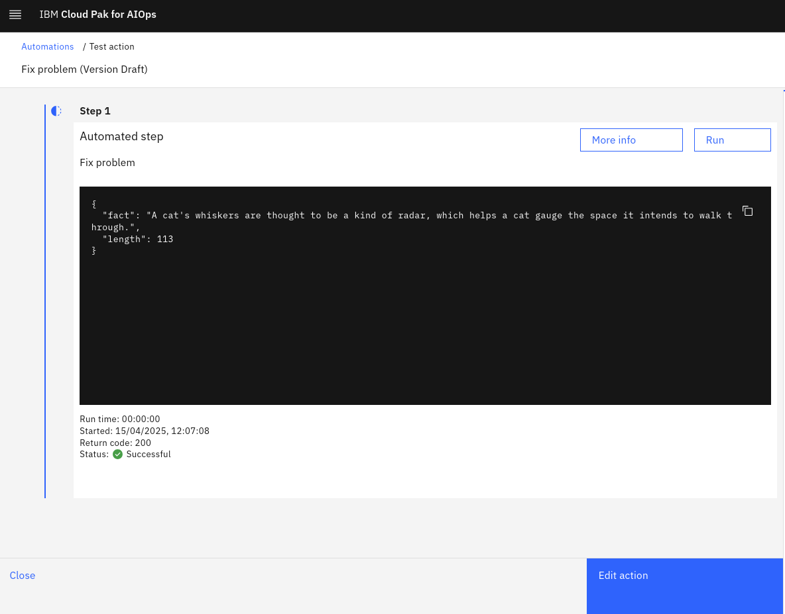
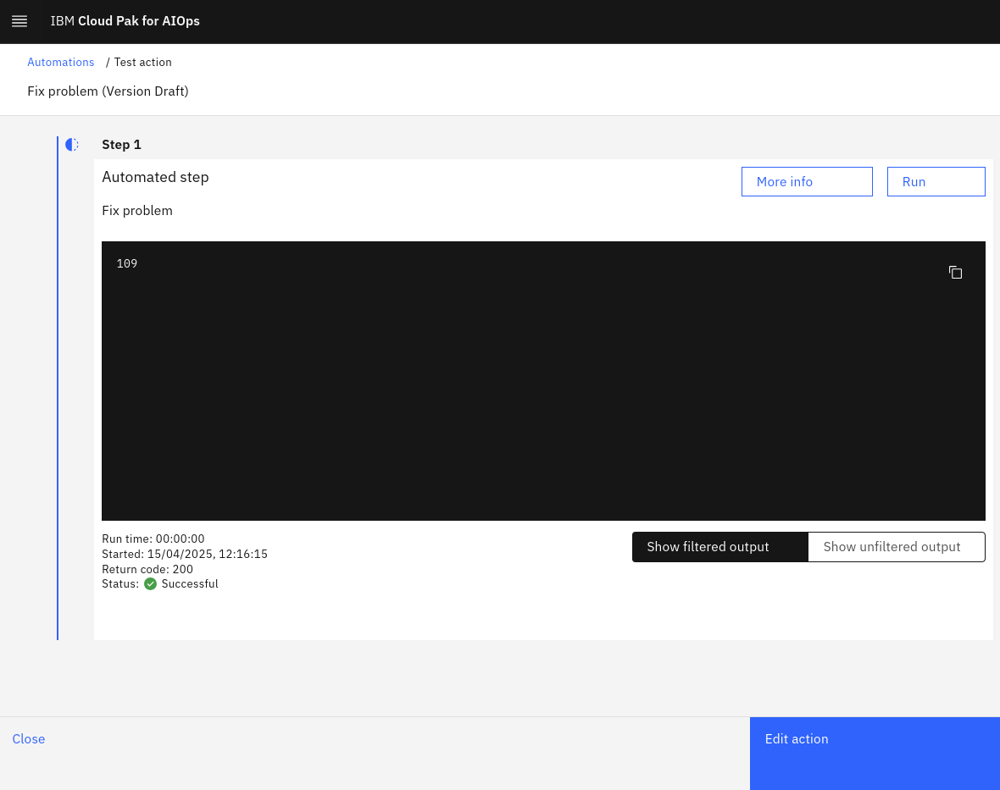
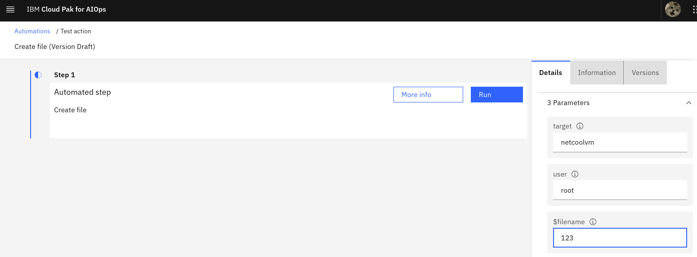
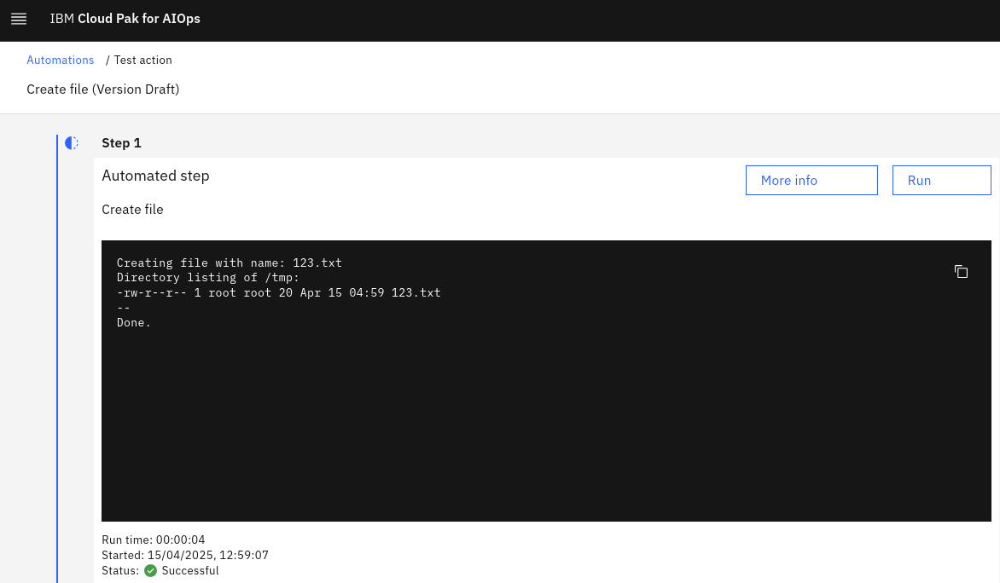

## 4.1: Overview

In this lab, you will create two actions which will later be added to the runbook we shall create.

The first of the two actions calls an external website that returns a fact about cats along with an integer value indicating the number of characters returned in the fact. In our example, we will extract this integer value from the returned payload and pass it as a parameter to the second action. The second of the two actions will take the parameter from the first action and create a file on the target host that includes the passed parameter in the name of the file.

## 4.2: Create the first action

Use the following steps to create the first action:

- Log in to the AIOps console and select **Automations** from the main menu
- Select the **Actions** tab
- Click the **Create action** button to create the action
- Select **HTTP** from the **Type** drop-down menu
- Enter a **Name** for the action: `Fix problem`
- Select **Custom API** from the **Target API** drop-down menu
- Enter the following for the **API endpoint**: `https://catfact.ninja/fact?max_length=140`
- Select **GET** from the **Method** drop-down menu
- Click on the **Test** button to test the action
- Click on the **Run** button to run the action
- Observe the output

We have not applied the filter yet to the action output so we see the full response from the target server:



Click **Edit action** to return to the action edit screen and continue:

- Scroll down to the **Action output** section
- Toggle the **Filter action output** switch on
- Select **JSONPath** from the **Choose query syntax** drop-down menu
- Enter: `length` into the **Enter query pattern** box
- Click on the **Test** button to test the action
- Click on the **Run** button to run the action
- Observe the output

This type of action output filter specifies that the output should parse the JSON payload returned and extract the value of the `length` attribute:



Click **Edit action** to return to the action edit screen and continue:

- Click on the **Publish** button to save the action and make it available for use

## 4.3 Create the second action

Use the following steps to create the second action:

- Log in to the AIOps console and select **Automations** from the main menu
- Select the **Actions** tab
- Click the **Create action** button to create the action
- Select **SSH (Bash)** from the **Type** drop-down menu
- Enter a **Name** for the action: `Create file`
- Scroll down to the **Action script** section
- Select **Bash** from the **Shell** drop-down menu
- Enter the following into the **Script** box:
```
#!/bin/bash

echo "Creating file with name: $filename.txt"
echo "Some important text" > /tmp/$filename.txt
echo "Directory listing of /tmp:"
cd /tmp
ls -alrt *.txt
echo "--"
echo "Done."
```
- Click on the 3 dots next to the `target` parameter and select **Edit**
- Check the box marked **Set a default value**
- Enter: `netcoolvm` in the **Default value (optional)** box and click **Save**
- Click on the 3 dots next to the `user` parameter and select **Edit**
- Check the box marked **Set a default value**
- Enter: `netcool` in the **Default value (optional)** box and click **Save**
- Click the **Add parameter** button to add a third parameter
- Type: `$filename` into the **Parameter** box
- Select **A single string value** from the **Type** drop-down menu
- Click **Save** to save your new parameter
- Click on the **Test** button to test the action
- Click on the **Run** button to run the action

You will notice that the **target** and **user** parameters are prepopulated with the default values. Because the third attribute **$filename** doesn't specify a default value, you will need to enter a value to test it out.

- Enter: `123` into the **$filename** box



- Click on the **Run** button to run the action
- Observe the output:



If you have set up your SSH key correctly in the first part of this lab, your script should successfully connect to the **netcoolvm** and see output like the above. If all goes well, a file by the name **123.txt** will have been created and shown in the directory listing.

Click **Edit action** to return to the action edit screen and continue:

- Click on the **Publish** button to save the action and make it available for use

You should now have two new actions which we will use to create our runbook in the next module.
