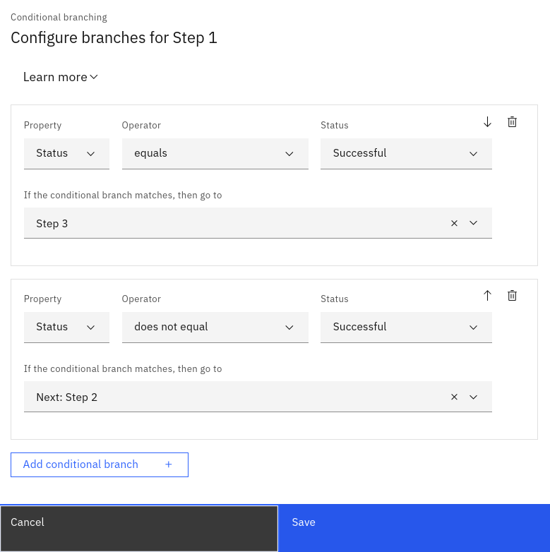

## 3.1: Overview

In this lab, you will create a new runbook that will use the two actions you created in the previous module. This runbook will include a branch and will pass the action output from the first action as input to the second action, to demonstrate these two concepts.

## 3.2: Create a new runbook

Use the following steps to create a new runbook:

- Log in to the AIOps console and select **Automations** from the main menu
- Select the **Runbooks** tab
- Click the **Create runbook** button to create a new runbook
- Enter a **Name** for the runbook: `Branched example`
- Click the **Add action step** button to add the first of three runbook actions
- Select the **Fix problem** action and click the **Select this action** button
- Click the **Add action step** button to add the second of three runbook actions
- Select the **Fix problem** action and click the **Select this action** button

Note that we are adding this action step twice. We will be creating a branch shortly that will bypass the second action step if the first action step is successful.

- Click the **Add action step** button to add the third of three runbook actions
- Select the **Create file** action and click the **Select this action** button
- Complete the parameter configuration as follows:

:::note
- Choose **Use default value** for **target**: it will load this default value from the action
- Choose **Use default value** for **user**: it will load this default value from the action
- Choose **Action output** and **Step 1** for **$filename**: it will inherit the value from the first action step
:::

- Scroll back up to **Step 1**
- Click the **Configure conditional branches** button to configure branching
- Complete the branching configuration as follows:

- Set: **Property**: `Status` **Operator**: `equals` **Status**: `Successful`
- Set: **If the conditional branch matches, then go to**: `Step 3`
- Set: **Property**: `Status` **Operator**: `does not equal` **Status**: `Successful`
- Set: **If the conditional branch matches, then go to**: `Step 2`
- Click **Save** to save the branching configuration

:::note
- If action Step 1 is successful, execution should jump to Step 3, bypassing Step 2
- If action Step 1 is unsuccessful, execution should continue to Step 2
- We are anticipating Step 1 to be successful, so we should see execution skipping Step 2
:::

- Click the **Add parameter** button top-right to add a new parameter
- Enter a **Parameter** name: `Hostname`
- Select **A single string value** from the **Type** drop-down menu
- Click the **Save** button to save the new parameter

:::note
This parameter won't be used in our example but is added so you can see how it can be passed from the runbook policy, which we will create next.
:::

- Click on the **Publish** button to save the runbook and make it available for use

