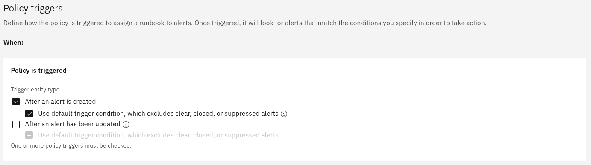

## 3.1: Overview

In this lab, you will create a new AIOps policy to associate specific alerts with our newly created runbook.

## 3.2: Create a runbook policy

Use the following steps to set up the new runbook policy:

- Log in to the AIOps console
- Select **Automations** from the **Quick navigation** menu or **Operate** → **Automations** from the main menu

- Select the **Policies** tab
- Click the **Create policy** button to create a new policy
- Find the **Assign a runbook to alerts** policy type and click **Create**
- Enter a **Policy name** for the policy: `Branched example`
- Leave the **Execution order** as the default value
- Under **Policy triggers**: check **After an alert is created**
- Under **Policy triggers**: uncheck **After an alert has been updated**

- Scroll down to **Condition sets**
- Click the **Add condition** button to add a condition for this policy
- Select **Alert property** from the drop-down menu
- Set: **Property** to: `Value of: alert.summary` by choosing **summary** from the pop-up list
- Set: **Operator** to: `contains`
- Set: **Matches** to: `only`
- Type into **Value** box: `Branched example` and select **String: Branched example** from the popup

- Scroll down to **Assign Runbook(s)**
- Check: **Branched example** from the list of available runbooks

:::note

Multiple runbooks can be assigned to an alert but we will only be assigning one in this lab.

:::

- Scroll down to **Hostname** to set the value for our runbook parameter
- Set: **Select mapping type** to: **Choose from alert**
- Click on the selection box and select: **alert.resource.name** to set the mapping to: `Value of: alert.resource.name`:

- Scroll back to the top, checking your settings as you go
- Click the **Create policy** button to save your new runbook:

- If you type **Branched** into the search box, you should see your newly created policy:

