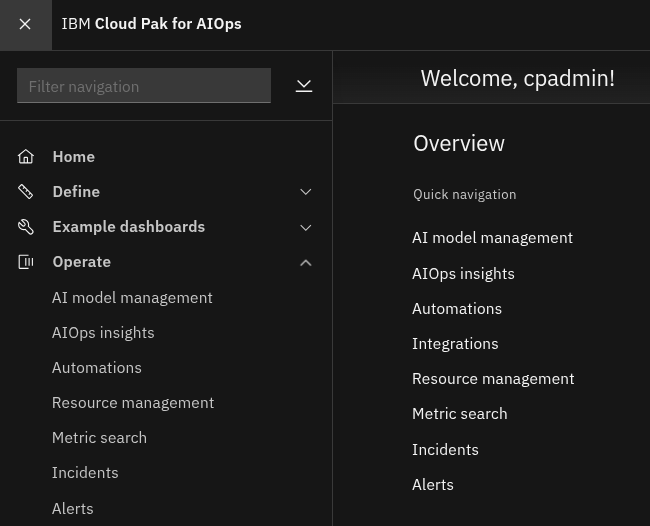
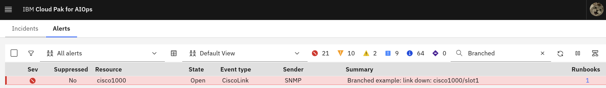
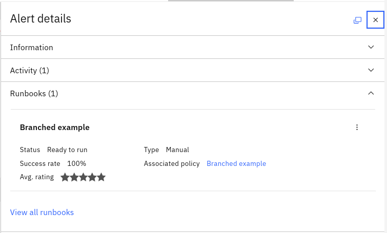
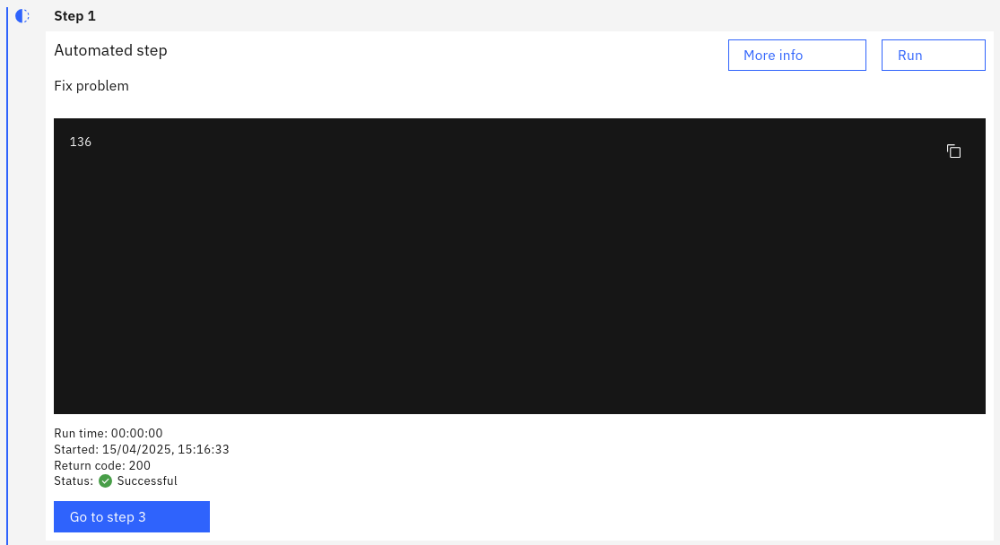
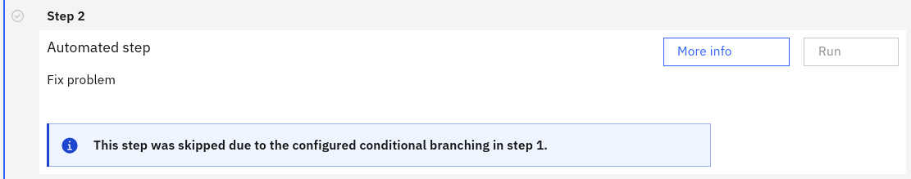
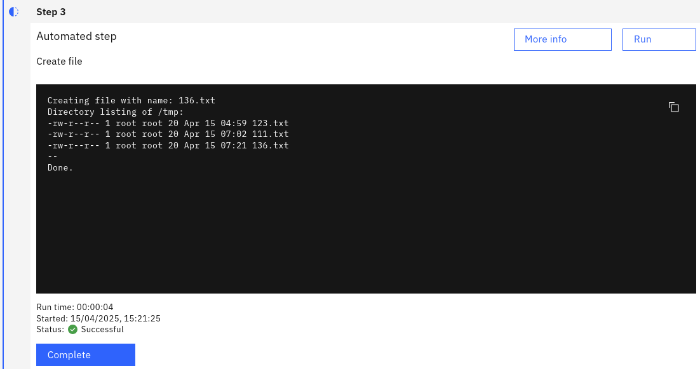

## 3.1: Overview

In this lab, you will inject a synthetic alert into your system, observe the runbook get associated with it, then run the runbook and observe parameters being passed, branching working, action output being passed from one action to another, and parameters being used in the target script.

## 3.2 Set up the Netcool Connector integration

If you haven't already completed the *Migration from Netcool* labs, you will need to follow the steps in module [3.2: Create a Netcool Connector instance](/waiops-tech-jam/labs/cloud-pak-aiops/migration-from-netcool/netcool-connector/#32-create-a-netcool-connector-instance) before you continue.

Return to this point after you have set up the Netcool Connector instance.

## 3.3: Inject a synthetic alert

Use the following steps to inject a synthetic alert into AIOps:

- Open a command terminal, connect to the virtual machine `netcoolvm` via SSH, and log in to the Netcool/OMNIbus ObjectServer:
```
$ ssh jammer@netcoolvm
$ sudo su - netcool
$ $OMNIHOME/bin/nco_sql -server AGG_P -user root -password netcool
```

- Copy and paste the following SQL into the SQL prompt:
```
insert into alerts.status (Identifier, Node, NodeAlias, Severity, Summary, Type, FirstOccurrence, 
LastOccurrence, Class, Service, AlertGroup, Manager, ExpireTime) values 
('BranchedExample', 'cisco1000', '', 5, 'Branched example: link down: cisco1000/slot1', 1, 
getdate, getdate, 40057, 'Banking', 'CiscoLink', 'SNMP', 86400);
go
```
- Type: `exit` and press the enter key to exit the command prompt

- Log in to the AIOps console
- Select **Alerts** from the **Quick navigation** menu or **Operate** → **Alerts** from the main menu



- Type: `Branched` into the Search box at the top of the Alerts viewer

You should see your synthetic alert in your Alerts viewer:



:::note
If you don't see the alert in your Alert viewer, wait up to a minute and then click the refresh button to refresh your view. The synthetic alert is being created in the Netcool/OMNIbus ObjectServer and then propagates up to AIOps via the Netcool Connector.
:::

- Under the **Runbooks** column, double-click the blue hyperlink: **1**
- Look for: **Runbooks (1)** under the **Alert details**
- You will be presented with the associated runbook: **Branched example**



- Click on the 3 small dots to the right of the runbook name
- Select **Run** from the popup menu

The runbook execution environment will now open. Note the hostname has been copied from the synthetic alert `resource.name` attribute and made available as a parameter within the runbook. We could potentially then use this or any other alert attribute in conjunction with other parameters within our runbooks.

- Click the **Start runbook** button to kick off the runbook execution
- Click the **Run** button in **Step 1**

It should complete successfully and return an integer value:



Note also that it prompts you to jump straight to Step 3 because of the branching condition.

- Click the **Go to step 3** button

Note that Step 2 is skipped:



- Click the **Run** button in **Step 3**

Step 3 completes and shows the output. You should be able to see the files you created in your tests as well as the newly created file:



- Click the **Complete** button to complete Step 3
- Give your runbook a star rating, provide any feedback, and click **Runbook worked**

You have now completed the Runbook Automation lab modules.
