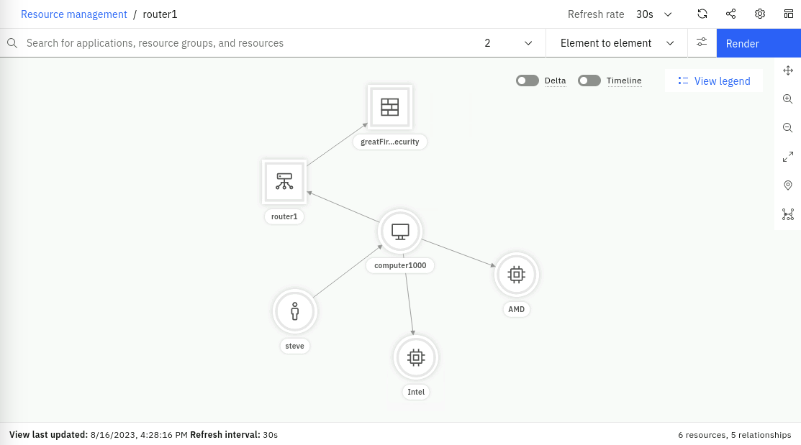

The **Resource Management** capabilities in the Cloud Pak for AIOps provide operations teams with complete up-to-date 
visibility and control over dynamic infrastructure and services. They let ITOps teams query a specific networked resource,
 and then presents a configurable topology view of it within its ecosystem of relationships and states, both in real time 
 and within a definable time window. 

Services and applications are increasingly deployed in environments that take advantage of distributed and often virtualized 
infrastructure. For example, parts of a network might be cloud-based, with other connected elements contained within, 
or tethered to, legacy systems that exploit tried and tested on-prem capability. The result is often a highly distributed and 
increasingly complex hybrid network that requires an agile and dynamic resource management capability in order to leverage 
and exploit its rapidly evolving technologies.

**Resource Management** allows the real-time view, support and management of highly dynamic infrastructures and services. 
By visualizing complex network topologies in real-time, updated dynamically or on-demand, and allowing further investigation 
of events, incidents and performance, operational efficiency is improved, problems are detected and solved faster, false alarms 
are reduced, and automation and collaboration between operational teams is improved. Also, data can be leveraged more efficiently 
both in real time and historically, thereby empowering teams and systems to create and nurture differentiated services for 
different customers.


Topology information adds enormous value to your deployment as it provides visibility into your environment and brings it 
to-life. With topology in your environment, you can:

- Visualize a seamless end-to-end view of your environment
- Create and view groups of resources that logically belong together
- Perform topology-based event correlation for events occurring within a group
  of related resources

The topology capability can ingest topology data from many different sources. The multiple disparate pieces of 
topology can then be stitched together, where it makes sense to do so, allowing you to see your end-to-end 
environment with all the logical and physical connections represented.


### Resources, Resource Groups and Applications


Resource Management has three categories of data: **Resources**, **Resource groups**, and **Applications**:

#### Resources

Resources are the lowest level of element in the system and are what is represented in topology visualizations, search 
experience, and APIs. They also form the basis of any topology-based event analytics. Resources are created in the system 
from observations of different technologies, in addition to allowing for proprietary data direct from you. These resources 
can represent a multitude of different things from the different layers of the application and infrastructure stack, for 
example host, vm, network interfaces, people, and locations. These resources are interconnected by relationships and their 
properties, which describe how the resources relate to one another. The relationship types can represent physical connections 
or logical connections, for example, the network interface partOf a host; the pod runs on a host; person owns this service. 
All the resources form together to create a connected representation of your environment, which is ideally ‘end to end’ across 
data sources and management silos.

#### Resource groups

Resource groups are an abstraction layer on top of resources. They aim to form collections of resources that capture some business 
or technical context within the environment for both search and correlation purposes. It might be something simple like a namespace 
or geographical region, but might also capture a network layer, protocol-specific constructs (like a VLAN), or a collection of 
resources that represent a running service instance. Resource groups are created either directly from Observers as they are observed 
from the various technologies ingesting topological data or can be created by defining templates that produce resource groups based 
on a particular criteria, which is an example topology structure or set of tags. The templates allow you to provide business logic to 
define how a grouping is created. The Cloud Pak for AIOps uses that template to dynamically create groups and maintain the dynamic 
membership. It is important to remember that resource groups are always responsible for ensuring the collection is up to date, and 
dynamically changing as the environment changes. Groups are useful because they allow us to impart meaning to potentially opaque resources, 
for example, a network interface problem can be prioritized far more effectively if it is known that the resource is part of an important 
customer’s service. You might want to create many thousands of groups depending on their environment, for example, you can provide tens of 
thousands of services to your customers or have one hundred thousand geographical locations.

Resource groups are used to manage specific resources. You can have resource groups within an application and also separate from any 
application. These groups can be from different sources. Resource groups can be created and managed through a connected inventory provider, 
such as Kubernetes, VMware, or Instana, or through a group template. The resources within a group must be created and managed through the 
connection with the inventory provider. If you need to change the resources within a resource group, do not directly manipulate your group. 
Use the group template or manage the group within the connected inventory provider.

When created and available, resource groups display on the Resource groups tab of the Resource management page and can be viewed in 
the Topology viewer and included within applications.


#### Applications

Applications (or more generally, ‘services’), are the highest level of abstraction, considered the starting point for correlating 
the current environment and managing it in a more coarse-grained and abstract way. Applications are simply a collection/group of 
resources groups that best represent the customer's application or service in terms of its composition given no one source or group 
is likely to have end-to-end visibility. For example, an application might be formed by a number of virtual machines and their 
hypervisors, network equipment, cloud-native services, a build pipeline, and a supporting organizational personnel. All of this can 
be provided to form a single holistic representation of the application, which can be used as a shared context between many different 
teams. It is important to note that while the Cloud Pak for AIOps can be seen as ‘application centric’, it is sufficiently 
flexible to model services or general groups-of-groups that you might need, that is to say that it can be ‘bent’ to business service management.

These applications, when combined with resource-level event correlation and grouping mechanisms, provide customers with rapid visibility 
of overall state, which allows them prioritize root cause analysis and remediation work. They also allow operators to focus on specific 
sets of resources that are known to relate to a specific application, so they can exclude resources and groups of resources that are not of interest.


## 3.1: Topology Observers 

An Observer is a service that extracts resource information and inserts it into the Resource Management database.
Using the Observer UI, different observer jobs can be configured and run. 

At the time of writing this Lab, there are 33 different Observers available. The Observers
 are designed to connect to specific types of end-points, such as
ServiceNow, Dynatrace, or VMware vCenter. Two of the Observers are generic:
the File Observer (for ingesting file-based topology data) and the REST Observer
(for ingesting topology data programmatically via an API).

:::note

In order to save resources, only a subset of Observers are enabled by default. You can see the full list
of Observers and the steps to enable them by following the [**documentation**](https://www.ibm.com/docs/en/cloud-paks/cloud-pak-watson-aiops/4.1.0?topic=integrations-observer-jobs)
:::

In this Lab, we will only leverage the File Observer, but a similar process applies to the other Observers. 
By the end of this module, you will have created various topology Observer jobs and ingested different sets of topology data. 


## 3.2: Creating Topology Files

This first step involves the following tasks:

- Create two sample files with topology data
- Load this data using the File Observer

In a real-world scenario, it is likely that you would be using a number of
off-the-shelf Observers to get your topology data from your environment. It is
also likely however that you would also leverage the File or REST Observers
either to ingest data for which an off-the-shelf Observer doesn't exist, or to
manually create relationships between Resources in your topology for which there
is no import source. For example, you may wish to create connections between
resources to represent logical connections or dependencies that aren't included
in the data sets. In any case, this exercise will give you the skills to use the
File Observer, which will also equip you with a little more knowledge of what's
going on under the covers.

In this scenario, we will have one set of topology data that represents
**physical infrastructure**, and a second set of topology data that represents
some **applications** running on that physical infrastructure. An analogy to
this might be physical topology data ingested from an orchestrator, such as
OpenStack, and application data, coming from an application management tool,
such as AppDynamics.

Create a file called **infrastructure.txt** with the following content:

```sh title="infrastructure.txt"
V:{"_operation":"InsertReplace","uniqueId":"379177a8-0a6a-4068-817c-d6d6e870437e","matchTokens":["379177a8-0a6a-4068-817c-d6d6e870437e","router1"],"tags":["WAIOpsDemo"],"name":"router1","entityTypes":["router"]}
V:{"_operation":"InsertReplace","uniqueId":"9c1f90e0-7dc4-40d8-8721-40ea2f3af453","matchTokens":["9c1f90e0-7dc4-40d8-8721-40ea2f3af453","Intel"],"tags":["WAIOpsDemo"],"name":"Intel","entityTypes":["cpu"]}
V:{"_operation":"InsertReplace","uniqueId":"222-9c1f90e0-7dc4-40d8-8721-40ea2f3af453","matchTokens":["222-9c1f90e0-7dc4-40d8-8721-40ea2f3af453","AMD"],"tags":["WAIOpsDemo"],"name":"AMD","entityTypes":["cpu"]}
V:{"_operation":"InsertReplace","uniqueId":"7598a194-27a0-4d0b-9c49-cbc0070c99c9","matchTokens":["7598a194-27a0-4d0b-9c49-cbc0070c99c9","greatFireWallOfSecurity"],"tags":["WAIOpsDemo"],"name":"greatFireWallOfSecurity","entityTypes":["firewall"]}
V:{"_operation":"InsertReplace","uniqueId":"974d1788-1312-4151-8a62-73fa1854e807","matchTokens":["974d1788-1312-4151-8a62-73fa1854e807","computer1000"],"tags":["WAIOpsDemo"],"name":"computer1000","entityTypes":["computer"]}
V:{"_operation":"InsertReplace","uniqueId":"5c6f968a-2006-4b43-96b5-dd53df6b0afb","matchTokens":["5c6f968a-2006-4b43-96b5-dd53df6b0afb","steve"],"tags":["WAIOpsDemo"],"name":"steve","entityTypes":["person"]}
E:{"_toUniqueId":"379177a8-0a6a-4068-817c-d6d6e870437e","_edgeType":"connectedTo","_fromUniqueId":"974d1788-1312-4151-8a62-73fa1854e807"}
E:{"_toUniqueId":"7598a194-27a0-4d0b-9c49-cbc0070c99c9","_edgeType":"uses","_fromUniqueId":"379177a8-0a6a-4068-817c-d6d6e870437e"}
E:{"_toUniqueId":"974d1788-1312-4151-8a62-73fa1854e807","_edgeType":"uses","_fromUniqueId":"5c6f968a-2006-4b43-96b5-dd53df6b0afb"}
E:{"_toUniqueId":"9c1f90e0-7dc4-40d8-8721-40ea2f3af453","_edgeType":"contains","_fromUniqueId":"974d1788-1312-4151-8a62-73fa1854e807"}
E:{"_toUniqueId":"222-9c1f90e0-7dc4-40d8-8721-40ea2f3af453","_edgeType":"contains","_fromUniqueId":"974d1788-1312-4151-8a62-73fa1854e807"}
```

Create a second file called **application.txt **with the following content:

```sh title="application.txt"
V:{"_operation":"InsertReplace","uniqueId":"111-379177a8-0a6a-4068-817c-d6d6e870437e","matchTokens":["111-379177a8-0a6a-4068-817c-d6d6e870437e","billing"],"tags":["WAIOpsDemo"],"name":"billing","entityTypes":["application"]}
V:{"_operation":"InsertReplace","uniqueId":"111-9c1f90e0-7dc4-40d8-8721-40ea2f3af453","matchTokens":["111-9c1f90e0-7dc4-40d8-8721-40ea2f3af453","webserver"],"tags":["WAIOpsDemo"],"name":"webserver","entityTypes":["application"]}
V:{"_operation":"InsertReplace","uniqueId":"111-974d1788-1312-4151-8a62-73fa1854e807","matchTokens":["111-974d1788-1312-4151-8a62-73fa1854e807","computer1000"],"tags":["WAIOpsDemo"],"name":"computer1000","entityTypes":["computer"]}
E:{"_toUniqueId":"111-974d1788-1312-4151-8a62-73fa1854e807","_edgeType":"runsOn","_fromUniqueId":"111-379177a8-0a6a-4068-817c-d6d6e870437e"}
E:{"_toUniqueId":"111-974d1788-1312-4151-8a62-73fa1854e807","_edgeType":"runsOn","_fromUniqueId":"111-9c1f90e0-7dc4-40d8-8721-40ea2f3af453"}
```

#### File Observer Format Overview

The JSON format in these two sample files is the format expected by the File Observer, and contains
topology directives, one per line. A line that begins with a **V** represents a
"Vertex" (or Resource). A line that begins with an **E** represents
an "Edge" (or Relationship).

:::note

Other format information can be found in the [**documentation**](https://www.ibm.com/docs/en/cloud-paks/cloud-pak-watson-aiops/4.1.0?topic=jobs-file-observer)
:::

#### Vertex

Some notes about the Vertex (Resource) properties follow:

- \_operation: A value of "InsertReplace" means that this Resource will be
  inserted into the topology if it does not already exist, and replace the
  current one if it does.

- uniqueId: This must be a globally unique identifier for the Resource. The
  off-the-shelf Observers will ensure uniqueness automatically. When using the
  File Observer, care must be taken to ensure uniqueness, otherwise you may
  inadvertently overwrite existing Resources with new ones.

- matchTokens: These values (comma separated list) are used to match the
  Resource against the incoming event stream, specifically against the Node and
  NodeAlias fields. Where there is a match, the event will be associated with
  the Resource and be visible from the topology view.

- tags: Tags can be handy to group Resources together, or for searching across
  resources that share a common tag. A resource can have multiple tags and
  represents a kind of group membership. One way that topology-based event
  correlation is across events that share a common tag. For example, you might
  tag all Resources that run an Oracle database with: "App:Oracle". Then you
  could create a tag-based correlation group template based on that tag.

- name: This is the primary identity of the Resource, and would normally be its
  most recognisable and human-readable name. The name attribute is normally the
  one shown in the topology viewer against a Resource.

- entityTypes: This defines what type of Resource is being created - for
  example: a computer or a database - and will also dictate which icon it will
  use in the topology view. A resource can have multiple values in the
  entityTypes field, although normally it would just have one entry.

#### Edge

Some notes about the Edge (Relationship) properties follow:

- \_fromUniqueId and \_toUniqueId: These parameters represent the start and end
  points for the Relationship - ie. which two Resources is it connecting. The
  values they have refer to the uniqueId parameters of the Vertex objects - ie.
  the Resources.

- \_edgeType: This parameter specifies the type of Relationship this relates to.
  For example, is it indicating a "uses" type of relationship, or a "contains"
  type?

A list of default Edge types (for the parameter \_edgeType) is documented [**here**](https://www.ibm.com/docs/en/cloud-paks/cloud-pak-watson-aiops/4.1.0?topic=reference-edge-types).


## 3.3: Creating File Observer Jobs


Log into the Cloud Pak for AIOps: 
* from the burger menu in the top-left navigate to: **Define → Data and tool connections**
* from the **Data and tool connections** page, click on **Add connection**
* from the **Add connections** page, under Category click on **Topology** then click on the **File** tile and click **Connect**


In the **New observer job: File** form, fill the Unique ID field as "infrastructure". Keep the 
**File Mode** as **Upload local file**, upload the **infrastructure.txt** file that you created in the previous 
step and click the **Save** button.


:::note
The Provider will be automatically populated when you click Save.
:::

Repeat the process by creating a second File Observer job with the Unique ID as "application" and this time load the
**application.txt** file.

Each job will run the moment it is saved. After you have done this, your
Observer jobs screen should look like the one below. You can verify that your jobs ran successfully by confirming the Ready status
for each job:


We will now search the topology for your newly added resources. 
From the burger menu in the top-left, navigate to: **Operate → Resource management**.
In the **Resource management** page, click on the **Resources** tab and search for *WAIOpsDemo*, which
is the tag that all of your Resources in both your files were tagged with. You
should see nine resources listed:


:::note

There are two resources in the list called "computer1000". One is from the
topology segment ingested from the infrastructure.txt file and the other one is
from the topology segment ingested from the application.txt file. We will be
merging these two Resources together in the next chapter, via a Merge Rule.

:::

Click on **router1** and it will open the topology view. Increase the number of
hops to 2 and click **Render** and you should see something like the following:



You can click Back on your browser window and click on one of the other
Resources ingested via the **application** job (e.g. billing). You will see a
representation of the topology segment created by ingesting that file.

