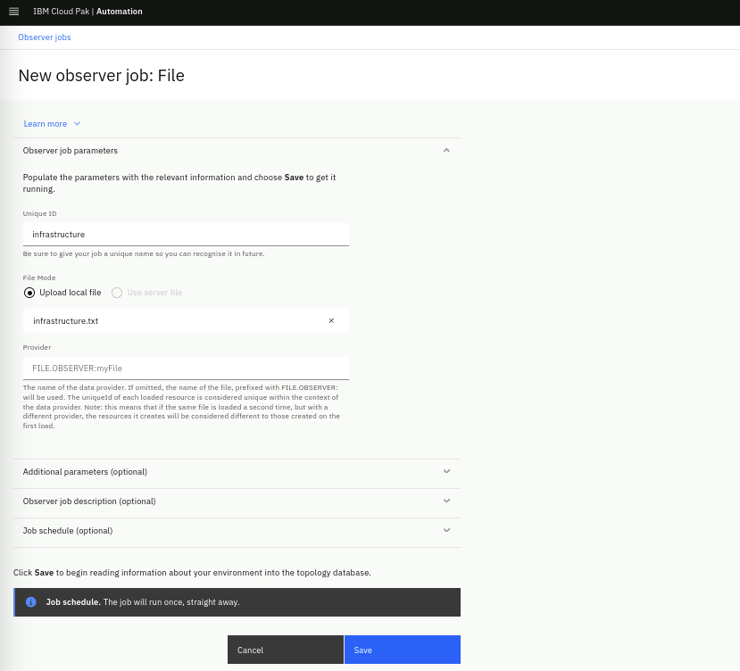
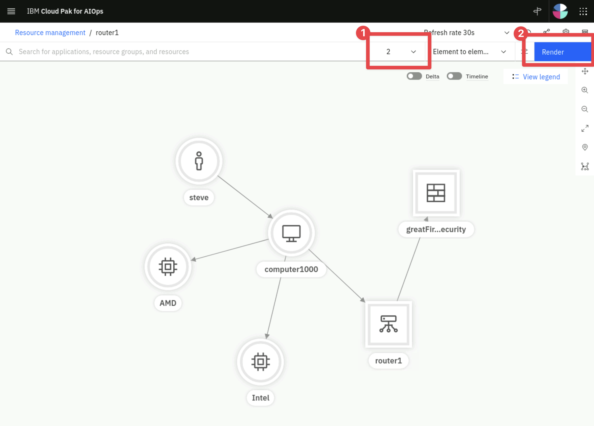

Services and applications are increasingly deployed in environments that take
advantage of distributed and often virtualized infrastructure. For example,
parts of a network might be cloud-based, with other connected elements contained
within, or tethered to, legacy systems that exploit tried and tested on-prem
capability. The result is often a highly distributed and increasingly complex
hybrid network that requires an agile and dynamic resource management capability
in order to leverage and exploit its rapidly evolving technologies.

The **Resource Management** capabilities in the Cloud Pak for AIOps provide
operations teams with complete up-to-date visibility and control over dynamic
infrastructure and services. They let ITOps teams query a specific networked
resource, and then presents a configurable topology view with its ecosystem of
relationships and states, both in real time and within a definable time window.

By visualizing complex network topologies in real-time, updated dynamically or
on-demand, and allowing further investigation of events and incidents,
operational efficiency is improved, problems are detected and solved faster,
false alarms are reduced, and automation and collaboration between operational
teams is enhanced.

Topology information adds enormous value to your IT Operations as it provides
visibility into the environment and brings it to-life. With topology information
its possible to:

- Visualize a seamless end-to-end view of the environment
- Create and view groups of resources that logically belong together
- Perform topology-based event correlation for events occurring within a group
  of related resources

The Cloud Pak for AIOps can ingest topology data from many different sources.
The multiple disparate pieces of topology can then be stitched together, where
it makes sense to do so, allowing to see the end-to-end environment with all the
logical and physical connections represented.


### Resources, Resource Groups and Applications

Resource Management has three categories of data: **Resources**, **Resource
groups**, and **Applications**:

#### Resources

Resources are the lowest level of element in the system and are what is
represented in topology visualizations, search experience, and APIs. They also
form the basis of any topology-based event correlation. Resources are created in
the system from observations of different technologies, in addition to allowing
for proprietary topology data. These resources can represent a multitude of
different things from the different layers of the application and infrastructure
stack, for example host, vm, network interfaces, people, and locations. These
resources are interconnected by relationships and their properties, which
describe how the resources relate to one another. The relationship types can
represent physical connections or logical connections. For example, the network
interface is **part-of** a host; the pod **runs-on** a host; person **owns**
this service. All these resources form together a complete, connected,
end-to-end representation of the on-premises and cloud IT environment.

#### Resource groups

Resource groups are an abstraction layer on top of resources. They aim to form
collections of resources that capture some business or technical context within
the environment for both search and correlation purposes. It might be something
simple like a namespace or geographical region, but might also capture a network
layer, protocol-specific constructs (like a VLAN), or a collection of resources
that represent a running service instance.

Resource groups are created either directly from topology Observers as they are
observed from the various technologies ingesting topological data or can be
created by defining templates that produce resource groups based on a particular
criteria. The templates allow to provide business logic to define how a grouping
is created. The Cloud Pak for AIOps uses templates to dynamically create groups
and maintain this dynamic membership.

#### Applications

Applications (or also defined as ‘services’ in the Telco industry), are the
highest level of abstraction. Applications are simply a collection of resource
groups that best represent the customer's application stack or service in terms
of its composition. For example, an application might be formed by a number of
virtual machines and their hypervisors, network equipment, cloud-native
services, a build pipeline, and a supporting organizational personnel. All of
this can be provided to form a single holistic representation of the
application, which can be used as a shared context between many different IT
teams. It is important to note that while the Cloud Pak for AIOps can be seen as
‘application centric’, it is sufficiently flexible to model services or general
groups-of-groups that might be needed.

These applications, when combined with resource-level event correlation and
grouping mechanisms, provide customers with rapid visibility of the overall
state, which allows them to prioritize root cause analysis and remediation work.
They also allow operators to focus on specific sets of resources that are known
to relate to a specific application, so they can exclude resources and groups of
resources that are not of interest.

## 3.1: Topology Observers

A Topology Observer is a service that extracts resource information from a
target source. Using the Observer UI, different observer jobs can be configured
and run. At the time of writing this Lab, there are 34 different Observers
available. The Observers are designed to connect to specific types of topology
sources, such as ServiceNow, Dynatrace, or VMware vCenter.

Two of the Observers are generic: the File Observer (for ingesting file-based
topology data) and the REST Observer (for ingesting topology data
programmatically via an API).

:::note

In order to save resources, only a subset of Observers are enabled by default.
You can see the full list of Observers and the steps to enable them by following
the
[**documentation**](https://www.ibm.com/docs/en/cloud-paks/cloud-pak-watson-aiops/4.1.0?topic=integrations-observer-jobs)
:::

In this Lab, we will only leverage the File Observer, but a similar process
applies to other Observers. By the end of this module, you will have created
various topology Observer jobs and ingested different sets of topology data.

## 3.2: Creating Topology Files

This first step involves the following tasks:

- Create two sample files with topology data
- Load this data into the Cloud Pak for AIOps using the File Observer

In a real-world scenario, it is likely that you would be using a number of
off-the-shelf Observers to get your topology data from your environment. It is
also likely however that you would also leverage the File or REST Observers
either to ingest data for which an off-the-shelf Observer doesn't exist, or to
manually create relationships between Resources in your topology for which there
is no import source. For example, you may wish to create connections between
resources to represent logical connections or dependencies that aren't included
in the original data sets. In any case, this exercise will give you the skills
to use the File Observer, which will also provide you with a little more
knowledge of what's going on under the covers.

In this scenario, we will have one set of topology data that represents
**physical infrastructure**, and a second set of topology data that represents
some **applications** running on that physical infrastructure. An example of
this might be physical topology data ingested from an orchestrator, such as
OpenStack, and application data, coming from an application management tool,
such as AppDynamics or Instana.

Lets create a folder for the topology files in the home directory and change to
this new folder. Run the following command from the **Terminal** window:

```
cd; mkdir lab; cd lab
```

Create a file called **infrastructure.txt** by running the following command in
the **Terminal** window to open the text editor , copy the infrastructure
topology data listed below (use the copy helper icon (top-right) for one-click
copy), paste it into the text editor, click on the **Save** button in the text
editor and close the editor window (click on the X).

```
gedit infrastructure.txt
```

```sh
V:{"_operation":"InsertReplace","uniqueId":"379177a8-0a6a-4068-817c-d6d6e870437e","matchTokens":["379177a8-0a6a-4068-817c-d6d6e870437e","router1"],"tags":["WAIOpsDemo"],"name":"router1","entityTypes":["router"],"_references":[{"_toUniqueId":"7598a194-27a0-4d0b-9c49-cbc0070c99c9","_edgeType":"uses"}]}
V:{"_operation":"InsertReplace","uniqueId":"9c1f90e0-7dc4-40d8-8721-40ea2f3af453","matchTokens":["9c1f90e0-7dc4-40d8-8721-40ea2f3af453","Intel"],"tags":["WAIOpsDemo"],"name":"Intel","entityTypes":["cpu"],"_references":[]}
V:{"_operation":"InsertReplace","uniqueId":"222-9c1f90e0-7dc4-40d8-8721-40ea2f3af453","matchTokens":["222-9c1f90e0-7dc4-40d8-8721-40ea2f3af453","AMD"],"tags":["WAIOpsDemo"],"name":"AMD","entityTypes":["cpu"],"_references":[]}
V:{"_operation":"InsertReplace","uniqueId":"7598a194-27a0-4d0b-9c49-cbc0070c99c9","matchTokens":["7598a194-27a0-4d0b-9c49-cbc0070c99c9","greatFireWallOfSecurity"],"tags":["WAIOpsDemo"],"name":"greatFireWallOfSecurity","entityTypes":["firewall"],"_references":[]}
V:{"_operation":"InsertReplace","uniqueId":"974d1788-1312-4151-8a62-73fa1854e807","matchTokens":["974d1788-1312-4151-8a62-73fa1854e807","computer1000"],"tags":["WAIOpsDemo"],"name":"computer1000","entityTypes":["computer"],"_references":[{"_toUniqueId":"379177a8-0a6a-4068-817c-d6d6e870437e","_edgeType":"connectedTo"},{"_toUniqueId":"9c1f90e0-7dc4-40d8-8721-40ea2f3af453","_edgeType":"contains"},{"_toUniqueId":"222-9c1f90e0-7dc4-40d8-8721-40ea2f3af453","_edgeType":"contains"}]}
V:{"_operation":"InsertReplace","uniqueId":"5c6f968a-2006-4b43-96b5-dd53df6b0afb","matchTokens":["5c6f968a-2006-4b43-96b5-dd53df6b0afb","steve"],"tags":["WAIOpsDemo"],"name":"steve","entityTypes":["person"],"_references":[{"_toUniqueId":"974d1788-1312-4151-8a62-73fa1854e807","_edgeType":"uses"}]}
```

Repeat the process and create a second file called **application.txt** by
running the following command and use the application topology data listed
below:

```
gedit application.txt
```

```sh
V:{"_operation":"InsertReplace","uniqueId":"111-379177a8-0a6a-4068-817c-d6d6e870437e","matchTokens":["111-379177a8-0a6a-4068-817c-d6d6e870437e","billing"],"tags":["WAIOpsDemo"],"name":"billing","entityTypes":["application"],"_references":[{"_toUniqueId":"111-974d1788-1312-4151-8a62-73fa1854e807","_edgeType":"runsOn"}]}
V:{"_operation":"InsertReplace","uniqueId":"111-9c1f90e0-7dc4-40d8-8721-40ea2f3af453","matchTokens":["111-9c1f90e0-7dc4-40d8-8721-40ea2f3af453","webserver"],"tags":["WAIOpsDemo"],"name":"webserver","entityTypes":["application"],"_references":[{"_toUniqueId":"111-974d1788-1312-4151-8a62-73fa1854e807","_edgeType":"runsOn"}]}
V:{"_operation":"InsertReplace","uniqueId":"111-974d1788-1312-4151-8a62-73fa1854e807","matchTokens":["111-974d1788-1312-4151-8a62-73fa1854e807","computer1000"],"tags":["WAIOpsDemo"],"name":"computer1000","entityTypes":["computer"],"_references":[]}
```

Confirm that you have two files created with data by running the command below:

```
ls -l infrastructure.txt application.txt
```

#### File Observer Format Overview

The JSON format in these two sample files is the format expected by the File
Observer, and contains topology directives, one per line.

:::note Additional File Observer topology format information can be found in the
[**documentation**](https://www.ibm.com/docs/en/cloud-paks/cloud-pak-watson-aiops/4.1.0?topic=jobs-file-observer)
:::

Resource properties definition:

- \_operation: A value of "InsertReplace" means that this Resource will be
  inserted into the topology if it does not already exist, and replace the
  current one if it does.

- uniqueId: This must be a globally unique identifier for the Resource. The
  off-the-shelf Observers will ensure uniqueness automatically. When using the
  File Observer, care must be taken to ensure uniqueness, otherwise you may
  inadvertently overwrite existing Resources with new ones.

- matchTokens: These values (comma separated list) are used to match the
  Resource against the incoming event stream. Where there is a match, the event
  will be associated with the Resource and be visible from the topology view.

- tags: Tags can be handy to group Resources together, or for searching across
  resources that share a common tag. A resource can have multiple tags and
  represents a kind of group membership.

- name: This is the primary identity of the Resource, and would normally be its
  most recognisable and human-readable name. The name attribute is normally the
  one shown in the topology viewer against a Resource.

- entityTypes: This defines what type of Resource is being created for example:
  a computer or a database and will also dictate which icon it will use in the
  topology view.

- references: this adds one or more edges to another resource. Each edge in the
  list can have some of these keywords:
  - \_fromUniqueId and \_toUniqueId: these parameters represent the start or end
    points for the relationship.
  - \_edgeType: this parameter specifies the type of relationship this relates
    to, for example, its indicating a "uses" or a "contains" type of
    relationship. A list of default Edge types is documented
    [**here**](https://www.ibm.com/docs/en/cloud-paks/cloud-pak-watson-aiops/4.1.0?topic=reference-edge-types).

## 3.3: Creating File Observer Jobs

Log into the Cloud Pak for AIOps:

- from the burger menu in the top-left navigate to: **Define → Integrations**
- from the **Integrations** page, click on **Add integration**
- from the **Add Integrations** page, under Category click on **Topology** then
  search for **File**, click on the **File** tile and click **Get started**

In the **New observer job: File** form, fill the Unique ID field as
"infrastructure". Keep the **File Mode** as **Upload local file**, upload the
**infrastructure.txt** file that you created in the previous step and click the
**Save** button. The Provider field will be automatically populated when you
click **Save**.



Now click on the **Add a new job** button, from the pop-up choose the **File**
observer and repeat the process by creating a second File Observer job with the
Unique ID as "application" and this time load the **application.txt** file.

Each job will run the moment it is saved. After you have done this, your
Observer jobs screen should look like the one below. You can verify that your
jobs ran successfully by confirming the Ready status for each job:


We will now search the topology for your newly added resources. From the burger
menu in the top-left, navigate to: **Operate → Resource management**. In the
**Resource management** page, click on the **Resources** tab. You should see
nine resources listed:


:::note

There are two resources in the list called "computer1000". One is from the
topology segment ingested from the infrastructure.txt file and the other one is
from the topology segment ingested from the application.txt file. We will be
merging these two Resources together in the next chapter, via a Merge Rule.

:::

Click on **router1** and it will open the topology view.

Increase the number of hops to 2 by clicking on the hops drop down list and
select **Render**, you should see six resources as shown below:



You can click Back on your browser window and click on one of the other
Resources ingested via the **application** job (e.g. billing). You will see a
representation of the topology segment created by ingesting that file.
