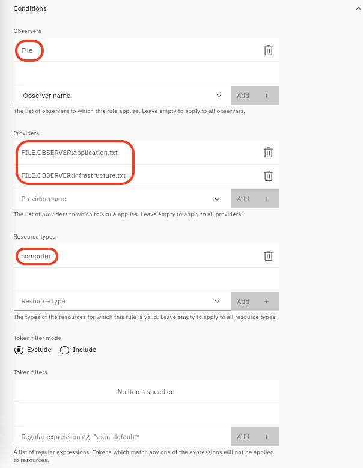

Topology Rules help streamline topologies, such as by merging different observer
records of the same resource into a single composite resource, or by excluding
specific changes from being recorded against a resource history. You can use
different types of rules for different purposes.

:::tip In this Lab, we will only see a hands-on example of a **mergeRule**.
Additional information about other rules can be found in the product
[**documentation**](https://www.ibm.com/docs/en/cloud-paks/cloud-pak-aiops/4.7.0?topic=elements-configuring-rules).
:::

#### mergeRule

Different observers can record and then display the same resource as two (or
more) resources. For example, a kubernetes cluster Observer can find a _worker
node_ as a topology resource but the same resource can be found by a VMware
vCenter Observer as _virtual machine_. But its essentially the same resource. To
prevent these situations, a merge rule can be created to ensure that these
separate records share values in their tokens set, which then triggers the Merge
service to create a single composite resource. Composite (or merged) resources
are displayed in the Topology viewer as a single resource, which includes the
properties of all merged resources. Merge rules are applied to resources by an
observer job _before_ it is sent to the topology service.

#### tagsRule

The tags rule allows the value of another field to be copied to the tags field
so that it becomes searchable in the UI. It populates the tags of resources
matched by the rule. Any field that is not indexed and cannot normally be
searched becomes searchable when copied to the tags property. For a list of
indexed properties, see
[Properties](https://www.ibm.com/docs/en/cloud-paks/cloud-pak-watson-aiops/4.1.0?topic=reference-properties).
Having the right tags in resources also enable the use of Tag Templates to group
resources with a common tag. We will see resource grouping in the next chapter.

#### matchTokensRule

A match token rule allows the value of another field to be copied to the
matchTokens field so that it can be used to match events to resources.

#### historyRule

Changes in topology resources are recorded. A history rule identifies properties
that don't indicate an important change that needs to be recorded, for example a
host's _sysUpTime_ property. In other words, a history rule can be used to
exclude properties from being retained in history, saving resources by not
maintaining detailed historical records of changes to these properties.

## 4.1: Merge Rules in Action

You are now ready to create a Merge Rule to tie the two topology resources that
we loaded in the previous chapter.

This is where the topology data coming from the **application** topology source
is mapped onto the topology data coming from the **infrastructure** topology
source. In our hypothetical scenario, we know we have Resources of type
"computer" in both sets of topology, and we know that they relate to the same
servers. Corresponding instances across the two data sets are also labelled
consistently and correctly, meaning that identifying the same Resource across
the two data sets is possible.

In our case, we have a Resource called "computer1000" represented in our
infrastructure topology data as well as in our application data. Our goal is to
merge the two sets of topology together so that we can both visualize what
applications are running on our servers, and more importantly, correlate
infrastructure alerts with application alerts, something that is not possible
otherwise. Note that the rule is created in a generic way so that if there were
any other computers included in our two data sets, they too would be merged
together automatically, so long as they met the criteria set out in the rule.

From the burger menu in the top-left, navigate to: **Operate → Resource
management**. In the **Resource management** page, click on the **Settings**
gear icon in the top-right as shown below:

Select **Topology configuration**. From the **Topology configuration** page, in
the **Rules** card shown below select **Configure**.

Note that some Merge rules are already defined out-of-the-box.

Click the **New** button in the top-right.

Select **Merge rule** from the rule type list and select **Start**.

Follow these steps to create your new Merge Rule:

- **Rule name:** Give your rule a name, for example
  **InfrastructureApplications**
- Set **Status** to **Enabled**
- **Tokens**: The tokens refer to the parameters in your Resources that will be
  compared. In our case, the parameter that stores the computer name is called
  "name" in both sets of data, therefore type **${name}** and click on **Add**.

- Expand the **Conditions** drop-down.

  - **Observers**: Select **File** from the list of Observers and click **Add**.
    Since both job types are of type File, this is all that is needed in this
    case. Normally you would add all the Observer types that apply to your
    mapping. If this section was left empty, it would try to apply this rule to
    topology data coming from **all** Observer types.

  - **Providers**: Add both of your jobs to the list (e.g.
    **FILE.OBSERVER:infrastructure.txt** and **FILE.OBSERVER:application.txt**)
    This specifies that this rule should only apply to these particular jobs. If
    this section was left empty, it would try to apply this rule to topology
    data coming from **all** File jobs defined.

  - **Resource types**: Add the Resource type that this rule should apply to
    which is **computer**. If this section was left empty, it would try to apply
    this rule to **all** Resource types in the Observers list and Providers list
    above.

  - The **Token filter mode** and **Token** filters sections allow you to refine
    your rule mapping even further, by allowing you to specify regular
    expressions to either include or exclude the set of Resources from the rule.
    In this case, we will leave both of these sections blank.

Your **Conditions** section should look like this:

:::note

Its good practice to specify the appropriate set of **Conditions** in the rules,
to ensure they only get applied to the right topology resources.

:::

When finished creating your new Merge Rule, click **Save** and return to the
Observer jobs page

#### Rerun Observer Jobs to Apply the Merge Rule

From the burger menu in the top-left navigate to: **Define → Integrations**

Click on **Manage observer jobs** tab and click on **Configure, schedule, and
manage observer jobs**.

Click on **Run** (Play button icon) under the Operation column on **each of the
two jobs**. Note that both Observer jobs must be run again. The data will be
reprocessed in light of the new Merge rule we just created, and any Resources
that match the rule will have the merge operation applied against them.

:::info

The merge will not happen unless the affected jobs are re-run. In other words,
you will always have to rerun jobs to apply any defined rules.

:::

#### Finding the Merged Resource

To verify the merge was successful, navigate back to Resource management. From
the burger menu in the top-left, navigate to: **Operate → Resource management**.

In the **Resource management** page, click on the **Resources** tab and this
time search for **computer1000**. Now you will see just one instance in the list
of Resources called computer1000 whereas before you would have seen two. Click
on **computer1000**, change the hop view to **2** and click **Render**. You
should see something like the following, showing the combined topology segments:

The Resource computer1000 is only shown once in the topology, but remains
connected to all the resources it was connected to in both sets of topology
data, prior to the merge. The Merge Rule has effectively merged the two sets of
topology together, by merging the common Resources, according to the rule that
we defined.

You have now completed this chapter and are ready for next one about "topology
templates".
