This chapter focuses on topology group templates, the different types, and how
groups of topology can be used for topology-based event correlation. We will use
the topology we created in the previous chapters.

By the end of this chapter, you will understand the four types of topology
templates, and have created an example of each type. You will also understand
what a "favorite" is and will have added some items to your topology dashboard.

Topology group templates are used to create groups of resources. Resource groups
make it easier to find and visualize collections of related resources, as well
as enabling event correlation over resources in the same group. There are four
types of topology group template:

- **Exact**: defines a single group of specific resources
- **Tag-based**: defines a single group of resources that share a common tags
- **Dynamic**: defines one or more groups of resources that match a prescribed
  specification
- **Token**: defines a set of rules which use the properties of your resources
  to create one or more groups which contain those resources

Note that **Exact** and **Tag-based** templates creates a **single** resource
group while **Dynamic** and **Token** templates could create **multiple**
resource groups.

## 5.1: Exact Group Template

An exact template builds a single group of resources centered on a specified
seed resource. The membership of the resulting resource group includes the seed
resource and those matching the specified relationship and/or resource type
criteria. Resource group membership is dynamically maintained for the resulting
resource group provided the specified seed resource type remains unchanged.

For example, you can use an exact template to create a group of resources only
for a specific Jenkins build pipeline and any new builds or physical server and
its connected network switch.

The exact topology group template is useful for when you have a specific
collection of resources that are unique in your environment that may be of
particular importance. Perhaps you want to be able to find this group of
resources quickly and easily.

#### Exercise

In this exercise, we will create a template for a specific group of resources
for our router **router1** and its connected resources up to one hop connection.

From the burger menu in the top-left, navigate to: **Operate → Resource
management**. In the **Resource management** page, click on the **Resource group
templates** icon in the top-right.

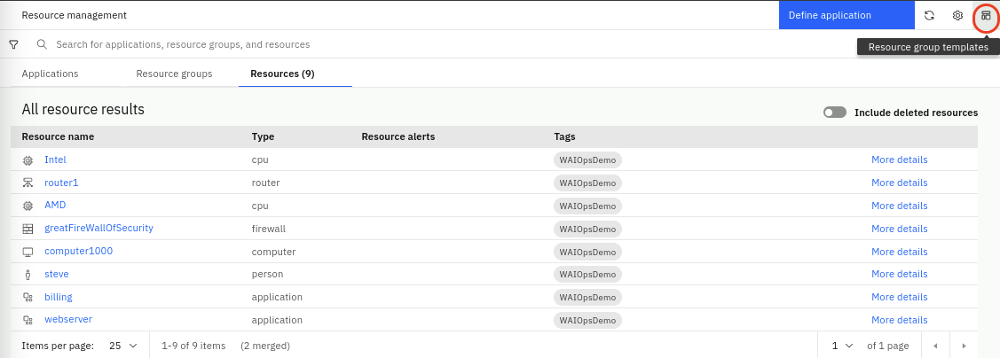

In the **Resource group templates** page, click on **Create a new template**,
select **Exact template** and click **Start**.

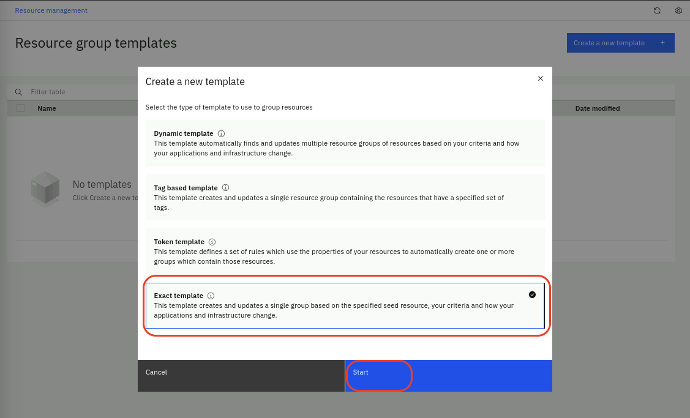

You will be presented with a **Template builder** page. From here, use the
following steps to configure a new exact template:

- Give the template a name such as **router1**
- Choose the **Resource group type** as **network**
- Add a **Resource group naming pattern prefix** for the resulting group's name:
  **ROUTER-**
- Enable **Correlate event groups on topologies from this template** to
  correlate events across these resources
- On the right side, in the search box: **Search for a resource to get started**
  type **router1** and hit Enter
  - Choose **router1** from the list of resources
  - Change the view to 1 hop and click **Render**


- Click **Save template & generate resource group**

You should have something like the following:


Click on the **Resource group templates** link on the top. You will see your new
template:

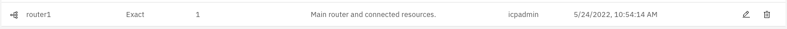

Click on the **Resource management** link on the top, select the **Resource
groups** tab and search for **ROUTER-** , you will see the following under the
**Resource groups** tab:

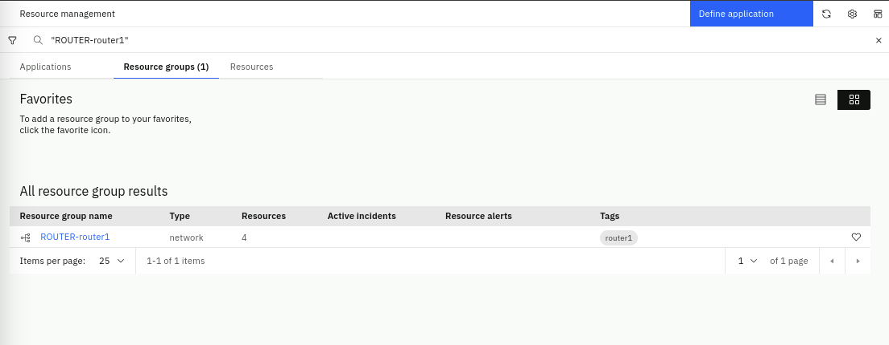

Click on the name **ROUTER-router1**, you will be able to view the topology
group, which shows 3 resources but actually consists of 4 resources because
computer1000 actually represents two resources as they have been merged by the
Merge Rule defined previously.

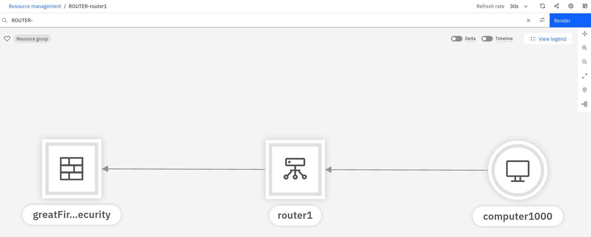

:::note

If you have enabled event correlation across this group of resources and receive
events related to any of these resources, these events will be correlated
automatically. This is called **topological event correlation** and is one of
the correlation modes in addition to **temporal** and **scope-based**
correlation.

:::

## 5.2: Tag Group Template

A tag based template builds a single but dynamic resource group containing
resources that have the specified tag(s). Resource group membership is
dynamically maintained to reflect changes in the topology for resources that
gain or lose the specified tags.

For example, you can use a tag based template to create a dynamic group of your
resources tagged with both 'red' and 'green'. Then, when you add new resources
with both of those tags, the resource group will be updated to include them.

Note that resources don't have to be connected; they simply need to have the
common tag in order to be grouped. Tags can be added to resources via the
topology **tagsRule** as discussed in the previous chapter, or by including the
tags parameter if creating topology via the File or REST Observers.

#### Exercise

In this exercise, we will create a template for group of resources based on
their common tag.

In the **Resource management** page, click on the **Resource group templates**
icon in the top-right. In the **Resource group templates** page, click on
**Create a new template**, select **Tag based template** and click **Start**.

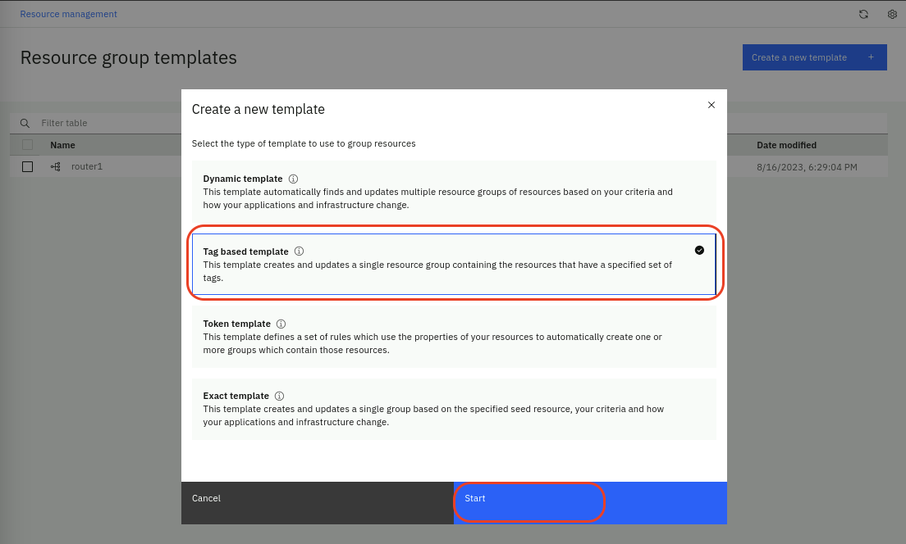

You will be presented with a **Template builder** page. From here, use the
following steps to configure an tag based template:

- Give the template a name (e.g. tag template)
- Choose the **Resource group type** as **compute**
- Add a **Resource group name** for the name of the group of resources:
  **tag-group**
- Enable **Correlate event groups on topologies from this template** to
  correlate events across these resources
- Type **WAIOpsDemo** in the search box: **Search for a tag to get started** and
  hit Enter
- Check the **WAIOpsDemo** checkbox from the list of available tags and then
  click the **Resources** tab to see the list of matching resources

You should have something like the following:

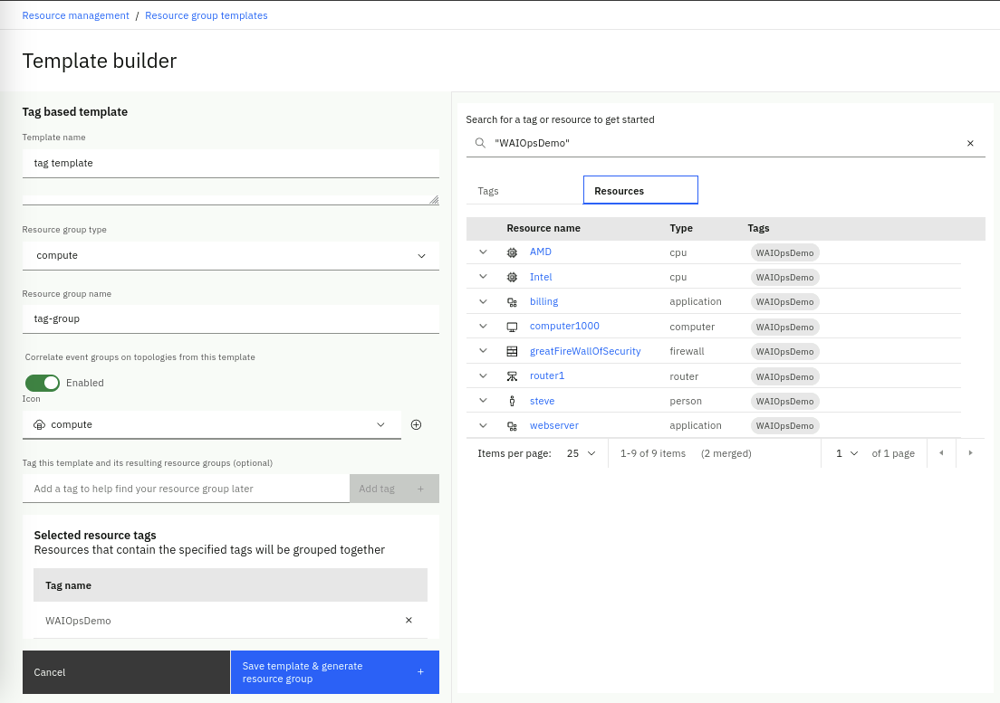

- Click **Save template & generate resource group**

Click on the **Resource group templates** link on the top, filter by **tag
template** and you will see your saved template:

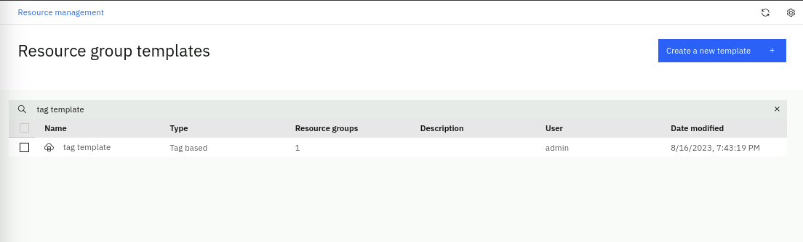

Click on the **Resource management** link on the top, select the **Resource
groups** tab and search for **tag-group**, you will find the new group created
by the tag template:

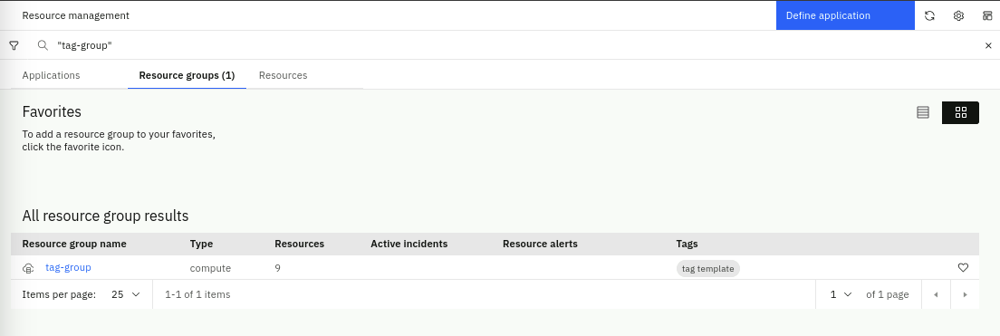

:::tip

If you do not see the resources in the group, you need to re-run the Observer
jobs.

:::

If you click on the name **tag-group**, you will see the resources in the
topology group:

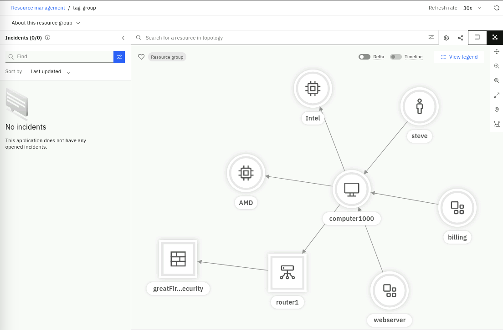

## 5.3: Dynamic Group Template

A dynamic group template builds multiple groups of resources that are similar to
the specified seed resource and relationship and/or resource type criteria.
Resource group creation and membership is dynamically maintained based on the
available topology data and how it changes.

For example, you can use a dynamic group template to create dynamic groups of
resources, one for each of your virtual machines and the Kubernetes services
they're running. Resource groups are then added, removed and updated as you add
or remove virtual machines and/or services running on them.

The Dynamic group template is probably the most versatile of all the topology
group templates. Using an example of a set of resources you want to group, the
dynamic group template will automatically find other groups of resources that
follow the same _recipe_ as the example you give. As you expose the resources
and relationships in the view, the template builder records the steps, and then
uses this _recipe_ to find other similar groups of resources.

#### Exercise

In this exercise, we will create a dynamic template to create groups of servers
that host our applications. We will create a second server **computer1001** that
hosts the **notification** and **email** applications for the purposes of this
exercise.

Create a new file called **application2.txt** by running the following command
in the **Terminal** window to open the text editor , copy the topology data
listed below (use the copy helper icon (top-right) for one-click copy), paste it
into the text editor, click on the **Save** button in the text editor and close
the editor window (click on the X).

```
gedit application2.txt
```

```sh title="application2.txt"
V:{"_operation":"InsertReplace","uniqueId":"111-379177a8-0a6a-4068-817c-d6d6e870437e-app2","matchTokens":["111-379177a8-0a6a-4068-817c-d6d6e870437e-app2","notifications"],"tags":["WAIOpsDemo"],"name":"notifications","entityTypes":["application"],"_references":[{"_toUniqueId":"111-974d1788-1312-4151-8a62-73fa1854e807-app2","_edgeType":"runsOn"}]}
V:{"_operation":"InsertReplace","uniqueId":"111-9c1f90e0-7dc4-40d8-8721-40ea2f3af453-app2","matchTokens":["111-9c1f90e0-7dc4-40d8-8721-40ea2f3af453-app2","email"],"tags":["WAIOpsDemo"],"name":"email","entityTypes":["application"],"_references":[{"_toUniqueId":"111-974d1788-1312-4151-8a62-73fa1854e807-app2","_edgeType":"runsOn"}]}
V:{"_operation":"InsertReplace","uniqueId":"111-974d1788-1312-4151-8a62-73fa1854e807-app2","matchTokens":["111-974d1788-1312-4151-8a62-73fa1854e807-app2","computer1001"],"tags":["WAIOpsDemo"],"name":"computer1001","entityTypes":["computer"],"_references":[]}
```

Use the steps described in the previous chapter to import this file
(**application2.txt**) using a new File Observer job to ingest the topology
data.

After running this last Observer job, you should see a total of 11 resources
which 2 have been merged, as shown below:

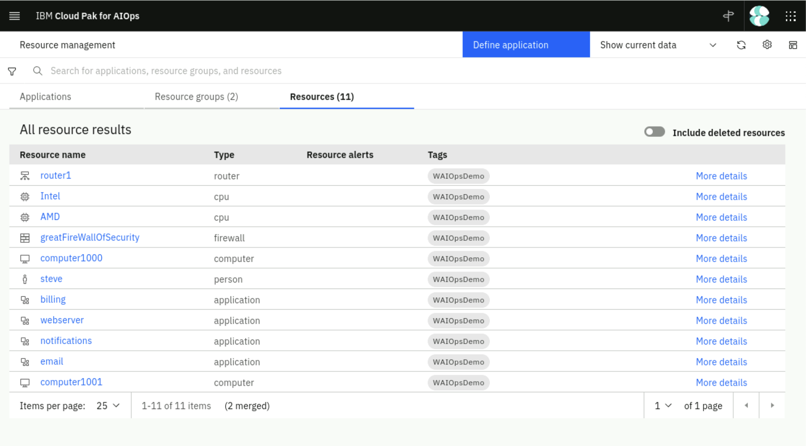

Now lets create the dynamic group template. In the **Resource management** page,
click on the **Resource group templates** icon in the top-right. In the
**Resource group templates** page, click on **Create a new template**, select
**Dynamic template** and click **Start**.

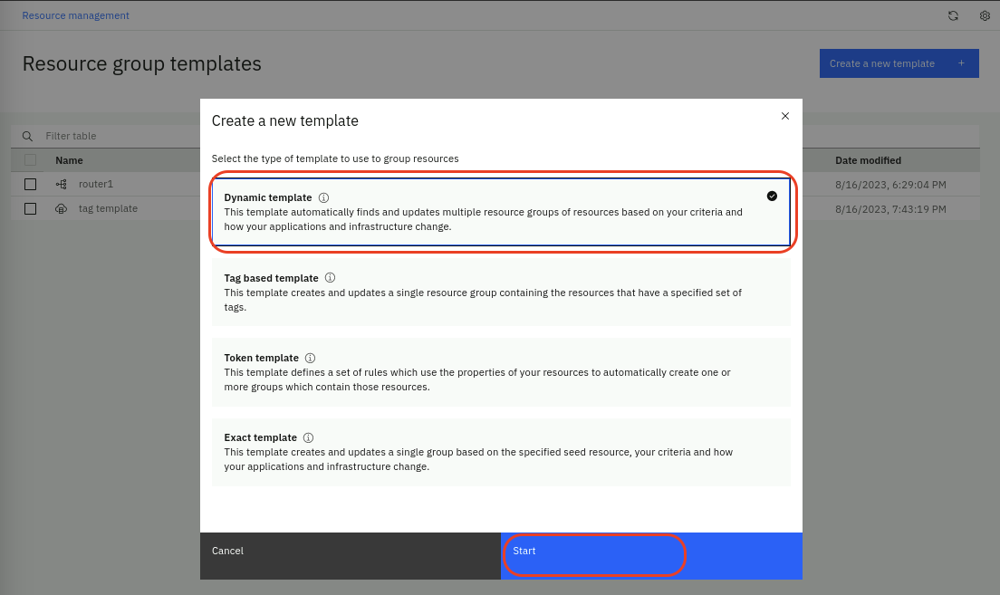

You will be presented with a **Template builder** page. From here, use the
following steps to configure a dynamic template:

- Give the template a **name** e.g. AppServers
- Choose the **Resource group type: compute**
- Add a **Resource group naming pattern** prefix for the resulting group's name:
  **APPSERVER-**
- Enable **Correlate event groups on topologies from this template** to
  correlate events across these resources
- In the search box **Search for a resource to get started**, type
  **computer1000** and hit Enter
- Choose **computer1000** from the list of available resources
- Right-click on computer1000 and select **Follow Relationship → runsOn** which
  will expose the applications **webserver** and **billing**

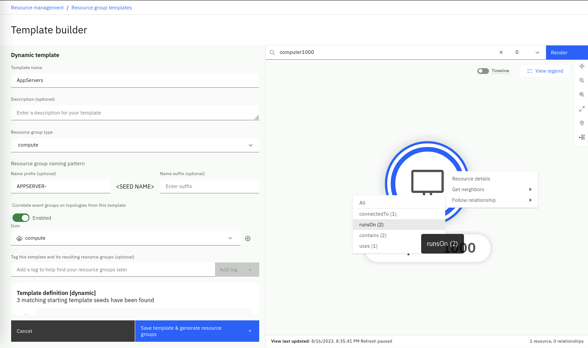

You should have something like the following:

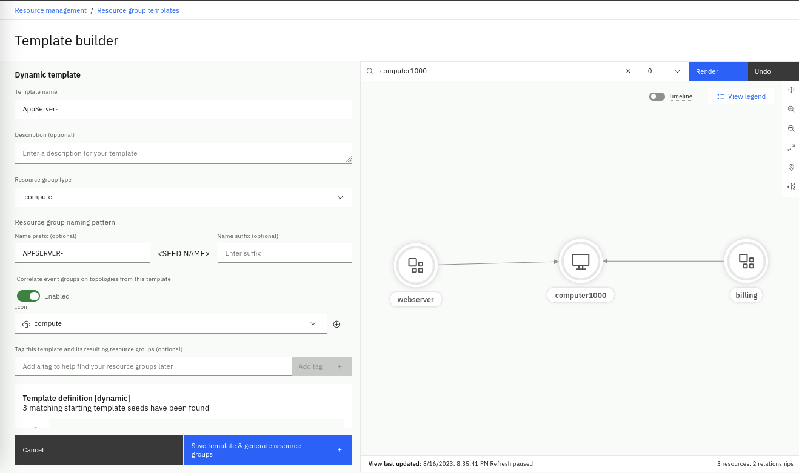

Continue with the following steps:

- Scroll down on the left side and note that the template has been recording
  your actions to build a _recipe_ for the template
- You can optionally add tag to the list of starting seeds if you want to
  restrict the items matched by this template to just those tagged with specific
  tags

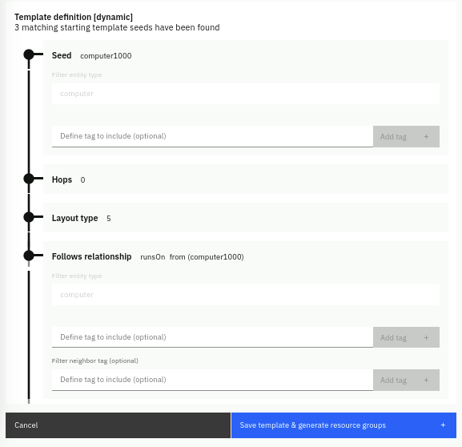

- Continue to scroll down and click **Save template & generate resource group**

In the **Preview resource groups** section, you will see that the dynamic
template builder has found two groups of resources that match the _recipe_. The
first group resources were in the original application resources data
(**application.txt**). The second group resources were added by the Observer job
we just run (**application2.txt**). In summary, we defined a dynamic template
that creates groups for every compute resource and will include any _one hop_
resource that has the attribute _runsOn_.

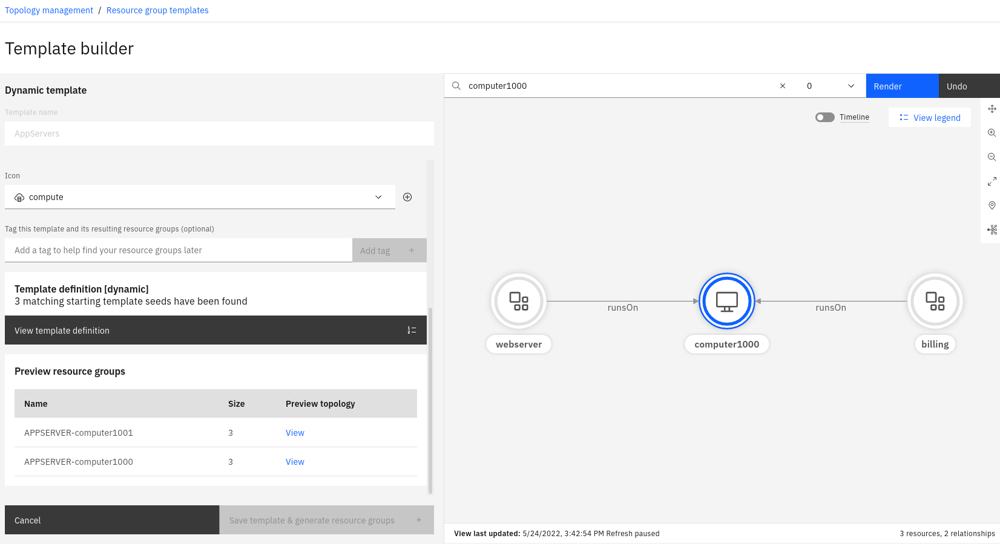

## 5.4: Token Group Template

A token template builds multiple groups of resources using one or more rules.
Any resource that matches one of the rules will be added to a group whose name
is based on the rule's token. Resource group membership is dynamically
maintained to reflect changes in the topology for resources that match one of
the template's rules.

For example, you could create a token template containing a rule with a token of
'applicationId'. When you next load data, if you have three resources which each
have an applicationId property value of 'MyApp', then a group called 'MyApp'
will be created, and those three resources will be added to it.

As token group templates apply rules only to resources that are received via
observer jobs, the only way to actually see the new resource groups created by
this template is by running the related observer jobs.

#### Exercise

We will create a Token group template to group cpu resources based on the
manufacturer. In other words, the template will create one group of all Intel
cpu resources and another group of all AMD cpu resources.

In the **Resource management** page, click on the **Resource group templates**
icon in the top-right. In the **Resource group templates** page, click on
**Create a new template**, select **Token template** and click **Start**.

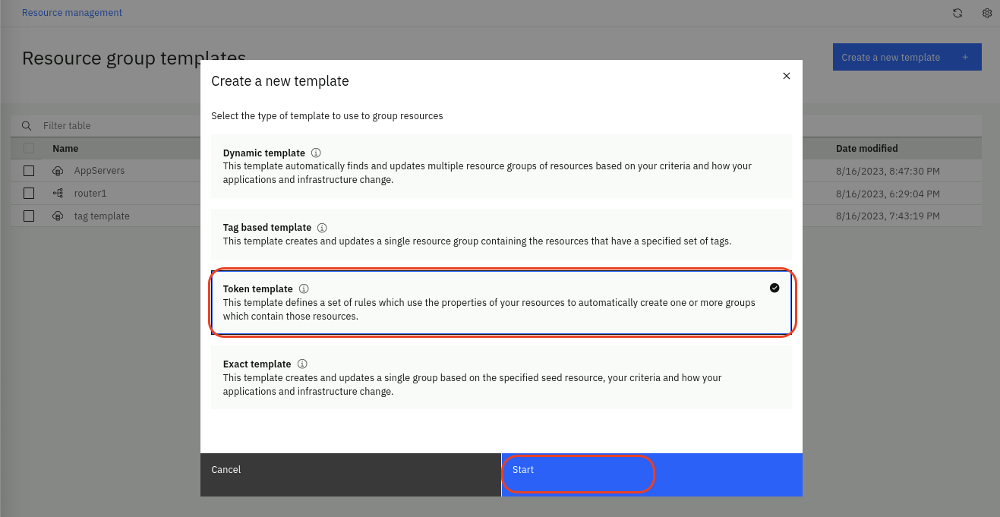

You will be presented with a **Template builder** page. From here, use the
following steps to configure a token template:

- Give the template a **name** e.g. token template
- Choose the **Resource group type: compute**
- Enable **Correlate event groups on topologies from this template** to
  correlate events across these resources
- On the right side, set the Rule name as **CPU rule**
- For **Tokens** type **${name}** and click on **Add**. This is the value of the
  name property which in our resource data will be _Intel_ or _AMD_.
- Expand the **Conditions** section
  - For **Observers** select **File** and click on **Add**
  - Skip **Providers** as this will apply to all File Observer providers
  - For **Resource types** select **cpu** and click on **Add**. This is
    important as we only want to group **cpu** type resources and nothing else.
  - Skip the **Token filter mode** as we don't need additional logic to filter.

Your rule should look like this:

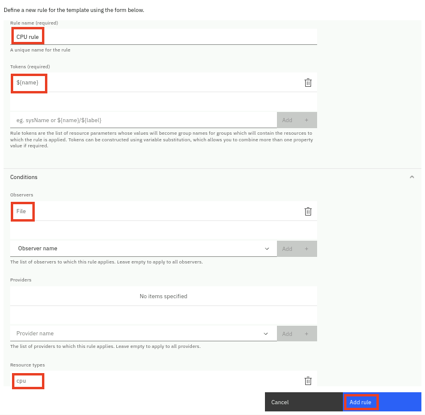

- Click on **Add rule**.

- Now confirm that you see the new rule under **Rule definitions** as shown
  below

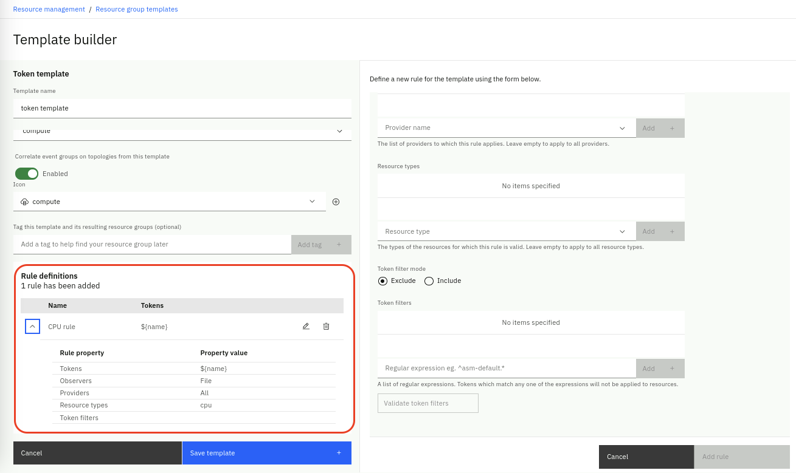

- Finally click on **Save template**.

As this template will create new groups based on the cpu name and these
resources are in the **infrastructure** resource data file, please rerun the
**infrastructure** observer job to actually apply the rules in this group
template.

Now in the **Resource management** page, click on the **Resource groups** tab
and you should see two new resource groups created, as shown below:

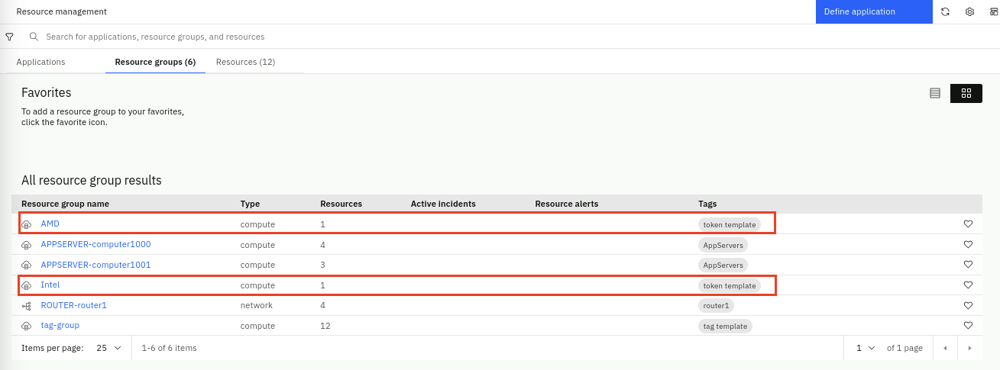
