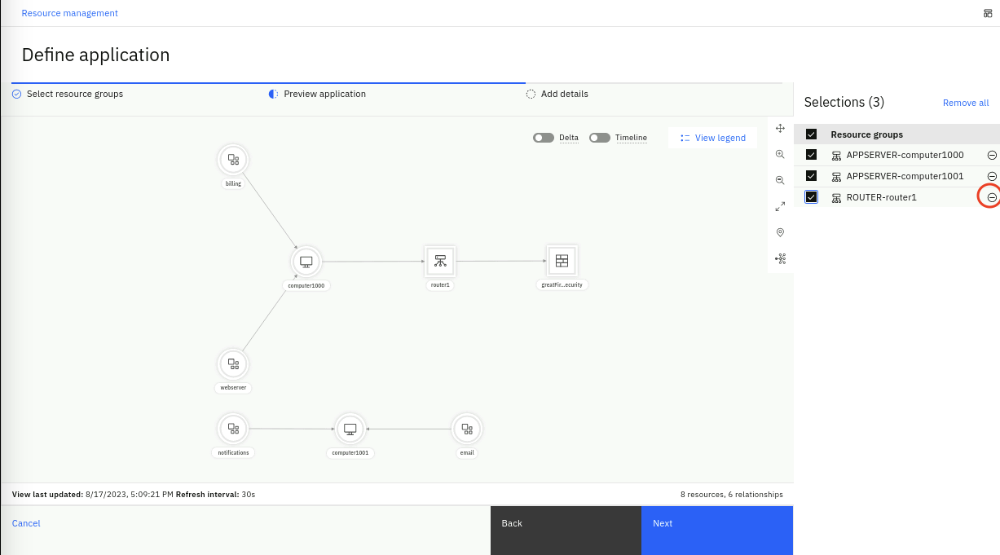
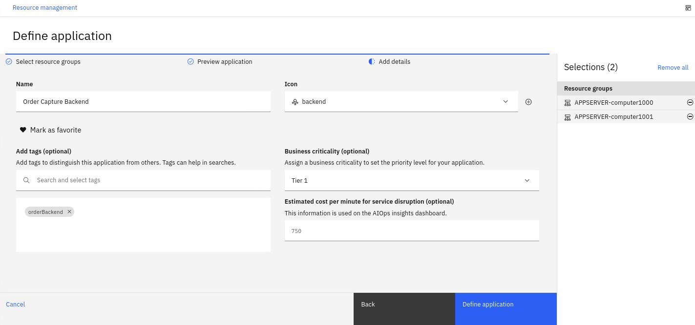
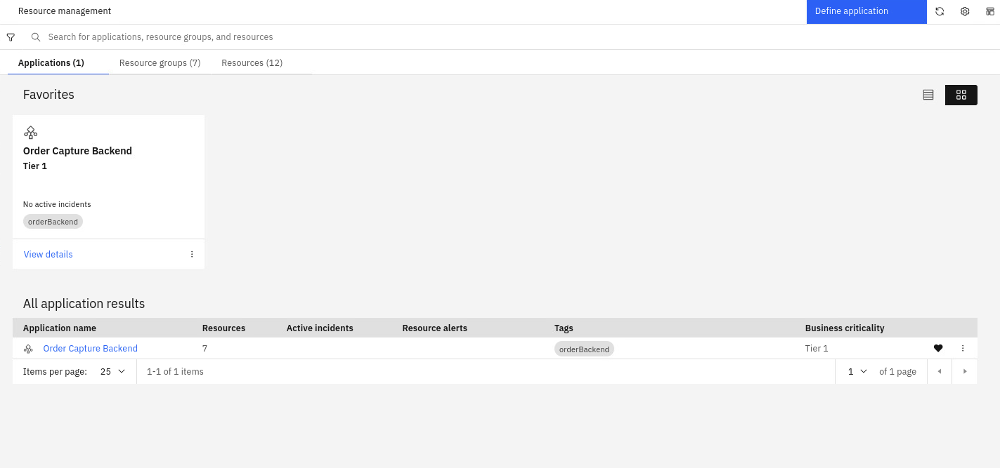

## 6.1: Business Criticality

The business criticality of a resource provides an indication of how critical to the business
that resource is, and therefore how important any related problems might be. You can define the levels 
of business criticality for your applications, resource groups and resources, 
and then view a list of them on the Business criticality page.

Lets have a quick overview of Policies as they leverage Business Criticality. Policies are rules that contain multiple 
condition and action sets. They can be triggered to reduce noise by suppressing alerts, grouping alerts together, automatically 
promote alerts to incidents, assign runbooks to remediate alerts, etc.

:::note
The topic of **Policies** is outside the scope of this Lab, but additional information can be found in the product 
[**documentation**](https://www.ibm.com/docs/en/cloud-paks/cloud-pak-watson-aiops/4.1.0?topic=policies-creating).
:::

Business Criticality plays a major factor in making sure that Policies reflect business priorities in terms
of what applications affect business operations the most. 
Policies can be defined in a way that considers the Business criticality as a factor to take an action
such as promoting Alerts to an Incident that IT Ops. personnel can see in the Incident View. 


### Defining Business Criticality

Now we will define some business criticality values that can then be assigned to an application later in the Lab.

* From the burger menu in the top-left, navigate to: **Operate → Resource management**.
* In the **Resource management** page, click on the **Settings** gear icon in the top-right and select 
**Topology configuration**. 


* From the **Topology configuration** page, in the **Business criticality** card, select **Configure**. 


The Business criticality page is displayed listing any existing criticality definitions in a table format
by name, description, and criticality value, in sortable columns. For the purpose of the Lab, we will use 
the predefined criticality values but note that you can custom define these values to better represent 
your specific IT environment. 

Click on **Start with presets**, inspect the preset values and click on **Add**. 

 

We have now defined three tiers of business criticality as shown below:


## 6.2: Applications or Services?

Based on customer feedback, starting in v4.1, the Cloud Pak for AIOps provides the option to call a 
collection of topology groups an **Application** or a **Service**. From a product functionality point of view, there is no 
difference between these two terms. But depending on the customer industry, these two terms represent two different abstractions. 
In the Telecommunications industry, a *Service* represents a group of interconnected components such as routers, switches, firewalls, etc. 
that participate in the operation of voice and data communications. In mostly every other industry, an *Application* represents a set of IT resources 
that performs a specific function directly for an end user or, in some cases, for another Application. In this Lab, we
are using the term *Application*. 

In summary, an Application, in the context of the Cloud Pak for AIOps, is a collection of topology resource groups that represent a complete IT solution stack. Applications, 
when combined with resource-level event correlation and grouping mechanisms, 
provide roll-up incident visibility. In other words, Alerts impacting resources will also surface
as impacting the Applications that those resources belong to. This improves overall visibility and 
allows the prioritization of incident resolution based on the business criticality that has been preassigned to the impacted applications.


### Defining Applications

You define and edit applications by adding (or removing) resource groups, icons and tags, 
assigning business criticality levels, and setting service disruption costs.

Lets define a fictional application based on the existing topology resource groups:

* From the burger menu in the top-left, navigate to: **Operate → Resource management**.
* In the **Resource management** page, click the **Define application** button in the top-right. 
* In the **Define application** page, we will select a subset of the resource groups defined in previous 
chapters using Topology Group Templates. These are the resource groups that belong to our fictional application. 
Lets select APPSERVER-computer1000, APPSERVER-computer1001 and ROUTER-router1 as shown below: 


* Click **Next** to preview the application. 

As we preview the application, we can use the checkbox to deselect resource groups on the right sidebar
in order to visualize the application without those groups. 

* In this preview step, we realize that we don't need the ROUTER-router1 resource group, so click on the (-) minus sign to remove
the ROUTER-router1 resource group from this application. 



* You should be left with the topology preview as
shown below:


* Click **Next** to add additional details.
* Enter a **Name** for the application, for example **Order Capture Backend**
* Set an **Icon** for the application, using the drop-down list select the **backend** icon. This icon is used to identify the application 
resource type in the topology view of your applications.
* Mark the application as a **favorite** by clicking on the heart icon. 
* In the **Add tags** field, type **orderBackend** and select **Create new tag**. Tags can be used to 
identify similar applications and to distinguish applications from other applications.
* In the **Business criticality** field, select **Tier 1**.
* In the **Estimated cost per minute for service disruption**, type **750**. This numerical value, represents the 
estimated disruption cost (in local currency) for the business per minute if this application is down. 
This information is used on the **AIOps insights** dashboard.

You should see the application details as shown below: 


 

* Click **Define application**. 

Now the application is added to the list of all applications on the page, as shown below. Note that from this 
view we can see total number of resources, the active Incidents and Alerts related to the application.

 


## 6.3: Alert Topological Correlation

We will see how the topology resource groups we have created are used to correlate alerts. Topological alert grouping 
helps you understand when alerts are connected based on their topology, providing valuable context information 
for why related alerts might occur together.

In order to load alerts, we need to create a webhook connection and an event loader script. 

### Creating a Webhook Connection

The webhook connection allows the Cloud Pak for AIOps to expose an API that can be used to load IT Ops events created
by observability tools such as Datadog, Zabbix and others:
* from the burger menu in the top-left navigate to: **Define → Data and tool connections**
* from the **Data and tool connections** page click on **Add connection**
* from the **Add connections** page search for **webhook**, click on the
 **Generic Webhook** tile and click **Connect**. 

Fill the **Add connection** form with these values: 

* Name: event-webhook
* Description: custom webhook connection for events
* Authentication type: *select Username/Password*
* Username: pick a username (e.g. test)
* Password: pick a password (e.g. test)

Your complete form should look like this (note that your route will be different)


Click **Next**. 

In the **Configure event mapping** form:

* Confirm the **Enable webhook** slider is green (On)
* The webhook connector leverages JSONata which is a simple expression language to transform JSON data. 
You can read about JSONata [here](https://jsonata.org/). In this Lab, we provide the JSON event format
as expected by the Cloud Pak for AIOPs, therefore the JSONata is just a "passthrough". In a real scenario, 
you will find this mapping capability very useful. 

Enter the following JSONata configuration (use the copy helper icon (top-right) for one-click copy)

```json
{
   "sender":{
      "service": sender.service,
      "name": sender.name,
      "type": sender.type
   },
   "resource":{
      "application": resource.application,
      "name": resource.name,
      "hostname": resource.hostname,
      "type": resource.type,
      "ipaddress": resource.ipaddress,
      "location": resource.location
   },
   "type":{
      "classification": type.classification,
      "eventType": type.eventType
   },
   "severity": severity,
   "summary": summary,
   "occurrenceTime": occurrenceTime,
   "expirySeconds": expirySeconds
}
```

Click on **Done**. You will see a new webhook created as shown below. Note the **Webhook route** URL on the right. You will need this URL in the next step. 


### Creating a Webhook Event Loader Script


We will create a simple bash script that reads an event file and calls the webhook 
API with every event in the file as a parameter. 

In the same *lab* folder, create a file called **event-load-webhook.sh** by running the following command in the **Terminal** window to open the text editor
, **copy** the bash script below (use the copy helper icon (top-right) for one-click copy), **paste** it into the text editor.

```
gedit event-load-webhook.sh
```


```sh
#!/bin/bash
# this is the event-load-webhook.sh script

# Check if a file is provided as a parameter
if [ $# -eq 0 ]; then
  echo "Please provide an event file as a parameter."
  exit 1
fi

###########################################
WEBHOOK_URL='<insert the webhook URL here>'
# Note below there is a colon character ':' between the username and password e.g. test:test
AUTH=<insert your chosen user name>:<insert your chosen password>
###########################################


# Read the event file line by line and submit the event via webhook
while IFS= read -r line; do
  curl -X POST -u $AUTH --insecure -H 'Content-Type: application/json' $WEBHOOK_URL -d "$line"
  echo ""
done < "$1"
```

There are two changes you need to make to the script:
*  assign to WEBHOOK_URL the webhook route of the webhook you just created in the previous step
*  assign to AUTH the chosen user name and password of the webhook you just created in the previous step e.g. test:test

Click on the **Save** button in the text editor and **close** the editor window (click on the X). 


### Validating Topological Correlation

We will now load a set of sample events. Because these events impact resources we have in one of our topology group (billing, 
computer1000 and webserver) these events will be correlated.


Create a new file called *topology-events.json* by running the following command in the **Terminal** window to open the text editor,
**copy** the event data below, **paste** it into the text editor, 
click on the **Save** button in the text editor and **close** the editor window (click on the X). 

```
gedit topology-events.json
```

```
{ "sender":{ "service":"Zabbix Middleware Monitoring", "name":"US-SOUTH CEA SelfMonitoring @AGG_P", "type":"Zabbix" }, "resource":{ "application":"eCom2 web server", "name":"computer1000", "hostname":"computer1000.company.com", "type":"host", "ipaddress":"10.1.96.24", "location":"US-SOUTH" }, "type":{ "classification":"System status", "eventType":"problem" }, "severity":3, "summary":"CPU at 80% utilization", "occurrenceTime":"2023-05-05T14:40:38.000Z", "expirySeconds":0 }
{ "sender":{ "service":"Zabbix Middleware Monitoring", "name":"US-SOUTH CEA SelfMonitoring @AGG_P", "type":"Zabbix" }, "resource":{ "application":"eCom2 api layer", "name":"billing", "hostname":"", "type":"device", "ipaddress":"10.1.96.28", "location":"US-SOUTH" }, "type":{ "classification":"System status", "eventType":"problem" }, "severity":5, "summary":"Unscheduled device restart. Review log files", "occurrenceTime":"2023-05-05T14:45:20.000Z", "expirySeconds":0 }
{ "sender":{ "service":"Zabbix Middleware Monitoring", "name":"US-SOUTH CEA SelfMonitoring @AGG_P", "type":"Zabbix" }, "resource":{ "application":"eCom2 security layer", "name":"webserver", "hostname":"", "type":"device", "ipaddress":"10.1.96.29", "location":"US-SOUTH" }, "type":{ "classification":"System status", "eventType":"problem" }, "severity":6, "summary":"Unable to load firewall rules after reboot", "occurrenceTime":"2023-05-05T14:46:10.000Z", "expirySeconds":0 }
```

Now lets submit the events via the *webhook event loader script* created in the previous section by running the following command from the **Terminal** window:

```
bash event-load-webhook.sh topology-events.json
```

First, lets see how the Application we have defined shows these events:

* From the burger menu in the top-left navigate to: **Operate → Resource Management** and click on the **Applications** tab

Note that the events impacting the resources, have rolled-up into the impacted **Application** that contains these resources, as shown below


Click on the Application name (**Order Capture Backend**) to see the topology resources impacted


Finally, lets see how these events are correlated:

* From the burger menu in the top-left navigate to: **Operate → Incidents and alerts** and click on the **Alerts** tab
* Click on the **Refresh alerts** icon on the right
* Lets add some color to this page:
    * Click on the **gear** icon in the right and select **User preferences**.
    * From the **User preferences for alerts** pop-up, click on the **Row coloring** slider to On (green).
    * Click on **Save**.

In the Alerts view, we can see a single group of alerts as shown below.


Click on the chevron icon on the left to expand this group. See how the three events we have submitted have been grouped together. 
Also click on the **View correlation** icon in the top-right, the Correlation column on the right, shows the topological group icon. 


## 6.4: Lab Recap


Congratulations if you made it here!. We have seen a lot of features in a short period of time. If there 
is a single thought that you can take away from this Lab, this is it:

*A real-time, unified Topology View is a core capability of the Cloud Pak for AIOps, as it allows to visualize
topology changes over time, anomalous alerts in context and the correlation of alerts based on the impacted topology resources.
Topology is a key component to achieve fast incident resolution through the Cloud Pak for AIOps.*


