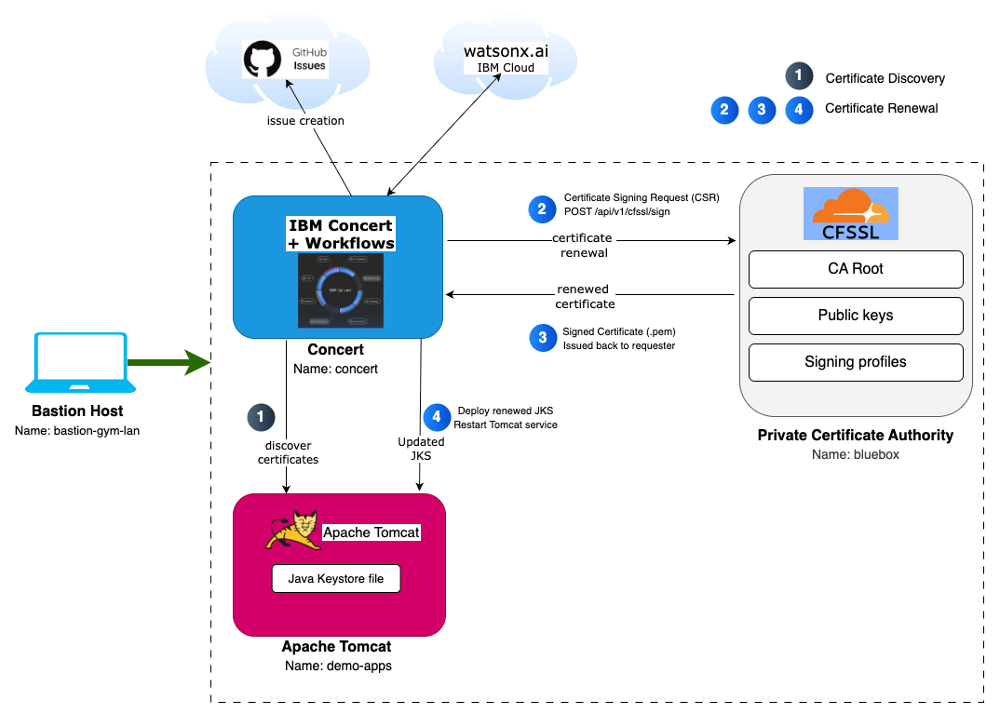

import CreateIbmId from "@site/src/components/createIbmId/CreateIbmId"
import ObtainingEntitlementKey from "@site/src/components/obtainingEntitlementKey/ObtainingEntitlementKey"
import RequestingLabEnvironment from "@site/src/components/requestingLabEnvironment/RequestingLabEnvironment"

# Lab Environment

In this Lab, you will have access to three RHEL (Red Hat Enterprise Linux) virtual machines plus a bastion virtual machine 
that will let you access the overall deployment:

* Bastion Host - a RHEL VM named **bastion-gym-lan** that will be used as the bastion host for the lab network. This Bastion host has access to all lab VM's and will be your primary workstation for these labs.
* Concert Host - a RHEL VM named **concert** that has preinstalled IBM Concert + Workflows + DataApps.
* CFSSL Host   - a RHEL VM named **bluebox** that contains CloudFlare SSL pre-installed to provide Certificate Authority Role. 
* Apache Tomcat Host - a RHEL VM named **demo-apps** that contains Apache Tomcat with a Java KeyStore file. 

:::note
CFSSL is Cloudflare's open-source PKI (Public Key Infrastructure) toolkit. Its an open-source Certificate Authority (CA) and toolkit that provides a simple, lightweight way to issue and manage certificates during lab exercises. 
In this lab environment, CFSSL acts as the local private CA used to generate root and intermediate certificates, sign certificate requests, and issue server certificates that will be discovered and renewed 
through automated workflows. For more information, visit the [CFSSL GitHub repository](https://github.com/cloudflare/cfssl).
:::

:::note
Apache Tomcat uses a Java KeyStore (JKS) to store and manage the server's SSL/TLS certificates. In this lab, you will work with Apache Tomcat and its JKS to understand how certificates are applied, updated, 
and managed in a real application environment.
:::

The following software versions are used in the Lab environment:
* Concert v2.2.0
* CFSSL v1.6.5
* Apache Tomcat v9.0.112
* RHEL release 9.4

The following diagram describes the infrastructure for the Lab:

## Prerequisites

<CreateIbmId />

<ObtainingEntitlementKey />

### A public GitHub account

During the Lab, you will need to create a new GitHub repository using your own personal public GitHub account. You can create a free account 
if you do not have one already from [GitHub](https://github.com).

## Requesting a Lab Environment

<RequestingLabEnvironment
   environmentName="Jam-in-a-Box: Concert - Vulnerability"
   environmentUrl="https://techzone.ibm.com/my/reservations/create/6866cf81f89d5795f68e379f"
/>

