## 3.1: Overview

Make sure to complete the Lab preparation steps from this section before proceeding with the Lab.


:::warning
You may get prompted for software updates during the lab. Please ignore these prompts and 
do NOT install any updates to avoid disrupting the lab environment.
::: 


If you get a security warning (**Warning: Potential Security Risk Ahead**) when accessing the Concert, Apache Tomcat UIs, please 
ignore it and proceed to the UI (click on **Advanced** and then **Accept the Risk and Continue**). 

### 3.1.1: Using the Bastion Host Terminal and UI 

This is for information only. Later in this page you will be instructed to run the actual commands. This Lab has both Concert and Workflows installed:
* To access the Concert UI, click on the burger menu on the top left corner and select **Concert -> Home**. 
* To access the Workflows UI, click on the burger menu on the top left corner and select **Workflows -> Home**.

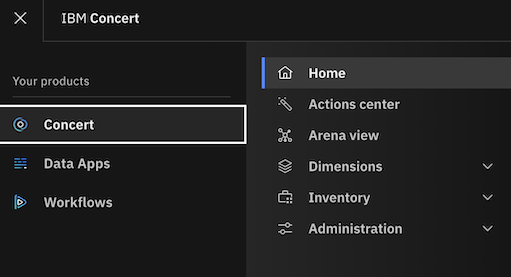

Note that from the Bastion SSH, you can ssh into each other VM with the commands below: 

```bash
# Access the Concert VM
ssh jammer@concert
# Access the CFSSL VM
ssh jammer@bluebox
# Access the Apache Tomcat VM
ssh jammer@demo-apps
``` 


### 3.1.2: Capturing the Lab Credentials

You will need to capture multiple pieces of information from the Concert and Apache Tomcat UIs to complete the lab.
To facilitate this process, we will capture this information into a single text file. From the Bastion Remote Desktop, 
on the left panel click on **Show Applications**, select **Text Editor**, paste the content below into a new 
file named `credentials.txt` and **save** it. Keep this window open for easy access later.

```
Bookmarks:
  Lab guide:        https://ibm.github.io/waiops-tech-jam/labs/concert/introduction/
  Concert:          https://concert.ibmdte.local/
  Apache Tomcat:    https://demo-apps.ibmdte.local:8443/

Concert URL:        https://concert.ibmdte.local
Concert API Key:    
concert_username:   
concert_password:   

Apache Tomcat URL:                   https://demo-apps.ibmdte.local:8443
Java Keystore Password:              tomcat

GitHub Repository URL:               https://github.com/<github-username>/concert-operations-lab
GitHub Repository Name:              concert-operations-lab
GitHub API Endpoint:                 https://api.github.com/  
GitHub Username:                     
GitHub Personal Access Token (PAT):  

########################################

demo-apps IP address:
Private Key value for "jammer" user on demo-apps VM (copy the value BELOW this line)


########################################

bluebox IP address:
Private Key value for "jammer" user on bluebox VM (copy the value BELOW this line)

``` 

From the Bastion SSH, run the command below:

```bash
cat demo-details.yml | grep -E 'concert'
``` 

Just to have the users and passwords handy together, copy these values below to the credentials file:
* concert_username: 
* concert_password:


## 3.2: Obtaining the IBM Concert API Key

From the Bastion Remote Desktop, open the Firefox browser and click on the Concert bookmark to open the Concert UI.
* To access the Concert UI, click on the burger menu on the top left corner and select Concert -> Home.

Login to the Concert UI with the credentials recorded in the credentials file (**concert_username:** and **concert_password:**).

:::danger
If prompted, make sure to select **Skip** in the **Welcome to IBM Concert** dialog.
:::


* In the Concert UI, on the top right corner, click on the API Key icon.
* Click **Generate API key**.
* After the API key is generated, save the value under **API key** into the credentials file.
* Click on the **X** to close the window.


## 3.3: Establishing a connection between Concert and watsonx.ai


Concert leverages the capabilities of watsonx.ai to provide advanced AI features. To enable this integration, 
you need to configure the connection between Concert and an existing instance of watsonx.ai that is used to support Concert Labs.

:::warning
DO NOT use these watsonx.ai credentials for any other purpose outside this lab. 
:::

From the Bastion SSH, run the following command to login to the Concert host with the user 'jammer'. If this is your first time connecting, 
you may need to accept the host key fingerprint.

```bash
ssh jammer@concert
```
Once logged in, run the following command:

```bash
export INSTALL_DIR=/opt/ibm/concert/ibm-concert
```

Obtain the required credentials for connecting to watsonx.ai. Open [**this Box Note**](https://ibm.box.com/v/concert-vuln-lab), 
copy the three lines and run them in the Concert host Terminal to set the environment variables. 

```bash
# use the exports from the Box Note, they should look similar to this:
export WATSONX_API_MODEL_ID=
export WATSONX_API_KEY=... 
export WATSONX_API_PROJECT_ID=...
export WATSONX_API_URL=...
```

Just to confirm the four env. variables are set, run this command and make sure each line shows a value:

```bash
echo "INSTALL_DIR=$INSTALL_DIR"
echo "WATSONX_API_MODEL_ID=$WATSONX_API_MODEL_ID"
echo "WATSONX_API_KEY=$WATSONX_API_KEY"
echo "WATSONX_API_PROJECT_ID=$WATSONX_API_PROJECT_ID"
echo "WATSONX_API_URL=$WATSONX_API_URL"
``` 

Run the commands below to apply the watsonx.ai configuration into the file **local_config.env**:

```bash
echo "WATSONX_API_MODEL_ID=$WATSONX_API_MODEL_ID" >> $INSTALL_DIR/ibm-concert-std/etc/local_config.env
echo "WATSONX_API_KEY=$WATSONX_API_KEY" >> $INSTALL_DIR/ibm-concert-std/etc/local_config.env
echo "WATSONX_API_PROJECT_ID=$WATSONX_API_PROJECT_ID" >> $INSTALL_DIR/ibm-concert-std/etc/local_config.env
echo "WATSONX_API_URL=$WATSONX_API_URL" >> $INSTALL_DIR/ibm-concert-std/etc/local_config.env
```

Finally, run the two commands below **one by one** to restart the py-utils service to apply the changes:

:::note
In the last **start_service** command, you can ignore one or more warnings **WARN[0000] Failed to mount subscriptions ...**
:::

```bash
$INSTALL_DIR/ibm-concert-std/bin/stop_service ibm-roja-py-utils
$INSTALL_DIR/ibm-concert-std/bin/start_service ibm-roja-py-utils
```

## 3.4: Configuring GitHub

You will need a GitHub account to complete the lab. If you do not have one, please create one at [GitHub](https://github.com/).

### 3.4.1: Creating new GitHub repository

You will need to create a new repository for your GitHub account. We will use this repository to demonstrate Change Management process
created by Concert Automation Rules.

* Login to your GitHub account and open the following repository URL on the browser
```
https://github.com/<github-username>
```

* On the Repository menu option, click on the **New** button to create a new repository in your GitHub account.
* Enter `concert-operations-lab` as the name for your new repository.
* You can skip the description for the repository.
* Click on the **Create repository** button to create the new repository.

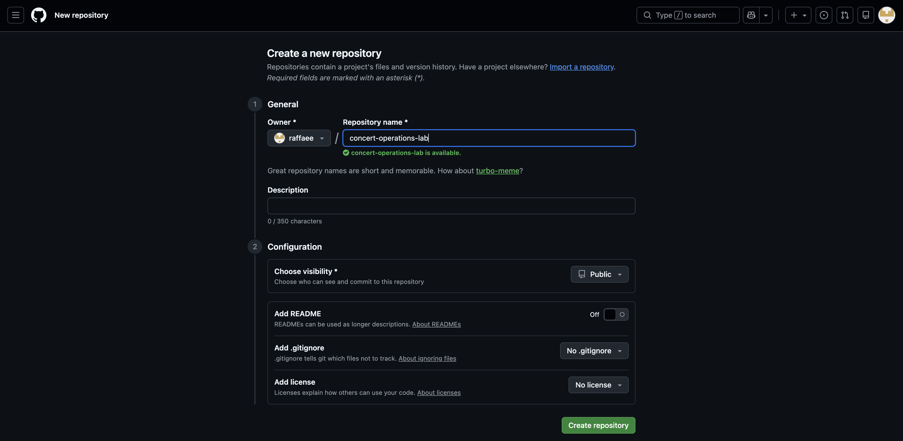

* Copy the URL of your new repository and save it into the credentials file after **GitHub Repository URL**. You will need it later to configure GitHub connection from Concert.
The URL should look similar to:
```
https://github.com/<github-username>/concert-operations-lab
```


### 3.4.2: Enabling GitHub issues

You will enable GitHub issues in your new repository to allow Concert to create issues for the expiring and expired Certificates.

* In your new repository, click on the **Settings** tab.
* Under the **General** section, scroll down to the **Features** section and select the checkbox for **Issues**
as shown below:

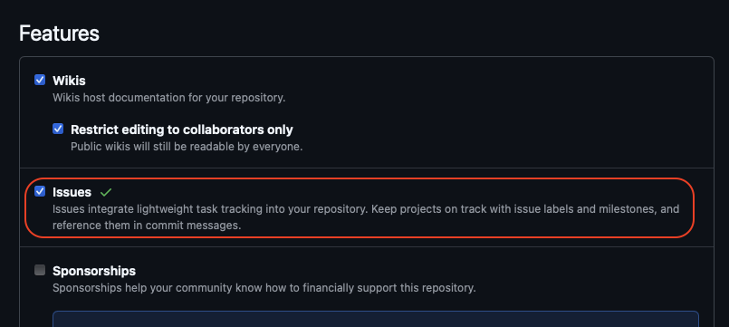


### 3.4.2: Creating GitHub labels

You will create 2 new labels for GitHub issues in your new repository to allow Concert Workflows to handle renewal for the expiring and expired Certificates.

* In your new repository, click on the **Issues** tab.
* From the **Issues** tab, click the **Labels** button on the right.
* Click **New label** button in Green color on right side.

First, create **approved** label with the following values : 
* Assign **Name** : approved
* Assign **Description** : approved
* Assign **Color** : `#0e8a16`
* Click **Create label** button

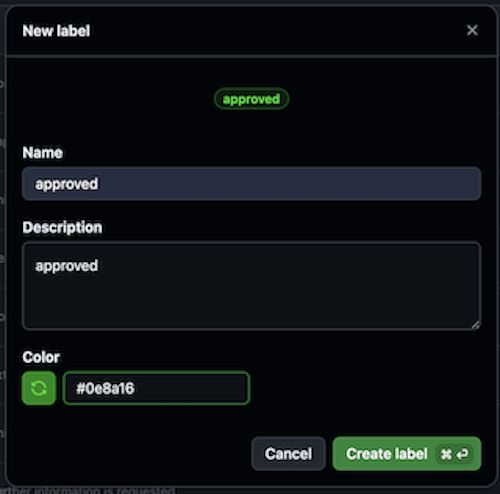


Second, create **rejected** label with the following values :
* Assign **Name** : rejected
* Assign **Description** : rejected
* Assign **Color** : `#e99695`
* Click **Create label** button

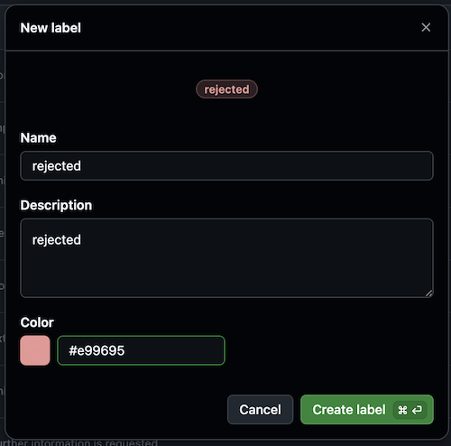


### 3.4.3: Creating a Personal Access Token (PAT)

You will create a Personal Access Token (PAT) in GitHub to allow Concert to connect to your new repository and create issues for the expiring and expired Certificates

* In your GitHub account, click on your profile picture on the top right corner of the page and select **Settings**.
* In the left navigation menu, scroll all way down and click **Developer settings**.
* In the left navigation menu, click **Personal access tokens** > **Tokens (classic)**.
* Click **Generate new token** > **Generate new token (classic)**.
* Under **Note**, enter a name for your token, such as **concert-lab**.
* Under **Expiration**, select **90 days**.
* Select the following scopes:
  * **repo** (Full control of private repositories)
  * **write:packages** (to push/pull images)
  * **delete:packages** (to delete images)
  * **user** (Update ALL user data)  
* Click **Generate token** on the bottom.
* Copy the generated token into the credentials file after **GitHub Personal Access Token (PAT)**. You will need it later to configure GitHub Authentication in Concert Workflows.

:::warning
Make sure to **save** the credentials file!. Keep the window open for easy access during the Lab.
::: 

## 3.5: Creating a target environment in Concert

An environment in Concert groups related applications and inventory data.
We will define a new environment to capture certificates coming from Apache Tomcat.

* In the Concert UI, select **Inventory > Environment inventory**.
* Click **Define environment > From resources**.
* Enter `development` as the **Name** for the environment.
* From the **Type** drop down menu, select **Other**.
* Select the **Purpose** of this environment as **Development**.
* Click **Next**.
* As there are no **Build Artifacts** to include in your environment definition, we will skip this step.
* Click **Next**.
* Review the summary of your entries, then click **Create**.

## 3.6: Creating GitHub connection from Concert

You will use the personal access token that you created previously to configure a GitHub Connection. 
Concert will leverage this connection to create GitHub issues for the expiring and expired Certificates in the Concert defined environment.

From the Bastion Remote Desktop, on the Firefox browser click on the Concert tab.


* Go to **Administration** > **Integrations**.
* Select the **Connections** tab.
* Click on **Create connection**.
* Search for **GitHub** and click on the GitHub tile.
* Enter a unique **Name** for the connection such as `github-connection`.
* Skip the **Description** field.
* Under **Parameters**, provide the following details:
  * **Host**: `https://api.github.com/`
  * **Personal Access Token**: the GitHub Personal Access Token (PAT) you created during the previous step.
* Click on **Validate connection** to verify the connection is successful.
* Click **Create**.


## 3.7: Creating Automation Rules in Concert


Concert reports all Certificates present in an Environment and classifies them into four categories such as Valid Certificates,
 Expired Certificates, Certificates Expiring Soon and Certificates with Open Ticket. Using automation rules, we will automate the issue/ticket creation 
 in GitHub to quickly address expiring and expired Certificates impacting an Environment.
 Note that Concert can also integrate with other ticketing systems such as Jira, Salesforce, ServiceNow, etc.

:::note
In addition to automation rules, Concert can leverage ingestion jobs to pull data from external issue tracking systems
in order to automatically update ticket status. This configuration is out of scope for this lab.
:::

From the Bastion Remote Desktop, on the Firefox browser click on the Concert tab.

* Click **Administration** > **Integrations**.
* Select the **Automation rules** tab.
* Click the **Create automation rule** button on the right.

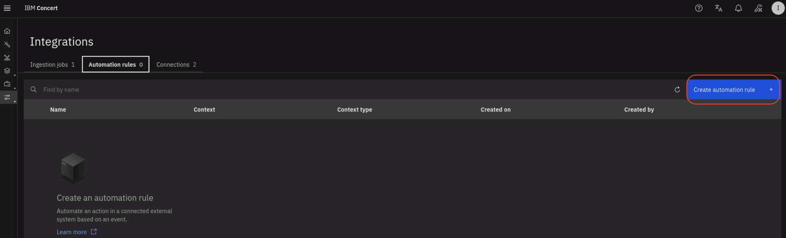

* Enter a **Name** for the automation rule such as `github-issue-cert-mgmt`.
* Skip the **Description** for the automation rule.
* Under **Take this action**:
    * Select **Open a GitHub issue**
    * In **Enter target organization** type your GitHub username.
    * In **Enter target repository** type `concert-operations-lab`.
* Under **Using this connection**:
    * Select the GitHub connection created during the previous step.
    * For **assign to**, leave empty or undefined.
* Under **When this condition occurs**:
    * Select **An expiring or expired certificate is detected**.
    * For **affecting**, select **development** from the  list of environments. `development` is the Concert environment which all Certificates will be discovered.
* Under **With the following threshold values**:
    * For **Certificates expiring within**, select **7 days** from the drop down list. This is the only condition that will trigger the issue creation.

Your configuration should look similar to the screenshot below. Your github name will be different:

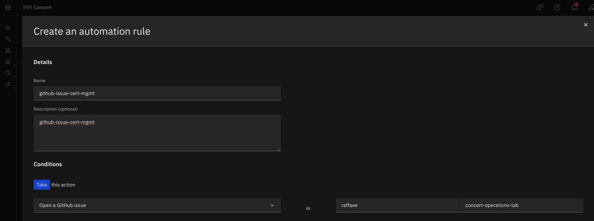
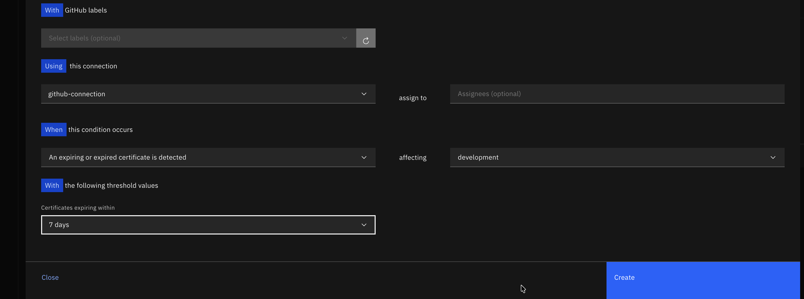

* Click **Create** to create the automation rule.

After the rule is created, it will appear in the list of automation rules. Click on the twistie before the rule name to 
expand the section and see more details. Review the conditions that will trigger the issue creation.

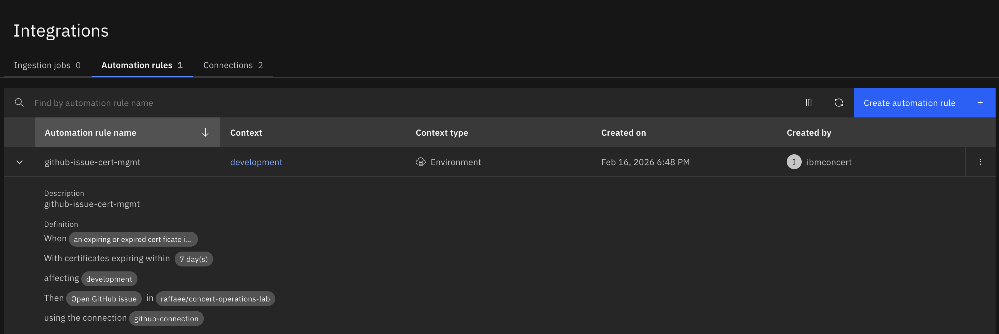


## 3.8: Installing the Workflows


You will download custom Workflows from a public Box folder and save them on the Bastion local disk. Later you will upload them to 
Concert Workflows.

From the Bastion Remote Desktop, open a new tab in the Firefox browser.

* Open the link **https://ibm.box.com/v/certificate-lab**
* In the Box folder, you will find three Workflows : 
    * Linux_Keystore_Cert_Discovery.zip
    * Linux_Keystore_Cert_Renewal.zip
    * updateGitHubIssueWithALabel.zip

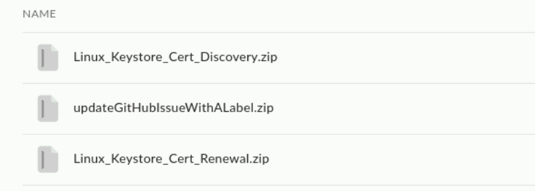

* Download all three Workflows and save them on Bastion's **Downloads** folder.

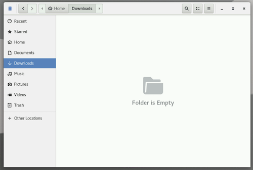

Next, you will create two new Folders in Concert Workflows for these 3 Workflows.

From the Bastion Remote Desktop, on the Firefox browser click on the Concert tab.

* Click on the burger menu on the top left corner and select **Workflows -> Workflows**
* Click on the three vertical dots on the top right corner and select **Create folder**

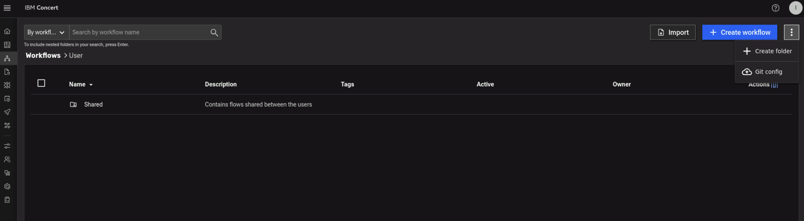

* Enter a name for the folder such as `certificatesDiscovery`
* Enter a description for the folder such as `Folder for Certificates Discovery` and click on **Create** button.

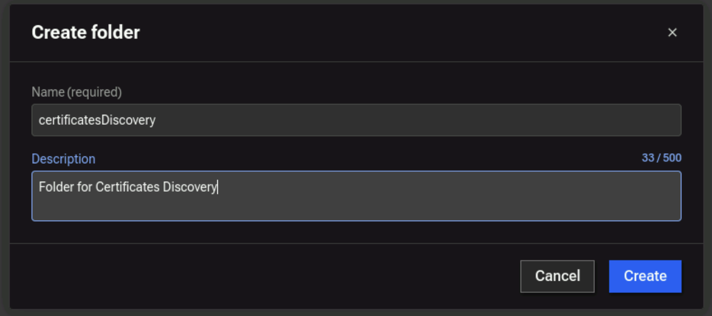

* Click on the three vertical dots on the top right corner and select **Create folder**
* Enter a name for the folder such as `certificatesRenewal`
* Enter a description for the folder such as `Folder for Certificates Renewal` and click on **Create** button.


At this stage, you will have 2 new Folders created Concert Workflows.

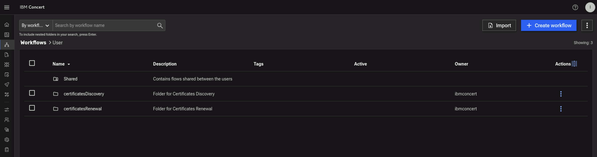

Finally, you will import the Workflows from Bastion's **Downloads** folder:

* Click on **certificatesDiscovery** folder in Concert Workflows
* Click on **Import** button in Concert Workflows, navigate to Bastion's **Downloads** folder, choose **Linux_Keystore_Cert_Discovery.zip** 
and click **Open** button to complete the Import 

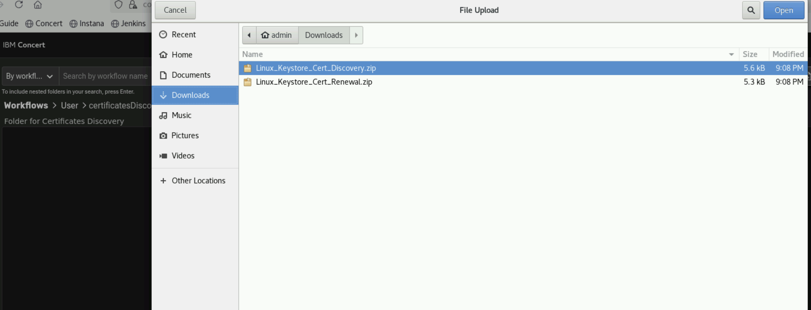

* At this stage, you will have **Linux_Keystore_Cert_Discovery** workflow imported to **certificatesDiscovery** folder

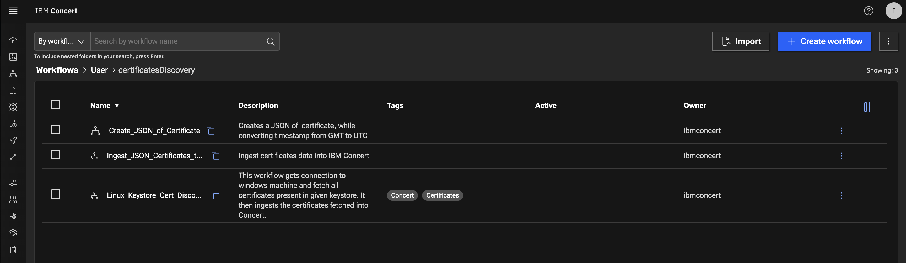

Next, you will upload **Linux_Keystore_Cert_Renewal** workflow imported to **certificatesRenewal** folder.

* Go up one level to the main folder in Concert Workflows by clicking on **User**.
* Click on **certificatesRenewal** folder in Concert Workflows
* Click on **Import** button in Concert Workflows, navigate to Bastion's **Downloads** folder, choose **Linux_Keystore_Cert_Renewal.zip** and click **Open** button to complete the Import 

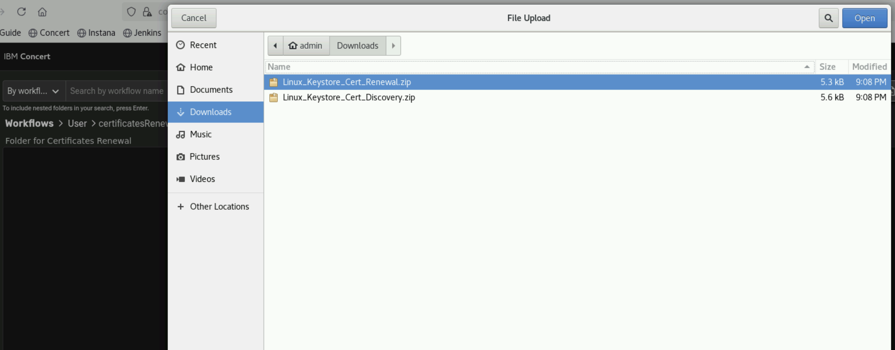

* At this stage, you will have **Linux_Keystore_Cert_Renewal** workflow imported to **certificatesRenewal** folder

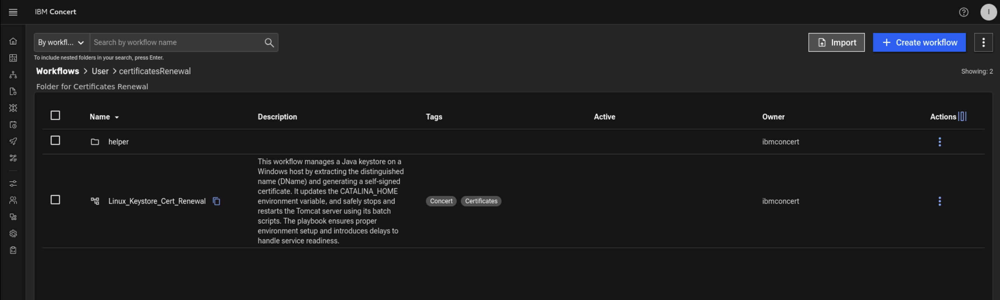

* Still on **certificatesRenewal** folder in Concert Workflows, click again on **Import** button in Concert Workflows, 
navigate to Bastion's **Downloads** folder, choose **updateGitHubIssueWithALabel.zip** and click **Open** button to complete the Import 

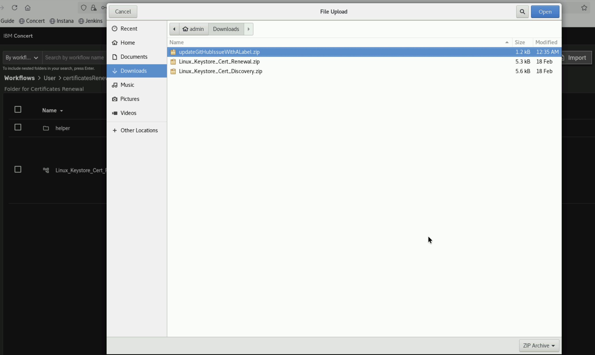

* At this stage, you will have **updateGitHubIssueWithALabel** workflow imported to **certificatesRenewal** folder

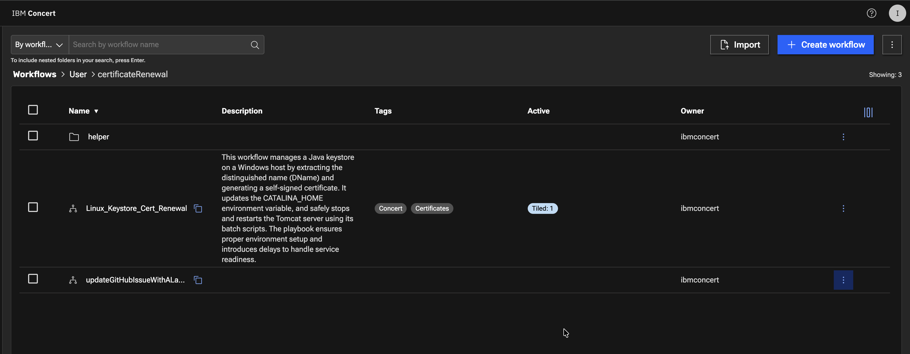

* Click on **3 vertical dots** on **updateGitHubIssueWithALabel** workflow and click **Expose externally** to expose the workflow.   

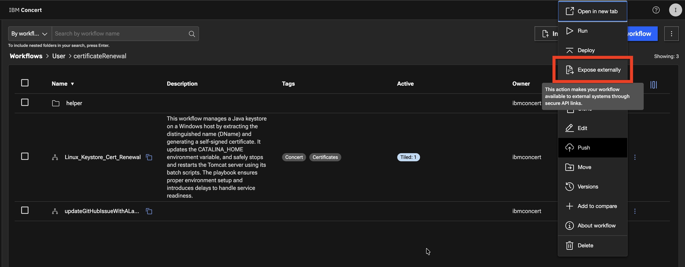

* On the **Expose externally** pop-up, click on the **Expose** button.   
  We need the **updateGitHubIssueWithALabel** workflow to be exposed so it can be called within the Concert UI certificate **Renew** menu option.

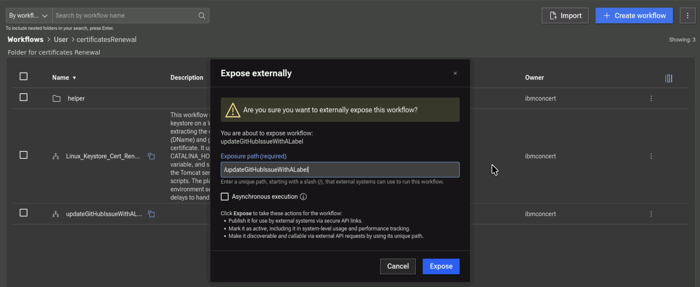

Now, you have all 3 Workflows uploaded to specific folders in Concert Workflows. In the next section, you will configure the Workflows and execute them.


## 3.9: Summary

So far you have been able to accomplish the following:

1. Have enabled GitHub issues and created new labels.
2. Have created a GitHub connection from Concert.
3. Have created one Automation Rule in Concert.
4. Have uploaded new Workflows in Concert Workflows. 

Please continue to the next section of the lab.