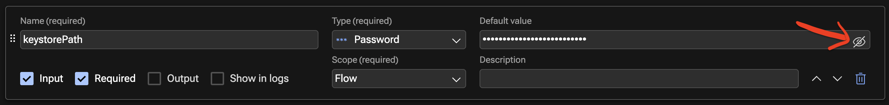
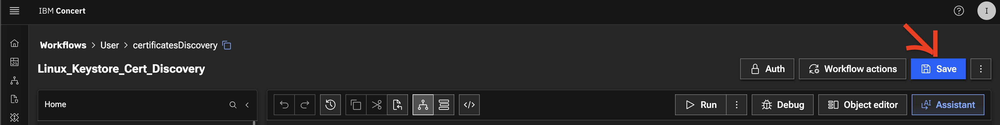
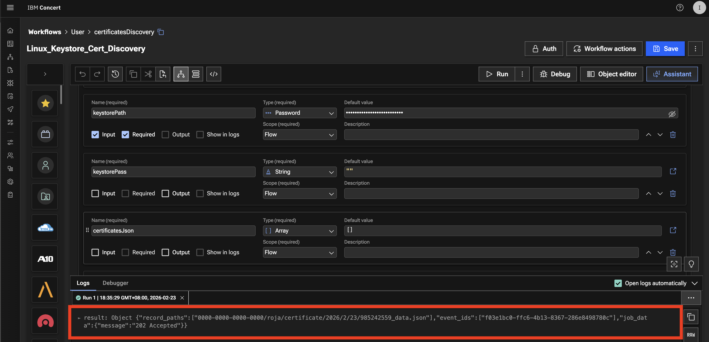
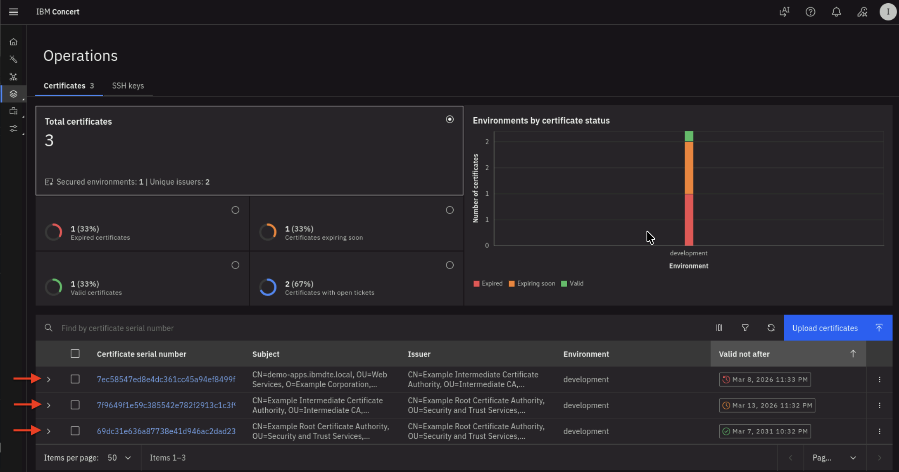
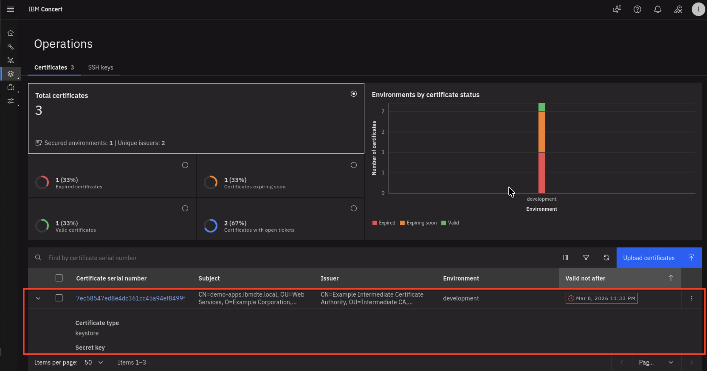
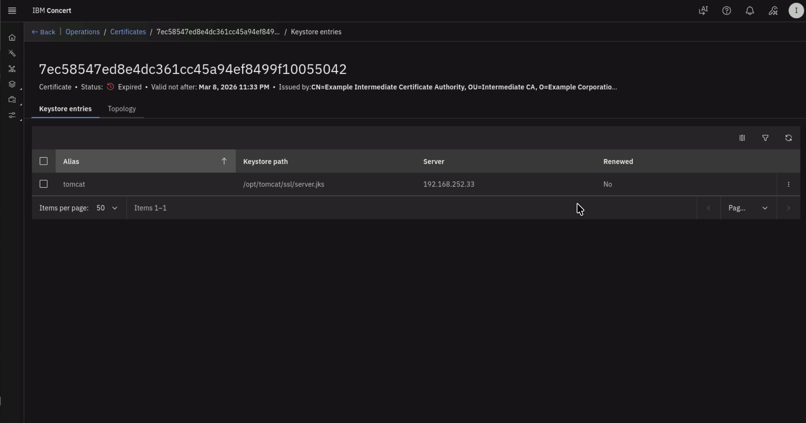
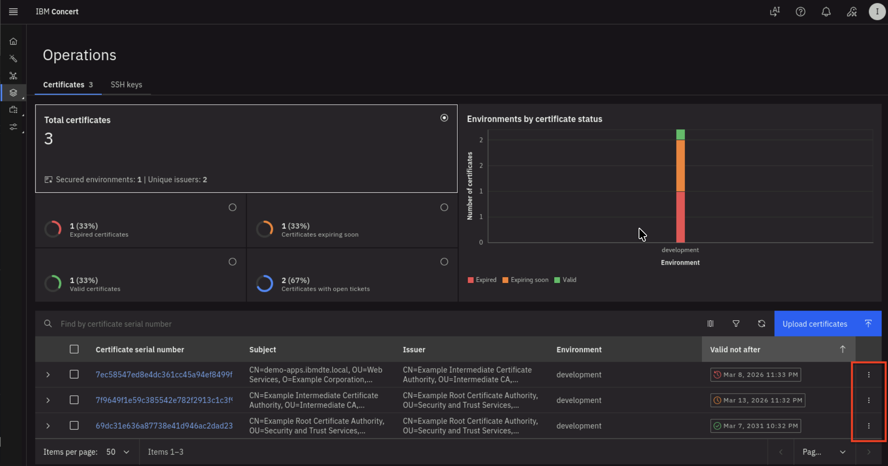
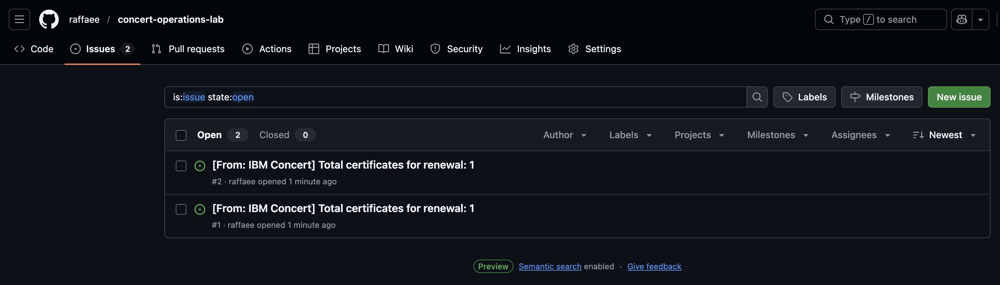
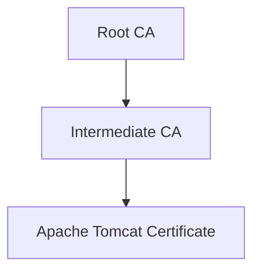

## 5.1: Overview

In this section, we will configure **Linux_Keystore_Cert_Discovery** Workflow to discover certificates from Apache Tomcat Java KeyStore, then ingest them into Concert. 
We will also verify that the certificates are visible in Concert's Operations Certificate page and that GitHub issues have been auto-created 
for both expired and expiring certificates.

## 5.2: Configuring the Discovery Workflow

Let's configure user variables values for **Linux_Keystore_Cert_Discovery** Workflow by using Authentications created in previous section. 

From the Bastion Remote Desktop, on the Firefox browser click on the Concert tab.

:::note
For each default value shown below, begin the entry with a double quote (") and end it with a double quote (").
:::

* Click on the burger menu on the top left corner and select **Workflows -> Workflows** 
* Click the **certificatesDiscovery** folder
* Click the **Linux_Keystore_Cert_Discovery** workflow

    * Under **keystorePath** name, click **Eye** icon as shown below to reveal the text, for Default value, type `"/opt/tomcat/ssl/server.jks"`

    

    * Under **env_name** name, for Default value, type `"development"` if it is not already set. This refers to the environment that you created in the Lab Preparation section
    * Under **linuxAuth** name, for Default value, type `"ibmconcert/Ansible-apacheTomcat"` 
    * Under **concertAuth** name, for Default value, type `"ibmconcert/ConcertAPIKey"` 
    * Under **passwordMap** name, for Default value, type `"ibmconcert/CertConfigData"`
    
* Click **Save** icon on top right area to apply and save the workflow with the configurations 




## 5.3: Running the Discovery Workflow and Verifying the Results


### 5.3.1: Running the Discovery Workflow

You will now run **Linux_Keystore_Cert_Discovery** Workflow to discover certificates from Apache Tomcat Java KeyStore, then ingest them into Concert. 

:::note
In a customer environment, the **Linux_Keystore_Cert_Discovery** Workflow is configured to run automatically as a **job** through a workflow job scheduler. In this lab exercise, however, it is executed manually to demonstrate how it works.
:::

:::note
Be aware that the certificate serial number in your lab environment may differ from the one shown in the screenshot.
:::

* Click **Run** icon for **Linux_Keystore_Cert_Discovery** Workflow


* The workflow will complete its execution and return **202 Accepted** as message in **Logs** section below 




### 5.3.2: Verifying the Results of the Discovery Workflow Execution

Let's verify the results of the Discovery Workflow execution in the Concert's Operations Certificate page    
From the Bastion Remote Desktop, on the Firefox browser click on the Concert tab.

* Click on the burger menu on the top left corner and select **Concert -> Dimensions -> Operations**
* On the Certificates tab, you will see that the total number of Certificates in the **development** environment is 3,
  where:

  - One Certificate is nearing expiration
  - One Certificate has already expired
  - One Certificate is still valid 



* Click the twistie indicated by the red arrow above to expand each certificate and view its properties.
* After expanding the twistie, you will see certificate properties and a GitHub issue URL.



* Click **the Certificate Serial Number** to navigate to the Certificate's **Keystore entries UI**.

 

* You will get into **Keystore entries UI** for a Certificate after performing previous action.



* Click 3 vertical dots at the right bottom of Certificate UI, to perform **Update attributes** action for the Certificate.




### 5.3.3: Verifying GitHub Issues are Automatically Created

In GitHub, you will also see two GitHub issues created automatically by Concert Automation Rules. 
To recap, you created an Automation Rule in section **3.6: Creating Automation Rules in Concert**
  The two GitHub issues are associated with:

  - One Certificate nearing expiration
  - One Certificate that has already expired



* For each GitHub issue, use the **Certificate Serial Number** to match it to the record in Concert

## 5.4: Confirm All Tomcat JKS Certificates are Discovered

Let's verify all Certificates in Apache Tomcat Java Keystore (JKS) are discovered and present in Concert UI.    
The trust chain hierarchy for the certificates stored in the keystore file is as follows:

<div align="center">

</div>


From the Bastion SSH, connect to **demo-apps**:

```sh title="Host: bastion-gym-lan"
ssh jammer@demo-apps
```

Run the following to list all Certificates in Apache Tomcat Java Keystore:

```sh title="Host: demo-apps"
sudo keytool -list -v -keystore /opt/tomcat/ssl/server.jks -storepass tomcat
```

The command output should display **Certificate[1]**, **Certificate[2]**, and **Certificate[3]** and certificate properties for each certificate as shown below.    
This confirms that all three Certificates from Apache Tomcat Java Keystore were successfully discovered by the discovery workflow 
and they are present in Concert.

* **Certificate[1]** is the Apache Tomcat certificate
* **Certificate[2]** is the Intermediate CA
* **Certificate[3]** is the Root CA. 

Check the **Valid from** property under **Certificate[1]**, which shows that the certificate is valid **from: Mon Mar 09 03:32:00 UTC 2026 until: Mon Mar 09 03:33:00 UTC 2026**.

:::note
Be aware that the certificate serial number in your lab environment may differ from the one shown in the screenshot.
:::

```sh  title="Example keytool command output"
Keystore type: JKS
Keystore provider: SUN

Your keystore contains 1 entry

Alias name: tomcat
Creation date: Mar 9, 2026
Entry type: PrivateKeyEntry
Certificate chain length: 3
Certificate[1]:
Owner: CN=demo-apps.ibmdte.local, OU=Web Services, O=Example Corporation, L=San Francisco, ST=California, C=US
Issuer: CN=Example Intermediate Certificate Authority, OU=Intermediate CA, O=Example Corporation, L=San Francisco, ST=California, C=US
Serial number: 7ec58547ed8e4dc361cc45a94ef8499f10055042
Valid from: Mon Mar 09 03:32:00 UTC 2026 until: Mon Mar 09 03:33:00 UTC 2026
Certificate fingerprints:
	 SHA1: 98:79:D2:98:E5:BD:2F:D7:05:92:BC:88:32:6C:A9:5F:CC:14:AB:3D
	 SHA256: E8:5D:87:19:5B:E0:A7:06:E1:35:2A:10:55:42:AC:6C:EB:4B:02:67:44:6D:5F:A1:67:A5:24:5A:07:EC:D5:2B
Signature algorithm name: SHA512withRSA
Subject Public Key Algorithm: 2048-bit RSA key
Version: 3

Extensions: 

#1: ObjectId: 2.5.29.35 Criticality=false
AuthorityKeyIdentifier [
KeyIdentifier [
0000: 73 21 3A 93 49 58 BA 1A   73 E3 58 A4 84 1A 56 81  s!:.IX..s.X...V.
0010: 28 A9 A7 68                                        (..h
]
]

#2: ObjectId: 2.5.29.19 Criticality=true
BasicConstraints:[
  CA:false
  PathLen: undefined
]

#3: ObjectId: 2.5.29.37 Criticality=false
ExtendedKeyUsages [
  serverAuth
]

#4: ObjectId: 2.5.29.15 Criticality=true
KeyUsage [
  DigitalSignature
  Key_Encipherment
]

#5: ObjectId: 2.5.29.17 Criticality=false
SubjectAlternativeName [
  DNSName: myserver.example.com
  DNSName: demo-apps.ibmdte.local
  IPAddress: 192.168.252.33
]

#6: ObjectId: 2.5.29.14 Criticality=false
SubjectKeyIdentifier [
KeyIdentifier [
0000: EB 73 E0 12 DC 15 A1 4C   FE 0F 94 B2 A1 D6 24 66  .s.....L......$f
0010: CC 78 F4 47                                        .x.G
]
]

Certificate[2]:
Owner: CN=Example Intermediate Certificate Authority, OU=Intermediate CA, O=Example Corporation, L=San Francisco, ST=California, C=US
Issuer: CN=Example Root Certificate Authority, OU=Security and Trust Services, O=Example Corporation, L=San Francisco, ST=California, C=US
Serial number: 7f9649f1e59c385542e782f2913c1c3f9a43808e
Valid from: Mon Mar 09 03:32:00 UTC 2026 until: Sat Mar 14 03:32:00 UTC 2026
Certificate fingerprints:
	 SHA1: C9:B8:FB:94:D3:D3:ED:1C:BB:8D:C5:76:5F:33:BB:9A:D3:2A:F4:05
	 SHA256: E4:83:54:6C:36:8B:50:B8:47:BB:49:36:A5:04:85:58:F7:58:AD:3A:2D:24:FB:56:8E:A1:25:76:B7:51:F7:0A
Signature algorithm name: SHA512withRSA
Subject Public Key Algorithm: 4096-bit RSA key
Version: 3

Extensions: 

#1: ObjectId: 2.5.29.35 Criticality=false
AuthorityKeyIdentifier [
KeyIdentifier [
0000: B8 C9 34 FC ED A1 88 87   6B 9C 43 CF 81 18 8B 87  ..4.....k.C.....
0010: A9 3B 98 85                                        .;..
]
]

#2: ObjectId: 2.5.29.19 Criticality=true
BasicConstraints:[
  CA:true
  PathLen: no limit
]

#3: ObjectId: 2.5.29.15 Criticality=true
KeyUsage [
  Key_CertSign
  Crl_Sign
]

#4: ObjectId: 2.5.29.17 Criticality=false
SubjectAlternativeName [
  IPAddress: 127.0.0.1
]

#5: ObjectId: 2.5.29.14 Criticality=false
SubjectKeyIdentifier [
KeyIdentifier [
0000: 73 21 3A 93 49 58 BA 1A   73 E3 58 A4 84 1A 56 81  s!:.IX..s.X...V.
0010: 28 A9 A7 68                                        (..h
]
]

Certificate[3]:
Owner: CN=Example Root Certificate Authority, OU=Security and Trust Services, O=Example Corporation, L=San Francisco, ST=California, C=US
Issuer: CN=Example Root Certificate Authority, OU=Security and Trust Services, O=Example Corporation, L=San Francisco, ST=California, C=US
Serial number: 69dc31e636a87738e41d946ac2dad2398be484d8
Valid from: Mon Mar 09 03:32:00 UTC 2026 until: Sat Mar 08 03:32:00 UTC 2031
Certificate fingerprints:
	 SHA1: 93:EF:C1:83:5C:FE:0D:1F:B4:8A:43:3D:E9:B3:89:28:C5:3F:53:99
	 SHA256: 43:5D:D9:62:FD:6E:67:2B:E7:80:B1:26:E2:F0:40:87:26:57:D0:D9:AB:F7:3B:D6:52:FC:8E:35:05:DE:4E:23
Signature algorithm name: SHA512withRSA
Subject Public Key Algorithm: 4096-bit RSA key
Version: 3

Extensions: 

#1: ObjectId: 2.5.29.19 Criticality=true
BasicConstraints:[
  CA:true
  PathLen: no limit
]

#2: ObjectId: 2.5.29.15 Criticality=true
KeyUsage [
  Key_CertSign
  Crl_Sign
]

#3: ObjectId: 2.5.29.14 Criticality=false
SubjectKeyIdentifier [
KeyIdentifier [
0000: B8 C9 34 FC ED A1 88 87   6B 9C 43 CF 81 18 8B 87  ..4.....k.C.....
0010: A9 3B 98 85                                        .;..
]
]


*******************************************
*******************************************


Warning:
The JKS keystore uses a proprietary format. It is recommended to migrate to PKCS12 which is an industry standard format using "keytool -importkeystore -srckeystore /opt/tomcat/ssl/server.jks -destkeystore /opt/tomcat/ssl/server.jks -deststoretype pkcs12".


```

## 5.5: Search a Certificate via Concert API

Let's use Concert API to search for a Certificate using Certificate Serial Number. 

:::note
Be aware that the certificate serial number in your lab environment may differ from the one shown in the screenshot.
:::

From the Bastion SSH, run the **curl** command, after replacing the following **two** values :
  - Replace the value after **search=** with the actual Certificate Serial Number obtained from your Concert Certificate UI
  - Replace the value after **C_API_KEY:** with your Concert API Key.

```sh title="Host: bastion-gym-lan"
curl -sk \
  --request GET https://concert.ibmdte.local:12443/core/api/v1/certificates?search=<CERTIFICATE_SERIAL_NUMBER> \
  --header 'Authorization: C_API_KEY: <YOUR_CONCERT_API_KEY>' \
  --header 'InstanceId: 0000-0000-0000-0000' \
  --header 'accept: application/json' \
  --header 'content-type: application/json-patch+json'
```

This is an example of the expected output:

```sh title="Example Output"
{
  "pagination": {
    "total_count": 1,
    "total_pages": 1,
    "page_size": 2000,
    "page_number": 1
  },
  "certificates": [
    {
      "id": "7b32dea1-18d1-4f19-ae27-c3692c57d67c",
      "subject": "CN=demo-apps.ibmdte.local, OU=Web Services, O=Example Corporation, L=San Francisco, ST=California, C=US",
      "issuer": "CN=Example Intermediate Certificate Authority, OU=Intermediate CA, O=Example Corporation, L=San Francisco, ST=California, C=US",
      "serial_number": "7ec58547ed8e4dc361cc45a94ef8499f10055042",
      "certificate_type": "keystore",
      "validity_start_date": 1773027120,
      "validity_end_date": 1773027180,
      "auth_user_role": "admin",
      "namespaces": [
        "192.168.252.33"
      ],
      "last_updated_on": 1773121137,
      "last_updated_by": "ibmconcert",
      "is_archived": false,
      "metadata": "{\"api_server\": \"192.168.252.33-/opt/tomcat/ssl/server.jks\"}",
      "additional_data": "{\"policy_check_result\": {\"issuer_compliant\": true, \"key_length_compliant\": false, \"hash_algorithm_compliant\": false}, \"192.168.252.33-/opt/tomcat/ssl/server.jks-tomcat\": {\"alias\": \"tomcat\", \"server\": \"192.168.252.33\", \"keystore_path\": \"/opt/tomcat/ssl/server.jks\"}}",
      "status": "expired",
      "environment": {
        "id": "c6f75900-d53e-4b90-b75c-824f95a48306",
        "name": "development"
      },
      "issues": [
        {
          "id": "7b32dea1-18d1-4f19-ae27-c3692c57d67c",
          "id_type": "certificate",
          "opened_on": 1773121142,
          "status": "Open",
          "last_updated_on": 1773121142,
          "issue_link": {
            "issue_id": "2",
            "url": "https://github.com/raffaee/concert-operations-lab/issues/2",
            "labels": [],
            "assignees": []
          }
        }
      ],
      "access_points": [],
      "with_open_tickets": true,
      "table_data": null
    }
  ]
}
```
* From the json output, you will notice that under **issues block** there is a GitHub issue associated with the certificate because it is already expired.
* Repeat the same curl command using another certificate serial number from the Concert Certificate UI and observe the output.

## 5.6: Summary

In this section, you have been able to accomplish the following:

1. Have configured the parameter values for the Discovery workflow.
2. Have executed the Discovery workflow.
3. Have verified all certificates from Apache Tomcat Java Keystore are discovered and present in Concert.
4. Have verified that GitHub issues are automatically created by the Concert Automation Rules. 
5. Have tried out Certificate Concert API to search for a Certificate using its Serial Number. 

Now, it's time to move to the next step, please continue to the next section of the lab.

