## 6.1: Overview

In this section, we will configure the certificate renewal workflow to update a certificate in the Apache Tomcat Java KeyStore, then ingest the new certificate into Concert. 
We will also verify that the new certificate is visible in Concert's Operations Dimension UI and confirm that the corresponding GitHub issue has been updated with a closing comment and marked as closed.

## 6.2: Configuring the Certificate Renewal Workflow

Let's configure user variables values for **Linux_Keystore_Cert_Renewal** Workflow by using Authentications created in previous section. 

From the Bastion Remote Desktop, on the Firefox browser click on the Concert tab.

:::note
For each default value shown below, begin the entry with a double quote (") and end it with a double quote (").
:::

* Click on the burger menu on the top left corner and select **Workflows -> Workflows** 
* Click on the **certificateRenewal** folder
* Click **Linux_Keystore_Cert_Renewal** workflow

    * Under **ansibleAuth** name, for Default value, type `"ibmconcert/Ansible-apacheTomcat"`
    * Under **passwordMap** name, for Default value, type `"ibmconcert/CertConfigData"`
    * Under **caOrSelfSigned** name, for Default value, type `"ca"`
    * Under **caServerAnsibleAuth** name, for Default value, type `"ibmconcert/Ansible-cfssl"`
    * Under **caType** name, for Default value, type `cfssl`
    * Under **tomcatServerAnsibleAuth** name, for Default value, type `"ibmconcert/Ansible-apacheTomcat"`
    * Under **sFtpsrcFilePath** name, for Default value, type `"/opt/cfssl/cfssl-pki/all-certs/fullchain.pem"`
    * Under **sFtpdestFilePath** name, for Default value, type `"/tmp/fullchain.pem"`
    * Under **keyStoreFileName** name, for Default value, type `"server.jks"`
    * Under **gitHubCredentials** name, for Default value, type `"ibmconcert/GitHub"`
    * Under **gitHubOwner** name, for Default value, type `"<GitHub Username>"`
    * Under **gitHubRepo** name, for Default value, type `"concert-operations-lab"`
    * Under **gitHubIssueState** name, for Default value, type `"open"`
    * Under **gitHubIssueLabel** name, for Default value, type `"approved"`
    * Under **concertAuth** name, for Default value, type `"ibmconcert/ConcertAPIKey"`
    * Under **commonSSHcfssl** name, for Default value, type `"ibmconcert/SSH-cfssl"`
    * Under **commonSSHTomcat** name, for Default value, type `"ibmconcert/SSH-apacheTomcat"`

* Click the **Save** icon on top right area to apply and save the workflow with the configurations 

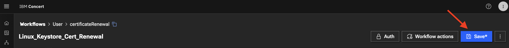

## 6.3: Scheduling the Certificate Renewal Workflow

Let's create a job schedule for **Linux_Keystore_Cert_Renewal** Workflow. 

:::note
In a customer environment, the **Linux_Keystore_Cert_Renewal** Workflow is configured to run automatically as a **job** through a workflow job scheduler. You can also run **Linux_Keystore_Cert_Renewal** workflow manually.
:::

From the Bastion Remote Desktop, on the Firefox browser click on the Concert tab.

* Click on the burger menu on the top left corner and select **Workflows -> Jobs** 
* Click **+ Create Job** button on top right side 
* Under **Job details**:
    * In **Name** type `certificateRenewal`
    * In **Select workflow** browse to `certificatesRenewal` folder and select `Linux_Keystore_Cert_Renewal`
    * In **Workflow version** select **Always use latest version**
    * In **Enable job** slider, slide it to the right to enable it
    
* Under **Schedule job**:
    * In **Time zone** select **the Time Zone for your location**
    * In **Repeats** select **Advanced settings**
    * Uncheck **Schedule immediately after saving** checkbox
    * In **Select date** select **Current Date**
    * In **Select time** select **Current Time + 5 minutes**
    * In **Ends** select **After**
    * In **Number of occurrences** select **5**
    * In **Cron job expression** type `0 */5 * * * *`

:::note
For the schedule time, **Current Time + 5 minutes** is required to give us some time to complete section 6.4 below before `Linux_Keystore_Cert_Renewal` job kicks in.
:::

Your configuration should look similar to the screenshot below. Your scheduled date and time will be different.

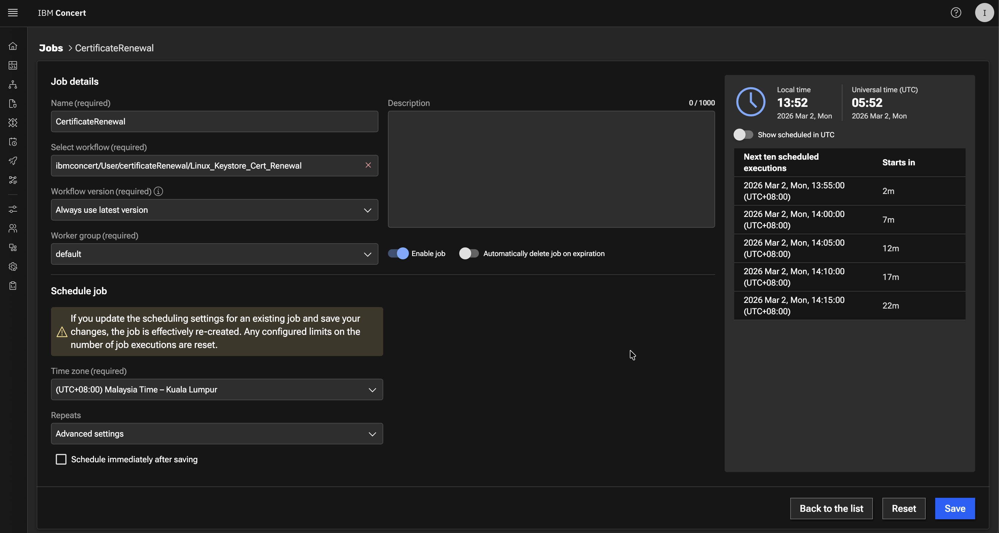
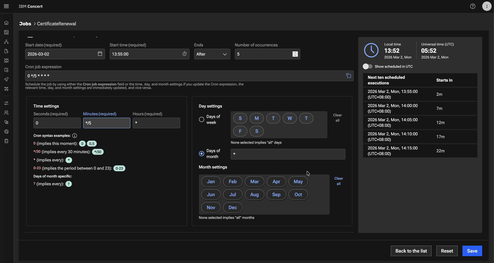

* Click the **Create** button to save the job schedule

## 6.4: Triggering the Certificate Renewal Workflow

We will use **Renewal** menu option in the Certificate Keystore page, to perform the following actions :

  - Use Certificate Serial Number to **approve** the Apache Tomcat certificate for renewal
  - Use Certificate Serial Number to **reject** the Intermediate certificate for renewal   

For this lab Certificate Renewal scenario:

*  **approving** Apache Tomcat certificate action means adding the **approved** label to the GiHub issue 
for the Apache Tomcat certificate. The `Linux_Keystore_Cert_Renewal` workflow uses this condition to *perform* the certificate renewal.

*  **rejecting** an Intermediate certificate action means adding the **rejected** label to GiHub issue for Apache Tomcat 
certificate and the `Linux_Keystore_Cert_Renewal` workflow uses this condition to *skip* the certificate renewal.

:::note
Be aware that the certificate serial number in your lab environment may differ from the one shown in the screenshot.
:::

From the Bastion Remote Desktop, on the Firefox browser click on the Concert tab.

* Click on the burger menu on the top left corner and select **Concert -> Dimensions -> Operations**
* Choose `Apache Tomcat certificate` or `expired certificate` from the list. It is Apache Tomcat certificate when you see **CN=demo-apps.ibmdte.local...** under Subject column
* Click **the Certificate Serial Number** to navigate to the Certificate's **Keystore entries UI**.

 

* You will get into **Keystore entries UI** for a Certificate after performing previous action. We will be using **the Certificate Serial Number** in subsequent step. Copy **the Certificate Serial Number** into a text file.
Click **Renew** option.

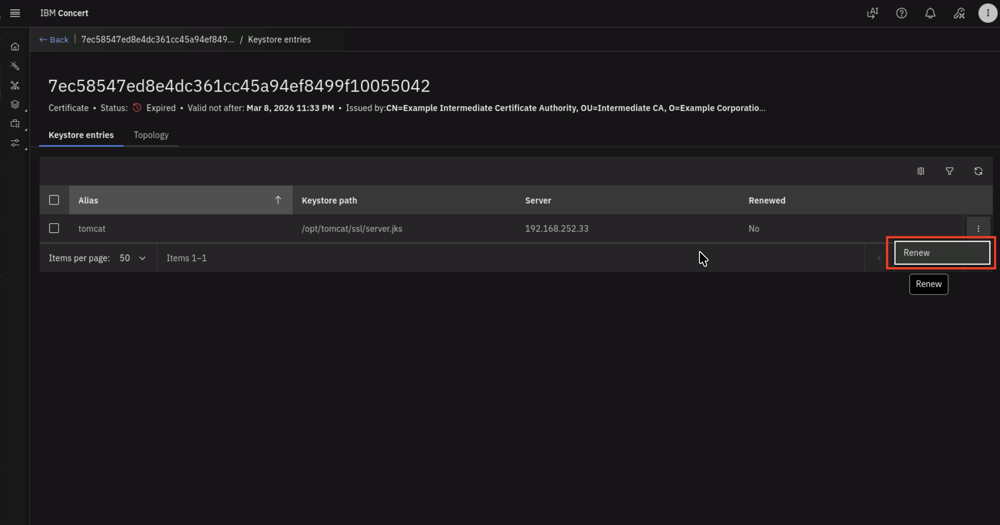

* In **Renew certificate** UI, fill in these values :
    * In **Workflow reference** select `updateGitHubIssueWithALabel`
    * In **Certserial** type the Certificate Serial Number that you copied previously
    * In **Concertauth** type `ibmconcert/ConcertAPIKey`
    * In **Githubcredentials** type `ibmconcert/GitHub`
    * In **Issuelabel** type `approved`

Your configuration should look similar to the screenshot below.

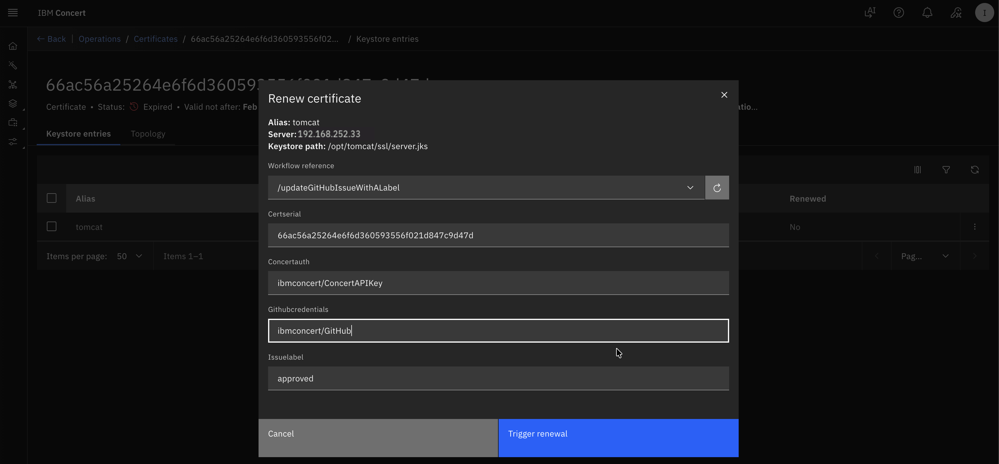

* Alternatively, you can go to GitHub Issues and manually add the `approved` label.


Now we will reject a certificate renewal:

* Navigate back to previous screen or **Concert -> Dimensions -> Operations**
* Choose `Intermediate CA` or `certificate expiring soon` from the list. It is Intermediate CA when you see **CN=Example Intermediate Certificate Authority...** under Subject column
* Click **the Certificate Serial Number** to navigate to the Certificate's **Keystore entries UI**.

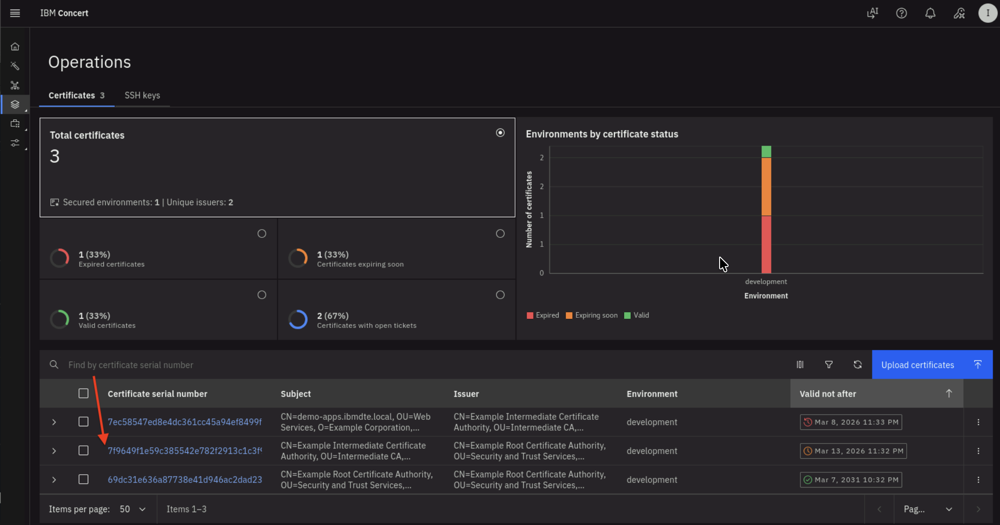 

* You will get into **Keystore entries UI** for a Certificate after performing previous action. We will be using **the Certificate Serial Number** in subsequent step. Copy **the Certificate Serial Number** into a text file.
Click **Renew** option.

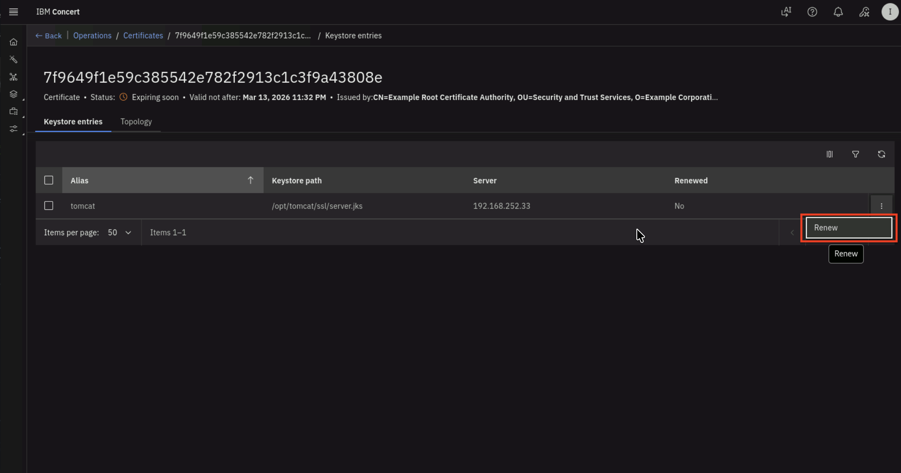

* In **Renew certificate** UI, fill in these values :
    * In **Workflow reference** select `updateGitHubIssueWithALabel`
    * In **Certserial** type the Certificate Serial Number that you copied previously
    * In **Concertauth** type `ibmconcert/ConcertAPIKey`
    * In **Githubcredentials** type `ibmconcert/GitHub`
    * In **Issuelabel** type `rejected`

Your configuration should look similar to the screenshot below.

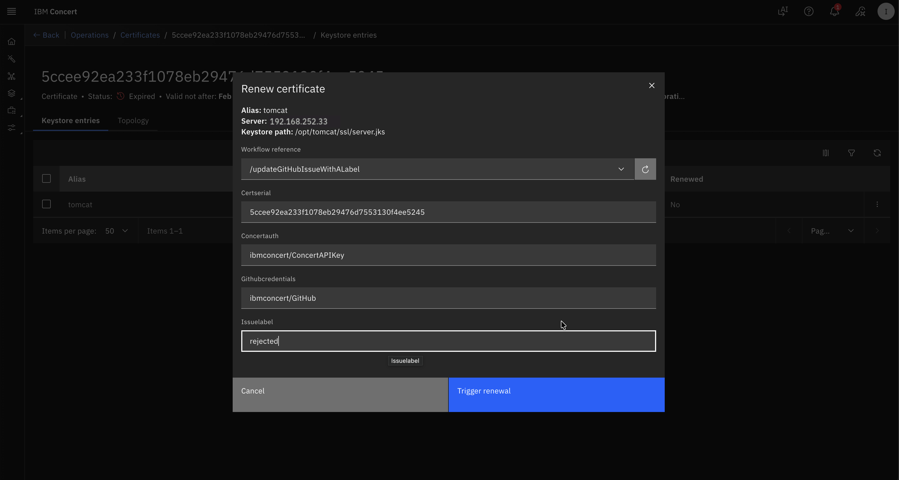

* Alternatively, you can go to GitHub Issues and manually add the `rejected` label.


You can now verify in GitHub that :
  - 1 issue for Apache Tomcat Certificate has `approved` label 
  - 1 issue for Intermediate CA has `rejected` label

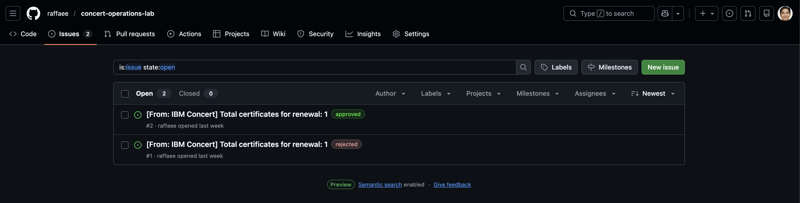

Let's wait for a while for `Linux_Keystore_Cert_Renewal` workflow job schedule kicks in.

## 6.5: Verifying the Renewal Workflow Job Schedule

Let's verify **Linux_Keystore_Cert_Renewal** workflow job log. 

:::note
Be aware that the certificate serial number in your lab environment may differ from the one shown in the screenshot.
:::

From the Bastion Remote Desktop, on the Firefox browser click on the Concert tab.

* Click on the burger menu on the top left corner and select **Workflows -> Logs** 
* Search for **Linux_Keystore_Cert_Renewal** under **Workflow** column and **Job scheduler** under **Executed from** column

You will see job log similar to the screenshot below. The job log shows that the workflow completed 
successfully for the certificate with serial number value.

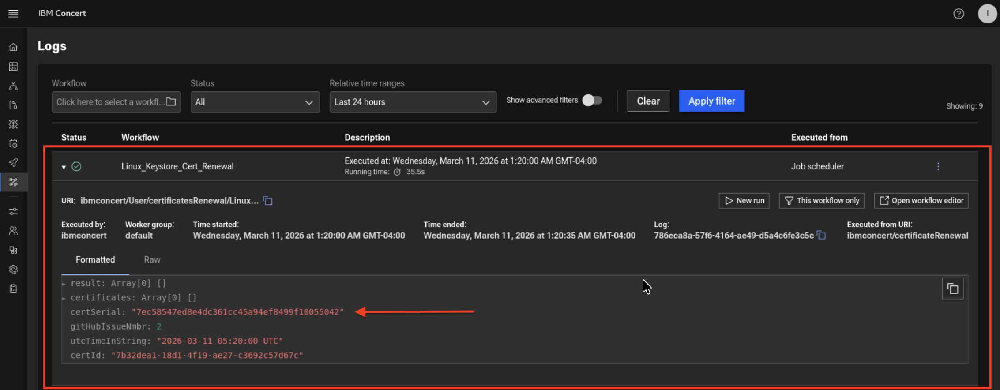

In GitHub, you will see the github issue for the certificate with serial number selected for renewal is marked as `Closed`. 
You will also notice that there are comments for the issue added by Concert Automation.

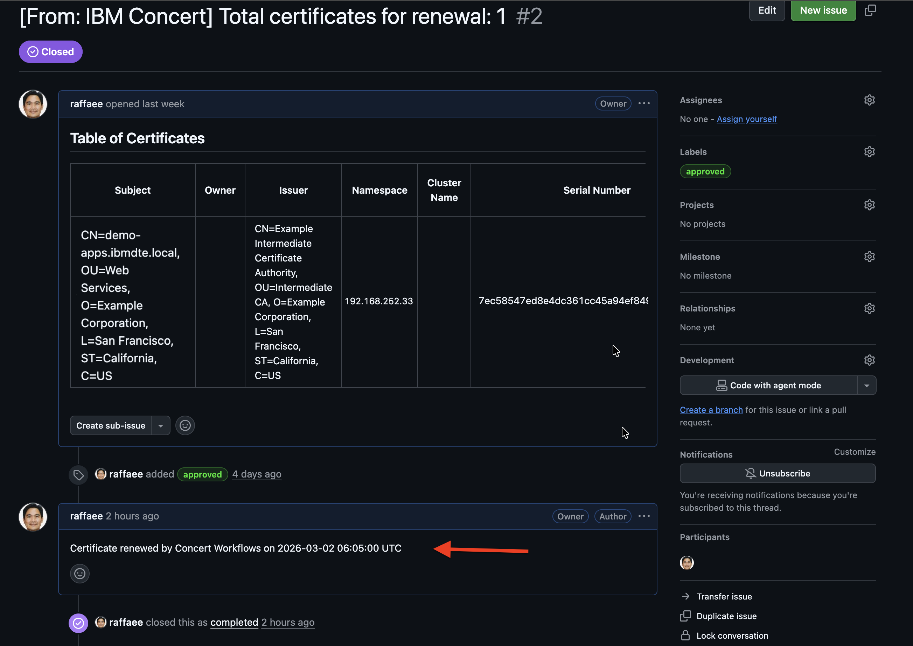

The github issue for the certificate with the serial number labeled as `rejected` is still `Open` and has no change.

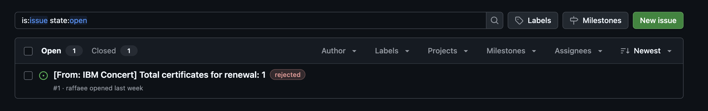

## 6.6: Performing the Certificate Discovery Again

After a certificate in Apache Tomcat Java Keystore has been renewed, you will now run **Linux_Keystore_Cert_Discovery** 
Workflow to discover certificates from Apache Tomcat Java KeyStore, then ingest them into Concert.    
This discovery step is essential for importing the renewed certificate into Concert.

:::note
In a customer environment, the **Linux_Keystore_Cert_Discovery** Workflow is configured to run automatically as a **job** 
through a workflow job scheduler. In this lab exercise, however, it is executed manually to demonstrate how it works.
:::

* Click **Run** icon for **Linux_Keystore_Cert_Discovery** Workflow

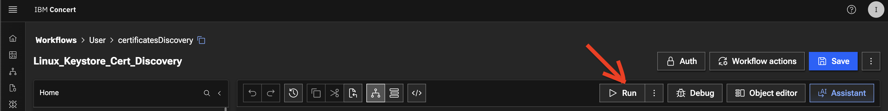

* The workflow will complete its execution and return **202 Accepted** as message in **Logs** section below 

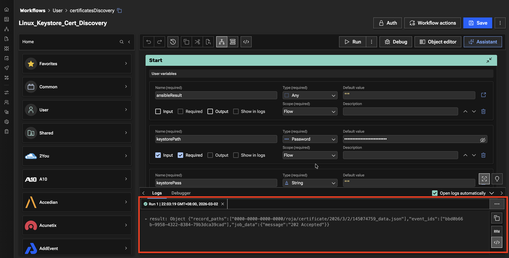

Let's verify the Discovery Workflow execution in Concert UI. 

From the Bastion Remote Desktop, on the Firefox browser click on the Concert tab.

* Click on the burger menu on the top left corner and select **Concert -> Dimensions -> Operations**. Make sure to refresh the page 
to see the updates. 

  On Certificates tab, you will see total number of Certificates in the **development** environment is 3,
  where :
  - Two Certificate are now valid,
  - One Certificate is still nearing expiration.

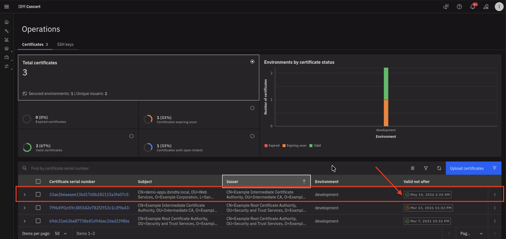

* The renewed certificate is highlighted in the above screenshot where the expiry date is **+ 2 months** from present date

:::note
Be aware that the certificate serial number in your lab environment may differ from the one shown in the screenshot.
:::

## 6.7: Search a Certificate via Concert API

Let's use Concert API to search for the new Apache Tomcat Certificate using Certificate Serial Number. 

:::note
Be aware that the certificate serial number in your lab environment may differ from the one shown in the screenshot.
:::

From the Bastion SSH, run the **curl** command, after replacing the following **two** values :
  - Replace the value after **search=** with the actual Certificate Serial Number obtained from your Concert Certificate UI
  - Replace the value after **C_API_KEY:** with your Concert API Key.

```sh title="Host: bastion-gym-lan"
curl -sk \
  --request GET https://concert.ibmdte.local:12443/core/api/v1/certificates?search=<CERTIFICATE_SERIAL_NUMBER> \
  --header 'Authorization: C_API_KEY: <YOUR_CONCERT_API_KEY>' \
  --header 'InstanceId: 0000-0000-0000-0000' \
  --header 'accept: application/json' \
  --header 'content-type: application/json-patch+json'
```

This is an example of the expected output:

```sh title="Example Output"
{
  "pagination": {
    "total_count": 1,
    "total_pages": 1,
    "page_size": 2000,
    "page_number": 1
  },
  "certificates": [
    {
      "id": "1eb38c4b-2cd9-440b-8672-b24c81fd4b02",
      "subject": "CN=demo-apps.ibmdte.local, OU=Web Services, O=Example Corporation, L=San Francisco, ST=California, C=US",
      "issuer": "CN=Example Intermediate Certificate Authority, OU=Intermediate CA, O=Example Corporation, L=San Francisco, ST=California, C=US",
      "serial_number": "33ae2b6aeaee13bd17d0b282115a3fa07c51e33",
      "certificate_type": "keystore",
      "validity_start_date": 1773210000,
      "validity_end_date": 1778394000,
      "auth_user_role": "admin",
      "namespaces": [
        "192.168.252.33"
      ],
      "last_updated_on": 1773211082,
      "last_updated_by": "ibmconcert",
      "is_archived": false,
      "metadata": "{\"api_server\": \"192.168.252.33-/opt/tomcat/ssl/server.jks\"}",
      "additional_data": "{\"policy_check_result\": {\"issuer_compliant\": true, \"key_length_compliant\": false, \"hash_algorithm_compliant\": false}, \"192.168.252.33-/opt/tomcat/ssl/server.jks-tomcat\": {\"alias\": \"tomcat\", \"server\": \"192.168.252.33\", \"keystore_path\": \"/opt/tomcat/ssl/server.jks\"}}",
      "status": "valid",
      "environment": {
        "id": "c6f75900-d53e-4b90-b75c-824f95a48306",
        "name": "development"
      },
      "issues": [],
      "access_points": [],
      "table_data": null
    }
  ]
}
```

From the json output, you will notice that the **issues** block is empty which indicates that there is no GitHub issue associated with 
the certificate because it is valid and not expiring.


## 6.8: Confirm the certificate in Java Keystore has a New Expiration Date


Let's use Java Keytool command to verify the Apache Tomcat certificate in Java Keystore now has new Expiration Date. 

From the Bastion SSH, connect to **demo-apps**:

```sh title="Host: bastion-gym-lan"
ssh jammer@demo-apps
```

Run the following to list all Certificates in Apache Tomcat Java Keystore:

```sh title="Host: demo-apps"
sudo keytool -list -v -keystore /opt/tomcat/ssl/server.jks -storepass tomcat
```

The command output should display **Certificate[1]**, **Certificate[2]**, and **Certificate[3]** and certificate properties for each certificate as shown below.    

* **Certificate[1]** is the Apache Tomcat certificate
* **Certificate[2]** is the Intermediate CA 
* **Certificate[3]** is the Root CA

Check the **Valid from** property under **Certificate[1]**, which shows that the certificate is now valid for the next two months. 
This confirms that Apache Tomcat certificate has been renewed successfully.

:::note
Be aware that the certificate serial number in your lab environment may differ from the one shown in the screenshot.
:::

Example keytool command output:

```sh title="Example Output"
Keystore type: JKS
Keystore provider: SUN

Your keystore contains 1 entry

Alias name: tomcat
Creation date: Mar 11, 2026
Entry type: PrivateKeyEntry
Certificate chain length: 3
Certificate[1]:
Owner: CN=demo-apps.ibmdte.local, OU=Web Services, O=Example Corporation, L=San Francisco, ST=California, C=US
Issuer: CN=Example Intermediate Certificate Authority, OU=Intermediate CA, O=Example Corporation, L=San Francisco, ST=California, C=US
Serial number: 7a32b7683d18a1416b923c2b8f2b63434b87b4ce
Valid from: Wed Mar 11 05:15:00 UTC 2026 until: Sun May 10 05:15:00 UTC 2026
Certificate fingerprints:
	 SHA1: 96:0B:14:3C:84:3C:D1:38:36:29:27:C0:12:FC:A1:5C:18:4B:B6:3C
	 SHA256: DF:AD:6F:64:8B:CD:2E:C4:ED:7C:5B:EB:D7:06:CE:46:12:8B:61:35:11:49:C3:8C:06:7E:5A:9F:A6:5D:29:E2
Signature algorithm name: SHA512withRSA
Subject Public Key Algorithm: 2048-bit RSA key
Version: 3

Extensions: 

#1: ObjectId: 2.5.29.35 Criticality=false
AuthorityKeyIdentifier [
KeyIdentifier [
0000: 73 21 3A 93 49 58 BA 1A   73 E3 58 A4 84 1A 56 81  s!:.IX..s.X...V.
0010: 28 A9 A7 68                                        (..h
]
]

#2: ObjectId: 2.5.29.19 Criticality=true
BasicConstraints:[
  CA:false
  PathLen: undefined
]

#3: ObjectId: 2.5.29.37 Criticality=false
ExtendedKeyUsages [
  serverAuth
]

#4: ObjectId: 2.5.29.15 Criticality=true
KeyUsage [
  DigitalSignature
  Key_Encipherment
]

#5: ObjectId: 2.5.29.17 Criticality=false
SubjectAlternativeName [
  DNSName: myserver.example.com
  DNSName: demo-apps.ibmdte.local
  IPAddress: 192.168.252.33
]

#6: ObjectId: 2.5.29.14 Criticality=false
SubjectKeyIdentifier [
KeyIdentifier [
0000: EB 73 E0 12 DC 15 A1 4C   FE 0F 94 B2 A1 D6 24 66  .s.....L......$f
0010: CC 78 F4 47                                        .x.G
]
]

Certificate[2]:
Owner: CN=Example Intermediate Certificate Authority, OU=Intermediate CA, O=Example Corporation, L=San Francisco, ST=California, C=US
Issuer: CN=Example Root Certificate Authority, OU=Security and Trust Services, O=Example Corporation, L=San Francisco, ST=California, C=US
Serial number: 7f9649f1e59c385542e782f2913c1c3f9a43808e
Valid from: Mon Mar 09 03:32:00 UTC 2026 until: Sat Mar 14 03:32:00 UTC 2026
Certificate fingerprints:
	 SHA1: C9:B8:FB:94:D3:D3:ED:1C:BB:8D:C5:76:5F:33:BB:9A:D3:2A:F4:05
	 SHA256: E4:83:54:6C:36:8B:50:B8:47:BB:49:36:A5:04:85:58:F7:58:AD:3A:2D:24:FB:56:8E:A1:25:76:B7:51:F7:0A
Signature algorithm name: SHA512withRSA
Subject Public Key Algorithm: 4096-bit RSA key
Version: 3

Extensions: 

#1: ObjectId: 2.5.29.35 Criticality=false
AuthorityKeyIdentifier [
KeyIdentifier [
0000: B8 C9 34 FC ED A1 88 87   6B 9C 43 CF 81 18 8B 87  ..4.....k.C.....
0010: A9 3B 98 85                                        .;..
]
]

#2: ObjectId: 2.5.29.19 Criticality=true
BasicConstraints:[
  CA:true
  PathLen: no limit
]

#3: ObjectId: 2.5.29.15 Criticality=true
KeyUsage [
  Key_CertSign
  Crl_Sign
]

#4: ObjectId: 2.5.29.17 Criticality=false
SubjectAlternativeName [
  IPAddress: 127.0.0.1
]

#5: ObjectId: 2.5.29.14 Criticality=false
SubjectKeyIdentifier [
KeyIdentifier [
0000: 73 21 3A 93 49 58 BA 1A   73 E3 58 A4 84 1A 56 81  s!:.IX..s.X...V.
0010: 28 A9 A7 68                                        (..h
]
]

Certificate[3]:
Owner: CN=Example Root Certificate Authority, OU=Security and Trust Services, O=Example Corporation, L=San Francisco, ST=California, C=US
Issuer: CN=Example Root Certificate Authority, OU=Security and Trust Services, O=Example Corporation, L=San Francisco, ST=California, C=US
Serial number: 69dc31e636a87738e41d946ac2dad2398be484d8
Valid from: Mon Mar 09 03:32:00 UTC 2026 until: Sat Mar 08 03:32:00 UTC 2031
Certificate fingerprints:
	 SHA1: 93:EF:C1:83:5C:FE:0D:1F:B4:8A:43:3D:E9:B3:89:28:C5:3F:53:99
	 SHA256: 43:5D:D9:62:FD:6E:67:2B:E7:80:B1:26:E2:F0:40:87:26:57:D0:D9:AB:F7:3B:D6:52:FC:8E:35:05:DE:4E:23
Signature algorithm name: SHA512withRSA
Subject Public Key Algorithm: 4096-bit RSA key
Version: 3

Extensions: 

#1: ObjectId: 2.5.29.19 Criticality=true
BasicConstraints:[
  CA:true
  PathLen: no limit
]

#2: ObjectId: 2.5.29.15 Criticality=true
KeyUsage [
  Key_CertSign
  Crl_Sign
]

#3: ObjectId: 2.5.29.14 Criticality=false
SubjectKeyIdentifier [
KeyIdentifier [
0000: B8 C9 34 FC ED A1 88 87   6B 9C 43 CF 81 18 8B 87  ..4.....k.C.....
0010: A9 3B 98 85                                        .;..
]
]


*******************************************
*******************************************


```

## 6.9: Make the Firefox Browser to Trust the Certificates

Finally, let's update the Firefox browser settings to trust the Intermediate CA and Root CA produced by CFSSL as the internal private Certificate Authority.

From the Bastion Remote Desktop, on the Firefox browser click on the burger menu on the top right corner.

* Click **Settings** 

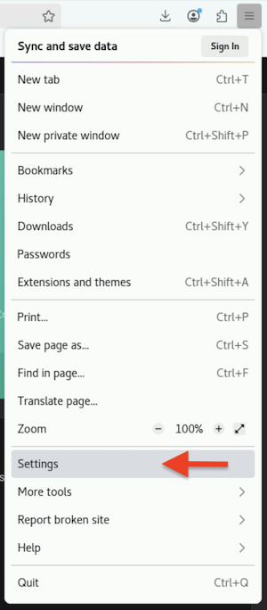

* Click **Privacy & Security** section on left panel
* Click **View Certificates...** button

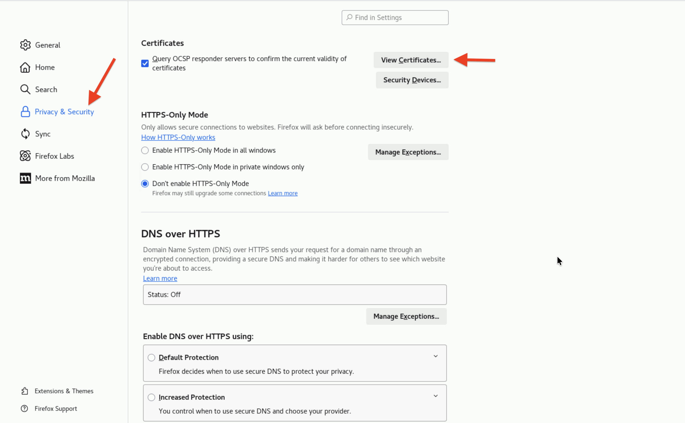

* Click **Authorities** tab
* Click **Import** button

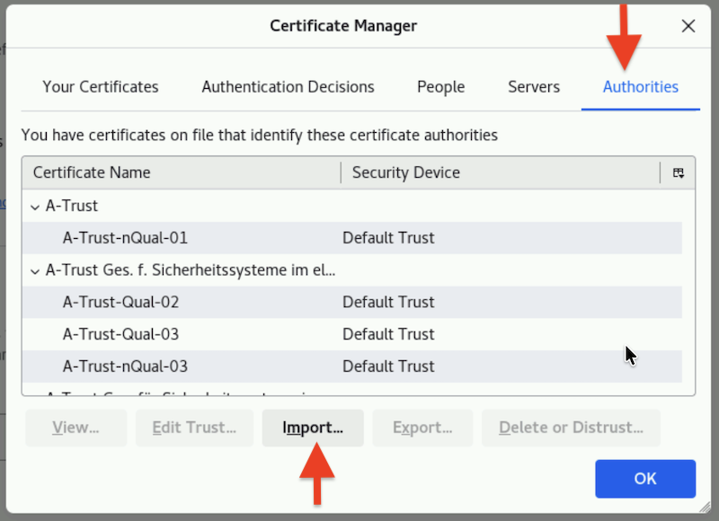

* Browse to **Downloads** folder
* Select **intermediate.pem** and **ca.pem** to import

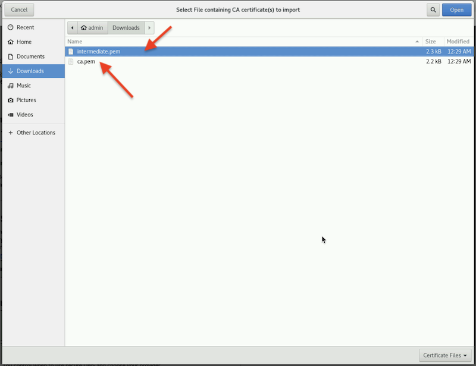

* Click the two check boxes appear in the dialog box
  - Trust this CA to identify websites.
  - Trust this CA to identify email users.

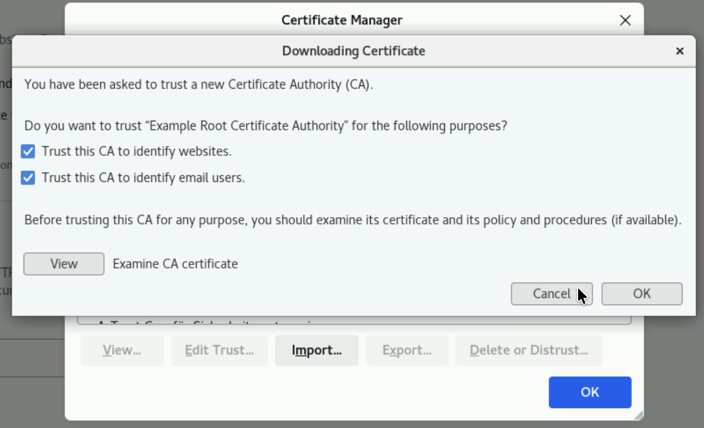

You will see the 2 certificates imported successfully similar to the screenshot below. 

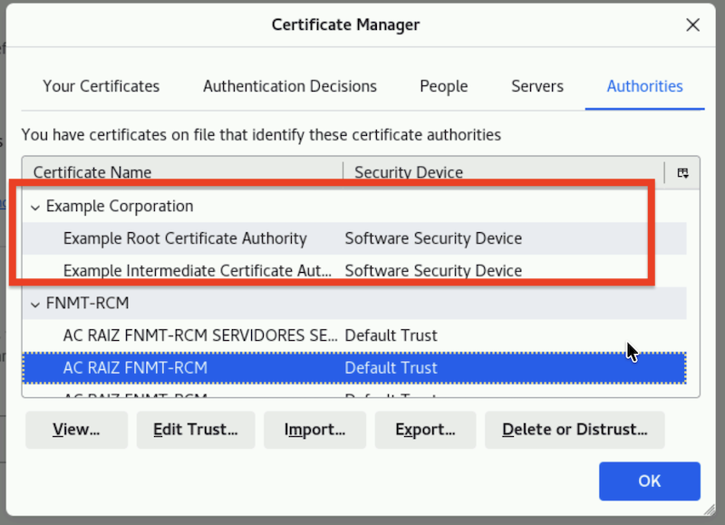

* Finally, open the URL `https://demo-apps.ibmdte.local:8443` in the Firefox browser.

You will see a padlock icon with a locked status, indicating a secure, encrypted HTTPS connection. This is the result of the steps you performed earlier, which enabled Firefox to trust the two certificates you imported.

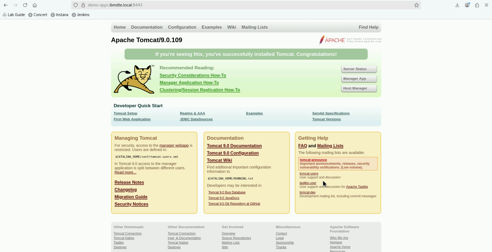

You can also view the new certificate for Apache Tomcat via Firefox browser by clicking the padlock icon and navigate to **Connection secure -> More information -> View Certificate**

## 6.10: Summary

In this section, you have been able to accomplish the following:

1. Have configured parameter values for Certificate Renewal workflow.
2. Have scheduled Certificate Renewal workflow using Concert Workflows Jobs.
3. Have verified the new Certificate for Apache Tomcat with new expiry date.
4. Have queried Concert API using curl for a Certificate Serial Number.
5. Have imported two certificates which CFSSL in the lab produces. 

<br> </br>
<br> </br>
<br> </br>

================================
===================================

# Congratulations! You have completed the Lab
We encourage you to provide feedback on this lab to help us improve future versions.
Tell us what you liked, what you didn't like, and any suggestions for improvement.
You can provide feedback on the Slack channel listed under the [**Support** section](https://techzone.ibm.com/collection/jam-in-a-box-for-aiops).

================================
===================================
